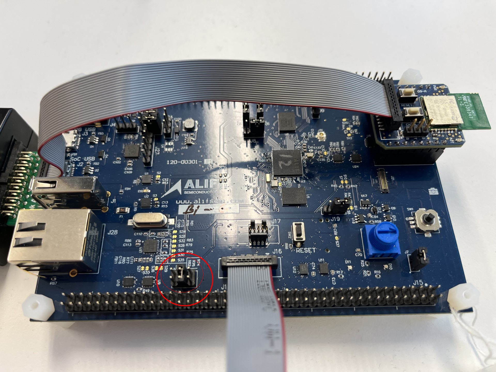

Introduction
============

This user guide will take you through the steps of initial setup to hook up the Alif Ensemble Development kit with a Bluetooth Low Energy(BLE) module and observe the Zephyr RTOS Bluetooth Beacon sample.
Preliminary assumption is that you have gone through the `Ensemble Gen 2 DevKit User Guide <https://alifsemi.com/download/AUGD0010>`_.
Another document to go through is `Zephyr RTOS Getting Started Guide <https://docs.zephyrproject.org/latest/develop/getting_started/>`_.

The Ensemble  DevKit contains an Ensemble E7 chip with a Cortex-M55 high efficiency processor(M55_HE) and a Cortex-M55 high performance processor(M55_HP), both of which contain an Ethos U55 micro-NPU, or Network Processor Unit.
The M55_HE has a 128 MAC wide U55 NPU and the M55_HP has a 256 MAC wide U55 NPU associated with it.

The E7 Family MCU device also contains large on-chip RAM and non-volatile memory, analog and digital peripherals supporting wired connectivity.
The range of computational performance, power efficiency, and their rich peripheral set makes it suitable for a wide range of embedded IoT applications.

The Devkit has a mikroBUS™ compatible socket for interfacing with external peripherals. The goal is to use the socket to attach a circuit board which holds the BLE module.
Communication between the Ensemble and BLE module is achieved over a UART interface which goes through the mikroBUS socket.

The sample uses RTSS HE core but it is possible to adapt it for the RTSS HP core.

Target Setup Requirements
-------------------------
* Ensemble Gen 2 DevKit
* Fanstel BT40F BLE module
* Micro-USB Cable (included in the kit)
* A host PC with terminal emulation software
* JTAG and SWD debugger such as Segger J-Link

The BLE module is adapted to fit into the mikroBUS socket found from the DevKit. The board is Click Board™ compatible.

Adjust Board Jumpers
====================

Before powering up your board, there's a need to adjust a jumper controlling the output voltage delivered by the mikroBUS socket.
Other jumpers should be kept in their default positions.
By default, the J13 - Click_IO - used for voltage selection is set to 1.8V - Pins 1-2 - but the Bluetooth module will need 3.3V - Pins 3-4.

Ensemble DevKit mikroBUS voltage Jumper
---------------------------------------
All Configuration Jumpers are male headers, 2.54mm pin spacing.

.. csv-table:: Connected pins
    :header: "Pins", "Voltage"
    :widths: 20 30

    "Pins 1-2 Click I/O", "1.8V - Factory default"
    "Pins 3-4 Click I/O", "3.3V - Required by the Bluetooth module"
    "Pins 5-6 Click I/O", "5.0V"

Host PC software
================
The following tool versions were used to bring up and test the setup:

* `J-Link Software and Documentation Pack <https://www.segger.com/downloads/jlink>`_ - V7.94h [2023-01-30]

The pack includes the debug probe firmware too.

**Remember to upgrade firmware to your JLink debug probe as well.**

Bluetooth module firmware
=========================
The Bluetooth module is delivered with the necessary firmware preinstalled.
The purpose is that the Bluetooth module provides BLE link layer functionality while the BLE host stack is kept on the Ensemble side.
All the communication happens over an UART interface with the HCI H4 protocol.

Ensemble DevKit firmware
========================
Unlike with the BLE module you need to compile and install an application binary yourself to see that the device is working as it is supposed to.
The used Beacon application is built for the M55 HE core.

Application installation
========================
Follow the instructions of the Zephyr RTOS Getting Started Guide.
When you reach the step where you need to get the Zephyr source code...

Fetch
-----
For testing the hardware, a sample application is used.
Clone the SDK repository to your host machine.

.. code-block:: console

    mkdir workspace
    cd workspace
    west init -m https://github.com/alifsemi/sdk-alif.git
    west update

Patch
-----
To be able to connect on the Bluetooth module you need to patch the source files to make UART0 available for that purpose.
One part of the patch is disabling the HW flow control which is not supported with mikroBUS. Please use the attached patch file to take the UART port into use.

To apply the patch go to the top level of the Zephyr directory and use the following patch file.

.. code-block:: console

    cd zephyr
    git apply --apply NAME_OF_THE_PATCH_FILE

.. literalinclude:: _static/fanstel_bt40f.patch

Build
-----
After downloading and patching navigate on the Zephyr's sample directory. Once you are there build the sample.

.. code-block:: console

    cd zephyr/samples/bluetooth/beacon
    west build -b alif_e7_dk_rtss_he

The resulting ELF file is on the build folder under the sample directory

.. code-block:: console

  build/zephyr/zephyr.elf

Deploy
------
When you have the ELF file available the deployment is done over a JLink debug probe as instructed on Getting Started with VS Code, GCC, and CMSIS Toolbox.
Another option is to use Segger's Ozone for loading an ELF file - Segger Ozone and J-Link Debug
