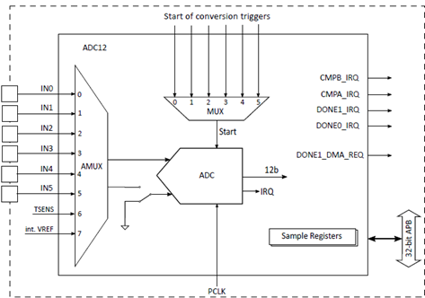
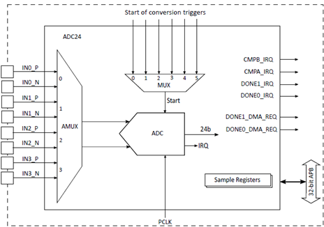
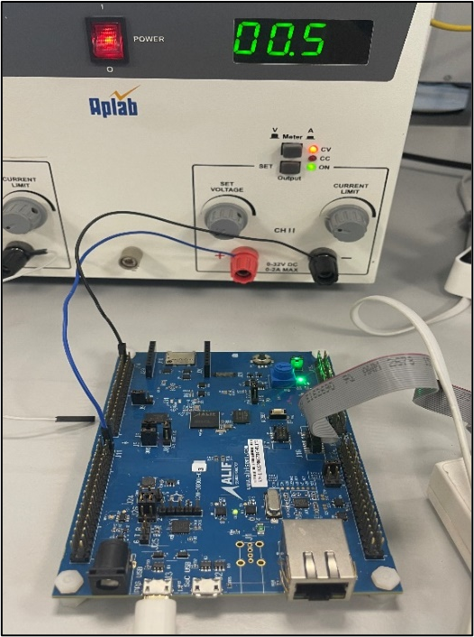
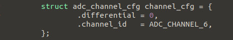
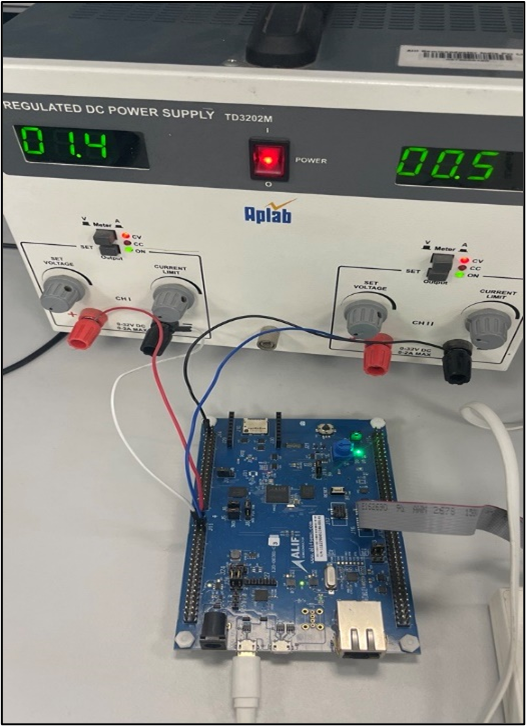
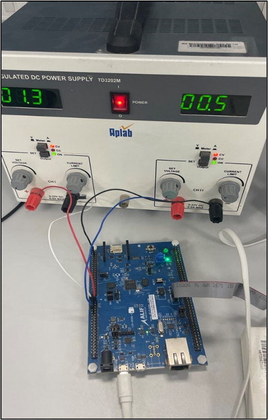

.. _appnote-zephyr-adc12-24:

========
ADC12/24
========

Introduction
============

This document explains how to create, compile, and run a demo application for the Analog-to-Digital Conversion (ADC) 12- and 24-bit controller IP provided by Alif Semiconductor™ and integrated into Devkit devices.

The ADC12 supports 8 channels (6 external and 2 internal inputs). One temperature sensor is connected to all ADC12 instances at channel no 6. ADC24 supports 4 channels (differential only). The ADC12 works with both single-ended input and differential input (ADC24 works only with differential input).

- **Single-Ended Input**:

  - Single-shot conversion
  - Single-channel scan
  - Continuous conversion
  - Single-channel scan
  - Multiple-channel scan
- **Differential Input**:

  - Single-shot conversion
  - Single-channel scan
  - Continuous conversion

   12-Bit ADC Block Diagram

   24-Bit ADC Block Diagram

Hardware Requirements
=====================

- **Alif DevKit**
- **Debugger: JLink**

ADC Interface
=============

The ADC12 and ADC24 modules interface with the external environment through designated pins on the DevKit devices.

Hardware Connections
====================

**ADC12**

No hardware connection is required to test the temperature sensor, which is internally connected to all instances of ADC12 (0, 1, and 2).

**Setup for Checking Single-Ended Conversion from an External Input Source**

(0–7 channels are available)

   Setup for Single-Ended Conversion for ADC 12

**Setup for Checking Differential Input Conversion from an External Input Source**

(0, 1, and 2 channels are available)

Enable differential mode from the ADC sample application for operating ADC in differential mode.

   Screen capture of ADC 12 Differential Conversion for ADC 12

   Setup for Differential Conversion for ADC 12

   Setup for Differential Conversion for ADC 24

Building ADC Application in Zephyr
====================================

Follow these steps to build the ADC application in Zephyr using the Alif Zephyr SDK:

1. For instructions on fetching the Alif Zephyr SDK and navigating to the Zephyr repository, please refer to the `ZAS User Guide`_

.. note::
   The build commands shown here are specifically for the Alif E7 DevKit.
   To build the application for other boards, please modify the board name in the build command accordingly. For more information, refer to the ZAS User Guide.

2. Build commands for applications on the M55 HE core using the Ninja build command:

.. code-block:: bash

   rm -rf build
   west build -b alif_e7_dk_rtss_he ../alif/samples/drivers/adc

3. Build commands for applications on the M55 HP core using the Ninja build command:

.. code-block:: bash

   rm -rf build
   west build -b alif_e7_dk_rtss_hp ../alif/samples/drivers/adc

.. note::
   To address various scenarios, such as utilizing MRAM or flash addresses and employing alternative compilers like LLVM or ARMCLANG, refer to the document AUGD0008_Getting-Started-with-ZAS-for-Ensemble-v0.5.0-Beta.

Once the build command completes successfully, executable images will be generated and placed in the `build/zephyr` directory. Both `.bin` (binary) and `.elf` (Executable and Linkable Format) files will be available.

Executing Binary on the DevKit
==============================

To execute binaries on the DevKit follow the command

.. code-block:: bash

   west flash

Sample Output
=============

.. note::
   The console output depends on the ADC configuration (e.g., single-ended or differential mode, channel selection, single-shot or continuous conversion). Refer to the ADC sample application (``../alif/samples/drivers/adc``) for specific output details. Typically, the output includes voltage readings or temperature sensor data in a format defined by the application.