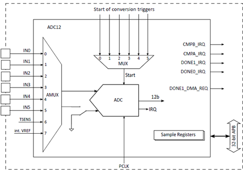
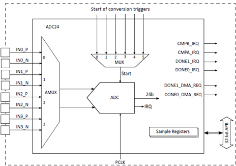
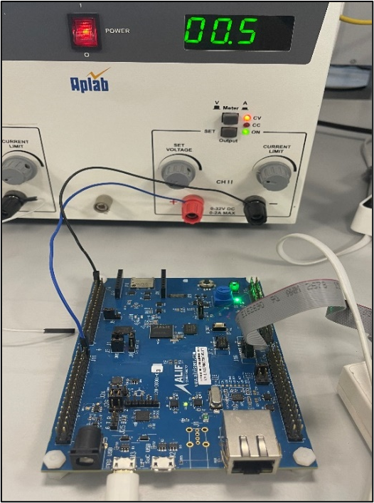
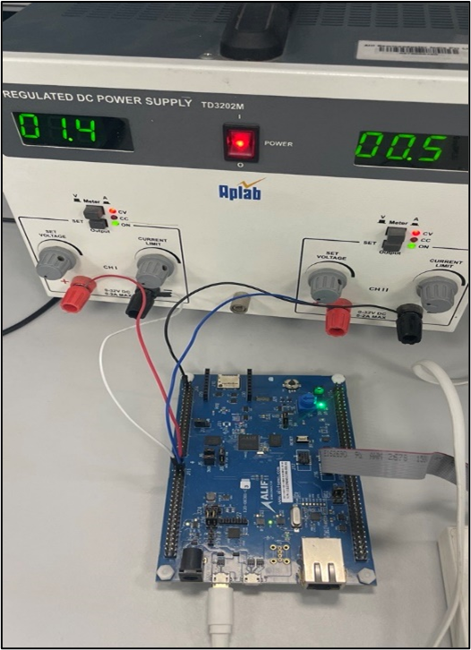
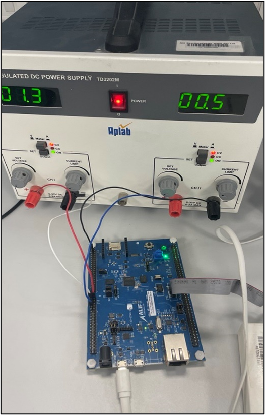

.. _appnote-zephyr-adc12/24:

=========
ADC12/24
=========

Introduction
============

This document explains how to create, compile, and run a demo application for the Analog-to-Digital Conversion (ADC) 12-bit controller IP provided by Alif Semiconductor™ and integrated into Devkit devices.

The ADC12 supports 8 channels (6 external and 2 internal inputs). One temperature sensor is connected to all ADC12 instances at channel no. 6. The ADC12 works with both single-ended and differential inputs.

- **Single-Ended Input**:

  - Single-shot conversion
  - Single-channel scan
  - Continuous conversion
  - Multiple-channel scan

- **Differential Input**:

  - Single-shot conversion
  - Single-channel scan
  - Continuous conversion

**Note: In Balletto, Channel 7 (Vref) has been removed from the ADC12.**

   12-Bit ADC Block Diagram

   24-Bit ADC Block Diagram

.. include:: prerequisites.rst

.. include:: note.rst

Build an ADC Application with Zephyr
========================================

Follow these steps to build the ADC application using the Alif Zephyr SDK:

1. For instructions on fetching the Alif Zephyr SDK and navigating to the Zephyr repository, please refer to the `ZAS User Guide`_

.. note::
   The build commands shown here are specifically for the Alif E7 DevKit.
   To build the application for other boards, modify the board name in the build command accordingly. For more information, refer to the `ZAS User Guide`_, under the section Setting Up and Building Zephyr Applications.

2. Build command for application on the M55 HP core:

.. code-block:: console

   west build -p always \
     -b alif_e7_dk/ae722f80f55d5xx/rtss_hp \
     ../alif/samples/drivers/adc \
     -S alif-adc

3. Build command for application on the M55 HE core:

.. code-block:: console

   west build -p always \
     -b alif_e7_dk/ae722f80f55d5xx/rtss_he \
     ../alif/samples/drivers/adc \
     -S alif-adc

ADC Interface
=============

The ADC12 and ADC24 modules interface with the external environment through designated pins on the DevKit devices.

Hardware Connections
====================

**ADC12**

No hardware connection is required to test the temperature sensor, which is internally connected to all instances of ADC12 (0, 1, and 2).

**Setup for Checking Single-Ended Conversion from an External Input Source**

(0–7 channels are available)

   Setup for Single-Ended Conversion for ADC 12

**Setup for Checking Differential Input Conversion from an External Input Source**

(0, 1, and 2 channels are available)

Enable differential mode from the ADC sample application for operating ADC in differential mode.

**Screen capture of ADC 12 Differential Conversion for ADC 12**

.. code-block:: c

   struct adc_channel_cfg channel_cfg = {
       .differential = 0,
       .channel_id   = ADC_CHANNEL_6,
   };

   Setup for Differential Conversion for ADC 12

   Setup for Differential Conversion for ADC 24

Executing Binary on the DevKit
===============================

To execute binaries on the DevKit follow the command

.. code-block:: console

   west flash

Console Output
===============

.. note::
   The console output depends on the ADC configuration (e.g., single-ended or differential mode, channel selection, single-shot or continuous conversion). Refer to the ADC sample application (``../alif/samples/drivers/adc -S alif-adc``) for specific output details. Typically, the output includes voltage readings or temperature sensor data in a format defined by the application.

DMA-Backed Sampling
====================

The driver can move ADC sample words into a caller buffer through the PL330 DMA
controller instead of the CPU. This offloads the per-sample IRQ handling and is
especially useful for streaming or high-rate captures.

Enable it with:

.. code-block:: kconfig

   CONFIG_ADC_ALIF_DMA=y
   CONFIG_DMA=y

and add DMA properties to the ADC node in a devicetree overlay:

.. code-block:: dts

   &dma2       { status = "okay"; };
   &evtrtr2    { status = "okay"; };

   &adc0 {
       status = "okay";
       adc_conversion_mode = "CONTINUOUS_CONVERSION";
       dmas      = <&evtrtr2 ALIF_DMA_ENCODE(0, 0, 1) 4>;
       dma-names = "rxdma";
   };

Constraints of the DMA path:

- Single ADC channel per read.
- ``adc_conversion_mode`` must be ``CONTINUOUS_CONVERSION`` **unless** the
  UTIMER hardware trigger is also enabled (see next section).
- ``sequence.options->extra_samplings`` is not supported.
- The DMA-complete callback releases ``adc_read()``; buffer size determines
  how many samples are collected per call.

UTIMER Hardware Trigger
=======================

Instead of the CPU writing the ADC START bit on every read, a UTIMER instance
can generate a periodic pulse that triggers the ADC in hardware. Combined with
DMA this produces a fully CPU-free periodic-sampling pipeline.

Enable it with:

.. code-block:: kconfig

   CONFIG_ADC_ALIF_UTIMER_TRIGGER=y
   CONFIG_USE_ALIF_HAL_UTIMER=y

and describe the UTIMER wiring in the ADC node in a devicetree overlay:

.. code-block:: dts

   &utimer0 { status = "okay"; };

   &adc0 {
       status = "okay";
       alif,utimer-trigger  = <&utimer0>;
       alif,utimer-driver   = <0>;         /* 0 = driver A, 1 = driver B */
       alif,utimer-period   = <160000000>; /* reload value in UTIMER ticks */
       alif,ext-trigger-src = <0x1>;       /* bitmask, see below */
   };

Devicetree properties:

- ``alif,utimer-trigger`` – phandle to the UTIMER node.
- ``alif,utimer-driver`` – driver output selection (0 = A, 1 = B).
- ``alif,utimer-period`` – reload value written to the UTIMER counter. With a
  ~400 MHz UTIMER clock, ``160000000`` gives roughly a 400 ms period.
- ``alif,ext-trigger-src`` – **bitmask** written to ``ADC_START_SRC[5:0]``.
  Each bit corresponds to one hard-wired trigger line from a UTIMER
  driver output; ``0x1`` selects source 0 (UTIMER0 driver A), ``0x2``
  selects source 1, and so on. Refer to the SoC HWRM for the mapping.

The driver programs the UTIMER once during ``adc_init()`` (compare value at
50 % of the reload for a proper pulse width), arms the ADC by writing the
selected trigger source into ``ADC_START_SRC``, and then bypasses the
software START in ``adc_context_start_sampling()``. Every UTIMER pulse
triggers an ADC conversion. Without DMA, the ADC done interrupt copies the
sample to memory; with DMA enabled, DMA transfers the sample and only signals
completion when the caller's buffer is full. UTIMER plus DMA is the CPU-free
sampling configuration.

When ``CONFIG_ADC_ALIF_UTIMER_TRIGGER=y`` is combined with DMA, both
``SINGLE_SHOT_CONVERSION`` and ``CONTINUOUS_CONVERSION`` work – the UTIMER
pulse re-arms START in hardware every period, so the conversion mode
selection no longer affects periodic operation. Without UTIMER, DMA still
requires ``CONTINUOUS_CONVERSION``.

Sampling cadence (example on ``alif_e7_dk/rtss_he``, temperature channel,
``alif,utimer-period = <160000000>``, ``alif,ext-trigger-src = <0x1>``):

+---------------------------------------------------+-----------------------------+
| Configuration                                     | ``adc_read()`` blocking time|
+===================================================+=============================+
| DMA only (no UTIMER), CONTINUOUS, buffer 10       | ~1 ms (ADC free-running)    |
+---------------------------------------------------+-----------------------------+
| UTIMER + DMA, CONTINUOUS, buffer 10               | ~3800 ms (10 × 380 ms)      |
+---------------------------------------------------+-----------------------------+
| UTIMER + DMA, SINGLE_SHOT, buffer 1               | ~200 ms (next UTIMER pulse) |
+---------------------------------------------------+-----------------------------+

