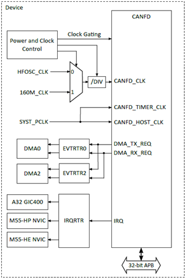
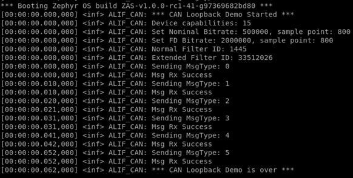

.. _can:

===
CAN
===

Overview
========

This document explains how to create, compile, and run the demo application for Controller Area Network (CAN) validation.

Introduction
============

The Controller Area Network (CAN) is a communication protocol designed for efficient and reliable data exchange between electronic control units (ECUs) in automotive and industrial systems. It operates on a bus topology, allowing multiple devices to share a common communication line while avoiding collisions using message prioritization. The protocol uses a differential signal over a twisted-pair cable, ensuring noise immunity in harsh environments, making it ideal for safety-critical applications. It supports features like error detection, retransmission, and fault isolation, ensuring data integrity. Advanced versions like CAN FD offer higher data rates and larger payloads, addressing the growing demands of modern applications.

   CAN Internal Connections

CAN Features
============

The following CAN features are currently supported by the Alif driver:

- CAN 2.0B (up to 8 bytes payload, verified by Bosch reference model)
- CAN FD (up to 64 bytes payload, ISO 11898-1:2015)
- Programmable data rates up to 10 Mbps
- Programmable baud rate prescaler (1 to 1/256)
- Programmable internal 29-bit acceptance filters
- Extended features:
  - Single Shot Transmission mode
  - Listen-Only mode
  - Loop Back mode (Internal)
- Extended status and error report:
  - Capturing of last occurred Kind of Error (KOER) and arbitration lost position
  - Programmable Error Warning Limit
- CiA 603 timestamping

Prerequisites
==============

Hardware Requirements
---------------------------

To run the CAN application, you need:

- **Alif Devkit**
- **Debugger: JLink (optional)**

Software Requirements
======================

To develop and run CAN applications on the Alif Devkit with Zephyr, you need:

- **Alif SDK**: v1.2.0 (includes CAN driver and sample application) or newer
- **Arm GCC Compiler**: For compiling the application (part of the Zephyr SDK)
- **SE Tools (optional)**: For loading binaries (refer to Alif documentation)

Building CAN Application in Zephyr
=====================================

Follow these steps to build the CAN application using the Alif Zephyr SDK:

1. For instructions on fetching the Alif Zephyr SDK and navigating to the Zephyr repository, please refer to the `ZAS User Guide`_

.. note::
   The build commands shown here are specifically for the Alif E7 DevKit.
   To build the application for other boards, please modify the board name in the build command accordingly. For more information, refer to the ZAS User Guide.

1. Build commands for loopback applications on the M55 HE core using the Ninja build command:

.. code-block:: bash

   rm -rf build
   west build -b alif_e7_dk_rtss_he ../alif/samples/drivers/can/loopback -p

4. Build commands for loopback applications on the M55 HP core using the Ninja build command:

.. code-block:: bash

   rm -rf build
   west build -b alif_e7_dk_rtss_hp ../alif/samples/drivers/can/loopback -p

5. Build commands for CAN counter applications on the M55 HE core using the Ninja build command:

.. code-block:: bash

   rm -rf build
   west build -b alif_e7_dk_rtss_he samples/drivers/can/counter/ -p

6. Build commands for CAN counter applications on the M55 HP core using the Ninja build command:

.. code-block:: bash

   rm -rf build
   west build -b alif_e7_dk_rtss_hp samples/drivers/can/counter/ -p

.. note::
   To address various scenarios, such as utilizing MRAM or flash addresses and employing alternative compilers like LLVM or ARMCLANG, refer to the document AUGD0008_Getting-Started-with-ZAS-for-Ensemble-v0.5.0-Beta.

Once the build command completes successfully, executable images will be generated and placed in the `build/zephyr` directory. Both `.bin` (binary) and `.elf` (Executable and Linkable Format) files will be available.

Executing Binary on the DevKit
==============================

To execute binaries on the DevKit follow the command

.. code-block:: bash

   west flash

Validating CAN
==============

Console Output
--------------

Upon reviewing the output logs, the CAN functionality has been successfully validated for Loopback mode.

   CAN Output Logs

.. note::
   The console output depends on the CAN application configuration (e.g., loopback mode, message transmission). Refer to the CAN sample application (``../alif/samples/drivers/can/loopback/``) for specific output details. Typically, the output includes status messages indicating successful message transmission and reception in loopback mode.