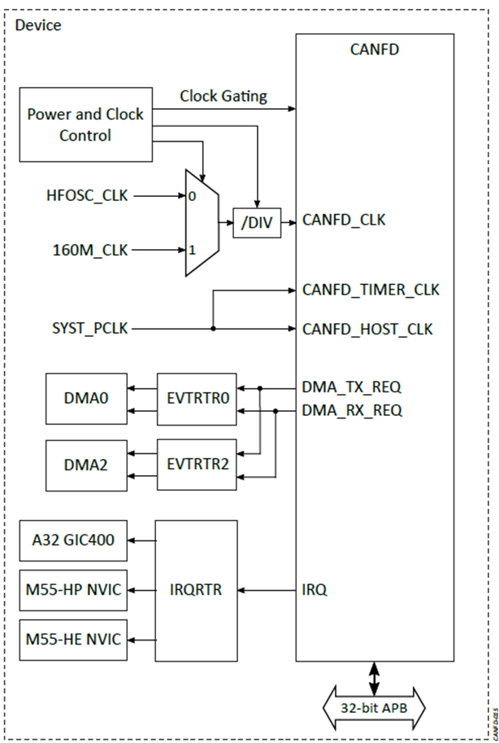

.. _can_appnote:

==============================
CAN (Controller Area Network)
==============================

Overview
=========

This document explains how to create, compile, and run the demo application for the
Controller Area Network (CAN) peripheral for device validation.
The example demonstrates internal loopback message communication on the Alif DevKit.

   CAN Internal Connections

Introduction
=============

CAN (Controller Area Network) is a data communication protocol used for broadcasting sensor
data and control information over 2-wire differential signaling. It is widely used in
modern high-performance vehicles and industrial automation systems.

The protocol was introduced to meet increasing data rate requirements (up to 5× faster)
and larger message sizes needed by contemporary automotive ECUs.

CAN Features
============

The following are important features of CAN:

- **Supported CAN protocols:**

  - CAN 2.0B (up to 8-byte payload, verified using Bosch reference model)
  - CAN FD (up to 64-byte payload), ISO 11898-1:2015 or non-ISO Bosch

- **Supported data rates:**

  - Up to 10 Mbps (depending on transceiver and controller clock)
  - Programmable baud-rate prescaler (1 to 1/256)

- **Transmit and receive buffers:**

  - One receive buffer
  - Two transmit buffers: Primary Transmit Buffer (PTB) and Secondary Transmit Buffer (STB)
  - Buffer size: 640 words
  - 16 buffer slots

- **Acceptance filtering:**

  - Three programmable 29-bit acceptance filters

- **Operating modes:**

  - Single-Shot Transmission mode (PTB/STB)
  - Listen-Only mode
  - Internal Loopback mode
  - External Loopback mode
  - Transceiver Standby mode

- **Error and status reporting:**

  - Extended status and error reporting
  - Capturing of KOER and arbitration lost position
  - Programmable Error Warning Limit

- **Additional capabilities:**

  - 32-bit synchronous host controller interface
  - Configurable interrupt sources
  - Dual-port memory for frame buffer
  - CiA 603 32-bit timestamping
  - AUTOSAR compatibility
  - Optimized for SAE J1939

.. include:: prerequisites.rst

Pin Setup
----------

+-------------+--------+
| Function    | Pin    |
+=============+========+
| Rx          | P7_0   |
+-------------+--------+
| Tx          | P7_1   |
+-------------+--------+
| Standby     | P7_3   |
+-------------+--------+

**Connection:**
The demo showcases **Internal Loopback**, so **no external wiring is required**.

.. include:: note.rst

Building a CAN Application with Zephyr
======================================

Follow these steps to build the CAN application using the Alif Zephyr SDK:

1. For instructions on fetching the Alif Zephyr SDK and navigating to the Zephyr repository, please refer to the `ZAS User Guide`_

.. note::
   The build commands shown here are specifically for the Alif E7 DevKit.
   To build the application for other boards, modify the board name in the build command accordingly. For more information, refer to the `ZAS User Guide`_, under the section Setting Up and Building Zephyr Applications.

2. Build command for application on the M55 HE core:

.. code-block:: console

   west build -p always \
     -b alif_e7_dk/ae722f80f55d5xx/rtss_he \
     -S alif-dk samples/drivers/can/counter

3. Build command for application on the M55 HP core:

.. code-block:: console

   west build -p always \
     -b alif_e7_dk/ae722f80f55d5xx/rtss_hp \
     -S alif-dk samples/drivers/can/counter

Once the build command completes successfully, executable images will be generated and placed in the `build/zephyr` directory. Both `.bin` (binary) and `.elf` (Executable and Linkable Format) files will be available.

Executing Binary on the DevKit
===============================

To execute binaries on the DevKit follow the command

.. code-block:: bash

   west flash

Console Output
==============

Example console output:

.. code-block:: console

   Change LED filter ID: 0
   Finished init.
   Counter filter id: 4

   uart:~$ Counter received: 0
   Counter received: 1
   Counter received: 2
   Counter received: 3

.. note::

   The values shown above may vary based on the CAN configuration.