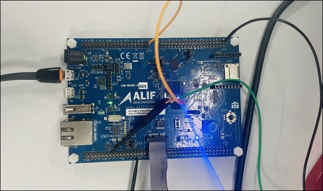

.. _appnote-zephyr-cmp-lpcmp:

=========
CMP/LPCMP
=========

Overview
==================

The High-Speed Comparator (CMP) and Low-Power Comparator (LPCMP) modules are analog comparators integrated into the Ensemble™ devices, designed for high-performance and low-power applications, respectively. The device includes up to two CMP modules and one LPCMP module, each with distinct features tailored to specific use cases.

- **CMP Features**:

  - Rail-to-rail, multi-input analog comparator with programmable reference voltage and hysteresis

  - Reference voltage selectable from DAC6, internal Vref, or external pins

  - Programmable hysteresis: 0 mV to 45 mV

  - Windowing (gating) driven by one of four events from UTIMER

  - Comparator result inverter

  - Configurable number of taps for filtering

  - Interrupt generation after filtering

  - Maximum current consumption: 100 microampere

  - Response time: < 5 ns

  - Input offset: under 8 mV

  - Power supply: internal 1.8-V LDO (LDO-5)

- **LPCMP Features**:
  - Low-power, rail-to-rail analog comparator with selectable reference voltage and hysteresis, located in the PD0 power domain

  - Up to four external pins for voltage monitoring

  - Voltage reference from:

    - Internal 0.6-V voltage reference

    - External VREF pins

  - Programmable hysteresis: 5 mV to 30 mV (measured with input voltage range limited from 0.7 V to VDD – 0.7 V)

  - Power supply: VDD_IO_1V8 pin

  - Maximum current consumption: 20 microAmpere

  - Response time: < 10 microseconds

  - Input offset: 20 mV / 1 sigma

- **Supported Channels**:
  - CMP: Up to four channels (CMP0, CMP1, CMP2, CMP3)
  - LPCMP: Single channel with up to four input pins (P2_4, P2_5, P2_6, P2_7)

.. figure:: _static/cmp_lpcmp_diagram.png
   :alt: CMP Implementation Overview
   :align: center

   CMP Implementation Overview

Introduction
============

This application note provides a comprehensive guide on how to create, compile, and run a demo application for the CMP (Analog Comparator) controller IP and LPCMP (Low Power Comparator), which is provided by Alif Semiconductor™ and integrated into the Ensemble™ devices using the Zephyr OS.

Hardware Requirements and Setup
===============================

Hardware Requirements
---------------------

- **Alif Ensemble DevKit (Flat Board)**
- **Debugger: JLink**

CMP/LPCMP Interface
-------------------

The CMP/LPCMP module interfaces with the external environment through designated pins on the Ensemble™ devices.

Pin Setup
---------

The CMP pin setup is as follows:

.. list-table:: CMP Pin Setup
   :widths: 20 20 20 20 20
   :header-rows: 1

   * - CMP
     - CMP0
     - CMP1
     - CMP2
     - CMP3
   * -
     - P0_0
     - P0_2
     - P0_1
     - P0_3
   * -
     - P0_6
     - P0_8
     - P0_7
     - P0_9
   * -
     - P1_4
     - P0_14
     - P0_13
     - P0_15
   * -
     - P0_4
     - P0_10
     - P0_5
     - P0_11
   * - Output Pin
     - P14_7
     - P14_6
     - P14_5
     - P14_4

The LPCMP pin setup is as follows:

.. list-table:: LPCMP Pin Setup
   :widths: 20 80
   :header-rows: 1

   * - LPCMP
     - Pins
   * -
     - P2_4, P2_5, P2_6, P2_7

.. note:: LPCMP has no output pins.

Hardware Connections
---------------------

   Hardware Connections

Software Requirements
=====================

Below is a list of required software and drivers needed to run the CMP/LPCMP application:

- **Alif Zephyr CMP driver**

Building CMP/LPCMP Application in Zephyr
===========================================================

Follow these steps to build the CMP/LPCMP application in Zephyr using the Alif Zephyr SDK:

1. For instructions on fetching the Alif Zephyr SDK and navigating to the Zephyr repository, please refer to the `ZAS User Guide`_

2. Remove any existing build and build the CMP/LPCMP sample:

.. note::
   The build commands shown here are specifically for the Alif E7 DevKit.
   To build the application for other boards, please modify the board name in the build command accordingly. For more information, refer to the ZAS User Guide.

3. Build commands for applications on the M55 HE core using the Ninja build command:

.. code-block:: bash

   rm -rf build
   west build -b alif_e7_dk_rtss_he ../alif/samples/drivers/cmp

4. Build commands for applications on the M55 HP core using the Ninja build command:

.. code-block:: bash

   rm -rf build
   west build -b alif_e7_dk_rtss_hp ../alif/samples/drivers/cmp

.. note::
   To address various scenarios, such as utilizing MRAM or flash addresses and employing alternative compilers like LLVM or ARMCLANG, refer to the document AUGD0008_Getting-Started-with-ZAS-for-Ensemble-v0.5.0-Beta.

Once the build command completes successfully, executable images will be generated and placed in the `build/zephyr` directory. Both `.bin` (binary) and `.elf` (Executable and Linkable Format) files will be available.

Executing Binary on the DevKit
================================

To execute binaries on the DevKit follow the command

.. code-block:: bash

   west flash

Sample Output
=============

**Console Output for CMP**

.. code-block:: text

   Welcome to minicom 2.7.1
   OPTIONS: I18n
   Compiled on Dec 23 2019, 02:06:26.
   Port /dev/ttyACM1, 12:41:44
   Press CTRL-A Z for help on special keys
   *** Booting Zephyr OS build Zephyr-Alif-SDK-v0.5.0-17-g17b360353343 ***
   [00:00:02.000,000] <inf> ALIF_CMP: start comparing
   [00:00:02.050,000] <inf> ALIF_CMP: positive input voltage is greater than negative input voltage
   [00:00:02.101,000] <inf> ALIF_CMP: negative input voltage is greater than the positive input voltage
   [00:00:02.151,000] <inf> ALIF_CMP: positive input voltage is greater than negative input voltage
   [00:00:02.201,000] <inf> ALIF_CMP: negative input voltage is greater than the positive input voltage
   [00:00:02.251,000] <inf> ALIF_CMP: positive input voltage is greater than negative input voltage
   [00:00:02.301,000] <inf> ALIF_CMP: negative input voltage is greater than the positive input voltage
   [00:00:02.351,000] <inf> ALIF_CMP: positive input voltage is greater than negative input voltage
   [00:00:02.401,000] <inf> ALIF_CMP: negative input voltage is greater than the positive input voltage
   [00:00:02.451,000] <inf> ALIF_CMP: positive input voltage is greater than negative input voltage
   [00:00:02.501,000] <inf> ALIF_CMP: negative input voltage is greater than the positive input voltage
   [00:00:02.501,000] <inf> ALIF_CMP: Comparison Completed

**Console Output for LPCMP**

.. code-block:: text

   Welcome to minicom 2.8
   OPTIONS: I18n
   Port /dev/ttyUSBO, 14:31:40
   Press CTRL-A Z for help on special keys
   *** Booting Zephyr OS build zas-vl.l-main-2-g12049f5595b5 ***
   [00:00:16.838,000] <inf> ALIF_CMP: Comparison completed