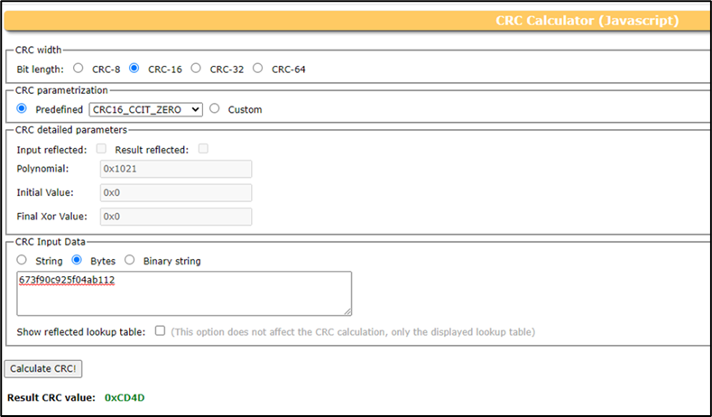

.. _appnote-zephyr-crc:

===
CRC
===

Introduction
============

This application note provides an overview of the Cyclic Redundancy Check (CRC), a powerful method used for error detection and correction. Here are the key features:

- **CRC Algorithm Support**: Supports CRC-8-CCITT, CRC-16-CCITT, CRC-32, and CRC-32C standards.
- **Data Processing**: Processes data in 8-bit or 32-bit chunks.
- **Automatic Byte and Bit Swapping**: Optionally performs byte and bit swapping of data.
- **Customized Polynomials**: Allows customization of polynomials for specific applications.
- **AHB Interface**: Interfaces with the Advanced High-performance Bus (AHB).

.. include:: prerequisites.rst

CRC Operation
=============

The following steps are involved in CRC operation:

Configuration
-------------

Write to the control register (0x00) to set up the operation:

- Choose the desired CRC algorithm and size (8, 16, or 32 bits).
- Optionally program BIT or BYTE swapping.
- Optionally program Reflect CRC.
- Provide a seed value for the selected algorithm.

Initialization
--------------

- Set the init[0] bit to load the CRC accumulation register with the seed value.
- Write the custom polynomial to the poly_custom register (0x14).

Calculation
-----------

The CRC output is independent of the input size. If the user selects the 8-bit CRC algorithm, the output will be 8 bits. For the 16-bit CRC algorithm, the output will be 16 bits, and for the 32-bit CRC algorithm, the output will be 32 bits.

Reading the Result
------------------

Once all data has been processed, read the CRC result from the crc_out register (0x18).

Building CRC Application in Zephyr
=======================================

Follow these steps to create your Zephyr-based CRC application using the GCC compiler and the Alif Zephyr SDK:

1. For instructions on fetching the Alif Zephyr SDK and navigating to the Zephyr repository, please refer to the `ZAS User Guide`_

.. note::
   The build commands shown here are specifically for the Alif E7 DevKit.
   To build the application for other boards, modify the board name in the build command accordingly. For more information, refer to the `ZAS User Guide`_, under the section Setting Up and Building Zephyr Applications.

2. Build commands for applications on the M55 HE core using the Ninja build command:

.. code-block:: bash

   rm -rf build
   west build -b alif_e7_dk/ae722f80f55d5xx/rtss_he ../alif/samples/drivers/crc/

3. Build commands for applications on the M55 HP core using the Ninja build command:

.. code-block:: bash

   rm -rf build
   west build -b alif_e7_dk/ae722f80f55d5xx/rtss_hp ../alif/samples/drivers/crc/

Once the build command completes successfully, executable images will be generated and placed in the `build/zephyr` directory. Both `.bin` (binary) and `.elf` (Executable and Linkable Format) files will be available.

Verifying CRC Algorithm in a Web CRC Calculator
===============================================

You can verify that the CRC output in a web CRC calculator matches the devKit output. Refer to a web CRC calculator (e.g., https://crccalc.com/) for validation.

CRC-8-CCITT
-----------

To verify the output in a web CRC calculator:

1. Select CRC8 and enter the CRC input data.
2. Calculate the CRC output.

To verify the CRC-8-CCITT algorithm in the Alif CRC Hardware module:

1. Navigate to the ``ensemble_rtss_common.dtsi`` file and set ``crc_algo = "CRC_8_BIT_SIZE"``.
2. Provide the input data in the CRC application.

Example code:

.. code-block:: c

   uint8_t arr[] = {0x67, 0x3F, 0x90, 0xC9, 0x25, 0xF0, 0x4A, 0xB1, 0x12}; /* CRC8 unaligned input data */
   uint32_t seed_value = 0x00000000; /* Seed value for 8 bit */
   /* Output: CRC8 output value: 0xCD */

    Web CRC 8 Output

    Flatboard CRC 8 Output

CRC-16-CCITT
------------

To verify the output in a web CRC calculator:

1. Select CRC16_CCITT_ZERO and enter the CRC input data.
2. Calculate the CRC output.

To verify the CRC-16-CCITT algorithm in the Alif CRC Hardware module:

1. Navigate to the ``ensemble_rtss_common.dtsi`` file and set ``crc_algo = "CRC_16_BIT_SIZE"``.
2. Provide the input data in the CRC application.

Example code:

.. code-block:: c

   uint8_t arr[] = {0x67, 0x3F, 0x90, 0xC9, 0x25, 0xF0, 0x4A, 0xB1, 0x12}; /* CRC unaligned input data */
   uint32_t seed_value = 0x00000000; /* Seed value for 16 bit */
   /* Output: CRC-16-CCITT output value: 0xCD4D */

    Web CRC 16 Output

    Flatboard CRC 16 Output

CRC-32
------

To verify the output in a web CRC calculator:

1. Select CRC32 and enter the CRC input data.
2. Enable Input reflected and Result reflected.
3. Set the initial value to 0xFFFFFFFF and the final XOR value to 0xFFFFFFFF.
4. Calculate the CRC output.

To verify the CRC32 algorithm in the Alif CRC Hardware module:

1. Navigate to the ``ensemble_rtss_common.dtsi`` file and set ``crc_algo = "CRC_32_BIT_SIZE"``.
2. In the application code, enable the bit_swap, byte_swap, reflect, and invert options.
3. Provide the input data in the CRC application.

Example code:

.. code-block:: c

   uint8_t input_value[] = {0x67, 0x3F, 0x90, 0xC9, 0x25, 0xF0, 0x4A, 0xB1, 0x12}; /* CRC unaligned input data */
   uint32_t seed_value = 0xFFFFFFFF; /* Seed value for 32 bit */

    CRC 32 Sample Code

    Web CRC 32 Output

    Flatboard CRC 32 Output

Custom CRC32C
-------------

To verify the output in a web CRC calculator:

1. Select the CRC32 custom option.
2. Enter your CRC input data.
3. Change the polynomial to match the application code.
4. Enable Input reflected.
5. Set the initial value to 0xFFFFFFFF and the final XOR value to 0xFFFFFFFF.
6. Calculate the CRC output.

To verify the CRC32C algorithm in the Alif CRC Hardware module:

1. Navigate to the ``ensemble_rtss_common.dtsi`` file and set ``crc_algo = "CRC_32_BIT_SIZE"``.
2. In the application code, enable the bit_swap, byte_swap, reflect, invert, and custom_poly options.
3. Set the polynomial value to 0x2CEEA6C8 and provide the input data in the CRC application.
4. Call the ``crc_polycustom`` function (declared in ``include/zephyr/drivers/crc/alif_crc.h``) in your application to use the CRC32C algorithm, passing the polynomial variable as a function parameter.

Example code:

.. code-block:: c

   uint8_t arr[] = {0x67, 0x3F, 0x90, 0xC9, 0x25, 0xF0, 0x4A, 0xB1, 0x12}; /* CRC unaligned input data */
   uint32_t seed_value = 0xFFFFFFFF; /* Seed value for custom CRC32 */
   uint32_t polynomial = 0x2CEEA6C8; /* Polynomial value for custom CRC32 */

    Custom CRC 32 Sample Code

    Custom CRC 32 Sample Code Continued

    Web Custom CRC 32 Output

    Flatboard Custom CRC 32 Output

Executing Binary on the DevKit
===============================

To execute binaries on the DevKit follow the command

.. code-block:: bash

   west flash

.. include:: west_debug.rst