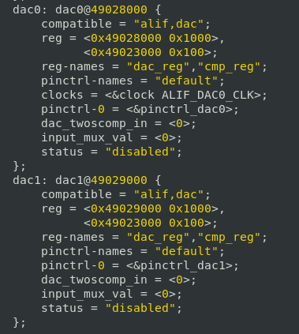

.. _appnote-zephyr-alif-dac:

===
DAC
===

Introduction
============

The Digital-to-Analog Converter (DAC12) module converts 12-bit digital values into analog voltage signals, with an analog output range of 0 V to 1.8 V in Low-Power (LP) mode. The device includes two DAC12 modules, each supporting the following features:

- **Conversion rate**: Up to 1 kHz at 12-bit resolution
- **Input data**: Unsigned binary or two’s complement signed digital data
- **Programmable output current**: Up to 1.5 mA
- **Programmable load capacitance compensation**
- **Internal 1.8 V voltage reference**
- **High-frequency Power Supply Rejection Ratio (PSRR)**
- **Maximum current output**: 1.5 mA
- **Modes**:
  - **High-Performance (HP)**: Supports larger resistive loads at higher power consumption
  - **Low-Power (LP)**: Supports slower sample rates and light resistive loads for power savings

  .. figure:: _static/dac_diagram.png
   :alt: DAC Configuration Diagram
   :align: center

   Diagram of the DAC Configuration

Prerequisites
==============

Hardware Requirements
------------------------

To run the DAC application, you need:

- **Alif Devkit**
- **Debugger: JLink (optional)**

Software Requirements
-----------------------

To develop and run DAC applications on the Alif Devkit with Zephyr, you need:

- **Alif Zephyr SDK**: Clone from `https://github.com/AlifSemiDev/sdk-alif <https://github.com/AlifSemiDev/sdk-alif>`_
- **West Tool**: For building Zephyr applications (installed via ``pip install west``)
- **Arm GCC Compiler**: For compiling the application (part of the Zephyr SDK)
- **SE Tools (optional)**: For loading binaries (refer to Alif documentation)

Output Calculation
==================

**For Positive Input**

Formula:

.. math::

   DAC_{out} = \frac{DAC_{Input}}{2^{12}} \times V_{ref}

Example:

- Given: \( DAC_{Input} = 4000 \), \( V_{ref} = 1.8 \, \text{V} \)
- Calculation: \( DAC_{out} = \frac{4000}{4096} \times 1.8 \, \text{V} = 1.757 \, \text{V} \)

**For Negative Input**

Formula:

- If \( DAC_{Input} > 2047 \):

.. math::

   DAC_{out} = \frac{DAC_{Input} - 2047}{2^{12}} \times V_{ref}

- If \( DAC_{Input} < 2047 \):

.. math::

   DAC_{out} = \frac{DAC_{Input} + 2047}{2^{12}} \times V_{ref}

Note: If DAC input is ``0xFFFFFFFFFFFFFFFF`` (-1 in decimal), the lower 12 bits (``0xFFF``, or 4095 in decimal) are considered.

Device Tree Specification
=========================

Users can modify parameters to convert two's complement to unsigned binary data and select the DAC input data source.

**Input MUX:**

- ``input_mux_val = 1``: DAC input through DAC_REG1 (bypass mode).
- ``input_mux_val = 0``: DAC input through DAC_IN register.

**Two’s Complement:**

- ``dac_twoscomp_in = 0``: Positive input.
- ``dac_twoscomp_in = 1``: Negative input.

   Device Tree Code Snippet

Building DAC Application in Zephyr
==================================

Follow these steps to build the DAC application using the Alif Zephyr SDK:

1. For instructions on fetching the Alif Zephyr SDK and navigating to the Zephyr repository, please refer to the `ZAS User Guide`_

.. note::
   The build commands shown here are specifically for the Alif E7 DevKit.
   To build the application for other boards, please modify the board name in the build command accordingly. For more information, refer to the ZAS User Guide.

1. Build commands for applications on the M55 HE core using the Ninja build command:

.. code-block:: bash

   rm -rf build/
   west build -b alif_e7_dk_rtss_he ../alif/samples/drivers/dac -p -- -G"Unix Makefiles"

2. Build commands for applications on the M55 HP core using the Ninja build command:

.. code-block:: bash

   rm -rf build/
   west build -b alif_e7_dk_rtss_hp ../alif/samples/drivers/dac -p -- -G"Unix Makefiles"

.. note::
   To address various scenarios, such as utilizing MRAM or flash addresses and employing alternative compilers like LLVM or ARMCLANG, refer to the document AUGD0008_Getting-Started-with-ZAS-for-Ensemble-v0.5.0-Beta.

Once the build command completes successfully, executable images will be generated and placed in the `build/zephyr` directory. Both `.bin` (binary) and `.elf` (Executable and Linkable Format) files will be available.

Executing Binary on the DevKit
==============================================

To execute binaries on the DevKit follow the command

.. code-block:: bash

   west flash

Expected Result
===============

The sample Output will be as follows

   .. figure:: _static/dac_sample_output.png
      :alt: DAC Sample Output
      :align: center

      DAC Sample Output