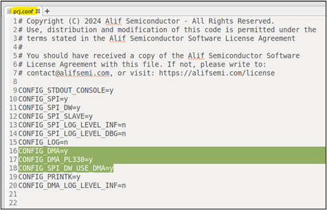
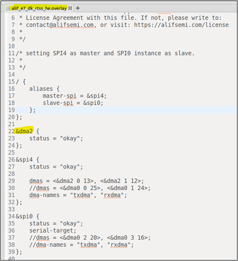
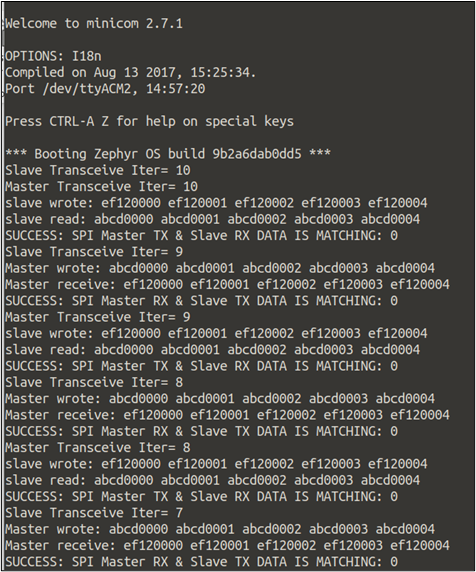
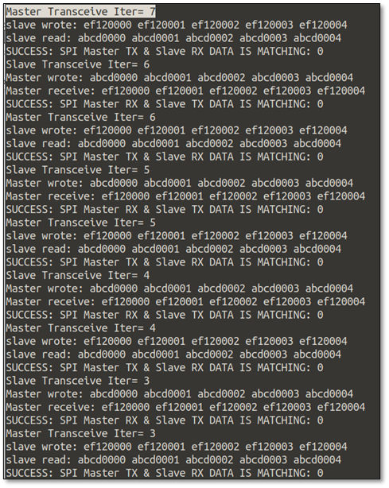
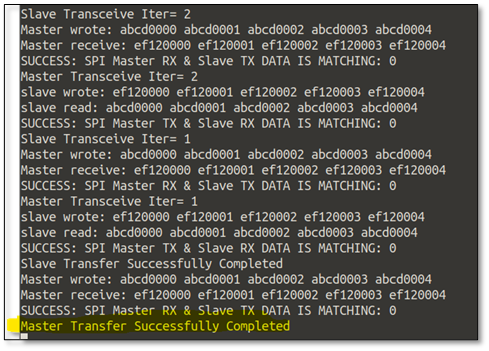

.. _appnote-zephyr-dma:

====
DMA
====

Introduction
============

Direct Memory Access (DMA) enhances system performance by offloading the CPUs from data transfers, enabling efficient data movement between memory and peripherals. The Alif platform features three DMA controllers:

- **DMA0**: A general-purpose DMA controller accessible by any core.
- **DMA1**: A dedicated DMA controller for the RTSS-HP core.
- **DMA2**: A dedicated DMA controller for the RTSS-HE core.

Since this core has numerous peripherals, we have a MUX for DMA0, which allows mapping peripherals to the DMA. This application note covers a sample test application for DMA with SPI (HE core).

.. include:: prerequisites.rst

Hardware Design
---------------

The block diagram illustrates the hardware design of Zephyr DMA, showing the integration of DMA controllers with peripherals and memory.

.. figure:: _static/dma_diagram.png
   :alt: Zephyr DMA Block Diagram
   :align: center

   Block Diagram of Zephyr DMA

Building SPI DMA Application in Zephyr
========================================

Follow these steps to build your Zephyr-based SPI_dw application using the GCC compiler and the Alif Zephyr SDK:

1. For instructions on fetching the Alif Zephyr SDK and navigating to the Zephyr repository, please refer to the `ZAS User Guide`_

.. note::
   The build commands shown here are specifically for the Alif E7 DevKit.
   To build the application for other boards, modify the board name in the build command accordingly. For more information, refer to the `ZAS User Guide`_, under the section Setting Up and Building Zephyr Applications.

2. Build commands for applications on the M55 HE core using the Ninja build command:

.. code-block:: bash

   rm -rf build
   west build -b alif_e7_dk/ae722f80f55d5xx/rtss_he ../alif/samples/drivers/spi_dw/

3. Build commands for applications on the M55 HP core using the Ninja build command:

.. code-block:: bash

   rm -rf build
   west build -b alif_e7_dk/ae722f80f55d5xx/rtss_hp ../alif/samples/drivers/spi_dw/

Ensure that the DMA-related configurations are enabled in ``../alif/samples/drivers/spi_dw/prj.conf``:

   DMA Configuration in prj.conf

Select the DMA instance from the overlay file ``../alif/samples/drivers/spi_dw/boards/aalif_e7_dk/ae722f80f55d5xx/rtss_he.overlay``:

   DMA Instance Selection in Overlay File

Executing Binary on the DevKit
==============================

To execute binaries on the DevKit follow the command

.. code-block:: bash

   west flash

Sample Output
=============

SPI data transfer occurs using the selected DMA. The following output is displayed on the serial terminal, showing the results of the SPI data transfer:

   Console Output 1

   Console Output 2

   Console Output 3

.. note::
   The console output displays the results of SPI data transfer using DMA, including transferred data and status messages. Refer to the SPI_dw sample application (``../alif/samples/drivers/spi_dw/``) for specific output details.

.. include:: west_debug.rst