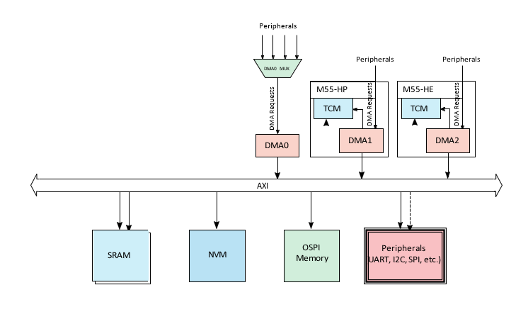

.. _appnote-zephyr-dma:

====
DMA
====

Introduction
============

Direct Memory Access (DMA) enhances system performance by offloading the CPUs from data transfers, enabling efficient data movement between memory and peripherals. The Alif platform features three DMA controllers:

- **DMA0**: A general-purpose DMA controller accessible by any core.
- **DMA1**: A dedicated DMA controller for the RTSS-HP core.
- **DMA2**: A dedicated DMA controller for the RTSS-HE core.

Since this core has numerous peripherals, we have a MUX for DMA0, which allows mapping peripherals to the DMA. This application note covers a sample test application for DMA with SPI (HE core).

Hardware Requirements and Setup
===============================

Hardware Requirements
---------------------

- **DevKit**
- **USB cable** (x1)

Host Software Requirements
--------------------------

- **Development Environment**: ARM DS or Keil

Hardware Design
---------------

The block diagram illustrates the hardware design of Zephyr DMA, showing the integration of DMA controllers with peripherals and memory.

   Block Diagram of Zephyr DMA

Building the SPI DMA Application
================================

Follow these steps to build your Zephyr-based SPI_dw application using the GCC compiler and the Alif Zephyr SDK:

.. note::
   The application is designed for the Alif Ensemble E7 DevKit. Modify the sample code as needed for other DevKits.

1. For instructions on fetching the Alif Zephyr SDK and navigating to the Zephyr repository, please refer to the `ZAS User Guide`_

2. Remove the existing build directory and build the application:

.. code-block:: bash

   rm -rf build
   west build -b alif_e7_dk_rtss_he ../alif/samples/drivers/spi_dw/

.. note::
   The build command targets the M55-HE core. To build for the M55-HP core, use ``alif_e7_dk_rtss_hp`` instead (e.g., ``west build -b alif_e7_dk_rtss_hp ../alif/samples/drivers/spi_dw/``). At present, only one DMA instance (DMA0 or DMA2) can be active on the RTSS-HE core at any given time.

Ensure that the DMA-related configurations are enabled in ``../alif/samples/drivers/spi_dw/prj.conf``:

.. figure:: _static/dma_prj_conf.png
   :alt: prj.conf Configuration
   :align: center

   DMA Configuration in prj.conf

Select the DMA instance from the overlay file ``../alif/samples/drivers/spi_dw/boards/alif_e7_dk_rtss_he.overlay``:

   DMA Instance Selection in Overlay File

Executing Binary on the DevKit
==============================

To execute binaries on the DevKit, follow these steps:

1. Open the **Debug Configuration** window using the *Create, manage, and run configurations* option.

   .. figure:: _static/debug_config_window.png
      :alt: Debug Configuration Window
      :align: center

      Debug Configuration Window

2. In the **Connection** tab, ensure the correct Core and ULINKpro selections are made. In the **Select Target** section, choose:

   - ``Cortex-M55_0`` for M55-HP core
   - ``Cortex-M55_1`` for M55-HE core

   .. figure:: _static/connections_tab.png
      :alt: Connection Tab Settings
      :align: center

      Connection Tab Settings

3. In the **Debugger** tab:

   - Select **Connect Only**.
   - Use the ``loadfile`` command to specify the path to the application’s ``.elf`` file.
   - Click the **Debug** symbol to load debugging information.
   - Click **Apply** and then **Debug** to start the debugging process.

   .. figure:: _static/debugger_tab.png
      :alt: Debugger Tab Settings
      :align: center

      Debugger Tab Settings

Sample Output
=============

SPI data transfer occurs using the selected DMA. The following output is displayed on the serial terminal, showing the results of the SPI data transfer:

   Console Output 1

.. figure:: _static/dma_console_output_2.png
   :alt: Console Output 2
   :align: center

   Console Output 2

   Console Output 3

.. note::
   The console output displays the results of SPI data transfer using DMA, including transferred data and status messages. Refer to the SPI_dw sample application (``../alif/samples/drivers/spi_dw/``) for specific output details.