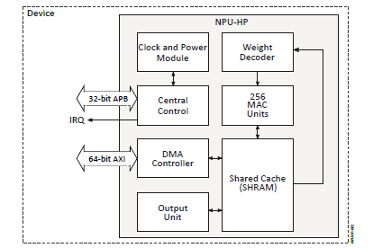

.. _appnote-zas-ethos:

===================
Ethos NPU U-55/U85
===================

Introduction
==============

Alif Semiconductor’s Ensemble and Balletto families feature flexible compute architectures that integrate Arm® Cortex®-A32 application processors, Cortex-M55 real-time processors with Armv8.1-M architecture and Helium™ MVE (M-Profile Vector Extension), and Arm Ethos™ microNPUs for accelerated machine learning (ML) inference. All Ensemble and Balletto devices combine the Cortex-M55 with an Ethos-U55 microNPU, while the higher-end Ensemble E4 and E8 variants further incorporate an Ethos-U85 microNPU to enable efficient acceleration of transformer-based neural networks (TNNs).

This application note offers practical guidance for developing ML inference applications on Ensemble and Balletto devices using the Zephyr RTOS and the TensorFlow Lite Micro (TFLM) framework. It presents two reference applications: tflm_ethosu, which supports convolutional neural network (CNN) models on all devices equipped with Ethos-U55 or Ethos-U85 microNPUs, and tflm_transformer, designed specifically for deploying compact transformer models such as BERT-Tiny on platforms featuring the Ethos-U85. The document serves as a concise, implementation-focused guide to harnessing hardware-accelerated ML across Alif’s microcontroller portfolio.

The Real-Time Processor cores are:

- **High-Performance Arm Cortex-M55 (RTSS-HP)**: Operating at up to 400 MHz.
- **High-Efficiency Arm Cortex-M55 (RTSS-HE)**: Operating at up to 160 MHz.

.. note::
   Refer to the `Arm Ethos-U85 documentation <https://www.arm.com/products/silicon-ip-cpu/ethos/ethos-u85>`_ for detailed specifications.

   Diagram of the Ethos U-55 NPU Configuration

Hardware Requirements
======================

- Alif Devkit
- Debugger: JLink

Software Requirements
========================

- **Alif SDK**: Clone from `https://github.com/alifsemi/sdk-alif.git <https://github.com/alifsemi/sdk-alif.git>`_
- **West Tool**: For building Zephyr applications (refer to the `ZAS User Guide`_)
- **Arm GCC Compiler**: For compiling the application (part of the Zephyr SDK)
- **SE Tools**: For loading binaries (refer to the `ZAS User Guide`_)

.. include:: note.rst

TensorFlow Lite
================

The Alif Zephyr release supports building the ``tflm_ethosu`` Zephyr application for both the HE and HP M55 cores of the SoC. This application runs a model compiled using the Vela compiler. The model is integrated into the application as a C array and loaded into the Ethos NPU. The application verifies that the Ethos NPU (128 MACs for the HE M55 core and 256 MACs for the HP M55 core) is properly loaded and functioning.

Build a tflm_ethosu Application Using the GCC Compiler
========================================================

Follow these steps to prepare your tflm_ethosu application using the GCC compiler and the Alif Zephyr SDK:

.. note::
   The application is designed for the Alif Ensemble E8 DevKit. Modify the sample code as needed for other DevKits.

1. Fetch the Alif Zephyr SDK source from the main branch at `https://github.com/alifsemi/sdk-alif.git <https://github.com/alifsemi/sdk-alif.git>`_

.. code-block:: bash

    mkdir /home/$USER/sdk-alif

    cd /home/$USER/sdk-alif

    west init -m https://github.com/alifsemi/sdk-alif --mr main

    west config manifest.project-filter -- +tflite-micro

    west update

2. Navigate to the Zephyr directory

.. code-block:: bash

    cd zephyr

3. Remove the existing build directory, if any:

.. code-block:: bash

      rm -rf build

4. Build command for application on the Ethos-U85-256 HE core:

.. code-block:: bash

   west build \
     -b alif_e8_dk/ae822fa0e5597xx0/rtss_he \
     ../alif/samples/modules/tflite-micro/tflm_ethosu/ \
     -p always \
     -- \
     -DETHOSU_TARGET_NPU_CONFIG=ethos-u85-256 \
     -DEXTRA_DTC_OVERLAY_FILE="boards/enable_ethosu85.overlay"

5. Build command for application on the Ethos-U85-256 HP core:

.. code-block:: bash

   west build \
     -b alif_e8_dk/ae822fa0e5597xx0/rtss_hp \
     ../alif/samples/modules/tflite-micro/tflm_ethosu/ \
     -p always \
     -- \
     -DETHOSU_TARGET_NPU_CONFIG=ethos-u85-256 \
     -DEXTRA_DTC_OVERLAY_FILE="boards/enable_ethosu85.overlay"

6. Build command for the application on the Ethos-U55-128 HE core:

.. code-block:: bash

   west build \
     -b alif_e8_dk/ae822fa0e5597xx0/rtss_he \
     ../alif/samples/modules/tflite-micro/tflm_ethosu/ \
     -p always \
     -- \
     -DETHOSU_TARGET_NPU_CONFIG=ethos-u55-128 \
     -DEXTRA_DTC_OVERLAY_FILE="boards/enable_ethosu55.overlay"

7. Build command for the application on the Ethos-U55-256 HP core:

.. code-block:: bash

   west build \
     -b alif_e8_dk/ae822fa0e5597xx0/rtss_hp \
     ../alif/samples/modules/tflite-micro/tflm_ethosu/ \
     -p always \
     -- \
     -DETHOSU_TARGET_NPU_CONFIG=ethos-u55-256 \
     -DEXTRA_DTC_OVERLAY_FILE="boards/enable_ethosu55.overlay"

How to Use the TFLM Application
--------------------------------

This sample application can be used for basic inference on the Ethos subsystem using a TFLite model on the M55 core of the Alif Ensemble DevKit. It uses the Ethos-U55 to accelerate supported network operators and the M55 core for unsupported operators using the appropriate reference kernels.

Limitations/Known Issues
-------------------------

- Compilation of the Ethos-U application has not been tried with the ArmClang and open-source clang compilers.

Sample JSON Configuration Files
---------------------------------

Sample JSON configuration files to use while flashing the binary into TCM or MRAM:

**For RTSS-HE (TCM):**

.. code-block:: json

   {
       "Zephyr-RTSS-HE": {
           "binary": "zephyr_e7_rtsshe_ethosu.bin",
           "version": "1.0.0",
           "cpu_id": "M55_HE",
           "loadAddress": "0x58000000",
           "flags": ["load", "boot"],
           "signed": false
       }
   }

**For RTSS-HP (TCM):**

.. code-block:: json

   {
       "Zephyr-RTSS-HP": {
           "binary": "zephyr_e7_rtsshp_ethosu.bin",
           "version": "1.0.0",
           "cpu_id": "M55_HP",
           "loadAddress": "0x50000000",
           "flags": ["load", "boot"],
           "signed": false
       }
   }

**For RTSS-HE (E1C, TCM):**

.. code-block:: json

   {
       "ZRTSS-E1C-HE": {
           "binary": "zephyr_e1c_rtsshe_ethosu.bin",
           "version": "1.0.0",
           "cpu_id": "M55_HE",
           "loadAddress": "0x58000000",
           "flags": ["load", "boot"],
           "signed": false
       }
   }

**For RTSS-HE (MRAM):**

Refer to the JSON configuration file at: `RTSS HE MRAM JSON`_

**For RTSS-HP (MRAM):**

Refer to the JSON configuration file at: `RTSS HP MRAM JSON`_

Loading the Binary on the Alif Ensemble Devkit
=================================================

To flash and execute the binary on the DevKit using the SE tool:

1. Copy the generated binary (e.g., `zephyr_e7_rtsshe_ethosu.bin` or `zephyr_e7_rtsshp_ethosu.bin`) and the corresponding JSON configuration file to the SE tool directory.
2. Use the SE tool to flash the binary to MRAM or TCM. Execute the flashing commands as per the Alif documentation (e.g., similar to `python3 app-gen-toc.py` and `python3 app-write-mram.py`).
3. Ensure the debugger is disconnected to allow the core to enter the OFF state.
4. Reset the DevKit to boot the cores and run the application.

Console Output
===============

.. code-block:: text

   [00:00:00.000,000] <dbg> ethos_u: ethosu_zephyr_init: Ethos-U DTS info. base_address=0x0x400e1000, secure_enable=1, privilege_enable=1
   [00:00:00.012,000] <dbg> ethos_u: ethosu_zephyr_init: Version: major=0, minor=16, patch=0
   *** Booting Zephyr OS build Zephyr-Ensemble-E7-B0-RTSS-v0.2.2-Beta-24-g04bcddaf4962 ***
   sender 0: Sending inference. job=0x205d340, name=keyword_spotting_cnn_small_int8
   runner 0: Received inference job. job=0x205d340
   sender 0: Serunner 0: Sending inference response. job=0x205d340
   nding inference. job=0x205d38c, name=keyword_spotting_cnn_small_int8
   runner 0: Received inference job. job=0x205d38c
   sender 0: Received job response. job=0x205d340, status=0
   runner 0: Sending inference response. job=0x205d38c
   sender 1: Sending inference. job=0x205db48, name=keyword_spotting_cnn_small_int8
   runner 0: Received inference job. job=0x205db48
   sender 1: Sending inference. job=0x205db94, name=runner 0: Sending inference response. job=0x205db48
   keyword_spotting_cnn_small_int8
   runner 0: Received inference job. job=0x205db94
   sender 1: Received job response. job=0x205db48, status=0
   runner 0: Sending inference response. job=0x205db94
   sender 0: Received job response. job=0x205d38c, status=0
   sender 1: Received job response. job=0x205db94, status=0
   exit

Executorch
==============

Overview
=========

ML inference application using PyTorch executorch runtime with Arm Ethos-U NPU acceleration.
Runs a Depthwise Separable CNN (DS-CNN) keyword spotting model optimized with Vela compiler.

This sample demonstrates:

- Loading pre-compiled executorch models (.pte files)
- Running quantized int8 inference on Ethos-U NPU
- Using static MFCC audio features as input
- Classifying 12 keyword classes with ~107ms inference time

Setup Instructions
==================

Initial Workspace Setup
-----------------------

For a fresh project, follow these steps.

1. Create the workspace directory.

.. code-block:: console

   mkdir sdk-alif
   cd sdk-alif

2. Create and activate the Python virtual environment.

.. code-block:: console

   python3 -m venv .zephyr_venv
   source .zephyr_venv/bin/activate

3. Initialize the West workspace.

.. code-block:: console

   west init -m https://github.com/alifsemi/sdk-alif --mr main

4. Enable the Executorch module.

.. code-block:: console

   west config manifest.project-filter -- +executorch

5. Update all modules.

.. code-block:: console

   west update

6. Setup Executorch.

.. code-block:: console

   west executorch-setup

.. note::

   **EULA Acceptance Required**

   During the ``west executorch-setup`` process, you will be prompted to accept
   Arm's End User License Agreement (EULA) for the Corstone Fixed Virtual
   Platform (FVP).

   The setup will pause and ask:

   ``Do you want to continue and review the EULA? (yes/no)``

   - Type ``yes`` or ``y`` to proceed with FVP setup and review the EULA.
   - Type ``no`` or ``n`` to skip FVP setup. Some ARM features may not be available.

The ``west executorch-setup`` command automatically performs the following:

- Initializes Executorch git submodules
- Installs the Executorch Python package into the virtual environment
- Runs ARM-specific setup scripts
- Applies Alif-specific modifications
- Copies KWS model files to both source and installed package locations

Building the Model
==================

Generate Executorch ``.pte`` Model Files
----------------------------------------

Ethos-U55 (256 MACs)

.. code-block:: console

   python -m modules.lib.executorch.examples.arm.aot_arm_compiler \
       --system_config=RTSS_HP_SRAM_MRAM \
       --config=alif/samples/modules/executorch/ensemble_vela.ini \
       --model_name=kws \
       --quantize \
       --delegate \
       -t ethos-u55-256 \
       --output=kws_u55_256.pte

Ethos-U85 (256 MACs)

.. code-block:: console

   python -m modules.lib.executorch.examples.arm.aot_arm_compiler \
       --system_config=RTSS_HP_SRAM_MRAM \
       --config=alif/samples/modules/executorch/ensemble_vela.ini \
       --model_name=kws \
       --quantize \
       --delegate \
       -t ethos-u85-256 \
       --output=kws_u85_256.pte

Ethos-U55 (128 MACs)

.. code-block:: console

   python -m modules.lib.executorch.examples.arm.aot_arm_compiler \
       --system_config=RTSS_HE_SRAM_MRAM \
       --config=alif/samples/modules/executorch/ensemble_vela.ini \
       --model_name=kws \
       --quantize \
       --delegate \
       -t ethos-u55-128 \
       --output=kws_u55_128.pte

Model Compiler Options
----------------------

- ``--system_config`` : Memory configuration (``RTSS_HP_SRAM_MRAM`` or ``RTSS_HE_SRAM_MRAM``)
- ``--config`` : Vela compiler configuration file
- ``--model_name`` : Model name (``kws``)
- ``--quantize`` : Enable INT8 quantization
- ``--delegate`` : Use Ethos-U delegate for NPU acceleration
- ``-t`` : Target NPU configuration
- ``--output`` : Output ``.pte`` file name

Building and Running
====================

Building for Alif E8 DK (HP Core with U55)
------------------------------------------

.. code-block:: console

   west build -b alif_e8_dk/ae822fa0e5597xx0/rtss_hp \
       -S ethos-u55-enable \
       alif/samples/modules/executorch/kws_ethosu/ -- \
       -DET_PTE_FILE_PATH=./kws_u55_256.pte \
       -DET_PTE_SECTION=.rodata.model \
       -DETHOSU_TARGET_NPU_CONFIG=ethos-u55-256

Building for Alif E8 DK (HP Core with U85)
------------------------------------------

.. code-block:: console

   west build -b alif_e8_dk/ae822fa0e5597xx0/rtss_hp \
       -S ethos-u85-enable \
       alif/samples/modules/executorch/kws_ethosu/ -- \
       -DET_PTE_FILE_PATH=./kws_u85_256.pte \
       -DET_PTE_SECTION=.rodata.model \
       -DETHOSU_TARGET_NPU_CONFIG=ethos-u85-256

Building for Alif E7 DK (HP Core with U55)
------------------------------------------

.. code-block:: console

   west build -b alif_e7_dk/ae722f80f55d5xx/rtss_hp \
       -S ethos-u55-enable \
       alif/samples/modules/executorch/kws_ethosu/ -- \
       -DET_PTE_FILE_PATH=./kws_u55_256.pte \
       -DET_PTE_SECTION=.rodata.model \
       -DETHOSU_TARGET_NPU_CONFIG=ethos-u55-256

Building for Alif E7 DK (HE Core with U55-128)
----------------------------------------------

.. code-block:: console

   west build -b alif_e7_dk/ae722f80f55d5xx/rtss_he \
       -S ethos-u55-enable \
       alif/samples/modules/executorch/kws_ethosu/ -- \
       -DET_PTE_FILE_PATH=./kws_u55_128.pte \
       -DET_PTE_SECTION=.rodata.model \
       -DETHOSU_TARGET_NPU_CONFIG=ethos-u55-128

Flashing
========

Flash the application to the board.

.. code-block:: console

   west flash

Sample Output
=============

.. code-block:: console

   *** Booting Zephyr OS build ***

   ========================================
   executorch Keyword Spotting Demo
   ========================================

   I [executorch:main.cpp:279 main()] Ethos-U backend registered successfully
   I [executorch:main.cpp:285 main()] Model PTE at 0x8021eb50, Size: 35280 bytes
   I [executorch:main.cpp:291 main()] Model data loaded. Size: 35280 bytes.
   I [executorch:main.cpp:303 main()] Model loaded, has 1 methods
   I [executorch:main.cpp:311 main()] Running method: forward
   I [executorch:main.cpp:408 main()] Inference completed in 107 ms
   I [executorch:main.cpp:418 main()] Predicted keyword: "left" (class 6)

   ========================================
   Keyword Spotting Demo Complete
   ========================================

   Inference time: 107 ms
   Result: PASS

References
==========

- `executorch Documentation`_
- `Arm Ethos-U NPU`_
- `Vela Compiler`_
- `Alif Semiconductor`_
- `Google Speech Commands Dataset`_
- `DS-CNN Paper`_
