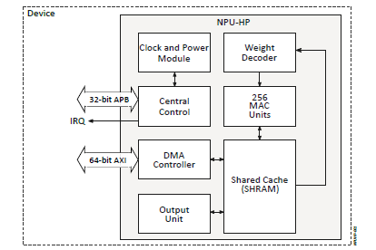

.. _appnote-zas-ethos-u55:

==============
Ethos U-55 NPU
==============

Introduction
============

The Alif processors have Application Processor cores consisting of dual-core Arm® Cortex®-A32 processors and Real-Time Processor cores consisting of Cortex-M55 processors. The Real-Time Processor cores implement the Arm v8.1 instruction set, including Helium M-Profile Vector Extension (MVE), and each Real-Time Processor core is paired with an Arm Ethos™-U55 microNPU for AI/ML acceleration.

The Real-Time Processor cores are:

- **High-Performance Arm Cortex-M55 (RTSS-HP)**: Operating at up to 400 MHz.
- **High-Efficiency Arm Cortex-M55 (RTSS-HE)**: Operating at up to 160 MHz.

.. note:: Please refer to Arm Ethos-U55 documentation for more information.

   Diagram of the Ethos U-55 NPU Configuration

Hardware Requirements and Setup
===============================

Hardware Requirements
---------------------

- DevKit
- USB cable (x1)

Software Requirements
=====================

- **Tera Term** or similar terminal application
- **SE tool** to flash the application to MRAM
- **Alif Zephyr SDK**: Clone from `https://github.com/alifsemi/sdk-alif <https://github.com/alifsemi/sdk-alif>`_

.. note:: Ensure that the debugger is not connected while running this application, as it will prevent the core from entering the OFF state.

Setup
=====

The Alif Zephyr release supports building the ``tflm_ethosu`` Zephyr application for both the HE and HP M55 cores of the SoC. This application runs a model compiled using the Vela compiler. The model is integrated into the application as a C array and loaded into the Ethos NPU. The application verifies that the Ethos NPU (128 MACs for the HE M55 core and 256 MACs for the HP M55 core) is properly loaded and functioning.

Build a ZAS ETHOS Application Using the GCC Compiler
====================================================

Follow these steps to prepare your ZAS ETHOS application using the GCC compiler and the Alif Zephyr SDK:

.. note::
   The application is designed for the Alif Ensemble E7 DevKit. Modify the sample code as needed for other DevKits.

1. Fetch the Alif Zephyr SDK source from the main branch at https://github.com/AlifSemiDev/sdk-alif

.. code-block:: bash

    $ mkdir -p /home/$USER/Zephyr-Ensemble-E7-B0-RTSS-v0.5.0-Beta/sdk-alif

    $ cd /home/$USER/Zephyr-Ensemble-E7-B0-RTSS-v0.5.0-Beta/sdk-alif

    $ west init -m https://github.com/AlifSemiDev/sdk-alif.git --mr main

    $ west config manifest.project-filter -- +tflite-micro

    $ west update

2. Navigate to the Zephyr directory

.. code-block:: bash

    $ cd zephyr

3. Remove the existing build directory, if any, and build the application:

.. code-block:: bash

      rm -rf build

3. Build commands for HE and HP cores:

    **For HE:**

    .. code-block:: bash

        west build -b alif_e7_dk_rtss_he ../alif/samples/modules/tflite-micro/tflm_ethosu/ -p always -- -G"Unix Makefiles"

    **For HP:**

    .. code-block:: bash

        west build -b alif_e7_dk_rtss_hp ../alif/samples/modules/tflite-micro/tflm_ethosu/ -p always -- -G"Unix Makefiles"

Alternatively, use the Ninja tool:

.. code-block:: bash

   west build -b alif_e7_dk_rtss_he samples/modules/tflite-micro/tflm_ethosu/
   west build -b alif_e7_dk_rtss_hp samples/modules/tflite-micro/tflm_ethosu/

How to Use the Application
==========================

This sample application can be used for basic inferencing of input data on the Ethos subsystem using a TFLite model in the M55 core of the Alif Ensemble devkit. It utilizes the Ethos U-55 for accelerating supported network operators and the M55 for unsupported operators using appropriate reference kernels.

Limitations/Known Issues
========================

- Compilation of the Ethos-U application has not been tried with the ArmClang and open-source clang compilers.

Sample JSON Configuration Files
===============================

Sample JSON configuration files to use while flashing the binary into TCM or MRAM:

**For RTSS-HE (TCM):**

.. code-block:: json

   {
       "Zephyr-RTSS-HE": {
           "binary": "zephyr_e7_rtsshe_ethosu.bin",
           "version": "1.0.0",
           "cpu_id": "M55_HE",
           "loadAddress": "0x58000000",
           "flags": ["load", "boot"],
           "signed": false
       }
   }

**For RTSS-HP (TCM):**

.. code-block:: json

   {
       "Zephyr-RTSS-HP": {
           "binary": "zephyr_e7_rtsshp_ethosu.bin",
           "version": "1.0.0",
           "cpu_id": "M55_HP",
           "loadAddress": "0x50000000",
           "flags": ["load", "boot"],
           "signed": false
       }
   }

**For RTSS-HE (E1C, TCM):**

.. code-block:: json

   {
       "ZRTSS-E1C-HE": {
           "binary": "zephyr_e1c_rtsshe_ethosu.bin",
           "version": "1.0.0",
           "cpu_id": "M55_HE",
           "loadAddress": "0x58000000",
           "flags": ["load", "boot"],
           "signed": false
       }
   }

**For RTSS-HE (MRAM):**

Refer to the JSON configuration file at: `http://10.10.10.28/QA/SE_TOOLS/json_files/zephyr_b1/zephyr_rtss_mram_he.json`

**For RTSS-HP (MRAM):**

Refer to the JSON configuration file at: `http://10.10.10.28/QA/SE_TOOLS/json_files/zephyr_b1/zephyr_rtss_mram_hp.json`

Loading the Binary on the Alif Ensemble Devkit
==============================================

To flash and execute the binary on the DevKit using the SE tool:

1. Copy the generated binary (e.g., `zephyr_e7_rtsshe_ethosu.bin` or `zephyr_e7_rtsshp_ethosu.bin`) and the corresponding JSON configuration file to the SE tool directory.
2. Use the SE tool to flash the binary to MRAM or TCM. Execute the flashing commands as per the Alif documentation (e.g., similar to `python3 app-gen-toc.py` and `python3 app-write-mram.py`).
3. Ensure the debugger is disconnected to allow the core to enter the OFF state.
4. Reset the DevKit to boot the cores and run the application.

Sample Output
=============

.. code-block:: text

   [00:00:00.000,000] <dbg> ethos_u: ethosu_zephyr_init: Ethos-U DTS info. base_address=0x0x400e1000, secure_enable=1, privilege_enable=1
   [00:00:00.012,000] <dbg> ethos_u: ethosu_zephyr_init: Version: major=0, minor=16, patch=0
   *** Booting Zephyr OS build Zephyr-Ensemble-E7-B0-RTSS-v0.2.2-Beta-24-g04bcddaf4962 ***
   sender 0: Sending inference. job=0x205d340, name=keyword_spotting_cnn_small_int8
   runner 0: Received inference job. job=0x205d340
   sender 0: Serunner 0: Sending inference response. job=0x205d340
   nding inference. job=0x205d38c, name=keyword_spotting_cnn_small_int8
   runner 0: Received inference job. job=0x205d38c
   sender 0: Received job response. job=0x205d340, status=0
   runner 0: Sending inference response. job=0x205d38c
   sender 1: Sending inference. job=0x205db48, name=keyword_spotting_cnn_small_int8
   runner 0: Received inference job. job=0x205db48
   sender 1: Sending inference. job=0x205db94, name=runner 0: Sending inference response. job=0x205db48
   keyword_spotting_cnn_small_int8
   runner 0: Received inference job. job=0x205db94
   sender 1: Received job response. job=0x205db48, status=0
   runner 0: Sending inference response. job=0x205db94
   sender 0: Received job response. job=0x205d38c, status=0
   sender 1: Received job response. job=0x205db94, status=0
   exit