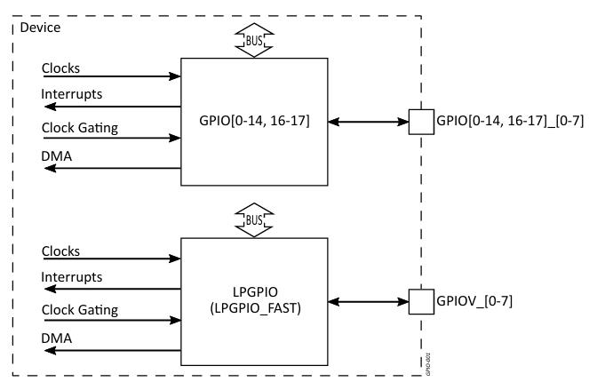

.. _appnote-gpio:

==========================================
General-Purpose Input/Output (GPIO)
==========================================

Introduction
============

The General-Purpose Input/Output (GPIO) module provides the means for driving and reading from digital I/O
pins when they are not used by other peripherals (like UART, I2C, etc.). The GPIO module can be used for tasks like lighting LEDs or reading the state of push-buttons, switches, etc. The GPIO module also offers switch contact debounce and interrupt capabilities.

The device includes up to nineteen GPIO modules with support for up to 144 I/O pins in total.

GPIO Overview
=============

   GPIO Block Diagram

The I/O signals are distributed as follows:

- GPIO[0-14, 16-17]: 8 I/O signals each
- LPGPIO: 8 I/O signals
- LPGPIO_FAST: Shares I/O signals with LPGPIO

The I/O pins are typically powered by VDD_IO_1V8 with the exception of 8 I/O pins, which are powered by
the VDD_IO_FLEX rail that can range from 1.8 V to 3.3 V.

Power Domains
-------------

The GPIO modules are integrated into the following power domains:

- **PowerDomainPD-6**: GPIO[0-14]
- **PowerDomainPD-2**: GPIO[16-17]
- **PowerDomainPD-0 (AON)**: LPGPIO
- **PowerDomainPD-3**: LPGPIO_FAST

GPIO Features
-------------

Each GPIO module supports the following features:

- Data register allows driving and reading each GPIO pin individually
- Data Direction register selects pin direction – input or output
- Bit manipulation registers for GPIO pin set, clear, and toggle
- Debounce function driven by the 32-kHz clock for switch/push-button contacts debouncing
- Individual interrupt generation for every pin of GPIO[0-14, 16-17] and LPGPIO/LPGPIO_FAST
- Common (combined) interrupt generation for the pin events of LPGPIO/LPGPIO_FAST
- The LPGPIO/LPGPIO_FAST interrupt can be used as a wake-up source from STANDBY and STOP low
  power modes

.. include:: prerequisites.rst

.. include:: note.rst

Build a GPIO Application with Zephyr
====================================

Follow these steps to build the GPIO application using the Alif Zephyr SDK:

For instructions on fetching the Alif Zephyr SDK and navigating to the Zephyr repository, refer to the `ZAS User Guide`_

.. note::
   The build commands shown here are for the Alif E8 DevKit.
   To build for other boards, modify the board name accordingly.

1. Build a blinky application on the M55 HP core:

.. code-block:: console

   west build -p always \
     -b alif_e8_dk/ae822fa0e5597xx0/rtss_hp \
     samples/basic/blinky

2.  Build a blinky application on the M55 HE core:

.. code-block:: console

   west build -p always \
     -b alif_e8_dk/ae822fa0e5597xx0/rtss_he \
     samples/basic/blinky

3. Build a button application on the M55 HP core:

.. code-block:: console

   west build -p always \
     -b alif_e8_dk/ae822fa0e5597xx0/rtss_hp \
     samples/basic/button/ \
     -S alif-button

4.  Build a button application on the M55 HE core:

.. code-block:: console

   west build -p always \
     -b alif_e8_dk/ae822fa0e5597xx0/rtss_he \
     samples/basic/button/ \
     -S alif-button

Console Output
==============

Console Output for Blinky Application
--------------------------------------

.. code-block:: text

   LED state: OFF
   LED state: ON
   LED state: OFF
   LED state: ON
   LED state: OFF
   LED state: ON
   LED state: OFF
   LED state: ON
   LED state: OFF
   LED state: ON
   LED state: OFF

Console Output for Button Application
--------------------------------------

.. code-block:: text

   Set up button at gpio@42002000 pin 4
   Set up LED at gpio@49006000 pin 4
   Press the button
   Button pressed at 760221424
   Button pressed at 854813845
   Button pressed at 1008038651
   Button pressed at 1187384813
   Button pressed at 1331663354
   Button pressed at 1331880709
   Button pressed at 1396313847
   Button pressed at 1444161148
   Button pressed at 1444378545
   Button pressed at 1660335278
   Button pressed at 1757955308
   Button pressed at 1758172698