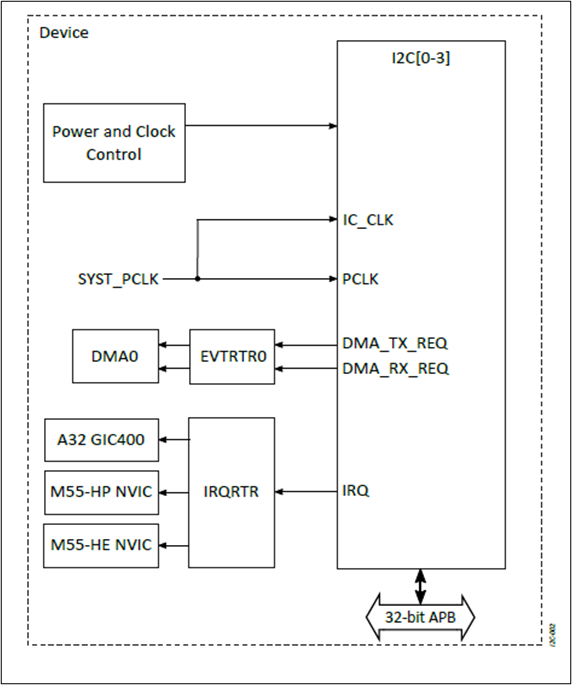
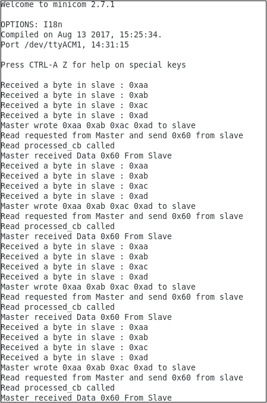

.. _i2c:

===
I2C
===

Overview
========

This document explains how to create, compile, and run the demo application for Inter-Integrated Circuit (I2C) master and slave validation.

Introduction
============

The Inter-Integrated Circuit (I2C) module, functioning as a synchronized master/slave serial communication bus, is highly relevant in various system control applications. Its hierarchical structure facilitates efficient data exchange, with a master device controlling communication and slaves responding.

I2C Features
============

The following are important features of I2C:

- Select the appropriate I2C speed mode according to the I2C or I3C slave device (currently, SDR mode is supported; HDR-DDR mode is not yet supported):
  - Standard Speed (SS) mode (up to 100 kbps)
  - Fast Speed (FS) mode (up to 400 kbps)
  - Fast Speed Plus (FS+) mode (up to 1 Mbps)
- Master or slave operation (LPI2C is slave-only)
- 7- or 10-bit addressing
- 7- or 10-bit combined format transfers
- Bulk transmit mode
- CBUS addresses are ignored
- Interrupt or polled-mode operation
- Bit and byte waiting at all bus speeds
- DMA handshaking interface
- Programmable SDA hold time
- Bus clear feature

Hardware Requirements and Setup
===============================

    I2C Internal Connections

Software Requirements
=====================

The software required for the I2C application includes:

- **Arm DS IDE**: Version 2021.0 or newer
- **Alif Zephyr SDK**: v0.5.0 (includes I2C driver and sample application) or newer

Building the I2C Application
============================

Follow these steps to build your Zephyr-based I2C application using the GCC compiler and the Alif Zephyr SDK:

.. note::
   The application is designed for the Alif Ensemble E7 DevKit. Modify the sample code as needed for other DevKits.

1. For instructions on fetching the Alif Zephyr SDK and navigating to the Zephyr repository, please refer to the `ZAS User Guide`_

2. Remove the existing build directory and build the application:

    .. code-block:: bash

        rm -rf build
        west build -b alif_e7_dk_rtss_hp ../alif/samples/drivers/i2c_dw -p

3. Access the output and binary files: The binary file is available in the `./build/zephyr/` directory.

Executing Binary on the DevKit
===============================

To execute binaries on the DevKit, follow these steps:

1. Open the **Debug Configuration** window using the *Create, manage, and run configurations* option.

    .. note::

        The configuration may be labeled as `M55_HE_I2S`, but you can rename it to suit your preferences.

    .. figure:: _static/debug_config_window.png
        :alt: Debug Configuration Window
        :align: center

        Debug Configuration Window

2. In the **Connection** tab, ensure the correct Core and ULINKpro selections are made. In the **Select Target** section, choose:

    - ``Cortex-M55_0`` for M55-HP core

    .. figure:: _static/connections_tab.png
        :alt: Connection Tab Settings
        :align: center

        Connection Tab Settings

3. In the **Debugger** tab:

    - Select **Debug from entry point** or **Debug from symbol** based on the type of debugging.
    - Use the ``loadfile`` command to specify the path to the application’s ``.elf`` file.
    - Click the **Debug** symbol to load debugging information.
    - Click **Apply** and then **Debug** to start the debugging process.

    .. figure:: _static/debugger_tab.png
        :alt: Debugger Tab Settings
        :align: center

        Debugger Tab Settings

Validating I2C
==============

Console Output
--------------

Upon reviewing the output logs, the I2C functionality has been successfully validated.

    I2C Output Logs