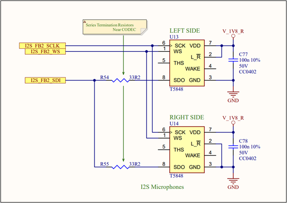
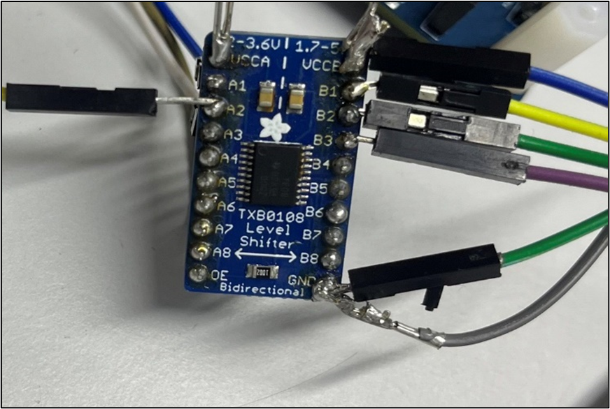
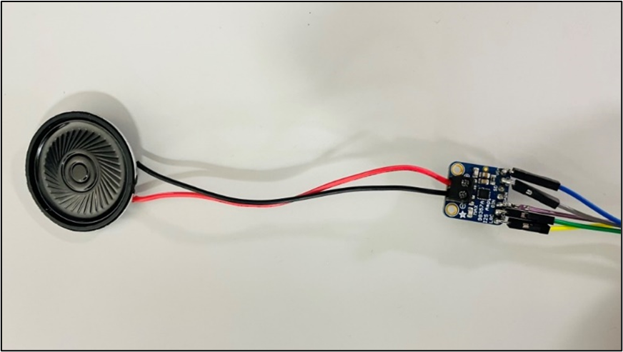
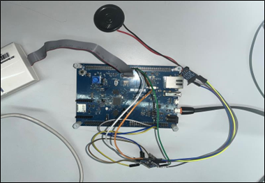

.. _i2s:

===
I2S
===

Introduction
============

This document explains how to create, compile, and run a demo application for the Inter-IC Sound (I2S) controller IP provided by Alif Semiconductor™ and integrated into Ensemble™ and Balletto devices.

Overview
--------

The Inter-IC Sound (I2S™) is a digital serial bus interface standard used for connecting digital audio devices. It is used to communicate Pulse-Code Modulation (PCM) audio data between integrated circuits in an electronic device. I2S uses separate lines for Bit Clock (BCLK), Word Select (LRCLK / WS), and Serial Data (SD), resulting in simpler receivers than those required for asynchronous communication systems that need to recover the clock from the data stream.

   I2S Hardware Connections

.. include:: prerequisites.rst

Hardware Setup I2S
------------------

The DevKit board includes two I2S microphones (one for the left channel and one for the right channel) for recording stereo audio. However, it does not have a built-in headphone jack or speaker.

For E7 DevKits, connect an external speaker to the board using a level shifter circuit to provide the appropriate 3.3V voltage level to the speaker to play the audio.

   Level Shifter

   Speaker

   Board Setup

.. include:: note.rst

Build an I2S Application with Zephyr
========================================

Follow these steps to build the I2S application using the Alif Zephyr SDK:

1. For instructions on fetching the Alif Zephyr SDK and navigating to the Zephyr repository, refer to the `ZAS User Guide`_, under the section ``Setting Up and Building Zephyr Applications``.

2. Build Command for the e7_dk I2S Echo Sample Application on HE

.. code-block:: console

   west build -p always \
     -b alif_e7_dk/ae722f80f55d5xx/rtss_he \
     samples/drivers/i2s/echo \
     -S alif-i2s-echo

3. Build Command for the e7_dk I2S Echo Sample Application on HP

.. code-block:: console

   west build -p always \
     -b alif_e7_dk/ae722f80f55d5xx/rtss_hp \
     samples/drivers/i2s/echo \
     -S alif-i2s-echo

4. Build Commands for the b1_dk I2S output Sample Application

.. code-block:: console

   west build -p always \
     -b alif_b1_dk/ab1c1f4m51820ph0/rtss_he \
     samples/drivers/i2s/output \
     -S alif-i2s-output

5. Build Commands for the b1_dk I2S codec Sample Application

.. code-block:: console

   west build -p always \
     -b alif_b1_dk/ab1c1f4m51820ph0/rtss_he \
     ../alif/samples/drivers/i2s_codec \
     -S i2s-codec

6. Build Commands for the e8_dk I2S codec Sample Application for HE

.. code-block:: console

   west build -p always \
     -b alif_e8_dk/ae822fa0e5597xx0/rtss_he \
     ../alif/samples/drivers/i2s_codec \
     -S i2s-codec

7. Build Commands for the e8_dk I2S codec Sample Application for HP

.. code-block:: console

   west build -p always \
     -b alif_e8_dk/ae822fa0e5597xx0/rtss_hp \
     ../alif/samples/drivers/i2s_codec \
     -S i2s-codec

.. note::

   The codec application can be run only on the Eagle and Spark boards, as the on-board WM8904 codec is available on these boards. The Bolt board does not support this application.

   The echo application can be run only on the Eagle (he core) and Bolt (hp core), as the on-board mic is available on these boards. The Spark board does not support this application.

Once the build command completes successfully, executable images will be generated and placed in the ``build/zephyr`` directory. Both ``.bin`` (binary) and ``.elf`` (Executable and Linkable Format) files will be available.

Executing Binary on the DevKit
===============================

To execute the binary on the DevKit, follow the command:

.. code-block:: console

   west flash

Console Output
===============

.. code-block:: text

   I2S echo sample
   Press "gpio@42002000" to toggle the echo effect
   Streams started

Observations
-------------
* The echo application plays back (or echoes) the sound from the microphone through the connected speaker, enabling real-time audio feedback.

* The output consists of sine wave samples.

I2S Full Duplex Sample
======================

This sample demonstrates a basic full-duplex I2S application. It keeps RX and
TX active at the same time, generates a transmit pattern, and separately
monitors received audio blocks.

The I2S device to be used by the sample is specified by defining a devicetree
node label named ``i2s_rxtx`` or ``i2s2``/``i2s3`` for a shared controller, or
separate node labels ``i2s_rx`` and ``i2s_tx`` if distinct devices are used.

For meaningful RX data, connect the TX and RX signals externally or route the
I2S stream through a direct loopback setup.

Build command for the B1 DevKit I2S duplex sample on the M55 HE core:

.. code-block:: console

   west build -p always \
     -b alif_b1_dk/ab1c1f4m51820hh0/rtss_he \
     ../alif/samples/drivers/i2s_duplex \
     -S i2s-duplex

Console Output
--------------

.. code-block:: text

   *** Booting Zephyr OS build ***
   I2S full duplex sample
   Sample setup: slab=0x2000a1b0 block_size=1764 bytes, block_count=12, samples_per_block=882, sample_frequency=44100 Hz
   Streams started
   RX block 0
   TX: 0 1 2 3
   RX: 0 1 2 3
   Verification: PASS
   RX block 1
   TX: 882 883 884 885
   RX: 882 883 884 885
   Verification: PASS
   RX block 2
   TX: 1764 1765 1766 1767
   RX: 1764 1765 1766 1767
   Verification: PASS

I2S Power Management Sample
===========================

This sample cycles through Zephyr power-management states and restarts I2S
RX/TX echo after each wake. It verifies that the I2S peripheral resumes
correctly.

The following PM sequences are supported:

* **S2RAM path (HE core, TCM boot)**

  ``RUNTIME_IDLE`` -> ``SUSPEND_TO_IDLE`` -> ``S2RAM STANDBY`` ->
  ``S2RAM STOP``

* **SOFT_OFF path (MRAM boot)**

  ``RUNTIME_IDLE`` -> ``SUSPEND_TO_IDLE`` -> ``SOFT_OFF``

I2S routing (microphone in, speaker out):

* Ensemble HE (E7/E8): ``i2s4`` (LPI2S RX) + ``i2s3`` (TX)
* Ensemble HP (E7/E8): ``i2s3`` (RX) + ``i2s1`` (TX)
* Balletto B1 / Ensemble E1C HE: ``i2s4`` (LPI2S RX) + ``i2s0`` (TX)

.. note::

   Use the LPUART port for console logs on E1C and B1 DevKits.

Building and Running the PM Sample
-----------------------------------

Follow these steps to build the PM sample application using the Alif Zephyr SDK.

For instructions on fetching the Alif Zephyr SDK and navigating to the Zephyr repository, refer to the `ZAS User Guide`_.

.. note::

   The build commands shown here are for the Alif E7 DevKit.
   E8, E1C, and B1 use the same snippets. Change only the board target.
   Refer to the `ZAS User Guide`_, under the section
   ``Setting Up and Building Zephyr Applications``.

HE Core — TCM Boot S2RAM (E7)
^^^^^^^^^^^^^^^^^^^^^^^^^^^^^

.. code-block:: console

   west build -p auto \
     -b alif_e7_dk/ae722f80f55d5xx/rtss_he \
     ../alif/samples/drivers/pm/i2s_dw \
     -S i2s-dw-pm-s2ram-tcm \
     -DCONFIG_FLASH_BASE_ADDRESS=0x0 \
     -DCONFIG_FLASH_LOAD_OFFSET=0x0 \
     -DCONFIG_FLASH_SIZE=256

HE Core — MRAM Boot SOFT_OFF (E7)
^^^^^^^^^^^^^^^^^^^^^^^^^^^^^^^^^

.. code-block:: console

   west build -p auto \
     -b alif_e7_dk/ae722f80f55d5xx/rtss_he \
     ../alif/samples/drivers/pm/i2s_dw \
     -S i2s-dw-pm-mram

HP Core — MRAM Boot SOFT_OFF (E7)
^^^^^^^^^^^^^^^^^^^^^^^^^^^^^^^^^

.. code-block:: console

   west build -p auto \
     -b alif_e7_dk/ae722f80f55d5xx/rtss_hp \
     ../alif/samples/drivers/pm/i2s_dw \
     -S i2s-dw-pm-mram
