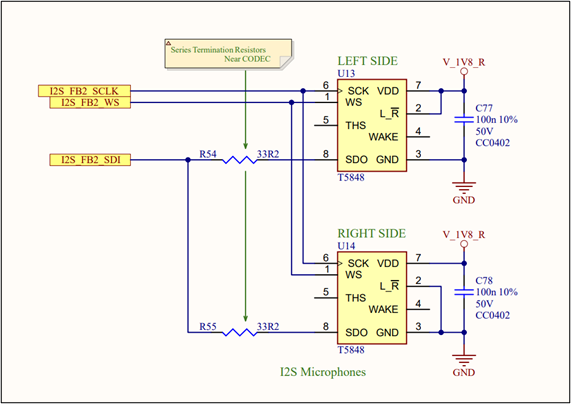

.. _i2s:

===
I2S
===

Introduction
============

This document explains how to create, compile, and run a demo application for the Inter-IC Sound (I2S) controller IP provided by Alif Semiconductor™ and integrated into Ensemble™ and Balletto devices.

Overview
--------

The Inter-IC Sound (I2S™) is an electrical serial bus interface standard used for connecting digital audio devices. It is used to communicate Pulse-Code Modulation (PCM) audio data between integrated circuits in an electronic device. The I2S bus separates clock and serial data signals, resulting in simpler receivers than those required for asynchronous communication systems that need to recover the clock from the data stream.

   I2S Hardware Connections

Hardware Requirements and Setup
===============================

Hardware Requirements
---------------------

- **Alif DevKit**

Hardware Setup I2S
------------------

The DevKit board includes two I2S microphones (one for the left channel and one for the right channel) for recording stereo audio. However, it does not have a built-in headphone jack or speaker.

For E7 DevKits, connect an external speaker to the board using a level shifter circuit to provide the appropriate 3.3V voltage level to the speaker to play the audio.

   Level Shifter

   Speaker

   Board Setup

Building the I2S Application
============================

Follow these steps to build your Zephyr-based I2S application using the GCC compiler and the Alif Zephyr SDK:

.. note::
   The application is designed for the Alif Ensemble E7 DevKit. Modify the sample code as needed for other DevKits.

1. For instructions on fetching the Alif Zephyr SDK and navigating to the Zephyr repository, please refer to the `ZAS User Guide`_

2. Remove the existing build directory and build the application:

.. code-block:: bash

   rm -rf build
   west build -b alif_e7_dk_rtss_he ../alif/samples/drivers/i2s/echo

.. note::
   The build command targets the M55-HE core. To build for the M55-HP core, use ``alif_e7_dk_rtss_hp`` instead (e.g., ``west build -b alif_e7_dk_rtss_hp ../alif/samples/drivers/i2s/``).

Executing Binary on the DevKit
==============================

To execute binaries on the DevKit board, follow these steps:

1. Open the **Debug Configuration** window using the *Create, manage, and run configurations* option.

   .. figure:: _static/debug_config_window.png
      :alt: Debug Configuration Window
      :align: center

      Debug Configuration Window

2. In the **Connection** tab, ensure the correct Core and ULINKpro selections are made. In the **Select Target** section, choose:

   - ``Cortex-M55_0`` for M55-HP core
   - ``Cortex-M55_1`` for M55-HE core

   .. figure:: _static/connections_tab.png
      :alt: Connection Tab Settings
      :align: center

      Connection Tab Settings

3. In the **Debugger** tab:

   - Select **Connect Only**.
   - Use the ``loadfile`` command to specify the path to the application’s ``.elf`` file.
   - Click the **Debug** symbol to load debugging information.
   - Click **Apply** and then **Debug** to start the debugging process.

   .. figure:: _static/debugger_tab.png
      :alt: Debugger Tab Settings
      :align: center

      Debugger Tab Settings

Observations
============
The echo application plays back (or echoes) the sound from the microphone through the connected speaker, enabling real-time audio feedback.