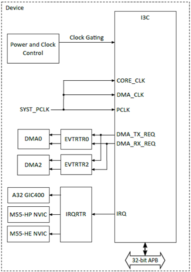
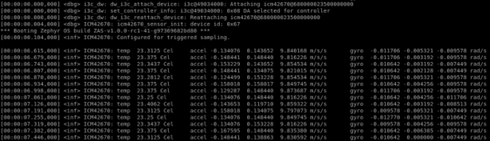

.. _i3c:

===
I3C
===

Overview
========

This document provides a comprehensive guide on creating, compiling, and running the demo application for Improved Inter-Integrated Circuit (I3C) validation.

Introduction
============

The I3C (Improved Inter-Integrated Circuit) is a cutting-edge communication interface designed to overcome the limitations of the traditional I2C protocol, enhancing both performance and efficiency. I3C supports advanced features such as dynamic address assignment, in-band interrupts, and multi-master capabilities, making it ideal for sensor-based applications in mobile, automotive, and IoT systems. With support for multiple data rates, including SDR (Standard Data Rate) and HDR (High Data Rate) modes, I3C offers greater flexibility for modern high-speed applications. It is a key enabler for reducing pin count and improving scalability in devices with diverse peripheral requirements.

I3C Features
============

The following I3C features are currently supported by the Alif driver:

- Dynamic Addressing
- Broadcast and directed Common Command Code (CCC) transfers
- In-Band Interrupts
  - Hot-Join
  - Slave Interrupt Request
  - Master-Request
- Data Rates:
  - Fast Speed (FS) mode
  - Fast Mode Plus (FM+) mode
  - SDR (Standard Data Rate)
  - HDR (High Data Rate)
- Support for legacy I2C devices
- CRC/parity generation and validation
- DMA support through hardware handshake interface
- Autonomous clock stalling
- Device address table for addressing multiple slaves
- Programmable Serial Data (SDA) transmit hold
- Programmable retry count for transfers that are addressed by slaves
- Byte support for vendor-specific Broadcast and Directed CCC Transfers

Hardware Requirements and Setup
===============================

    I3C Internal Connections

Hardware Connection & Setup
---------------------------

Select a board equipped with the ICM42670P (IMU sensor) I3C slave, such as the Alif Ensemble DevKit (E7, Appkit configuration) or Spark E1C DevKit.

.. note::
    The SCL and SDA lines are internally connected, so no external connection is required.

Pin Connections I3C
-------------------

- **SDA**: I3C0 (P7_6)
- **SCL**: I3C0 (P7_7)

.. list-table:: I3C Pin Connections
    :widths: 20 20 20
    :header-rows: 1

    * - Instance
      - SDA
      - SCL
    * - I3C-0
      - J15-8
      - J15-10

Software Requirements
=====================

The software required for the I3C application includes:

- **Alif Zephyr SDK**: v1.2.0 or later (includes I3C driver and sample application)

Building I3C Application in Zephyr
====================================

Follow these steps to build your Zephyr-based I3C application using the GCC compiler and the Alif Zephyr SDK:

1. For instructions on fetching the Alif Zephyr SDK and navigating to the Zephyr repository, please refer to the `ZAS User Guide`_

2. Remove the existing build directory and build the I3C ICM42670P sensor application:

.. note::
   The build commands shown here are specifically for the Alif E7 DevKit.
   To build the application for other boards, please modify the board name in the build command accordingly. For more information, refer to the ZAS User Guide.

3. Build commands for applications on the M55 HE core using the Ninja build command:

    .. code-block:: bash

        rm -rf build
        west build -b alif_e7_dk_rtss_he samples/sensor/icm42670 -p

4. Build commands for applications on the M55 HP core using the Ninja build command:

.. code-block:: bash

        rm -rf build
        west build -b alif_e7_dk_rtss_hp samples/sensor/icm42670 -p

.. note::
   To address various scenarios, such as utilizing MRAM or flash addresses and employing alternative compilers like LLVM or ARMCLANG, refer to the document AUGD0008_Getting-Started-with-ZAS-for-Ensemble-v0.5.0-Beta.

Once the build command completes successfully, executable images will be generated and placed in the `build/zephyr` directory. Both `.bin` (binary) and `.elf` (Executable and Linkable Format) files will be available.

Executing Binary on the DevKit
==============================

To execute binaries on the DevKit follow the command

.. code-block:: bash

   west flash

Validating I3C
==============

Output Logs
-----------

    I3C Output Logs

Observation
-----------

Upon reviewing the output logs, it can be concluded that the I3C functionality has been successfully validated with the ICM42670P IMU sensor.