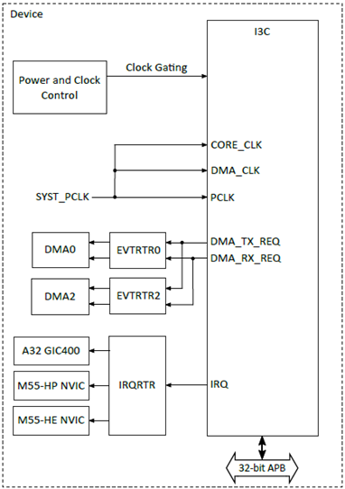

.. _i3c:

===
I3C
===

Introduction
============

The I3C (Improved Inter-Integrated Circuit) is a cutting-edge communication interface designed to overcome the limitations of the traditional I2C protocol, enhancing both performance and efficiency. I3C supports advanced features such as dynamic address assignment, in-band interrupts, and multi-master capabilities, making it ideal for sensor-based applications in mobile, automotive, and IoT systems. With support for multiple data rates, including SDR (Standard Data Rate) and HDR (High Data Rate) modes, I3C offers greater flexibility for modern high-speed applications. It is a key enabler for reducing pin count and improving scalability in devices with diverse peripheral requirements.

I3C Features
============

The following I3C features are currently supported by the Alif driver:

- Dynamic Addressing
- Broadcast and directed Common Command Code (CCC) transfers
- In-Band Interrupts
  - Hot-Join
  - Slave Interrupt Request
  - Master-Request
- Data Rates:
  - Fast Speed (FS) mode
  - Fast Mode Plus (FM+) mode
  - SDR (Standard Data Rate)
  - HDR (High Data Rate)
- Support for legacy I2C devices
- CRC/parity generation and validation
- DMA support through hardware handshake interface
- Autonomous clock stalling
- Device address table for addressing multiple slaves
- Programmable Serial Data (SDA) transmit hold
- Programmable retry count for transfers that are addressed by slaves
- Byte support for vendor-specific Broadcast and Directed CCC Transfers

.. include:: prerequisites.rst

Hardware Requirements and Setup
----------------------------------

    I3C Internal Connections

Hardware Connection & Setup
---------------------------

Select a board equipped with the BMI323 (IMU sensor) I3C slave, such as the Alif E7 DevKit (AppKit configuration) or Alif E1C DevKit.

.. note::
    The SCL and SDA lines are internally connected, so no external connection is required.

Pin Connections I3C
-------------------

- **SDA**: I3C0 (P7_6)
- **SCL**: I3C0 (P7_7)

.. list-table:: I3C Pin Connections
    :widths: 20 20 20
    :header-rows: 1

    * - Instance
      - SDA
      - SCL
    * - I3C-0
      - P7_6
      - P7_7

.. include:: note.rst

Build an I3C Application with Zephyr
========================================

Follow these steps to build the I3C application using the Alif Zephyr SDK:

1. For instructions on fetching the Alif Zephyr SDK and navigating to the Zephyr repository, refer to the `ZAS User Guide`_.

.. note::
   The build commands shown here are specifically for the Alif E7 DevKit.
   To build the application for other boards, modify the board name in the build command accordingly. For more information, refer to the `ZAS User Guide`_, under the section ``Setting Up and Building Zephyr Applications``.

2. Build command for application on the M55 HP core:

.. code-block:: console

   west build -p always \
     -b alif_e7_dk/ae722f80f55d5xx/rtss_hp \
     samples/sensor/bmi323 \
     -S alif-dk-ak

3. Build command for application on the M55 HE core:

.. code-block:: console

   west build -p always \
     -b alif_e7_dk/ae722f80f55d5xx/rtss_he \
     samples/sensor/bmi323 \
     -S alif-dk-ak

Once the build command completes successfully, executable images will be generated and placed in the ``build/zephyr`` directory. Both ``.bin`` (binary) and ``.elf`` (Executable and Linkable Format) files will be available.

Executing Binary on the DevKit
==============================

To execute binaries on the DevKit, follow the command:

.. code-block:: console

   west flash

Console Output
===============

.. code-block:: text

   Device 0xb35c name is bmi323@69000003b810431000
   Accel AX: -0.004209; AY: -0.008052; AZ: 1.022177 g       Gyro GX: 0.076295; GY: -0.289921; GZ: -0.015259 deg/s
   Accel AX: -0.003294; AY: -0.009760; AZ: 1.019310 g       Gyro GX: 0.106813; GY: -0.183108; GZ: -0.015259 deg/s
   Accel AX: -0.005551; AY: -0.008906; AZ: 1.020164 g       Gyro GX: 0.061036; GY: -0.183108; GZ: 0.000000 deg/s
   Accel AX: -0.005856; AY: -0.007869; AZ: 1.021750 g       Gyro GX: 0.045777; GY: -0.183108; GZ: 0.015259 deg/s
   Accel AX: -0.005612; AY: -0.008052; AZ: 1.021384 g       Gyro GX: 0.091554; GY: -0.228885; GZ: 0.015259 deg/s
   Accel AX: -0.006161; AY: -0.008601; AZ: 1.021506 g       Gyro GX: 0.061036; GY: -0.167849; GZ: -0.076295 deg/s
   Accel AX: -0.003172; AY: -0.006588; AZ: 1.020042 g       Gyro GX: 0.045777; GY: -0.244144; GZ: 0.000000 deg/s
   Accel AX: -0.004575; AY: -0.008174; AZ: 1.019981 g       Gyro GX: 0.061036; GY: -0.213626; GZ: 0.000000 deg/s
   Accel AX: -0.004087; AY: -0.007503; AZ: 1.020469 g       Gyro GX: 0.076295; GY: -0.183108; GZ: -0.045777 deg/s
   *** Booting Zephyr OS build 3ba659300a80 ***
   Accel AX: -0.004880; AY: -0.006405; AZ: 1.020042 g       Gyro GX: 0.045777; GY: -0.183108; GZ: -0.061036 deg/s
   Accel AX: -0.007015; AY: -0.008967; AZ: 1.020042 g       Gyro GX: 0.015259; GY: -0.198367; GZ: -0.015259 deg/s
   Accel AX: -0.005368; AY: -0.007930; AZ: 1.021140 g       Gyro GX: 0.076295; GY: -0.198367; GZ: 0.030518 deg/s
   Accel AX: -0.006100; AY: -0.008113; AZ: 1.021384 g       Gyro GX: 0.030518; GY: -0.183108; GZ: -0.045777 deg/s
   Accel AX: -0.004392; AY: -0.007381; AZ: 1.020408 g       Gyro GX: 0.015259; GY: -0.183108; GZ: -0.015259 deg/s
   Accel AX: -0.004697; AY: -0.009455; AZ: 1.020103 g       Gyro GX: 0.061036; GY: -0.183108; GZ: -0.015259 deg/s
   Accel AX: -0.005063; AY: -0.007198; AZ: 1.020164 g       Gyro GX: 0.076295; GY: -0.198367; GZ: -0.030518 deg/s
   Accel AX: -0.004880; AY: -0.009211; AZ: 1.022604 g       Gyro GX: 0.030518; GY: -0.213626; GZ: 0.045777 deg/s

Observation
-----------

Upon reviewing the output logs, it can be concluded that the I3C functionality has been successfully validated with the BMI323 IMU sensor.

I3C Power Management Application
================================

``samples/sensor/bmi323_pm`` walks Alif power-management states and polls
the same on-board BMI323 over I3C after each wake. Hardware, pinmux and
the ``alif-dk-ak`` overlay are unchanged from the sample above. The SoC
is woken by the RTC (EWIC). The sensor GPIO INT pin is not used (it is
not LPGPIO and cannot wake STOP/S2RAM).

Sequence (HE TCM boot)::

  BMI323 poll
  RUNTIME_IDLE  (~18 s)  -> poll
  SUSPEND_TO_IDLE        -> poll
  S2RAM STANDBY (~20 s)  -> poll
  S2RAM STOP    (~22 s)  -> poll

MRAM boot and the HP core use SOFT_OFF instead of S2RAM (the system
resets on wake).

.. note::
   Do not leave a debugger attached if you want STOP/SOFT_OFF; it holds
   the core out of those states.

Build command for the M55 HE core:

.. code-block:: console

   west build -p always \
     -b alif_e7_dk/ae722f80f55d5xx/rtss_he \
     ../alif/samples/sensor/bmi323_pm \
     -S alif-dk-ak -S pm-system-off-he

Build command for the M55 HP core (use ``pm-system-off-hp``):

.. code-block:: console

   west build -p always \
     -b alif_e7_dk/ae722f80f55d5xx/rtss_hp \
     ../alif/samples/sensor/bmi323_pm \
     -S alif-dk-ak -S pm-system-off-hp

Flash with ``west flash`` as above. Example console output from
``alif_e8_dk`` RTSS_HE, TCM boot (other boards follow the same
sequence; accel/gyro values vary):

.. code-block:: console

    *** Booting Zephyr OS build 97fddffd316f ***
    Device 0xef30 name is bmi323@69000003b810431000
    [00:00:00.025,000] <inf> bmi323_pm: alif_e8_dk RTSS_HE (TCM boot): BMI323 PM states demo (RUNTIME_IDLE, SUSPEND_TO_IDLE, S2RAM)
    [00:00:00.037,000] <inf> bmi323_pm: --- BMI323 poll before sleep ---
    Accel AX: 0.025803; AY: -0.001220; AZ: 0.980331 g        Gyro GX: 0.030518; GY: 0.488288; GZ: -0.305180 deg/s
    [00:00:00.066,000] <inf> bmi323_pm: POWER STATE SEQUENCE:
    [00:00:00.072,000] <inf> bmi323_pm:   1. PM_STATE_RUNTIME_IDLE
    [00:00:00.078,000] <inf> bmi323_pm:   2. PM_STATE_SUSPEND_TO_IDLE
    [00:00:00.085,000] <inf> bmi323_pm:   3. PM_STATE_SUSPEND_TO_RAM (substate 0: STANDBY)
    [00:00:00.093,000] <inf> bmi323_pm:   4. PM_STATE_SUSPEND_TO_RAM (substate 1: STOP)
    [00:00:00.101,000] <inf> bmi323_pm:   5. (SOFT_OFF skipped - TCM boot, using retention)
    [00:00:00.110,000] <inf> bmi323_pm: Enter RUNTIME_IDLE sleep for (18000000 microseconds)
    [00:00:18.119,000] <inf> bmi323_pm: Exited from RUNTIME_IDLE sleep
    [00:00:18.125,000] <inf> bmi323_pm: --- BMI323 poll after RUNTIME_IDLE ---
    Accel AX: 0.025376; AY: -0.001708; AZ: 0.980392 g        Gyro GX: 0.030518; GY: 0.503547; GZ: -0.274662 deg/s
    [00:00:18.149,000] <inf> bmi323_pm: Enter PM_STATE_SUSPEND_TO_IDLE for (4000 microseconds)
    [00:00:18.164,000] <inf> bmi323_pm: Exited from PM_STATE_SUSPEND_TO_IDLE
    [00:00:18.171,000] <inf> bmi323_pm: --- BMI323 poll after SUSPEND_TO_IDLE ---
    Accel AX: 0.023790; AY: -0.000549; AZ: 0.980514 g        Gyro GX: 0.045777; GY: 0.442511; GZ: -0.289921 deg/s
    [00:00:18.195,000] <inf> bmi323_pm: Enter PM_STATE_SUSPEND_TO_RAM (substate 0: STANDBY) for (20000000 microseconds)
    [00:00:38.208,000] <inf> bmi323_pm: === Resumed from PM_STATE_SUSPEND_TO_RAM (substate 0: STANDBY) ===
    [00:00:38.239,000] <inf> bmi323_pm: Main thread running - iteration 0 - tick: 38239
    [00:00:40.249,000] <inf> bmi323_pm: Main thread running - iteration 1 - tick: 40249
    [00:00:42.259,000] <inf> bmi323_pm: Main thread running - iteration 2 - tick: 42259
    [00:00:44.269,000] <inf> bmi323_pm: --- BMI323 poll after S2RAM (STANDBY) ---
    Accel AX: 0.026718; AY: -0.001647; AZ: 0.980880 g        Gyro GX: 0.106813; GY: 0.457770; GZ: -0.274662 deg/s
    [00:00:44.298,000] <inf> bmi323_pm: Enter PM_STATE_SUSPEND_TO_RAM (substate 1: STOP) for (22000000 microseconds)
    [00:01:06.311,000] <inf> bmi323_pm: === Resumed from PM_STATE_SUSPEND_TO_RAM (substate 1: STOP) ===
    [00:01:06.342,000] <inf> bmi323_pm: Main thread running - iteration 0 - tick: 66342
    [00:01:08.352,000] <inf> bmi323_pm: Main thread running - iteration 1 - tick: 68352
    [00:01:10.362,000] <inf> bmi323_pm: Main thread running - iteration 2 - tick: 70362
    [00:01:12.371,000] <inf> bmi323_pm: --- BMI323 poll after S2RAM (STOP) ---
    Accel AX: 0.025010; AY: 0.000488; AZ: 0.980270 g         Gyro GX: 0.045777; GY: 0.442511; GZ: -0.274662 deg/s
    [00:01:12.400,000] <inf> bmi323_pm: Skipping PM_STATE_SOFT_OFF (TCM boot, using retention instead)
    [00:01:12.410,000] <inf> bmi323_pm: === BMI323 PM TEST COMPLETED ===

See ``samples/sensor/bmi323_pm/README.rst`` for the MRAM/HP SOFT_OFF log.

PM observation
--------------

A valid BMI323 sample after each listed power state means the I3C
controller resumed (clock, DAT, dynamic address) and the target was
reachable over I3C.
