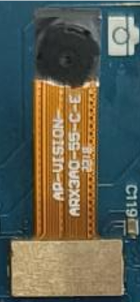
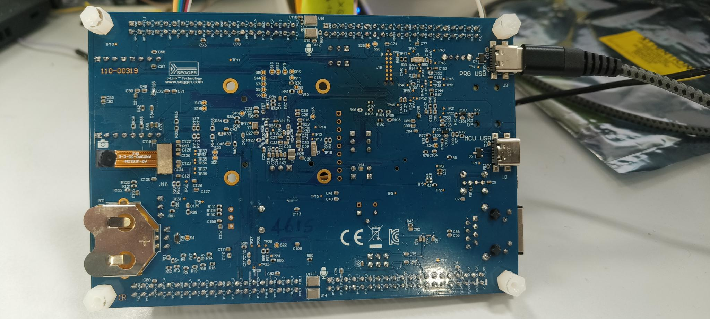
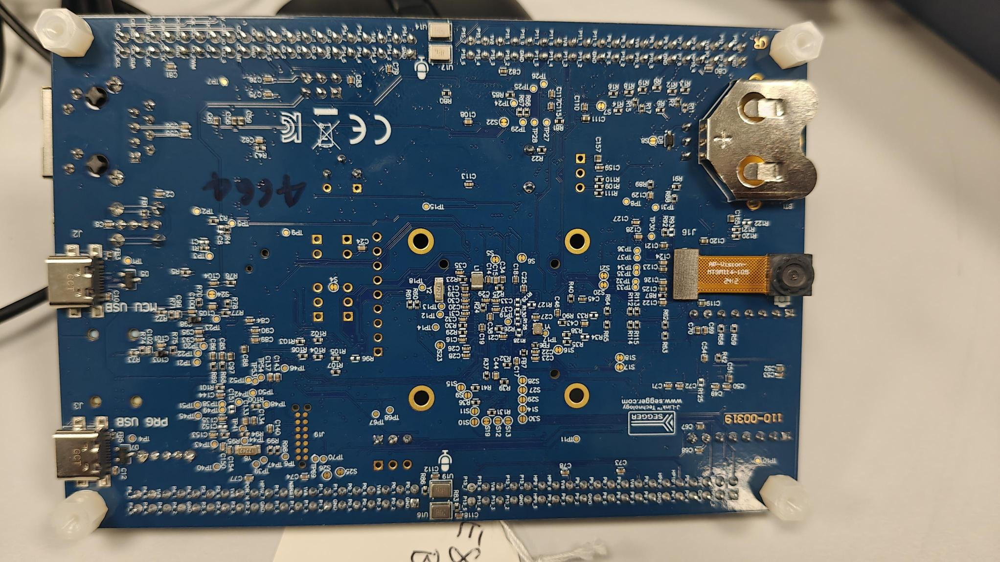

.. _isp:

===
ISP
===

Introduction
============

This application note describes how to capture camera frames using the ISP instances of the video driver with camera sensors.

The demo application demonstrates frame capture using the following
camera sensors with ISP:

- ARX3A0 Camera Sensor
- MT9M114 Camera Sensor

Both sensors transmit image data through the MIPI CSI-2 serial interface
while sensor configuration is performed using the I2C interface.

**Image data path**::

   External MIPI Camera Sensor → MIPI DPHY RX → MIPI CSI2 → CPI → ISP → Memory

Hardware Requirements
======================

CPI
----

The CPI IP, provided by Alif Semiconductor, captures video frames and stores them in an allocated memory area. It can also forward the frames to the ISP IP from VeriSilicon, which is integrated into the Alif SoC.

MIPI D-PHY
-------------

The MIPI D-PHY physical layer receives serial input data from the camera sensor and transfers it to the MIPI CSI-2 host. Key features of the D-PHY include:

- **Flexible clock configuration**: Supports a clock frequency range of 17 MHz to 52 MHz.
- **Lane operation**: Supports data rates from 80 Mbps to 2.5 Gbps per lane in the forward direction.
- **Aggregate throughput**: Capable of up to 10 Gbps with four data lanes in the forward direction.
- **Maximum low-power (LP) data rate**: Supports up to 10 Mbps.
- **PHY-Protocol Interface (PPI)**: Used for communication between the PHY and the protocol layer for clock and data lanes.
- **Low-power modes**: Supports low-power escape modes and an Ultra-Low-Power (ULP) state for improved energy efficiency.
- **High-Speed (HS) TX and RX features**: Includes programmable HS transmitter amplitude levels, automatic deskew calibration, equalization, and offset cancellation.
- **Internal pattern checker**: Built-in for testing and verification purposes.

This comprehensive set of features enables the D-PHY physical layer to efficiently handle a wide range of data rates and power modes while maintaining signal integrity and robust communication performance.

MIPI CSI-2
----------

The MIPI CSI-2 interface unpacks serial input data according to the configured pixel data type. It conveys the unpacked pixel data and generates accurately timed video synchronization signals via the Image Pixel Interface (IPI).

Key features of MIPI CSI-2 include:

- **Combo PHY Support**: Utilizes up to four RX data lanes on D-PHY.
- **High Data Rate**: Supports data rates of up to 2.5 Gbps per lane in D-PHY mode.
- **Data Format Flexibility**: Compatible with a wide range of primary and secondary data formats, including YUV, RGB, RAW, and user-defined byte-based formats.
- **Robust Error Detection and Correction**: Implements mechanisms at multiple levels—PHY, packet, line, and frame—to ensure reliable data transmission.

These features enable MIPI CSI-2 to efficiently handle diverse pixel data formats, maintain precise synchronization, and deliver robust, error-resilient communication for image sensors.

I2C Controller
--------------

The I2C controller is an IP block provided by Alif Semiconductor and facilitates communication between the SoC and the camera sensor.

VeriSilicon ISP Pico 8000L
--------------------------

The VeriSilicon Vivante ISP IP is a full-featured image signal processor (ISP) capable of supporting a wide range of image processing functions.

The ISPPico, part of the Vivante ISP IP family, is a complete video and still-image input unit designed for ultra-low power consumption and minimal silicon area. It provides essential image processing capabilities and supports both:

- Simple CMOS sensors that output an RGB Bayer pattern (without integrated image processing), and
- Image sensors with built-in YUV processing.

The IP accepts sensor input via the DVP interface and can be directly connected to other IP blocks—such as the CPI block on Alif SoCs. Image data is transferred through a memory interface to an AXI bus system, while register programming is performed via an AHB slave interface.

Designed for seamless integration into SoCs, the ISP achieves low power consumption and a small silicon footprint for its class. Dynamic power consumption is minimized through extensive use of multi-level hierarchical clock gating, and leakage power is reduced by employing low-leakage, low-power standard cells.

ARX3A0 Camera Sensor
=======================

The ARX3A0 camera sensor, with a 1/10th-inch optical format, is compact and energy-efficient, ideal for IoT devices. It offers an active resolution of 560 × 560 pixels and can achieve a high frame rate of 360 frames per second.

Hardware Requirements and Setup
--------------------------------

- Alif Devkit
- Debugger: JLink
- ARX3A0 Camera Sensor (IAS1MOD-ARX3A0CSSC090110-GEVB)

Camera Sensor Support
-----------------------

.. note::

   The ARX3A0 camera sensor interfaces via MIPI-CSI (serial interface) with ISP and is supported on the following DevKits:

   - DevKit E8

Features
----------

- Active resolution: 560 x 560 pixels
- Frame rate: Up to 360 frames per second
- Compact 1/10th-inch optical format
- Energy-efficient design ideal for IoT devices

Hardware Connections and Setup
------------------------------

    ARX3A0 Camera Sensor

    Flat Board with Standard connection

Camera GPIO Configuration (B0 Flat Board)
^^^^^^^^^^^^^^^^^^^^^^^^^^^^^^^^^^^^^^^^^^

- **P0_3**: Configured as ``CAM_XVCLK_A``.

I2C GPIO Configuration
^^^^^^^^^^^^^^^^^^^^^^^

- **P7_2**: Configured as ``I2C1_SDA_C``.
- **P7_3**: Configured as ``I2C1_SCL_C``.

Required Config Features
--------------------------

.. code-block:: kconfig

   CONFIG_VIDEO=y
   CONFIG_VIDEO_MIPI_CSI2_DW=y
   CONFIG_LOG=y
   CONFIG_PRINTK=y
   CONFIG_STDOUT_CONSOLE=y
   CONFIG_I2C_TARGET=y
   CONFIG_I2C=y
   CONFIG_I2C_DW_CLOCK_SPEED=100

ISP Configs
^^^^^^^^^^^^

.. code-block:: kconfig

   CONFIG_USE_ALIF_ISP_LIB=y
   CONFIG_ISP_LIB_SCALAR_MODULE=y
   CONFIG_ISP_LIB_DMSC_MODULE=y

The above ISP configuration enables scaling and demosaicing in the ISP IP.

Software Requirements
-----------------------

- **Alif SDK**: Clone from `https://github.com/alifsemi/sdk-alif.git <https://github.com/alifsemi/sdk-alif.git>`_
- **West Tool**: For building Zephyr applications (refer to the `ZAS User Guide`_)
- **Arm GCC Compiler**: For compiling the application (part of the Zephyr SDK)
- **SE Tools**: For loading binaries (refer to the `ZAS User Guide`_)
- **Camera Drivers (MIPI Interface)**:
   - Alif Zephyr MIPI CSI-2 Driver
   - Alif Zephyr Video Driver
   - Alif Zephyr MIPI D-PHY Driver
   - Alif Zephyr ISP Driver
   - Alif Zephyr ISP HAL Driver
- **ARX3A0 Camera Sensor Driver**:
   - Zephyr I2C DesignWare Driver
   - Alif Zephyr ARX3A0 Camera Sensor Driver

Selected ARX3A0 Camera Sensor Configurations
----------------------------------------------

- **Interface**: MIPI CSI-2
- **Resolution**: 560×560
- **Output Format**: RAW Bayer10

Selected ISP Configurations
^^^^^^^^^^^^^^^^^^^^^^^^^^^^

- **Resolution**: 480×480
- **Output Format**: RGB888 planar

.. include:: note.rst

Build an ARX3A0 ISP Application with Zephyr
======================================================

Follow these steps to build the ARX3A0 ISP application using the Alif Zephyr SDK:

1. For instructions on fetching the Alif Zephyr SDK and navigating to the Zephyr repository, please refer to the `ZAS User Guide`_

.. note::
   The build commands shown here are specifically for the Alif E8 DevKit.
   To build the application for other boards, modify the board name in the build command accordingly. For more information, refer to the `ZAS User Guide`_, under the section Setting Up and Building Zephyr Applications.

2. Build command for application on the M55 HP core:

.. code-block:: console

   west build -p always \
     -b alif_e8_dk/ae822fa0e5597xx0/rtss_hp \
     ../alif/samples/drivers/video/ \
     -- \
     -DDTC_OVERLAY_FILE="$PWD/../alif/samples/drivers/video/boards/serial_camera_arx3a0_selfie.overlay" \
     -DOVERLAY_CONFIG="$PWD/../alif/samples/drivers/video/boards/isp.conf"

3. Build command for application on the M55 HE core:

.. code-block:: console

   west build -p always \
     -b alif_e8_dk/ae822fa0e5597xx0/rtss_he \
     ../alif/samples/drivers/video/ \
     -- \
     -DDTC_OVERLAY_FILE="$PWD/../alif/samples/drivers/video/boards/serial_camera_arx3a0_selfie.overlay" \
     -DOVERLAY_CONFIG="$PWD/../alif/samples/drivers/video/boards/isp.conf"

Executing Binary on the DevKit
--------------------------------

To execute the binary on the DevKit, run:

.. code-block:: console

   west flash

Console Output
---------------

The following output is observed in the console during execution of the ARX3A0 ISP application:

.. code-block:: text

   [00:00:00.000,000] <inf> csi2_dw: #rx_dphy_ids: 1
   *** Booting Zephyr OS build ef2a2e33086f ***
   [00:00:00.663,000] <inf> video_app: - Device name: isp@49046000
   [00:00:00.663,000] <inf> video_app: Selected camera: Selfie
   [00:00:00.663,000] <inf> video_app: - Capabilities:
   [00:00:00.663,000] <inf> video_app: Y10P width (min, max, step)[560; 560; 0] height (min, max, step)[560; 560; 0]
   [00:00:01.203,000] <inf> dphy_dw: RX-DDR clock: 400000000
   [00:00:01.203,000] <inf> video_app: - format: PRGB 480x480
   [00:00:01.203,000] <inf> video_app: Width - 480, Pitch - 1440, Height - 480, Buff size - 691200
   [00:00:01.203,000] <inf> video_app: - addr - 0x2000060, size - 691200, bytesused - 0
   [00:00:01.229,000] <inf> video_app: capture buffer[0]: dump binary memory "/home/$USER/capture_0.bin" 0x02000060 0x020a8c5f -r
   [00:00:01.229,000] <inf> video_app: - addr - 0x20a8c68, size - 691200, bytesused - 0
   [00:00:01.255,000] <inf> video_app: capture buffer[1]: dump binary memory "/home/$USER/capture_1.bin" 0x020a8c68 0x02151867 -r
   [00:00:08.257,000] <inf> video_app: Capture started
   [00:00:08.325,000] <inf> video_app: Got frame 0! size: 691200; timestamp 8325 ms
   [00:00:08.325,000] <inf> video_app: FPS: 0.0
   [00:00:08.525,000] <inf> video_app: Got frame 1! size: 691200; timestamp 8525 ms
   [00:00:08.525,000] <inf> video_app: FPS: 5.000000
   [00:00:08.725,000] <inf> video_app: Got frame 2! size: 691200; timestamp 8725 ms
   [00:00:08.725,000] <inf> video_app: FPS: 5.000000
   [00:00:08.925,000] <inf> video_app: Got frame 3! size: 691200; timestamp 8925 ms
   [00:00:08.925,000] <inf> video_app: FPS: 5.000000
   [00:00:09.125,000] <inf> video_app: Got frame 4! size: 691200; timestamp 9125 ms
   [00:00:09.125,000] <inf> video_app: FPS: 5.000000
   [00:00:09.325,000] <inf> video_app: Got frame 5! size: 691200; timestamp 9325 ms
   [00:00:09.325,000] <inf> video_app: FPS: 5.000000
   [00:00:09.525,000] <inf> video_app: Got frame 6! size: 691200; timestamp 9525 ms
   [00:00:09.525,000] <inf> video_app: FPS: 5.000000
   [00:00:09.725,000] <inf> video_app: Got frame 7! size: 691200; timestamp 9725 ms
   [00:00:09.725,000] <inf> video_app: FPS: 5.000000
   [00:00:09.925,000] <inf> video_app: Got frame 8! size: 691200; timestamp 9925 ms
   [00:00:09.925,000] <inf> video_app: FPS: 5.000000
   [00:00:10.125,000] <inf> video_app: Got frame 9! size: 691200; timestamp 10125 ms
   [00:00:10.125,000] <inf> video_app: FPS: 5.000000
   [00:00:10.125,000] <inf> video_app: Calling video flush.
   [00:00:10.125,000] <inf> video_app: Calling video stream stop.

MT9M114 Camera Sensor
=======================

The ON Semiconductor MT9M114 is a 1/6-inch CMOS digital image sensor with an active-pixel array of 1296H x 976V.

It includes advanced camera functions such as auto exposure control, auto white balance, black level control, flicker avoidance, and defect correction, optimized for low-light conditions.

The MT9M114 is a system-on-a-chip (SoC) image sensor, programmable through a serial interface, suitable for embedded notebook, netbook, game consoles, cell phones, mobile devices, and desktop monitor cameras.

Hardware Requirements and Setup
--------------------------------

- Alif Devkit
- Debugger: JLink
- MT9M114 Camera Sensor

Camera Sensor Support
-----------------------

.. note::

   The MT9M114 camera sensor interfaces via MIPI-CSI (serial interface) with ISP and is supported on the following DevKits:

   - DevKit E8

Hardware Connections and Setup
------------------------------

.. figure:: _static/MT9M114.png
    :alt: MT9M114 Camera Sensor
    :align: center
    :width: 250px

    MT9M114 Camera Sensor

    Flat Board with Selfie connection

Camera GPIO Configuration (B0 Flat Board)
^^^^^^^^^^^^^^^^^^^^^^^^^^^^^^^^^^^^^^^^^^

- **P0_3**: Configured as ``CAM_XVCLK_A``.

I2C GPIO Configuration
^^^^^^^^^^^^^^^^^^^^^^^

- **P7_2**: Configured as ``I2C1_SDA_C``.
- **P7_3**: Configured as ``I2C1_SCL_C``.

Features
----------

- Superior low-light performance
- Ultra-low power
- 720p HD video at 30 fps (15 fps via MIPI CSI-2)
- Active resolution: 1280 x 720 pixels (720p HD)
- Maximum resolution: 1288 x 728 pixels (RAW)
- Output formats: RGB565, YUV422, RAW Bayer (8/10-bit)
- On-chip ISP with auto exposure, auto white balance, and defect correction
- MIPI CSI-2 interface: 1 data lane, up to 768 Mbps
- I2C control interface

Applications
-------------

- Embedded notebook, netbook, and desktop monitor cameras
- Tethered PC cameras
- Game consoles
- Cell phones, mobile devices, and consumer video communications
- Surveillance, medical, and industrial applications

Supported Resolutions and Formats
-----------------------------------

The MT9M114 driver supports multiple resolution and format combinations:

- **480x272**: RGB565, YUYV
- **640x480**: RGB565, YUYV, RAW10 (Y10P), Grayscale (GREY)
- **1280x720**: RGB565, YUYV, RAW10 (Y10P), Grayscale (GREY)
- **1288x728**: RAW10 (Y10P) - Maximum sensor resolution

Required Config Features
--------------------------

.. code-block:: kconfig

   CONFIG_VIDEO=y
   CONFIG_VIDEO_MIPI_CSI2_DW=y
   CONFIG_LOG=y
   CONFIG_PRINTK=y
   CONFIG_STDOUT_CONSOLE=y
   CONFIG_I2C_TARGET=y
   CONFIG_I2C=y
   CONFIG_I2C_DW_CLOCK_SPEED=100

ISP Configs
^^^^^^^^^^^^

.. code-block:: kconfig

   CONFIG_USE_ALIF_ISP_LIB=y
   CONFIG_ISP_LIB_SCALAR_MODULE=y
   CONFIG_ISP_LIB_DMSC_MODULE=y

The above ISP configuration enables scaling and demosaicing in the ISP IP.

Software Requirements
-----------------------

- **Alif SDK**: Clone from `https://github.com/alifsemi/sdk-alif.git <https://github.com/alifsemi/sdk-alif.git>`_
- **West Tool**: For building Zephyr applications (installed via ``pip install west``)
- **Arm GCC Compiler**: For compiling the application (part of the Zephyr SDK)
- **SE Tools (optional)**: For loading binaries (refer to Alif documentation)
- **Video Drivers (MIPI CSI-2 Interface with ISP)**:
   - Alif Zephyr MIPI CSI2 Driver
   - Alif Zephyr Video Driver
   - Alif Zephyr MIPI DPHY Driver
   - Alif Zephyr ISP Driver
   - Alif Zephyr ISP HAL Driver
- **MT9M114 Camera Sensor Driver**:
   - Zephyr I2C DesignWare Driver
   - Alif Zephyr MT9M114 Camera Sensor Driver

Selected MT9M114 Camera Sensor Configurations
----------------------------------------------

- **Interface**: MIPI CSI2
- **Resolution**: 1288x728 (maximum), 1280x720, 640x480, 480x272
- **Output Formats**: RAW Bayer10 (Y10P), RGB565, YUYV, Grayscale
- **Data Lane**: Single lane operation at 768 Mbps
- **Frame Rate**: ~15 FPS at 720p

Selected ISP Configurations
^^^^^^^^^^^^^^^^^^^^^^^^^^^^

- **Input Resolution**: 1280x720 (RAW Bayer10)
- **Output Resolution**: Configurable via ISP scaling
- **Output Format**: RGB888 planar

Build an MT9M114 ISP Application with Zephyr
======================================================

Follow these steps to build the MT9M114 ISP (Selfie Camera) application using the Alif Zephyr SDK:

1. For instructions on fetching the Alif Zephyr SDK and navigating to the Zephyr repository, please refer to the `ZAS User Guide`_

.. note::
   The build commands shown here are specifically for the Alif E8 DevKit.
   To build the application for other boards, modify the board name in the build command accordingly. For more information, refer to the `ZAS User Guide`_, under the section Setting Up and Building Zephyr Applications.

2. Build command for E8 DevKit (Selfie Camera with ISP) on M55 HP core:

.. code-block:: console

   west build -p always \
     -b alif_e8_dk/ae822fa0e5597xx0/rtss_hp \
     ../alif/samples/drivers/video/ \
     -DDTC_OVERLAY_FILE="$PWD/../alif/samples/drivers/video/boards/serial_camera_mt9m114_selfie.overlay" \
     -DOVERLAY_CONFIG="$PWD/../alif/samples/drivers/video/boards/isp.conf;$PWD/../alif/samples/drivers/video/boards/serial_camera_mt9m114.conf"

3. Build command for E8 DevKit (Selfie Camera with ISP) on M55 HE core:

.. code-block:: console

   west build -p always \
     -b alif_e8_dk/ae822fa0e5597xx0/rtss_he \
     ../alif/samples/drivers/video/ \
     -DDTC_OVERLAY_FILE="$PWD/../alif/samples/drivers/video/boards/serial_camera_mt9m114_selfie.overlay" \
     -DOVERLAY_CONFIG="$PWD/../alif/samples/drivers/video/boards/isp.conf;$PWD/../alif/samples/drivers/video/boards/serial_camera_mt9m114.conf"

.. note::

   - **Selfie mode**: Camera data is processed through the ISP (Image Signal Processor) before storage
   - The MT9M114 sensor supports both parallel and serial MIPI interfaces; this example uses the serial MIPI CSI-2 interface
   - ISP provides scaling, demosaicing, and other image processing capabilities

Executing Binary on the DevKit
--------------------------------

To execute the binary on the DevKit, run:

.. code-block:: bash

   west flash

Console Output
---------------

The following output is observed in the console during execution of the MT9M114 ISP application:

.. code-block:: console

   [00:00:00.000,000] <inf> csi2_dw: #rx_dphy_ids: 1
   [00:00:00.000,000] <inf> mt9m114: MT9M114 initialization starting...
   [00:00:00.000,000] <inf> mt9m114: Resetting sensor...
   [00:00:00.446,000] <inf> mt9m114: Sensor initialized, MIPI lanes in LP11
   *** Booting Zephyr OS build 18fd91c4661d ***
   [00:00:00.446,000] <inf> video_app: - Device name: isp@49046000
   [00:00:00.446,000] <inf> video_app: Selected camera: Selfie
   [00:00:00.446,000] <inf> video_app: - Capabilities:

   [00:00:00.446,000] <inf> video_app:   RGBP width (min, max, step)[480; 480; 0] height (min, max, step)[272; 272; 0]
   [00:00:00.446,000] <inf> video_app:   YUYV width (min, max, step)[480; 480; 0] height (min, max, step)[272; 272; 0]
   [00:00:00.446,000] <inf> video_app:   RGBP width (min, max, step)[640; 640; 0] height (min, max, step)[480; 480; 0]
   [00:00:00.446,000] <inf> video_app:   YUYV width (min, max, step)[640; 640; 0] height (min, max, step)[480; 480; 0]
   [00:00:00.446,000] <inf> video_app:   Y10P width (min, max, step)[640; 640; 0] height (min, max, step)[480; 480; 0]
   [00:00:00.446,000] <inf> video_app:   GREY width (min, max, step)[640; 640; 0] height (min, max, step)[480; 480; 0]
   [00:00:00.446,000] <inf> video_app:   RGBP width (min, max, step)[1280; 1280; 0] height (min, max, step)[720; 720; 0]
   [00:00:00.446,000] <inf> video_app:   YUYV width (min, max, step)[1280; 1280; 0] height (min, max, step)[720; 720; 0]
   [00:00:00.446,000] <inf> video_app:   Y10P width (min, max, step)[1288; 1288; 0] height (min, max, step)[728; 728; 0]
   [00:00:00.446,000] <inf> video_app:   GREY width (min, max, step)[1280; 1280; 0] height (min, max, step)[720; 720; 0]
   [00:00:00.514,000] <inf> dphy_dw: RX-DDR clock: 384000000
   [00:00:00.515,000] <inf> video_app: - format: PRGB 480x480
   [00:00:00.515,000] <inf> video_app: Width - 480, Pitch - 1440, Height - 480, Buff size - 691200
   [00:00:00.515,000] <inf> video_app: - addr - 0x2000068, size - 691200, bytesused - 0, resolution - 480x480
   [00:00:00.528,000] <inf> video_app: capture buffer[0]: dump binary memory "/home/$USER/capture_0.bin" 0x02000068 0x020a8c67 -r

   [00:00:00.528,000] <inf> video_app: - addr - 0x20a8c70, size - 691200, bytesused - 0, resolution - 480x480
   [00:00:00.540,000] <inf> video_app: capture buffer[1]: dump binary memory "/home/$USER/capture_1.bin" 0x020a8c70 0x0215186f -r

   [00:00:00.562,000] <err> csi2_dw: Fatal Interrupt due to mismatch of Frame Start and Frame End for a specific VC. status - 0x1
   [00:00:00.562,000] <err> csi2_dw: Review the Timings programmed to IPI. Resetting the IPI for now.
   [00:00:07.543,000] <inf> video_app: Capture started
   [00:00:07.628,000] <inf> video_app: Got frame 0! size: 691200; timestamp 7628 ms
   [00:00:07.628,000] <inf> video_app: FPS: 0.0
   [00:00:07.695,000] <inf> video_app: Got frame 1! size: 691200; timestamp 7695 ms
   [00:00:07.695,000] <inf> video_app: FPS: 14.925373
   [00:00:07.762,000] <inf> video_app: Got frame 2! size: 691200; timestamp 7762 ms
   [00:00:07.762,000] <inf> video_app: FPS: 14.925373
   [00:00:07.828,000] <inf> video_app: Got frame 3! size: 691200; timestamp 7828 ms
   [00:00:07.828,000] <inf> video_app: FPS: 15.151515
   [00:00:07.895,000] <inf> video_app: Got frame 4! size: 691200; timestamp 7895 ms
   [00:00:07.895,000] <inf> video_app: FPS: 14.925373
   [00:00:07.962,000] <inf> video_app: Got frame 5! size: 691200; timestamp 7962 ms
   [00:00:07.962,000] <inf> video_app: FPS: 14.925373
   [00:00:08.028,000] <inf> video_app: Got frame 6! size: 691200; timestamp 8028 ms
   [00:00:08.028,000] <inf> video_app: FPS: 15.151515
   [00:00:08.095,000] <inf> video_app: Got frame 7! size: 691200; timestamp 8095 ms
   [00:00:08.095,000] <inf> video_app: FPS: 14.925373
   [00:00:08.162,000] <inf> video_app: Got frame 8! size: 691200; timestamp 8162 ms
   [00:00:08.162,000] <inf> video_app: FPS: 14.925373
   [00:00:08.228,000] <inf> video_app: Got frame 9! size: 691200; timestamp 8228 ms
   [00:00:08.228,000] <inf> video_app: FPS: 15.151515
   [00:00:08.228,000] <inf> video_app: Calling video flush.
   [00:00:08.228,000] <inf> video_app: Calling video stream stop.

.. note::

   The MT9M114 sensor with ISP captures at 480x480 resolution in RGB888 planar (PRGB) format with a frame rate of approximately 15 FPS. The ISP processes the RAW Bayer data from the sensor and outputs RGB888 format. The buffer size is 691,200 bytes per frame. Note the CSI2 timing error message during initialization which is automatically recovered.
