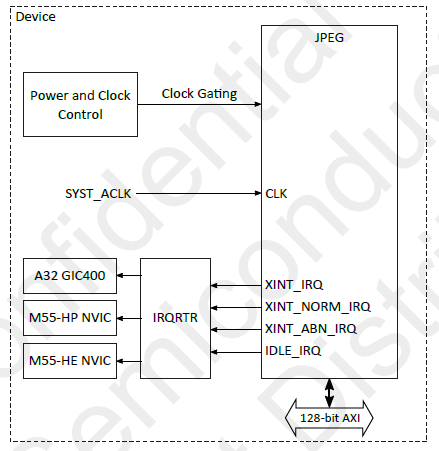

.. _jpeg:

============
JPEG Encoder
============

Overview
========

This document explains how to create, compile, and run the demo application for JPEG Encoder validation.

    JPEG Internal Connections

Introduction
============

This application note describes how to use the VeriSilicon Hantro VC9000E hardware JPEG encoder
on the Alif Ensemble SoC. Two sample applications are provided:

- **Standalone JPEG test**: Encodes a static NV12 test image embedded in the binary.
- **Video + JPEG pipeline**: Captures live camera frames via ISP and encodes them to JPEG in real time.

**Image data path (standalone)**:
Embedded NV12 image → JPEG Encoder → Compressed JPEG in memory

**Image data path (video pipeline)**:
CMOS sensor → CSI → CPI → ISP → NV12 frame → JPEG Encoder → Compressed JPEG in memory

JPEG Features
=============
The JPEG module has the following features:
- Supports JPEG ISO/IEC 10918-1, ITU-T T.81
- Baseline process (Huffman coding interleaved YUV420)
- MJPEG format (T.81 Annex H) in AVI container
- Encoding color space: YUV4:2:0
- Slices mode encoding: N macroblock rows per slice
- Encoding bit depth: 8 bits
- Output image step size: 16 pixels
- Input color formats: YUV420
- Cropping, padding

Prerequisites
=============

Hardware Requirements
---------------------

VeriSilicon Hantro VC9000E JPEG Encoder
~~~~~~~~~~~~~~~~~~~~~~~~~~~~~~~~~~~~~~~

The VC9000E is a hardware JPEG encoder IP integrated into the Alif Ensemble SoC.
Key features include:

- **Input formats**: YUV420 semi-planar (NV12, NV21)
- **Configurable quality factor**: Adjustable from 1 to 100
- **Hardware quantization**: Quantization tables programmed directly into encoder registers
- **AXI DMA**: Configurable burst length and outstanding transaction limits
- **Output**: Baseline JPEG bitstream (software-generated header + hardware-encoded scan data)

For the video pipeline mode, the following additional hardware is required:

- **camera sensor** connected via MIPI CSI-2
- **ISP** configured for NV12 output

Software Requirements
---------------------
- **Alif SDK**: Clone from `https://github.com/alifsemi/sdk-alif.git <https://github.com/alifsemi/sdk-alif.git>`_
- **West Tool**: For building Zephyr applications (refer to the `ZAS User Guide`_)
- **Arm GCC Compiler**: For compiling the application (part of the Zephyr SDK)
- **SE Tools**: For loading binaries (refer to the `ZAS User Guide`_)

Required Configuration
=======================

Standalone JPEG Test
--------------------

.. code-block:: kconfig

   CONFIG_VIDEO=y
   CONFIG_VIDEO_JPEG_HANTRO_VC9000E=y
   CONFIG_USE_ALIF_JPEG_SW_LIB=y

Video Pipeline with JPEG
------------------------

.. code-block:: kconfig

   CONFIG_VIDEO=y
   CONFIG_VIDEO_MIPI_CSI2_DW=y
   CONFIG_VIDEO_JPEG_HANTRO_VC9000E=y
   CONFIG_USE_ALIF_JPEG_SW_LIB=y
   CONFIG_USE_ALIF_ISP_LIB=y
   CONFIG_ISP_LIB_SCALAR_MODULE=y
   CONFIG_ISP_LIB_DMSC_MODULE=y

.. include:: note.rst

Building the JPEG Application
=============================

Follow these steps to build the JPEG application using the Alif Zephyr SDK:

1. For instructions on fetching the Alif Zephyr SDK and navigating to the Zephyr repository,
   please refer to the `ZAS User Guide`_

.. note::
   The build commands shown here are specifically for the Alif E8 boards.
   For more information, refer to the `ZAS User Guide`_, under the section Setting Up and Building Zephyr Applications.

Standalone Static Image Test
----------------------------

This application encodes an embedded 1280×720 NV12 test image using the JPEG encoder.

a. Build command for the M55 HP core on Alif E8 Board:

.. code-block:: console

   west build -p always \
     -b alif_e8_dk/ae822fa0e5597xx0/rtss_hp \
     ../alif/samples/drivers/jpeg/ \
     -S alif-dk-ak \

b. Build command for the M55 HE core on Alif E8 Board:

.. code-block:: console

   west build -p always \
     -b alif_e8_dk/ae822fa0e5597xx0/rtss_he \
     ../alif/samples/drivers/jpeg/ \
     -S alif-dk-ak \

c. Build command for the M55 HP core on Alif E4 Board:

.. code-block:: console

   west build -p always \
     -b alif_e8_dk/ae402fa0e5597xx0/rtss_hp \
     ../alif/samples/drivers/jpeg/ \
     -S alif-dk-ak \

d. Build command for the M55 HE core on Alif E4 Board:

.. code-block:: console

   west build -p always \
     -b alif_e8_dk/ae402fa0e5597xx0/rtss_he \
     ../alif/samples/drivers/jpeg/ \
     -S alif-dk-ak \

Video Pipeline with JPEG Encoding
---------------------------------

This application captures live arx3a0_selfie camera frames
via ISP and encodes each frame to JPEG.

a. Build command for the M55 HP core on Alif E8 Board:

.. code-block:: console

   west build -p always \
     -b alif_e8_dk/ae822fa0e5597xx0/rtss_hp \
     ../alif/samples/drivers/video/ \
     -- \
     -DDTC_OVERLAY_FILE="$PWD/../alif/samples/drivers/video/boards/serial_camera_arx3a0_selfie.overlay \
       $PWD/../alif/samples/drivers/video/boards/jpeg.overlay" \
     -DOVERLAY_CONFIG="$PWD/../alif/samples/drivers/video/boards/isp.conf \
       $PWD/../alif/samples/drivers/video/boards/jpeg.conf"

b. Build command for the M55 HE core on Alif E8 Board:

.. code-block:: console

   west build -p always \
     -b alif_e8_dk/ae822fa0e5597xx0/rtss_he \
     ../alif/samples/drivers/video/ \
     -- \
     -DDTC_OVERLAY_FILE="$PWD/../alif/samples/drivers/video/boards/serial_camera_arx3a0_selfie.overlay \
       $PWD/../alif/samples/drivers/video/boards/jpeg.overlay" \
     -DOVERLAY_CONFIG="$PWD/../alif/samples/drivers/video/boards/isp.conf \
       $PWD/../alif/samples/drivers/video/boards/jpeg.conf"

c. Build command for the M55 HP core on Alif E4 Board:

.. code-block:: console

   west build -p always \
     -b alif_e8_dk/ae402fa0e5597xx0/rtss_hp \
     ../alif/samples/drivers/video/ \
     -- \
     -DDTC_OVERLAY_FILE="$PWD/../alif/samples/drivers/video/boards/serial_camera_arx3a0_selfie.overlay \
       $PWD/../alif/samples/drivers/video/boards/jpeg.overlay" \
     -DOVERLAY_CONFIG="$PWD/../alif/samples/drivers/video/boards/isp.conf \
       $PWD/../alif/samples/drivers/video/boards/jpeg.conf"

d. Build command for the M55 HE core on Alif E4 Board:

.. code-block:: console

   west build -p always \
     -b alif_e8_dk/ae402fa0e5597xx0/rtss_he \
     ../alif/samples/drivers/video/ \
     -- \
     -DDTC_OVERLAY_FILE="$PWD/../alif/samples/drivers/video/boards/serial_camera_arx3a0_selfie.overlay \
       $PWD/../alif/samples/drivers/video/boards/jpeg.overlay" \
     -DOVERLAY_CONFIG="$PWD/../alif/samples/drivers/video/boards/isp.conf \
       $PWD/../alif/samples/drivers/video/boards/jpeg.conf"

Once the build command completes successfully, executable images will be generated and placed in the `build/zephyr` directory. Both `.bin` (binary) and `.elf` (Executable and Linkable Format) files will be available.

Executing Binary on the board
==============================

Follow the below command to execute binaries

.. code-block:: bash

   west flash

Verification
============

Once encoding completes successfully, the application logs provide:

- The **memory address** and **size** of the compressed JPEG output buffer.
- A ``dump binary memory`` command that can be used directly in the debugger console
  to save the JPEG data to a file on the host machine.

Use the logged command to dump the encoded JPEG image and verify it by opening the resulting
``.bin`` file with any standard image viewer (rename to ``.jpg`` if needed).

Console Output
==============

Standalone Static Image Test
----------------------------

.. code-block:: console

   [00:00:00.001,000] <inf> jpeg_hantro_vc9000e: VeriSilicon Hantro VC9000E JPEG encoder initialized
   [00:00:00.001,000] <inf> jpeg_test: === VeriSilicon Hantro VC9000E JPEG Encoder Test ===
   [00:00:00.001,000] <inf> jpeg_test: JPEG device ready: jpeg@49044000
   [00:00:00.001,000] <inf> jpeg_test: Allocated input buffer at 0x2000068 with (1382400 bytes)

   [00:00:00.018,000] <inf> jpeg_test: Allocated output buffer at 0x2151870 with (701039 bytes)

   [00:00:00.018,000] <inf> jpeg_test: JPEG Encoder Capabilities:
   [00:00:00.018,000] <inf> jpeg_test:   Format: 0x3231564e, Size: 32x32 to 16384x16384
   [00:00:00.018,000] <inf> jpeg_test:   Format: 0x3132564e, Size: 32x32 to 16384x16384
   [00:00:00.018,000] <inf> jpeg_test: Starting JPEG encoding test...
   [00:00:00.018,000] <inf> jpeg_test: Format set: 1280x720, format: NV12
   [00:00:00.018,000] <inf> jpeg_test: Quality set to: 10
   [00:00:00.018,000] <inf> jpeg_test: Buffer enqueued
   [00:00:00.019,000] <inf> jpeg_test: Stream started, waiting for encoding...
   [00:00:00.021,000] <inf> jpeg_test: === JPEG Encoding Results ===
   [00:00:00.021,000] <inf> jpeg_test: Input size:  1382400 bytes (1280x720 YUV420)
   [00:00:00.021,000] <inf> jpeg_test: Output size: 30840 bytes (JPEG)
   [00:00:00.021,000] <inf> jpeg_test: Compression ratio: 44.82:1
   [00:00:00.021,000] <inf> jpeg_test: JPEG header verified (SOI marker found)
   [00:00:00.021,000] <inf> jpeg_test: Jpeg: Capture Image: dump memory "/home/$USER/capture_img_q10.jpg" 0x02151870 0x021590e8

   [00:00:00.021,000] <inf> jpeg_test: Jpeg Basic Test completed successfully!

Video Pipeline with JPEG Encoding
---------------------------------

.. code-block:: console

   [00:00:00.000,000] <inf> csi2_dw: #rx_dphy_ids: 1
   [00:00:00.664,000] <inf> jpeg_hantro_vc9000e: VeriSilicon Hantro VC9000E JPEG encoder initialized
   [00:00:00.664,000] <inf> video_app: - Device name: isp@49046000
   [00:00:00.664,000] <inf> video_app: Selected camera: Selfie
   [00:00:00.664,000] <inf> video_app: - Capabilities:

   [00:00:00.664,000] <inf> video_app:   Y10P width (min, max, step)[560; 560; 0] height (min, max, step)[560; 560; 0]
   [00:00:01.204,000] <inf> dphy_dw: RX-DDR clock: 400000000
   [00:00:01.205,000] <inf> video_app: - format: NV12 480x480
   [00:00:01.205,000] <inf> video_app: Width - 480, Pitch - 720, Height - 480, Buff size - 345600
   [00:00:01.205,000] <inf> video_app: JPEG: device ready: jpeg@49044000
   [00:00:01.205,000] <inf> video_app: JPEG: Encoder Capabilities:
   [00:00:01.205,000] <inf> video_app:   Format: 0x3231564e, Size: 32x32 to 16384x16384
   [00:00:01.205,000] <inf> video_app:   Format: 0x3132564e, Size: 32x32 to 16384x16384
   [00:00:01.205,000] <inf> video_app: Jpeg: Outbuf allocated at 0x02000060 with 231023 bytes

   [00:00:01.209,000] <inf> video_app: - addr - 0x20386d8, size - 345600, bytesused - 0, resolution - 480x480
   [00:00:01.215,000] <inf> video_app: capture buffer[0]: dump binary memory "/home/$USER/capture_0.bin" 0x020386d8 0x0208ccd7 -r

   [00:00:01.215,000] <inf> video_app: - addr - 0x208cce0, size - 345600, bytesused - 0, resolution - 480x480
   [00:00:01.221,000] <inf> video_app: capture buffer[1]: dump binary memory "/home/$USER/capture_1.bin" 0x0208cce0 0x020e12df -r

   [00:00:08.223,000] <inf> video_app: Capture started
   [00:00:08.291,000] <inf> video_app: Got frame 0! size: 345600; timestamp 8291 ms
   [00:00:08.291,000] <inf> video_app: FPS: 0.0
   [00:00:08.291,000] <inf> video_app: Starting JPEG encoding...
   [00:00:08.291,000] <inf> video_app: Jpeg: Format set: 480x480, format: NV12
   [00:00:08.291,000] <inf> video_app: === JPEG Encoding Success===
   [00:00:08.291,000] <inf> video_app: Jpeg: Capture Image: dump memory "/home/$USER/capture_cp_0.jpg" 0x02000060 0x02020d89

   [00:00:08.491,000] <inf> video_app: Got frame 1! size: 345600; timestamp 8491 ms
   [00:00:08.491,000] <inf> video_app: FPS: 5.000000
   [00:00:08.491,000] <inf> video_app: Starting JPEG encoding...
   [00:00:08.491,000] <inf> video_app: Jpeg: Format set: 480x480, format: NV12
   [00:00:08.491,000] <inf> video_app: === JPEG Encoding Success===
   [00:00:08.491,000] <inf> video_app: Jpeg: Capture Image: dump memory "/home/$USER/capture_cp_1.jpg" 0x02000060 0x0202ccc0

   [00:00:08.691,000] <inf> video_app: Got frame 2! size: 345600; timestamp 8691 ms
   [00:00:08.691,000] <inf> video_app: FPS: 5.000000
   [00:00:08.691,000] <inf> video_app: Starting JPEG encoding...
   [00:00:08.691,000] <inf> video_app: Jpeg: Format set: 480x480, format: NV12
   [00:00:08.691,000] <inf> video_app: === JPEG Encoding Success===
   [00:00:08.691,000] <inf> video_app: Jpeg: Capture Image: dump memory "/home/$USER/capture_cp_2.jpg" 0x02000060 0x0202cb40

   [00:00:08.891,000] <inf> video_app: Got frame 3! size: 345600; timestamp 8891 ms
   [00:00:08.891,000] <inf> video_app: FPS: 5.000000
   [00:00:08.891,000] <inf> video_app: Starting JPEG encoding...
   [00:00:08.891,000] <inf> video_app: Jpeg: Format set: 480x480, format: NV12
   [00:00:08.891,000] <inf> video_app: === JPEG Encoding Success===
   [00:00:08.891,000] <inf> video_app: Jpeg: Capture Image: dump memory "/home/$USER/capture_cp_3.jpg" 0x02000060 0x0202c072

   [00:00:09.091,000] <inf> video_app: Got frame 4! size: 345600; timestamp 9091 ms
   [00:00:09.091,000] <inf> video_app: FPS: 5.000000
   [00:00:09.091,000] <inf> video_app: Starting JPEG encoding...
   [00:00:09.091,000] <inf> video_app: Jpeg: Format set: 480x480, format: NV12
   [00:00:09.091,000] <inf> video_app: === JPEG Encoding Success===
   [00:00:09.091,000] <inf> video_app: Jpeg: Capture Image: dump memory "/home/$USER/capture_cp_4.jpg" 0x02000060 0x0202c34f

   [00:00:09.291,000] <inf> video_app: Got frame 5! size: 345600; timestamp 9291 ms
   [00:00:09.291,000] <inf> video_app: FPS: 5.000000
   [00:00:09.291,000] <inf> video_app: Starting JPEG encoding...
   [00:00:09.291,000] <inf> video_app: Jpeg: Format set: 480x480, format: NV12
   [00:00:09.291,000] <inf> video_app: === JPEG Encoding Success===
   [00:00:09.291,000] <inf> video_app: Jpeg: Capture Image: dump memory "/home/$USER/capture_cp_5.jpg" 0x02000060 0x0202a230

   [00:00:09.491,000] <inf> video_app: Got frame 6! size: 345600; timestamp 9491 ms
   [00:00:09.491,000] <inf> video_app: FPS: 5.000000
   [00:00:09.491,000] <inf> video_app: Starting JPEG encoding...
   [00:00:09.491,000] <inf> video_app: Jpeg: Format set: 480x480, format: NV12
   [00:00:09.491,000] <inf> video_app: === JPEG Encoding Success===
   [00:00:09.491,000] <inf> video_app: Jpeg: Capture Image: dump memory "/home/$USER/capture_cp_6.jpg" 0x02000060 0x0202cef6

   [00:00:09.691,000] <inf> video_app: Got frame 7! size: 345600; timestamp 9691 ms
   [00:00:09.691,000] <inf> video_app: FPS: 5.000000
   [00:00:09.691,000] <inf> video_app: Starting JPEG encoding...
   [00:00:09.691,000] <inf> video_app: Jpeg: Format set: 480x480, format: NV12
   [00:00:09.691,000] <inf> video_app: === JPEG Encoding Success===
   [00:00:09.691,000] <inf> video_app: Jpeg: Capture Image: dump memory "/home/$USER/capture_cp_7.jpg" 0x02000060 0x0202d953

   [00:00:09.891,000] <inf> video_app: Got frame 8! size: 345600; timestamp 9891 ms
   [00:00:09.891,000] <inf> video_app: FPS: 5.000000
   [00:00:09.891,000] <inf> video_app: Starting JPEG encoding...
   [00:00:09.891,000] <inf> video_app: Jpeg: Format set: 480x480, format: NV12
   [00:00:09.891,000] <inf> video_app: === JPEG Encoding Success===
   [00:00:09.891,000] <inf> video_app: Jpeg: Capture Image: dump memory "/home/$USER/capture_cp_8.jpg" 0x02000060 0x0202ce4f

   [00:00:10.091,000] <inf> video_app: Got frame 9! size: 345600; timestamp 10091 ms
   [00:00:10.091,000] <inf> video_app: FPS: 5.000000
   [00:00:10.091,000] <inf> video_app: Starting JPEG encoding...
   [00:00:10.091,000] <inf> video_app: Jpeg: Format set: 480x480, format: NV12
   [00:00:10.092,000] <inf> video_app: === JPEG Encoding Success===
   [00:00:10.092,000] <inf> video_app: Jpeg: Capture Image: dump memory "/home/$USER/capture_cp_9.jpg" 0x02000060 0x0202d2df

   [00:00:10.092,000] <inf> video_app: Calling video flush.
   [00:00:10.092,000] <inf> video_app: Calling video stream stop.
