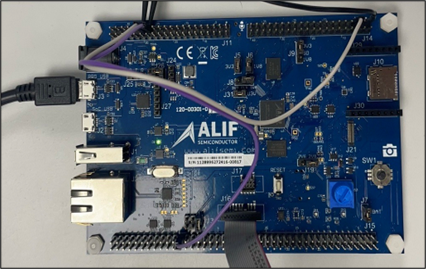

.. _lpi2c:

=====
LPI2C
=====

Introduction
============

This document explains how to create, compile, and run a demo application for the LPI2C (Low Power Inter-Integrated Circuit) controller IP provided by Alif Semiconductor™ and integrated into Ensemble™ devices.

.. figure:: _static/lpi2c_block_diagram.png
   :alt: LPI2C Block Diagram
   :align: center

   LPI2C Block Diagram

.. include:: Prerequisites.rst

LPI2C Interface
---------------

The LPI2C block diagram illustrates the integration of the LPI2C controller with other system components.

Pin Setup
---------

.. list-table:: LPI2C Pin Setup
   :widths: 20 20 20
   :header-rows: 1

   * - Function
     - I2C0 Pin
     - LPI2C Pin
   * - SDA
     - P3_5
     - P5_3
   * - SCL
     - P3_4
     - P5_2

Hardware Connections and Setup
------------------------------

   LPI2C Hardware Setup

Connection
~~~~~~~~~~

- **SDA**: Connect I2C0 instance P3_5 (J11-29) to LPI2C pin P5_3 (J14_5).
- **SCL**: Connect I2C0 instance P3_4 (J11-27) to LPI2C pin P5_2 (J12_17).

Building LPI2C Application in Zephyr
======================================

Follow these steps to build your Zephyr-based LPI2C application using the GCC compiler and the Alif Zephyr SDK:

1. For instructions on fetching the Alif Zephyr SDK and navigating to the Zephyr repository, please refer to the `ZAS User Guide`_

2. Remove the existing build directory and build the application:

.. note::
   The build commands shown here are specifically for the Alif E7 DevKit.
   To build the application for other boards, modify the board name in the build command accordingly. For more information, refer to the `ZAS User Guide`_, under the section Setting Up and Building Zephyr Applications.

3. Build commands for applications on the M55 HP core using the Ninja build command:

.. code-block:: bash

   rm -rf build
   west build -b alif_e7_dk_rtss_hp ../alif/samples/drivers/lpi2c/

4. Build commands for applications on the M55 HE core using the Ninja build command:

.. code-block:: bash

   rm -rf build
   west build -b alif_e7_dk_rtss_he ../alif/samples/drivers/lpi2c/

Once the build command completes successfully, executable images will be generated and placed in the `build/zephyr` directory. Both `.bin` (binary) and `.elf` (Executable and Linkable Format) files will be available.

Executing Binary on the DevKit
==============================

To execute binaries on the DevKit follow the command

.. code-block:: bash

   west flash

Console Output
==============

You can observe the console output as shown below

   .. figure:: _static/lpi2c_console_output.png
      :alt: Console Output
      :align: center

      LPI2C COnsole Output