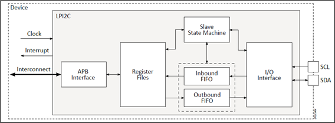
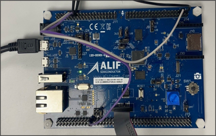

.. _lpi2c:

=====
LPI2C
=====

Introduction
============

This document explains how to create, compile, and run a demo application for the LPI2C (Low Power Inter-Integrated Circuit) controller IP provided by Alif Semiconductor and integrated into Alif devices.

   LPI2C Block Diagram

.. include:: prerequisites.rst

LPI2C Interface
---------------

The LPI2C block diagram illustrates the integration of the LPI2C controller with other system components.

Pin Setup
---------

.. list-table:: LPI2C0 Pin Setup
   :widths: 20 20 20
   :header-rows: 1

   * - Function
     - I2C0 Pin
     - LPI2C0 Pin
   * - SDA
     - P3_5
     - P7_5
   * - SCL
     - P3_4
     - P7_4

Hardware Connections and Setup
------------------------------

   LPI2C Hardware Setup

Connection
~~~~~~~~~~

- **SDA**: Connect I2C0 instance P3_5 to LPI2C pin P7_5.
- **SCL**: Connect I2C0 instance P3_4 to LPI2C0 pin P7_4.

.. note::
   In the Balletto A5 SoC, the SCL and SDA lines of I2C0 (configured as Master) are not pulled up. Therefore, it is recommended to use I2C1 as the bus master in such cases.

.. include:: note.rst

Build an LPI2C Application with Zephyr
=======================================

Follow these steps to build the LPI2C application using the Alif Zephyr
SDK:

For instructions on fetching the Alif Zephyr SDK and navigating to the Zephyr
repository, refer to the `ZAS User Guide`_.

Alif E7 DevKit
---------------

Build for SoC variant ``ae722f80f55d5xx``, M55 HE core:

.. code-block:: console

   west build -p always \
     -b alif_e7_dk/ae722f80f55d5xx/rtss_he \
     ../alif/samples/drivers/lpi2c \
     -S alif-lpi2c

Build for SoC variant ``ae302f80f55d5xx``, M55 HE core:

.. code-block:: console

   west build -p always \
     -b alif_e7_dk/ae302f80f55d5xx/rtss_he \
     ../alif/samples/drivers/lpi2c \
     -S alif-lpi2c

Alif E7 AppKit
----------------

Build for SoC variant ``ae722f80f55d5xx``, M55 HE core:

.. code-block:: console

   west build -p always \
     -b alif_e7_ak/ae722f80f55d5xx/rtss_he \
     ../alif/samples/drivers/lpi2c \
     -S alif-lpi2c

Alif E8 DevKit
---------------

Build for SoC variant ``ae822fa0e5597xx0``, M55 HE core:

.. code-block:: console

   west build -p always \
     -b alif_e8_dk/ae822fa0e5597xx0/rtss_he \
     ../alif/samples/drivers/lpi2c \
     -S alif-lpi2c

Build for SoC variant ``ae402fa0e5597xx0``, M55 HE core:

.. code-block:: console

   west build -p always \
     -b alif_e8_dk/ae402fa0e5597xx0/rtss_he \
     ../alif/samples/drivers/lpi2c \
     -S alif-lpi2c

Alif E8 AppKit
----------------

Build for SoC variant ``ae822fa0e5597xx0``, M55 HE core:

.. code-block:: console

   west build -p always \
     -b alif_e8_ak/ae822fa0e5597xx0/rtss_he \
     ../alif/samples/drivers/lpi2c \
     -S alif-lpi2c

Alif E1C DevKit
----------------

Build for SoC variant ``ae1c1f4051920hh``, M55 HE core:

.. code-block:: console

   west build -p always \
     -b alif_e1c_dk/ae1c1f4051920hh/rtss_he \
     ../alif/samples/drivers/lpi2c \
     -S alif-lpi2c

Alif B1 DevKit
---------------

Build for SoC variant ``ab1c1f4m51820ph0``, M55 HE core:

.. code-block:: console

   west build -p always \
     -b alif_b1_dk/ab1c1f4m51820ph0/rtss_he \
     ../alif/samples/drivers/lpi2c \
     -S alif-lpi2c

Build for SoC variant ``ab1c1f4m51820hh0``, M55 HE core:

.. code-block:: console

   west build -p always \
     -b alif_b1_dk/ab1c1f4m51820hh0/rtss_he \
     ../alif/samples/drivers/lpi2c \
     -S alif-lpi2c

Build for SoC variant ``ab1c1f1m41820hh0``, M55 HE core:

.. code-block:: console

   west build -p always \
     -b alif_b1_dk/ab1c1f1m41820hh0/rtss_he \
     ../alif/samples/drivers/lpi2c \
     -S alif-lpi2c

Build for SoC variant ``ab1c1f1m41820ph0``, M55 HE core:

.. code-block:: console

   west build -p always \
     -b alif_b1_dk/ab1c1f1m41820ph0/rtss_he \
     ../alif/samples/drivers/lpi2c \
     -S alif-lpi2c

Once the build command completes successfully, executable images will be generated and placed in the ``build/zephyr`` directory. Both ``.bin`` (binary) and ``.elf`` (Executable and Linkable Format) files will be available.

Executing Binary on the DevKit
==============================

To execute binaries on the DevKit, follow the command:

.. code-block:: console

   west flash

Console Output
==============

.. code-block:: text

   [00:00:00.000,000] <inf> ALIF_LPI2C: Start Master transmit and Slave receive
   [00:00:00.001,000] <inf> ALIF_LPI2C: Master transmit and slave receive successful
   [00:00:00.002,000] <inf> ALIF_LPI2C: Start Slave transmit and Master receive
   [00:00:00.006,000] <inf> ALIF_LPI2C: Slave transmit and Master receive successful
   [00:00:00.006,000] <inf> ALIF_LPI2C: Transfer completed
