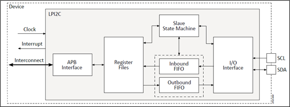

.. _lpi2c:

=====
LPI2C
=====

Introduction
============

This document explains how to create, compile, and run a demo application for the LPI2C (Low Power Inter-Integrated Circuit) controller IP provided by Alif Semiconductor™ and integrated into Ensemble™ devices.

   LPI2C Block Diagram

Hardware Requirements and Setup
===============================

Hardware Requirements
---------------------

- **Alif Devkit**
- **Debugger (ULinkpro or JLink)**

LPI2C Interface
---------------

The LPI2C block diagram illustrates the integration of the LPI2C controller with other system components.

Pin Setup
---------

.. list-table:: LPI2C Pin Setup
   :widths: 20 20 20
   :header-rows: 1

   * - Function
     - I2C0 Pin
     - LPI2C Pin
   * - SDA
     - P3_5
     - P5_3
   * - SCL
     - P3_4
     - P5_2

Hardware Connections and Setup
------------------------------

   LPI2C Hardware Setup

Connection
~~~~~~~~~~

- **SDA**: Connect I2C0 instance P3_5 (J11-29) to LPI2C pin P5_3 (J14_5).
- **SCL**: Connect I2C0 instance P3_4 (J11-27) to LPI2C pin P5_2 (J12_17).

Software Requirements
=====================

Below is a list of required software and drivers needed to run the LPI2C application:

- **Alif Zephyr LPI2C driver**

Building the LPI2C Application
==============================

Follow these steps to build your Zephyr-based LPI2C application using the GCC compiler and the Alif Zephyr SDK:

.. note::
   The application is designed for the Alif Ensemble E7 DevKit. Modify the sample code as needed for other DevKits.

1. For instructions on fetching the Alif Zephyr SDK and navigating to the Zephyr repository, please refer to the `ZAS User Guide`_

2. Remove the existing build directory and build the application:

.. code-block:: bash

   rm -rf build
   west build -b alif_e7_dk_rtss_he ../alif/samples/drivers/lpi2c/

.. note::
   The build command targets the M55-HE core. To build for the M55-HP core, use ``alif_e7_dk_rtss_hp`` instead (e.g., ``west build -b alif_e7_dk_rtss_hp ../alif/samples/drivers/lpi2c/``).

Executing Binary on the DevKit
==============================

To execute binaries on the DevKit, follow these steps:

1. Open the **Debug Configuration** window using the *Create, manage, and run configurations* option.

   .. figure:: _static/debug_config_window.png
      :alt: Debug Configuration Window
      :align: center

      Debug Configuration Window

2. In the **Connection** tab, ensure the correct Core and ULINKpro selections are made. In the **Select Target** section, choose:

   - ``Cortex-M55_0`` for M55-HP core
   - ``Cortex-M55_1`` for M55-HE core

   .. figure:: _static/connections_tab.png
      :alt: Connection Tab Settings
      :align: center

      Connection Tab Settings

3. In the **Debugger** tab:

   - Select **Connect Only**.
   - Use the ``loadfile`` command to specify the path to the application’s ``.elf`` file.
   - Click the **Debug** symbol to load debugging information.
   - Click **Apply** and then **Debug** to start the debugging process.

   .. figure:: _static/debugger_tab.png
      :alt: Debugger Tab Settings
      :align: center

      Debugger Tab Settings

Console Output
==============

You can observe the console output as shown below

   .. figure:: _static/lpi2c_console_output.png
      :alt: Console Output
      :align: center

      LPI2C COnsole Output