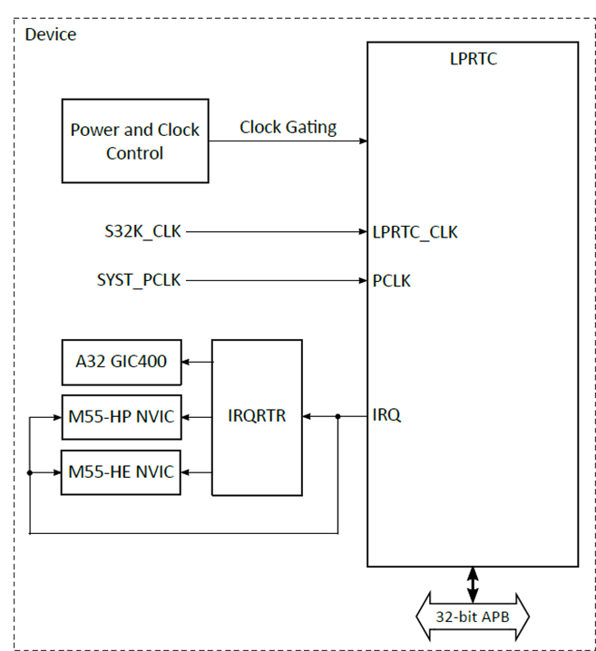

.. _lprtc:

=====
LPRTC
=====

Introduction
============

This document explains how to create, compile, and run a demo application for the Low Power Real-Time Counter (LPRTC) driver IP provided by Synopsys and integrated into Alif Semiconductor Ensemble™ devices. The demo application uses the LPRTC module to generate interrupts at user-specified intervals, demonstrated through an alarm application.

Overview
--------

The LPRTC module is a configurable high-range binary counter that can generate an interrupt on a user-specified interval. Key features include:

- Located in the PD-0 power domain, enabling operation in the lowest power state with VDD_BATT power present.
- 32-bit counter width.
- Supports Wrap mode (wraps to zero on reaching the user-specified interval).
- Includes a 16-bit programmable prescaler to adjust timing.
- Tested with a sample alarm application detailed in this document.

   LPRTC Diagram

Required Config Features
------------------------

- ``CONFIG_COUNTER_SNPS_DW=n``
- ``CONFIG_COUNTER_RTC_SNPS_DW=y``
- ``CONFIG_COUNTER_ALIF_UTIMER=n``

Hardware Requirements and Setup
===============================

Hardware Requirements
---------------------

- **Alif Ensemble DevKit (E7)**
- **Debugger (ULinkpro or JLink)**

Hardware Connections and Setup
------------------------------

The LPRTC module does not require any external connections.

Software Requirements
=====================

Below is a list of required software and drivers needed to run the LPRTC application:

- **DesignWare Zephyr RTC driver**

Drivers can be found at:
- Alif SDK software: https://github.com/alifsemi/sdk-alif

Building the LPRTC Application
==============================

The LPRTC is integrated into the alarm application as a demonstration, shared with the LPTIMER and Utimer modules. Separate overlay and config files for LPRTC, LPTIMER, and Utimer are located in the board's directory within the alarm application. Users can select these files using the west build command.

Steps for Building the LPRTC Alarm Application
----------------------------------------------

Follow these steps to build the LPRTC alarm application using the GCC compiler and the Alif Zephyr SDK:

.. note::
   The application is designed for the Alif Ensemble E7 DevKit. Modify the sample code as needed for other DevKits.

1. For instructions on fetching the Alif Zephyr SDK and navigating to the Zephyr repository, please refer to the `ZAS User Guide`_

2. Remove the existing build directory and build the application:

   **For M55-HP core:**

.. code-block:: bash

   rm -rf build
   west build -b alif_e7_dk_rtss_hp samples/drivers/counter/alarm/ -DOVERLAY_CONFIG=samples/drivers/counter/alarm/boards/alif_rtc.conf -DDTC_OVERLAY_FILE=samples/drivers/counter/alarm/boards/alif_rtc.overlay

   **For M55-HE core:**

.. code-block:: bash

   rm -rf build
   west build -b alif_e7_dk_rtss_he samples/drivers/counter/alarm/ -DOVERLAY_CONFIG=samples/drivers/counter/alarm/boards/alif_rtc.conf -DDTC_OVERLAY_FILE=samples/drivers/counter/alarm/boards/alif_rtc.overlay

.. note::
   To build with different scenarios (e.g., using MRAM or flash addresses with alternative compilers like LLVM or ARMCLANG), refer to the *Getting Started with ZAS for Ensemble* documentation. Upon successful build completion, executable images (.bin and .elf) will be generated in the ``build/zephyr`` directory.

Executing Binary on the DevKit
==============================

To execute binaries on the DevKit using the ULINKpro debugger in Arm DS, follow these steps:

1. Open the **Debug Configuration** window using the *Create, manage, and run configurations* option.

   .. figure:: _static/debug_config_window.png
      :alt: Debug Configuration Window
      :align: center

      Debug Configuration Window

2. In the **Connection** tab, ensure the correct Core and ULINKpro selections are made. In the **Select Target** section, choose:

   - ``Cortex-M55_0`` for M55-HP core
   - ``Cortex-M55_1`` for M55-HE core

   .. figure:: _static/connections_tab.png
      :alt: Connection Tab Settings
      :align: center

      Connection Tab Settings

3. In the **Debugger** tab:

   - Select **Connect Only**.
   - Use the ``loadfile`` command to specify the path to the application’s ``.elf`` file.
   - Click the **Debug** symbol to load debugging information.
   - Click **Apply** and then **Debug** to start the debugging process.

   .. figure:: _static/debugger_tab.png
      :alt: Debugger Tab Settings
      :align: center

      Debugger Tab Settings

Loading Binaries with SE Tools
==============================

For detailed instructions on loading executables using SE Tools, refer to the *Getting Started with ZAS for Ensemble* documentation.

Expected Result
===============

The sample alarm application will run continuously until manually stopped, generating interrupts at the user-specified interval based on the LPRTC configuration. The console output will display as follows:

.. code-block:: text

   *** Booting Zephyr OS build 2d6231a778ac ***
   Counter alarm sample
   Set alarm in 2 sec (65536 ticks)
   !!! Alarm !!!
   Now: 1
   Set alarm in 4 sec (131072 ticks)
   !!! Alarm !!!
   Now: 3middle
   Set alarm in 8 sec (262144 ticks)
   !!! Alarm !!!
   Now: 7
   Set alarm in 16 sec (524288 ticks)
   !!! Alarm !!!
   Now: 15
   Set alarm in 32 sec (1048576 ticks)
   !!! Alarm !!!
   Now: 31
   Set alarm in 64 sec (2097152 ticks)