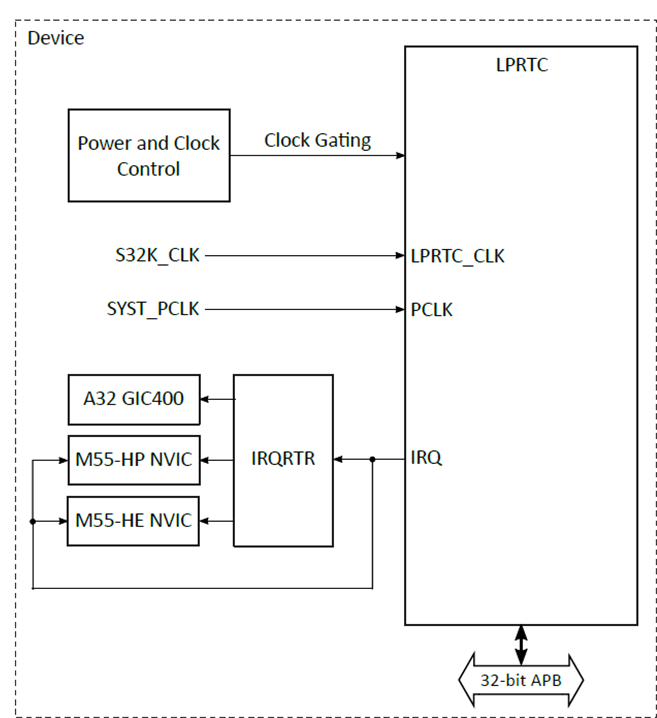

.. _lprtc:

=====
LPRTC
=====

Introduction
============

This document explains how to create, compile, and run a demo application for the Low Power Real-Time Counter (LPRTC) driver IP provided by Synopsys and integrated into Alif Semiconductor devices. The demo application uses the LPRTC module to generate interrupts at user-specified intervals, demonstrated through an alarm application.

Furthermore, the LPRTC is integrated into the Alarm application as a demo application, where it functions as expected. The same demo app is also utilized by the RTC (Real-Time Clock) and LPTIMER. To facilitate configuration, separate overlay and config files for the RTC, UTIMER, and LPTIMER reside in the board’s directory of the Alarm application. Users can select these files using the west build command.

Overview
--------

The LPRTC module is a configurable high-range binary counter that can generate an interrupt on a user-specified interval. Key features include:

- Located in the PD-0 power domain, enabling operation in the lowest power state with VDD_BATT power present.
- 32-bit counter width.
- Supports Wrap mode (wraps to zero on reaching the user-specified interval).
- Includes a 16-bit programmable prescaler to adjust timing.
- Tested with a sample alarm application detailed in this document.

   LPRTC Diagram

Required Config Features
------------------------

- ``CONFIG_COUNTER_SNPS_DW=n``
- ``CONFIG_COUNTER_RTC_SNPS_DW=y``
- ``CONFIG_COUNTER_ALIF_UTIMER=n``

.. include:: prerequisites.rst

.. include:: note.rst

Build an LPRTC Application with Zephyr
==========================================

The LPRTC is integrated into the alarm application as a demonstration, shared with the LPTIMER and Utimer modules. Separate overlay and config files for LPRTC, LPTIMER, and Utimer are located in the board's directory within the alarm application. Users can select these files using the west build command.

Follow these steps to build the LPRTC application using the Alif Zephyr SDK:

For instructions on fetching the Alif Zephyr SDK and navigating to the Zephyr
repository, refer to the `ZAS User Guide`_.

Alif E7 DevKit
----------------

Build for SoC variant ``ae722f80f55d5xx``, M55 HE core:

.. code-block:: console

   west build -p always \
     -b alif_e7_dk/ae722f80f55d5xx/rtss_he \
     samples/drivers/counter/alarm/ \
     -- \
     -DOVERLAY_CONFIG=boards/alif_rtc.conf \
     -DDTC_OVERLAY_FILE=boards/alif_rtc.overlay

Build for SoC variant ``ae722f80f55d5xx``, M55 HP core:

.. code-block:: console

   west build -p always \
     -b alif_e7_dk/ae722f80f55d5xx/rtss_hp \
     samples/drivers/counter/alarm/ \
     -- \
     -DOVERLAY_CONFIG=boards/alif_rtc.conf \
     -DDTC_OVERLAY_FILE=boards/alif_rtc.overlay

Build for SoC variant ``ae302f80f55d5xx``, M55 HE core:

.. code-block:: console

   west build -p always \
     -b alif_e7_dk/ae302f80f55d5xx/rtss_he \
     samples/drivers/counter/alarm/ \
     -- \
     -DOVERLAY_CONFIG=boards/alif_rtc.conf \
     -DDTC_OVERLAY_FILE=boards/alif_rtc.overlay

Build for SoC variant ``ae302f80f55d5xx``, M55 HP core:

.. code-block:: console

   west build -p always \
     -b alif_e7_dk/ae302f80f55d5xx/rtss_hp \
     samples/drivers/counter/alarm/ \
     -- \
     -DOVERLAY_CONFIG=boards/alif_rtc.conf \
     -DDTC_OVERLAY_FILE=boards/alif_rtc.overlay

Alif E7 AppKit
----------------

Build for SoC variant ``ae722f80f55d5xx``, M55 HE core:

.. code-block:: console

   west build -p always \
     -b alif_e7_ak/ae722f80f55d5xx/rtss_he \
     samples/drivers/counter/alarm/ \
     -- \
     -DOVERLAY_CONFIG=boards/alif_rtc.conf \
     -DDTC_OVERLAY_FILE=boards/alif_rtc.overlay

Build for SoC variant ``ae722f80f55d5xx``, M55 HP core:

.. code-block:: console

   west build -p always \
     -b alif_e7_ak/ae722f80f55d5xx/rtss_hp \
     samples/drivers/counter/alarm/ \
     -- \
     -DOVERLAY_CONFIG=boards/alif_rtc.conf \
     -DDTC_OVERLAY_FILE=boards/alif_rtc.overlay

Alif E8 DevKit
---------------

Build for SoC variant ``ae822fa0e5597xx0``, M55 HE core:

.. code-block:: console

   west build -p always \
     -b alif_e8_dk/ae822fa0e5597xx0/rtss_he \
     samples/drivers/counter/alarm/ \
     -- \
     -DOVERLAY_CONFIG=boards/alif_rtc.conf \
     -DDTC_OVERLAY_FILE=boards/alif_rtc.overlay

Build for SoC variant ``ae822fa0e5597xx0``, M55 HP core:

.. code-block:: console

   west build -p always \
     -b alif_e8_dk/ae822fa0e5597xx0/rtss_hp \
     samples/drivers/counter/alarm/ \
     -- \
     -DOVERLAY_CONFIG=boards/alif_rtc.conf \
     -DDTC_OVERLAY_FILE=boards/alif_rtc.overlay

Build for SoC variant ``ae402fa0e5597xx0``, M55 HE core:

.. code-block:: console

   west build -p always \
     -b alif_e8_dk/ae402fa0e5597xx0/rtss_he \
     samples/drivers/counter/alarm/ \
     -- \
     -DOVERLAY_CONFIG=boards/alif_rtc.conf \
     -DDTC_OVERLAY_FILE=boards/alif_rtc.overlay

Build for SoC variant ``ae402fa0e5597xx0``, M55 HP core:

.. code-block:: console

   west build -p always \
     -b alif_e8_dk/ae402fa0e5597xx0/rtss_hp \
     samples/drivers/counter/alarm/ \
     -- \
     -DOVERLAY_CONFIG=boards/alif_rtc.conf \
     -DDTC_OVERLAY_FILE=boards/alif_rtc.overlay

Alif E8 AppKit
----------------

Build for SoC variant ``ae822fa0e5597xx0``, M55 HE core:

.. code-block:: console

   west build -p always \
     -b alif_e8_ak/ae822fa0e5597xx0/rtss_he \
     samples/drivers/counter/alarm/ \
     -- \
     -DOVERLAY_CONFIG=boards/alif_rtc.conf \
     -DDTC_OVERLAY_FILE=boards/alif_rtc.overlay

Build for SoC variant ``ae822fa0e5597xx0``, M55 HP core:

.. code-block:: console

   west build -p always \
     -b alif_e8_ak/ae822fa0e5597xx0/rtss_hp \
     samples/drivers/counter/alarm/ \
     -- \
     -DOVERLAY_CONFIG=boards/alif_rtc.conf \
     -DDTC_OVERLAY_FILE=boards/alif_rtc.overlay

Alif E1C DevKit
----------------

Build for SoC variant ``ae1c1f4051920hh``, M55 HE core:

.. code-block:: console

   west build -p always \
     -b alif_e1c_dk/ae1c1f4051920hh/rtss_he \
     samples/drivers/counter/alarm/ \
     -- \
     -DOVERLAY_CONFIG=boards/alif_rtc.conf \
     -DDTC_OVERLAY_FILE=boards/alif_rtc.overlay

Alif B1 DevKit
---------------

Build for SoC variant ``ab1c1f4m51820ph0``, M55 HE core:

.. code-block:: console

   west build -p always \
     -b alif_b1_dk/ab1c1f4m51820ph0/rtss_he \
     samples/drivers/counter/alarm/ \
     -- \
     -DOVERLAY_CONFIG=boards/alif_rtc.conf \
     -DDTC_OVERLAY_FILE=boards/alif_rtc.overlay

Build for SoC variant ``ab1c1f4m51820hh0``, M55 HE core:

.. code-block:: console

   west build -p always \
     -b alif_b1_dk/ab1c1f4m51820hh0/rtss_he \
     samples/drivers/counter/alarm/ \
     -- \
     -DOVERLAY_CONFIG=boards/alif_rtc.conf \
     -DDTC_OVERLAY_FILE=boards/alif_rtc.overlay

Build for SoC variant ``ab1c1f1m41820hh0``, M55 HE core:

.. code-block:: console

   west build -p always \
     -b alif_b1_dk/ab1c1f1m41820hh0/rtss_he \
     samples/drivers/counter/alarm/ \
     -- \
     -DOVERLAY_CONFIG=boards/alif_rtc.conf \
     -DDTC_OVERLAY_FILE=boards/alif_rtc.overlay

Build for SoC variant ``ab1c1f1m41820ph0``, M55 HE core:

.. code-block:: console

   west build -p always \
     -b alif_b1_dk/ab1c1f1m41820ph0/rtss_he \
     samples/drivers/counter/alarm/ \
     -- \
     -DOVERLAY_CONFIG=boards/alif_rtc.conf \
     -DDTC_OVERLAY_FILE=boards/alif_rtc.overlay

Once the build command completes successfully, executable images will be generated and placed in the ``build/zephyr`` directory. Both ``.bin`` (binary) and ``.elf`` (Executable and Linkable Format) files will be available.

Executing Binary on the DevKit
==============================

To execute binaries on the DevKit, follow the command:

.. code-block:: console

   west flash

Loading Binaries with SE Tools
==============================

For detailed instructions on loading executables using SE Tools, refer to the *Getting Started with ZAS for Alif* documentation.

Sample Output
===============

The sample alarm application will run continuously until manually stopped, generating interrupts at the user-specified interval based on the LPRTC configuration. The console output will display as follows:

.. code-block:: text

   Counter alarm sample

   Set alarm in 2 sec (65536 ticks)
   !!! Alarm !!!
   Now: 65372

   Set alarm in 4 sec (131072 ticks)
   !!! Alarm !!!
   Now: 65376

   Set alarm in 8 sec (262144 ticks)
   !!! Alarm !!!
   Now: 65384

   Set alarm in 16 sec (524288 ticks)
   !!! Alarm !!!
   Now: 65400

   Set alarm in 32 sec (1048576 ticks)

