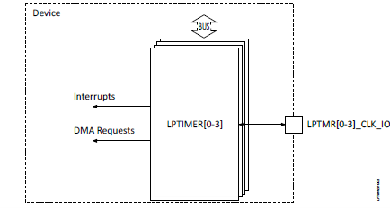

.. _appnote-zephyr-low-power-timer:

===============
Low Power Timer
===============

Introduction
============

The 32-bit Low-Power Timer (LPTIMER) module counts down from a programmed value and generates an interrupt when the count reaches zero. Two events can cause the timer to load the initial value from which it counts down. The first event is when the timer is enabled after being reset or disabled, and the second event is when the timer count reaches zero.

The device includes up to four LPTIMER modules. Each LPTIMER module supports the following main features:

- 32-bit width of the timer counter register
- User-defined count mode of operation
- Asynchronous event counting
- Individual interrupt output
- Independent clock input that can be connected either to internal clocks or to an external clock source
- Each odd-numbered LPTIMER module can be concatenated with the previous even-numbered LPTIMER module to form up to a 64-bit timer.

   LPTIMER Block Diagram

Software Requirement
====================

- **Alif SDK**: Clone from `https://github.com/alifsemi/sdk-alif <https://github.com/alifsemi/sdk-alif>`_

Driver Description
==================

The LPTIMER IP, sourced from Synopsys DesignWare, can be utilized as a timer driver within the counter driver subsystem for the LPTIMER module. It supports a 32KHz clock and an external clock input, both of which are hardware-specific features. Additionally, the code includes support for a 128KHz clock, although stability issues exist with this source due to hardware limitations. Currently, cascaded input is only partially supported, and the output toggle feature is available for all channels.

Furthermore, the LPTIMER is integrated into the Alarm application as a demo application, where it functions as expected. The same demo app is also utilized by the RTC (Real-Time Clock). To facilitate configuration, separate overlay and config files for both RTC and LPTIMER reside in the board’s directory of the Alarm application. Users can select these files using the west build command.

Building LPTimer Application in Zephyr
======================================

Follow these steps to build the LPTIMER application in Zephyr using the Alif Zephyr SDK:

.. note::
   The application is designed for the Alif Ensemble E7 DevKit. Modify the sample code as needed for other DevKits.

1. For instructions on fetching the Alif Zephyr SDK and navigating to the Zephyr repository, please refer to the `ZAS User Guide`_

2. Build commands for applications on the M55 HP core using the Ninja build command:

.. code-block:: bash

   rm -rf build
   west build -b alif_e7_dk_rtss_hp samples/drivers/counter/alarm/ \
       -DOVERLAY_CONFIG=path_to_zephyr_directory/samples/drivers/counter/alarm/boards/alif_lptimer.conf \
       -DDTC_OVERLAY_FILE=path_to_zephyr_directory/samples/drivers/counter/alarm/boards/alif_lptimer.overlay

3. Build commands for applications on the M55 HE core using the Ninja build command:

.. code-block:: bash

   rm -rf build
   west build -b alif_e7_dk_rtss_he samples/drivers/counter/alarm/ \
       -DOVERLAY_CONFIG=path_to_zephyr_directory/samples/drivers/counter/alarm/boards/alif_lptimer.conf \
       -DDTC_OVERLAY_FILE=path_to_zephyr_directory/samples/drivers/counter/alarm/boards/alif_lptimer.overlay

.. note::
   To address various scenarios, such as utilizing MRAM or flash addresses and employing alternative compilers like LLVM or ARMCLANG, refer to the document AUGD0008_Getting-Started-with-ZAS-for-Ensemble-v0.5.0-Beta.

Once the build command completes successfully, executable images will be generated and placed in the `build/zephyr` directory. Both `.bin` (binary) and `.elf` (Executable and Linkable Format) files will be available.

Hardware Requirements
=====================

- **Alif Ensemble DevKit**
- **Debugger (ULinkpro or JLink)** (optional)

Loading the Binary on the Alif Ensemble Devkit
==============================================

To execute binaries on the DevKit-E7 board, follow these steps:

1. Open the **Debug Configuration** window with *Create, manage, and run configurations*.

   .. figure:: _static/debug_config_window.png
      :alt: Debug Configuration Window
      :align: center

      Debug Configuration Window

2. In the **Connection** tab, ensure the correct Core and ULINKpro selections are made. In the **Select Target** section, choose:

   - ``Cortex-M55_0`` for M55-HP core
   - ``Cortex-M55_1`` for M55-HE core

   .. figure:: _static/connections_tab.png
      :alt: Connection Tab Settings
      :align: center

      Connection Tab Settings

3. In the **Debugger** tab:

   - Select **Connect Only**.
   - Use the ``loadfile`` command to specify the path to the application’s ``.elf`` file.
   - Click the **Debug** symbol to load debugging information.
   - Click **Apply** and then **Debug** to start the debugging process.

   .. figure:: _static/debugger_tab.png
      :alt: Debugger Tab Settings
      :align: center

      Debugger Tab Settings