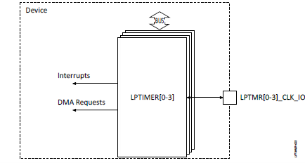

.. _appnote-zephyr-low-power-timer:

=========
LP Timer
========

Introduction
============

The 32-bit Low-Power Timer (LPTIMER) module counts down from a programmed value and generates an interrupt when the count reaches zero. Two events can cause the timer to load the initial value from which it counts down. The first event is when the timer is enabled after being reset or disabled, and the second event is when the timer count reaches zero.

The device includes up to four LPTIMER modules. Each LPTIMER module supports the following main features:

- 32-bit width of the timer counter register
- User-defined count mode of operation
- Asynchronous event counting
- Individual interrupt output
- Independent clock input that can be connected either to internal clocks or to an external clock source
- Each odd-numbered LPTIMER module can be concatenated with the previous even-numbered LPTIMER module to form up to a 64-bit timer.

   LPTIMER Block Diagram

Description
============

The LPTIMER IP, sourced from Synopsys DesignWare, can be utilized as a timer driver within the counter driver subsystem for the LPTIMER module. It supports a 32KHz clock and an external clock input, both of which are hardware-specific features. Additionally, the code includes support for a 128KHz clock, although stability issues exist with this source due to hardware limitations. Currently, cascaded input is only partially supported, and the output toggle feature is available for all channels.

Furthermore, the LPTIMER is integrated into the Alarm application as a demo application, where it functions as expected. The same demo app is also utilized by the RTC (Real-Time Clock) and UTIMER. To facilitate configuration, separate overlay and config files for the RTC, UTIMER, and LPTIMER reside in the board’s directory of the Alarm application. Users can select these files using the west build command.

.. include:: prerequisites.rst

.. include:: note.rst

Build an LP TIMER Application with Zephyr
==============================================

Follow these steps to build the LP TIMER application using the Alif Zephyr SDK:

For instructions on fetching the Alif Zephyr SDK and navigating to the Zephyr
repository, refer to the `ZAS User Guide`_.

Alif E7 DevKit
----------------

Build for SoC variant ``ae722f80f55d5xx``, M55 HE core:

.. code-block:: console

   west build -p always \
     -b alif_e7_dk/ae722f80f55d5xx/rtss_he \
     samples/drivers/counter/alarm/ \
     -- \
     -DDTC_OVERLAY_FILE=boards/alif_lptimer.overlay

Build for SoC variant ``ae722f80f55d5xx``, M55 HP core:

.. code-block:: console

   west build -p always \
     -b alif_e7_dk/ae722f80f55d5xx/rtss_hp \
     samples/drivers/counter/alarm/ \
     -- \
     -DDTC_OVERLAY_FILE=boards/alif_lptimer.overlay

Build for SoC variant ``ae302f80f55d5xx``, M55 HE core:

.. code-block:: console

   west build -p always \
     -b alif_e7_dk/ae302f80f55d5xx/rtss_he \
     samples/drivers/counter/alarm/ \
     -- \
     -DDTC_OVERLAY_FILE=boards/alif_lptimer.overlay

Build for SoC variant ``ae302f80f55d5xx``, M55 HP core:

.. code-block:: console

   west build -p always \
     -b alif_e7_dk/ae302f80f55d5xx/rtss_hp \
     samples/drivers/counter/alarm/ \
     -- \
     -DDTC_OVERLAY_FILE=boards/alif_lptimer.overlay

Alif E7 AppKit
----------------

Build for SoC variant ``ae722f80f55d5xx``, M55 HE core:

.. code-block:: console

   west build -p always \
     -b alif_e7_ak/ae722f80f55d5xx/rtss_he \
     samples/drivers/counter/alarm/ \
     -- \
     -DDTC_OVERLAY_FILE=boards/alif_lptimer.overlay

Build for SoC variant ``ae722f80f55d5xx``, M55 HP core:

.. code-block:: console

   west build -p always \
     -b alif_e7_ak/ae722f80f55d5xx/rtss_hp \
     samples/drivers/counter/alarm/ \
     -- \
     -DDTC_OVERLAY_FILE=boards/alif_lptimer.overlay

Alif E8 DevKit
---------------

Build for SoC variant ``ae822fa0e5597xx0``, M55 HE core:

.. code-block:: console

   west build -p always \
     -b alif_e8_dk/ae822fa0e5597xx0/rtss_he \
     samples/drivers/counter/alarm/ \
     -- \
     -DDTC_OVERLAY_FILE=boards/alif_lptimer.overlay

Build for SoC variant ``ae822fa0e5597xx0``, M55 HP core:

.. code-block:: console

   west build -p always \
     -b alif_e8_dk/ae822fa0e5597xx0/rtss_hp \
     samples/drivers/counter/alarm/ \
     -- \
     -DDTC_OVERLAY_FILE=boards/alif_lptimer.overlay

Build for SoC variant ``ae402fa0e5597xx0``, M55 HE core:

.. code-block:: console

   west build -p always \
     -b alif_e8_dk/ae402fa0e5597xx0/rtss_he \
     samples/drivers/counter/alarm/ \
     -- \
     -DDTC_OVERLAY_FILE=boards/alif_lptimer.overlay

Build for SoC variant ``ae402fa0e5597xx0``, M55 HP core:

.. code-block:: console

   west build -p always \
     -b alif_e8_dk/ae402fa0e5597xx0/rtss_hp \
     samples/drivers/counter/alarm/ \
     -- \
     -DDTC_OVERLAY_FILE=boards/alif_lptimer.overlay

Alif E8 AppKit
----------------

Build for SoC variant ``ae822fa0e5597xx0``, M55 HE core:

.. code-block:: console

   west build -p always \
     -b alif_e8_ak/ae822fa0e5597xx0/rtss_he \
     samples/drivers/counter/alarm/ \
     -- \
     -DDTC_OVERLAY_FILE=boards/alif_lptimer.overlay

Build for SoC variant ``ae822fa0e5597xx0``, M55 HP core:

.. code-block:: console

   west build -p always \
     -b alif_e8_ak/ae822fa0e5597xx0/rtss_hp \
     samples/drivers/counter/alarm/ \
     -- \
     -DDTC_OVERLAY_FILE=boards/alif_lptimer.overlay

Alif E1C DevKit
----------------

Build for SoC variant ``ae1c1f4051920hh``, M55 HE core:

.. code-block:: console

   west build -p always \
     -b alif_e1c_dk/ae1c1f4051920hh/rtss_he \
     samples/drivers/counter/alarm/ \
     -- \
     -DDTC_OVERLAY_FILE=boards/alif_lptimer.overlay

Alif B1 DevKit
---------------

Build for SoC variant ``ab1c1f4m51820ph0``, M55 HE core:

.. code-block:: console

   west build -p always \
     -b alif_b1_dk/ab1c1f4m51820ph0/rtss_he \
     samples/drivers/counter/alarm/ \
     -- \
     -DDTC_OVERLAY_FILE=boards/alif_lptimer.overlay

Build for SoC variant ``ab1c1f4m51820hh0``, M55 HE core:

.. code-block:: console

   west build -p always \
     -b alif_b1_dk/ab1c1f4m51820hh0/rtss_he \
     samples/drivers/counter/alarm/ \
     -- \
     -DDTC_OVERLAY_FILE=boards/alif_lptimer.overlay

Build for SoC variant ``ab1c1f1m41820hh0``, M55 HE core:

.. code-block:: console

   west build -p always \
     -b alif_b1_dk/ab1c1f1m41820hh0/rtss_he \
     samples/drivers/counter/alarm/ \
     -- \
     -DDTC_OVERLAY_FILE=boards/alif_lptimer.overlay

Build for SoC variant ``ab1c1f1m41820ph0``, M55 HE core:

.. code-block:: console

   west build -p always \
     -b alif_b1_dk/ab1c1f1m41820ph0/rtss_he \
     samples/drivers/counter/alarm/ \
     -- \
     -DDTC_OVERLAY_FILE=boards/alif_lptimer.overlay

Once the build command completes successfully, executable images will be generated and placed in the ``build/zephyr`` directory. Both ``.bin`` (binary) and ``.elf`` (Executable and Linkable Format) files will be available.

Executing Binary on the DevKit
==============================================

To execute binaries on the DevKit, follow the command:

.. code-block:: console

   west flash

Console Output
===============

.. code-block:: text

   Counter alarm sample

   Set alarm in 2 sec (65536 ticks)
   !!! Alarm !!!
   Now: 0
   Set alarm in 4 sec (131072 ticks)
   !!! Alarm !!!
   Now: 0
   Set alarm in 8 sec (262144 ticks)
   !!! Alarm !!!
   Now: 0
   Set alarm in 16 sec (524288 ticks)
   !!! Alarm !!!
   Now: 0
   Set alarm in 32 sec (1048576 ticks)

