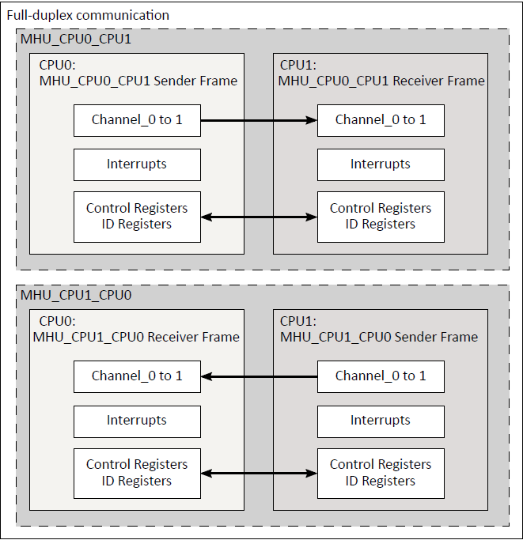

.. _appnote-mhu:

=====
MHU
=====

Introduction
=============

This document explains how to create, compile, and run a demo application for the Message Handling Unit (MHU).
The MHU provides point-to-point communication between the Secure Enclave processor, the Application processor (A32), and the two Real-Time processors (M55-HP and M55-HE).
It enables interrupt-based communication between these processing entities.

   MHU interface

.. include:: prerequisites.rst

.. include:: note.rst

Build an MHU Application with Zephyr
========================================

Follow these steps to build the MHU sample application using the Alif Zephyr
SDK:

For instructions on fetching the Alif Zephyr SDK and navigating to the Zephyr
repository, refer to the `ZAS User Guide`_.

Alif E7 DevKit
---------------

Build for SoC variant ``ae722f80f55d5xx``, MHU0 Application on the M55-HE Core:

.. code-block:: console

   west build -p always \
     -b alif_e7_dk/ae722f80f55d5xx/rtss_he \
     ../alif/samples/drivers/ipm/ipm_arm_mhuv2/ \
     -- \
     -DRTSS_HP_MHU0=on

Build for SoC variant ``ae722f80f55d5xx``, MHU0 Application on the M55-HP Core:

.. code-block:: console

   west build -p always \
     -b alif_e7_dk/ae722f80f55d5xx/rtss_hp \
     ../alif/samples/drivers/ipm/ipm_arm_mhuv2/ \
     -- \
     -DRTSS_HE_MHU0=on

Build for SoC variant ``ae722f80f55d5xx``, MHU1 Application on the M55-HE Core:

.. code-block:: console

   west build -p always \
     -b alif_e7_dk/ae722f80f55d5xx/rtss_he \
     ../alif/samples/drivers/ipm/ipm_arm_mhuv2/ \
     -- \
     -DRTSS_HP_MHU1=on

Build for SoC variant ``ae722f80f55d5xx``, MHU1 Application on the M55-HP Core:

.. code-block:: console

   west build -p always \
     -b alif_e7_dk/ae722f80f55d5xx/rtss_hp \
     ../alif/samples/drivers/ipm/ipm_arm_mhuv2/ \
     -- \
     -DRTSS_HE_MHU1=on

Build for SoC variant ``ae302f80f55d5xx``, MHU0 Application on the M55-HE Core:

.. code-block:: console

   west build -p always \
     -b alif_e7_dk/ae302f80f55d5xx/rtss_he \
     ../alif/samples/drivers/ipm/ipm_arm_mhuv2/rtss_he \
     -- \
     -DRTSS_HP_MHU0=on

Build for SoC variant ``ae302f80f55d5xx``, MHU0 Application on the M55-HP Core:

.. code-block:: console

   west build -p always \
     -b alif_e7_dk/ae302f80f55d5xx/rtss_hp \
     ../alif/samples/drivers/ipm/ipm_arm_mhuv2/rtss_hp \
     -- \
     -DRTSS_HE_MHU0=on

Build for SoC variant ``ae302f80f55d5xx``, MHU1 Application on the M55-HE Core:

.. code-block:: console

   west build -p always \
     -b alif_e7_dk/ae302f80f55d5xx/rtss_he \
     ../alif/samples/drivers/ipm/ipm_arm_mhuv2/rtss_he \
     -- \
     -DRTSS_HP_MHU1=on

Build for SoC variant ``ae302f80f55d5xx``, MHU1 Application on the M55-HP Core:

.. code-block:: console

   west build -p always \
     -b alif_e7_dk/ae302f80f55d5xx/rtss_hp \
     ../alif/samples/drivers/ipm/ipm_arm_mhuv2/rtss_hp \
     -- \
     -DRTSS_HE_MHU1=on

Alif E7 AppKit
---------------

Build for SoC variant ``ae722f80f55d5xx``, MHU0 Application on the M55-HE Core:

.. code-block:: console

   west build -p always \
     -b alif_e7_ak/ae722f80f55d5xx/rtss_he \
     ../alif/samples/drivers/ipm/ipm_arm_mhuv2/rtss_he \
     -- \
     -DRTSS_HP_MHU0=on

Build for SoC variant ``ae722f80f55d5xx``, MHU0 Application on the M55-HP Core:

.. code-block:: console

   west build -p always \
     -b alif_e7_ak/ae722f80f55d5xx/rtss_hp \
     ../alif/samples/drivers/ipm/ipm_arm_mhuv2/rtss_hp \
     -- \
     -DRTSS_HE_MHU0=on

Build for SoC variant ``ae722f80f55d5xx``, MHU1 Application on the M55-HE Core:

.. code-block:: console

   west build -p always \
     -b alif_e7_ak/ae722f80f55d5xx/rtss_he \
     ../alif/samples/drivers/ipm/ipm_arm_mhuv2/rtss_he \
     -- \
     -DRTSS_HP_MHU1=on

Build for SoC variant ``ae722f80f55d5xx``, MHU1 Application on the M55-HP Core:

.. code-block:: console

   west build -p always \
     -b alif_e7_ak/ae722f80f55d5xx/rtss_hp \
     ../alif/samples/drivers/ipm/ipm_arm_mhuv2/rtss_hp \
     -- \
     -DRTSS_HE_MHU1=on

Alif E8 DevKit
---------------

Build for SoC variant ``ae822fa0e5597xx0``, MHU0 Application on the M55-HE Core:

.. code-block:: console

   west build -p always \
     -b alif_e8_dk/ae822fa0e5597xx0/rtss_he \
     ../alif/samples/drivers/ipm/ipm_arm_mhuv2/rtss_he \
     -- \
     -DRTSS_HP_MHU0=on

Build for SoC variant ``ae822fa0e5597xx0``, MHU0 Application on the M55-HP Core:

.. code-block:: console

   west build -p always \
     -b alif_e8_dk/ae822fa0e5597xx0/rtss_hp \
     ../alif/samples/drivers/ipm/ipm_arm_mhuv2/rtss_hp \
     -- \
     -DRTSS_HE_MHU0=on

Build for SoC variant ``ae822fa0e5597xx0``, MHU1 Application on the M55-HE Core:

.. code-block:: console

   west build -p always \
     -b alif_e8_dk/ae822fa0e5597xx0/rtss_he \
     ../alif/samples/drivers/ipm/ipm_arm_mhuv2/rtss_he \
     -- \
     -DRTSS_HP_MHU1=on

Build for SoC variant ``ae822fa0e5597xx0``, MHU1 Application on the M55-HP Core:

.. code-block:: console

   west build -p always \
     -b alif_e8_dk/ae822fa0e5597xx0/rtss_hp \
     ../alif/samples/drivers/ipm/ipm_arm_mhuv2/rtss_hp \
     -- \
     -DRTSS_HE_MHU1=on

Build for SoC variant ``ae402fa0e5597xx0``, MHU0 Application on the M55-HE Core:

.. code-block:: console

   west build -p always \
     -b alif_e8_dk/ae402fa0e5597xx0/rtss_he \
     ../alif/samples/drivers/ipm/ipm_arm_mhuv2/rtss_he \
     -- \
     -DRTSS_HP_MHU0=on

Build for SoC variant ``ae402fa0e5597xx0``, MHU0 Application on the M55-HP Core:

.. code-block:: console

   west build -p always \
     -b alif_e8_dk/ae402fa0e5597xx0/rtss_hp \
     ../alif/samples/drivers/ipm/ipm_arm_mhuv2/rtss_hp \
     -- \
     -DRTSS_HE_MHU0=on

Build for SoC variant ``ae402fa0e5597xx0``, MHU1 Application on the M55-HE Core:

.. code-block:: console

   west build -p always \
     -b alif_e8_dk/ae402fa0e5597xx0/rtss_he \
     ../alif/samples/drivers/ipm/ipm_arm_mhuv2/rtss_he \
     -- \
     -DRTSS_HP_MHU1=on

Build for SoC variant ``ae402fa0e5597xx0``, MHU1 Application on the M55-HP Core:

.. code-block:: console

   west build -p always \
     -b alif_e8_dk/ae402fa0e5597xx0/rtss_hp \
     ../alif/samples/drivers/ipm/ipm_arm_mhuv2/rtss_hp \
     -- \
     -DRTSS_HE_MHU1=on

Alif E8 AppKit
----------------

Build for SoC variant ``ae822fa0e5597xx0``, MHU0 Application on the M55-HE Core:

.. code-block:: console

   west build -p always \
     -b alif_e8_ak/ae822fa0e5597xx0/rtss_he \
     ../alif/samples/drivers/ipm/ipm_arm_mhuv2/rtss_he \
     -- \
     -DRTSS_HP_MHU0=on

Build for SoC variant ``ae822fa0e5597xx0``, MHU0 Application on the M55-HP Core:

.. code-block:: console

   west build -p always \
     -b alif_e8_ak/ae822fa0e5597xx0/rtss_hp \
     ../alif/samples/drivers/ipm/ipm_arm_mhuv2/rtss_hp \
     -- \
     -DRTSS_HE_MHU0=on

Build for SoC variant ``ae822fa0e5597xx0``, MHU1 Application on the M55-HE Core:

.. code-block:: console

   west build -p always \
     -b alif_e8_ak/ae822fa0e5597xx0/rtss_he \
     ../alif/samples/drivers/ipm/ipm_arm_mhuv2/rtss_he \
     -- \
     -DRTSS_HP_MHU1=on

Build for SoC variant ``ae822fa0e5597xx0``, MHU1 Application on the M55-HP Core:

.. code-block:: console

   west build -p always \
     -b alif_e8_ak/ae822fa0e5597xx0/rtss_hp \
     ../alif/samples/drivers/ipm/ipm_arm_mhuv2/rtss_hp \
     -- \
     -DRTSS_HE_MHU1=on

Alif E1C DevKit
----------------

Build for SoC variant ``ae1c1f4051920hh``, MHU0 Application on the M55-HE Core:

.. code-block:: console

   west build -p always \
     -b alif_elc_dk/ae1c1f4051920hh/rtss_he \
     ../alif/samples/drivers/ipm/ipm_arm_mhuv2/rtss_he \
     -- \
     -DRTSS_HP_MHU0=on

Build for SoC variant ``ae1c1f4051920hh``, MHU1 Application on the M55-HE Core:

.. code-block:: console

   west build -p always \
     -b alif_e1c_dk/ae1c1f4051920hh/rtss_he \
     ../alif/samples/drivers/ipm/ipm_arm_mhuv2/rtss_he \
     -- \
     -DRTSS_HP_MHU1=on

Alif B1 DevKit
---------------

Build for SoC variant ``ab1c1f4m51820ph0``, MHU0 Application on the M55-HE Core:

.. code-block:: console

   west build -p always \
     -b alif_b1_dk/ab1c1f4m51820ph0/rtss_he \
     ../alif/samples/drivers/ipm/ipm_arm_mhuv2/rtss_he \
     -- \
     -DRTSS_HP_MHU0=on

Build for SoC variant ``ab1c1f4m51820ph0``, MHU1 Application on the M55-HE Core:

.. code-block:: console

   west build -p always \
     -b alif_b1_dk/ab1c1f4m51820ph0/rtss_he \
     ../alif/samples/drivers/ipm/ipm_arm_mhuv2/rtss_he \
     -- \
     -DRTSS_HP_MHU1=on

Build for SoC variant ``ab1c1f4m51820hh0``, MHU0 Application on the M55-HE Core:

.. code-block:: console

   west build -p always \
     -b alif_b1_dk/ab1c1f4m51820hh0/rtss_he \
     ../alif/samples/drivers/ipm/ipm_arm_mhuv2/rtss_he \
     -- \
     -DRTSS_HP_MHU0=on

Build for SoC variant ``ab1c1f4m51820hh0``, MHU1 Application on the M55-HE Core:

.. code-block:: console

   west build -p always \
     -b alif_b1_dk/ab1c1f4m51820hh0/rtss_he \
     ../alif/samples/drivers/ipm/ipm_arm_mhuv2/rtss_he \
     -- \
     -DRTSS_HP_MHU1=on

Build for SoC variant ``ab1c1f1m41820hh0``, MHU0 Application on the M55-HE Core:

.. code-block:: console

   west build -p always \
     -b alif_b1_dk/ab1c1f1m41820hh0/rtss_he \
     ../alif/samples/drivers/ipm/ipm_arm_mhuv2/rtss_he \
     -- \
     -DRTSS_HP_MHU0=on

Build for SoC variant ``ab1c1f1m41820hh0``, MHU1 Application on the M55-HE Core:

.. code-block:: console

   west build -p always \
     -b alif_b1_dk/ab1c1f1m41820hh0/rtss_he \
     ../alif/samples/drivers/ipm/ipm_arm_mhuv2/rtss_he \
     -- \
     -DRTSS_HP_MHU1=on

Build for SoC variant ``ab1c1f1m41820ph0``, MHU0 Application on the M55-HE Core:

.. code-block:: console

   west build -p always \
     -b alif_b1_dk/ab1c1f1m41820ph0/rtss_he \
     ../alif/samples/drivers/ipm/ipm_arm_mhuv2/rtss_he \
     -- \
     -DRTSS_HP_MHU0=on

Build for SoC variant ``ab1c1f1m41820ph0``, MHU1 Application on the M55-HE Core:

.. code-block:: console

   west build -p always \
     -b alif_b1_dk/ab1c1f1m41820ph0/rtss_he \
     ../alif/samples/drivers/ipm/ipm_arm_mhuv2/rtss_he \
     -- \
     -DRTSS_HP_MHU1=on

Once the build command completes successfully, executable images will be generated and placed in the ``build/zephyr`` directory. Both ``.bin`` (binary) and ``.elf`` (Executable and Linkable Format) files will be available.

Executing Binary on the DevKit
===============================

To execute the binary on the DevKit, run:

.. code-block:: console

   west flash

Console Output
===============

The following console logs show the Minicom outputs for RTSS-HP and RTSS-HE MHU0 examples on the Alif E7 DevKit.

.. list-table::
   :header-rows: 1
   :widths: 50 50

   * - **Minicom - Port /dev/ttyUSB0**
     - **Minicom - Port /dev/ttyACM1**

   * - .. code-block:: text

          RTSS-HP RTSS-HE MHU 0 example on alif_e7_devkit
          MSG received is 0xdeaddeace
          data sent
          MSG received is 0xbeabdead
          data sent
          MSG received is 0xdeaddeace
          data sent
          MSG received is 0xbeabdead
          data sent
          MSG received is 0xdeaddeace
          data sent
          MSG received is 0xbeabdead
          data sent
          MSG received is 0xdeaddeace
          data sent
          MSG received is 0xbeabdead
          data sent
          MSG received is 0xdeaddeace
          data sent
          MSG received is 0xbeabdead
          data sent

     - .. code-block:: text

          RTSS-HE RTSS-HP MHU 0 example on alif_e7_devkit
          MSG received is 0xdeaddeace
          data sent
          MSG received is 0xbeabdead
          data sent
          MSG received is 0xdeaddeace
          data sent
          MSG received is 0xbeabdead
          data sent
          MSG received is 0xdeaddeace
          data sent
          MSG received is 0xbeabdead
          data sent
          MSG received is 0xdeaddeace
          data sent
          MSG received is 0xbeabdead
          data sent
          MSG received is 0xdeaddeace
          data sent
          MSG received is 0xbeabdead
          data sent

The following console logs show the Minicom outputs for RTSS-HP and RTSS-HE MHU1 examples on the Alif E7 DevKit.

.. list-table::
   :header-rows: 1
   :widths: 50 50

   * - **Minicom - Port /dev/ttyUSB0**
     - **Minicom - Port /dev/ttyACM1**

   * - .. code-block:: text

          *** Booting Zephyr OS build ***

          RTSS-HP RTSS-HE MHU 1 example on alif_e7_dk

          RTSS-HP: MSG sent on Ch:0 is 0xfaceface
          RTSS-HP: MSG rcvd on ch:0 is 0xfaceface

          RTSS-HP: MSG sent on Ch:1 is 0xfadefade
          RTSS-HP: MSG rcvd on ch:1 is 0xfadefade

          RTSS-HP: MSG sent on Ch:0 is 0xfaceface
          RTSS-HP: MSG rcvd on ch:0 is 0xfaceface

          RTSS-HP: MSG sent on Ch:1 is 0xfadefade
          RTSS-HP: MSG rcvd on ch:1 is 0xfadefade

          RTSS-HP: MSG sent on Ch:0 is 0xfaceface
          RTSS-HP: MSG rcvd on ch:0 is 0xfaceface

          RTSS-HP: MSG sent on Ch:1 is 0xfadefade
          RTSS-HP: MSG rcvd on ch:1 is 0xfadefade

          RTSS-HP: MSG sent on Ch:0 is 0xfaceface
          RTSS-HP: MSG rcvd on ch:0 is 0xfaceface

          RTSS-HP: MSG sent on Ch:1 is 0xfadefade
          RTSS-HP: MSG rcvd on ch:1 is 0xfadefade

     - .. code-block:: text

          *** Booting Zephyr OS build ***

          RTSS-HE RTSS-HP MHU 1 example on alif_e7_dk

          RTSS-HE: MSG rcvd on ch:0 is 0xfaceface
          RTSS-HE: MSG sent on Ch:0 is 0xfaceface

          RTSS-HE: MSG rcvd on ch:1 is 0xfadefade
          RTSS-HE: MSG sent on Ch:1 is 0xfadefade

          RTSS-HE: MSG rcvd on ch:0 is 0xfaceface
          RTSS-HE: MSG sent on Ch:0 is 0xfaceface

          RTSS-HE: MSG rcvd on ch:1 is 0xfadefade
          RTSS-HE: MSG sent on Ch:1 is 0xfadefade

          RTSS-HE: MSG rcvd on ch:0 is 0xfaceface
          RTSS-HE: MSG sent on Ch:0 is 0xfaceface

          RTSS-HE: MSG rcvd on ch:1 is 0xfadefade
          RTSS-HE: MSG sent on Ch:1 is 0xfadefade

          RTSS-HE: MSG rcvd on ch:0 is 0xfaceface
          RTSS-HE: MSG sent on Ch:0 is 0xfaceface

          RTSS-HE: MSG rcvd on ch:1 is 0xfadefade
          RTSS-HE: MSG sent on Ch:1 is 0xfadefade

          RTSS-HE: MSG rcvd on ch:0 is 0xfaceface

.. note::
   MHU0 and MHU1 communication is not supported on Balletto devices.

.. note::
   The logs above show successful message exchange between RTSS-HP and RTSS-HE cores through the MHU interface on the Alif E7 DevKit.

