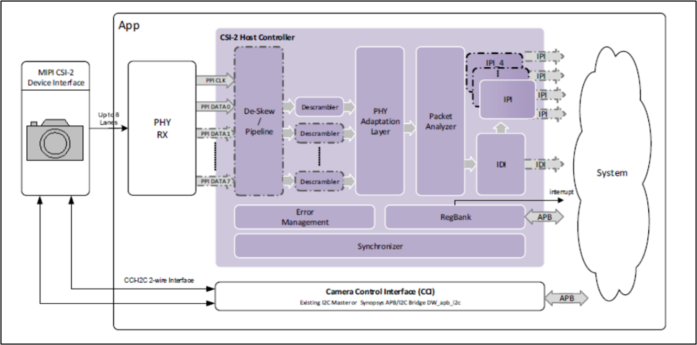
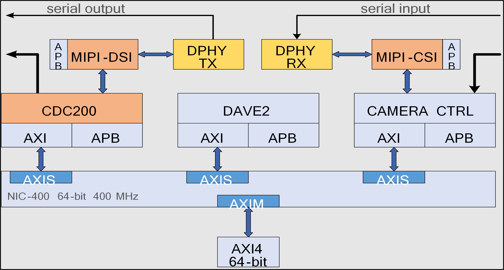
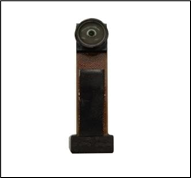
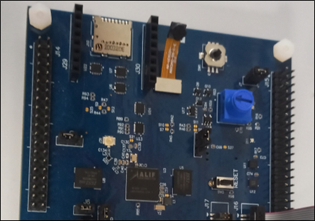
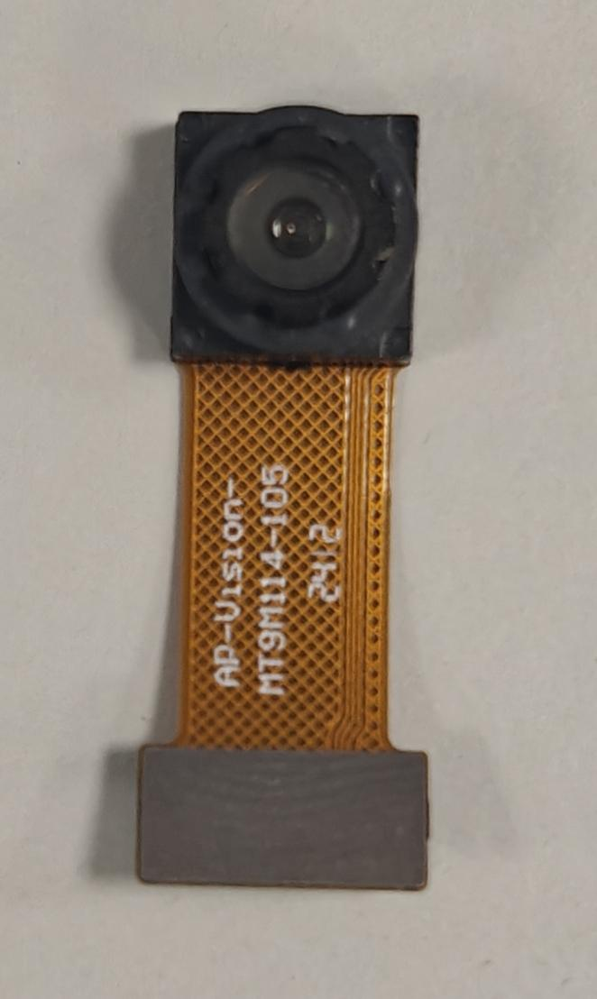
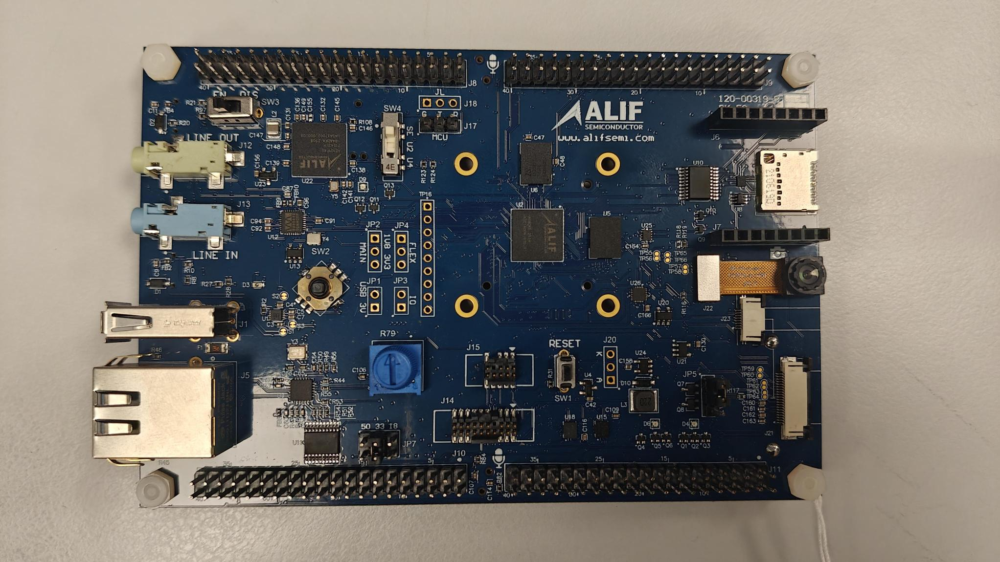

.. _mipi-camera:

===========
MIPI Camera
===========

Introduction
=============

This application note describes how to capture camera frames using the MIPI CSI-2
serial interface along with a camera sensor.

The demo application demonstrates frame capture using the following
MIPI camera sensors:

- ARX3A0 Camera Sensor
- MT9M114 Camera Sensor

Both sensors transmit image data through the MIPI CSI-2 serial interface
while sensor configuration is performed using the I2C interface.

Image Data Path::

   External MIPI Camera Sensor → MIPI DPHY RX → MIPI CSI2 → CPI → Memory

   Data Flow from MIPI CSI2 to the system

   MIPI Block Diagram

CPI (Camera Parallel Interface)
---------------------------------

The CPI IP is provided by Alif Semiconductor and serves the purpose of
capturing frames and storing them in the allocated memory area.

I2C Controller
---------------

The I2C IP is provided by Alif Semiconductor. This IP facilitates communication
between the SoC and the camera sensor.

MIPI DPHY
---------

The MIPI DPHY Physical layer receives serial input data from the camera sensor and transfers it to the MIPI CSI2 host. Key features include:

- Flexible clock configuration: 17 MHz to 52 MHz.
- Lane Operation: Data rates from 80 Mbps to 2.5 Gbps per lane in the forward direction.
- Aggregate throughput: Up to 10 Gbps with four data lanes in the forward direction.
- Maximum low-power (LP) data rate: 10 Mbps.
- PHY-Protocol Interface (PPI): Used for clock and data lanes.
- Low-power Modes: Supports low power escape modes and Ultra Low Power state.
- HS TX and RX Features: Programmable HS TX amplitude levels, automatic de-skew calibration, equalization, and offset cancellation.
- Internal Pattern Checker for testing and verification.

MIPI CSI2
---------

MIPI CSI2 unpacks serial input data based on the configured pixel data type, conveying pixels and generating timed video synchronization signals via the Image Pixel Interface (IPI). Notable features include:

- Combo PHY Support: Utilizes four RX data lanes on D-PHY.
- High Data Rate: Up to 2.5 Gbps per lane in D-PHY.
- Data Format Flexibility: Supports YUV, RGB, RAW, and user-defined byte-based data.
- Error Detection and Correction: Robust mechanisms at PHY, packet, line, and frame levels.

ARX3A0 Camera Sensor
=======================

The ARX3A0 camera sensor, with a 1/10th-inch optical format, is compact and energy-efficient, ideal for IoT devices.

Hardware Requirements and Setup
--------------------------------

- Alif Devkit
- Debugger: JLink
- ARX3A0 Camera Sensor (IAS1MOD-ARX3A0CSSC090110-GEVB)

Camera Sensor Support
-----------------------

.. note::

   The ARX3A0 camera sensor interfaces via MIPI-CSI (serial interface) and is supported on the following DevKits:

   - DevKit E7
   - DevKit E8

Features
----------

- Active resolution: 560 x 560 pixels
- Frame rate: Up to 360 frames per second
- Compact 1/10th-inch optical format
- Energy-efficient design ideal for IoT devices

Hardware Connections and Setup
------------------------------

   ARX3A0 Sensor

.. figure:: _static/arx3a0_connections.png
   :alt: ARX3A0 Sensor and DevKit Board Connection
   :align: center

   ARX3A0 Sensor and DevKit Connection

   DevKit

Required Config Features
--------------------------

- ``CONFIG_VIDEO=y``
- ``CONFIG_VIDEO_MIPI_CSI2_DW=y``
- ``CONFIG_LOG=y``
- ``CONFIG_PRINTK=y``
- ``CONFIG_STDOUT_CONSOLE=y``
- ``CONFIG_I2C_TARGET=y``
- ``CONFIG_I2C=y``
- ``CONFIG_I2C_DW_CLOCK_SPEED=100``

Software Requirements
-----------------------

- **Alif SDK**: Clone from `https://github.com/alifsemi/sdk-alif.git <https://github.com/alifsemi/sdk-alif.git>`_
- **West Tool**: For building Zephyr applications (refer to the `ZAS User Guide`_)
- **Arm GCC Compiler**: For compiling the application (part of the Zephyr SDK)
- **SE Tools**: For loading binaries (refer to the `ZAS User Guide`_)
- **Camera Drivers (MIPI Interface)**:
   - Alif Zephyr MIPI CSI2 Driver
   - Alif Zephyr Video Driver
   - Alif Zephyr MIPI DPHY Driver
- **ARX3A0 Camera Sensor Driver**:
   - Zephyr I2C DesignWare Driver
   - Alif Zephyr ARX3A0 Camera Sensor Driver

Selected ARX3A0 Camera Sensor Configurations
----------------------------------------------

- **Interface**: MIPI CSI2
- **Resolution**: 560x560
- **Output Format**: RAW Bayer10

Build an ARX3A0 Camera Application with Zephyr
======================================================

Follow these steps to build the ARX3A0 camera application using the Alif Zephyr SDK:

1. For instructions on fetching the Alif Zephyr SDK and navigating to the Zephyr repository, please refer to the `ZAS User Guide`_

.. note::
   The build commands shown here are specifically for the Alif E7 DevKit.
   To build the application for other boards, modify the board name in the build command accordingly. For more information, refer to the `ZAS User Guide`_, under the section Setting Up and Building Zephyr Applications.

2. Build command for application on the M55 HP core:

.. code-block:: console

   west build -p always \
     -b alif_e7_dk/ae722f80f55d5xx/rtss_hp \
     ../alif/samples/drivers/video/ \
     -- \
     -DDTC_OVERLAY_FILE="$PWD/../alif/samples/drivers/video/boards/serial_camera_arx3a0.overlay"

Executing Binary on the DevKit
--------------------------------

To execute binaries on the DevKit follow the command

.. code-block:: console

   west flash

Console Output
---------------

The following output is observed in the console for ARX3A0 sensor:

.. code-block:: text

   - Device name: cam@49030000
   - Capabilities:
     Y10P width (min, max, step)[560; 560; 0] height (min, max, step)[560; 560; 0]
   - format: Y10P 560x560
   Width - 560, Pitch - 560, Height - 560, Buff size - 313600
   - addr - 0x8000000, size - 313600, bytesused - 0
   capture buffer[0]: dump binary memory "/home/$USER/path/capture_0.bin" 0x08000000 0x0804c8ff -r
   - addr - 0x804c900, size - 313600, bytesused - 0
   capture buffer[1]: dump binary memory "/home/$USER/path/capture_1.bin" 0x0804c900 0x080991ff -r
   Capture started
   Got frame 0! size: 313600; timestamp 2285 ms
   Got frame 1! size: 313600; timestamp 2485 ms
   Got frame 2! size: 313600; timestamp 2685 ms
   Got frame 3! size: 313600; timestamp 2885 ms
   Got frame 4! size: 313600; timestamp 3085 ms
   Got frame 5! size: 313600; timestamp 3285 ms
   Got frame 6! size: 313600; timestamp 3485 ms
   Got frame 7! size: 313600; timestamp 3685 ms
   Got frame 8! size: 313600; timestamp 3885 ms
   Got frame 9! size: 313600; timestamp 4085 ms
   [00:00:04.085,000] <inf> video_app: Calling video flush.
   [00:00:04.085,000] <inf> video_app: Calling video stream stop.

Exporting and Converting Captured Images
-----------------------------------------

After capturing images, users must export the raw image data to convert it into a viewable format (e.g., RGB). The raw image data is stored in the capture buffers as shown in the console output. To export the raw image data, use the file paths provided in the console output (e.g., ``/home/$USER/path/capture_0.bin``) and transfer them to a system where image conversion can be performed.

Image Conversion from Bayer to RGB
^^^^^^^^^^^^^^^^^^^^^^^^^^^^^^^^^^^^

To convert a Bayer 10 image to RGB format for viewing, run the following command:

.. code-block:: bash

   bayer2rgb -i image_file.bin -o checking_rgb.tiff -w 560 -v 560 -b 8 -f GRBG -m SIMPLE -t

.. include:: note.rst

MT9M114 Camera Sensor
=======================

The ON Semiconductor MT9M114 is a 1/6-inch CMOS digital image sensor with an active-pixel array of 1296H x 976V.

It includes advanced camera functions such as auto exposure control, auto white balance, black level control, flicker avoidance, and defect correction, optimized for low-light conditions.

The MT9M114 is a system-on-a-chip (SoC) image sensor, programmable through a serial interface, suitable for embedded notebook, netbook, game consoles, cell phones, mobile devices, and desktop monitor cameras.

Hardware Requirements and Setup
--------------------------------

- Alif Devkit
- Debugger: JLink
- MT9M114 Camera Sensor

Camera Sensor Support
-----------------------

.. note::

   The MT9M114 camera sensor interfaces via MIPI-CSI (serial interface) and is supported on the following DevKits:

   - DevKit E7
   - DevKit E8

Hardware Connections and Setup
------------------------------

    MT9M114 Camera Sensor

    Flat Board with Standard connection

Camera GPIO Configuration (B0 Flat Board)
^^^^^^^^^^^^^^^^^^^^^^^^^^^^^^^^^^^^^^^^^^

- **P0_3**: Configured as ``CAM_XVCLK_A``.

I2C GPIO Configuration
^^^^^^^^^^^^^^^^^^^^^^^

- **P7_2**: Configured as ``I2C1_SDA_C``.
- **P7_3**: Configured as ``I2C1_SCL_C``.

Features
----------

- Superior low-light performance
- Ultra-low power
- 720p HD video at 30 fps (15 fps via MIPI CSI-2)
- Active resolution: 1280 x 720 pixels (720p HD)
- Maximum resolution: 1288 x 728 pixels (RAW)
- Output formats: RGB565, YUV422, RAW Bayer (8/10-bit)
- On-chip ISP with auto exposure, auto white balance, and defect correction
- MIPI CSI-2 interface: 1 data lane, up to 768 Mbps
- I2C control interface

Applications
-------------

- Embedded notebook, netbook, and desktop monitor cameras
- Tethered PC cameras
- Game consoles
- Cell phones, mobile devices, and consumer video communications
- Surveillance, medical, and industrial applications

Supported Resolutions and Formats
-----------------------------------

The MT9M114 driver supports multiple resolution and format combinations:

- **480x272**: RGB565, YUYV
- **640x480**: RGB565, YUYV, RAW10 (Y10P), Grayscale (GREY)
- **1280x720**: RGB565, YUYV, RAW10 (Y10P), Grayscale (GREY)
- **1288x728**: RAW10 (Y10P) - Maximum sensor resolution

Required Config Features
--------------------------

- ``CONFIG_VIDEO=y``
- ``CONFIG_VIDEO_MIPI_CSI2_DW=y``
- ``CONFIG_LOG=y``
- ``CONFIG_PRINTK=y``
- ``CONFIG_STDOUT_CONSOLE=y``
- ``CONFIG_I2C_TARGET=y``
- ``CONFIG_I2C=y``
- ``CONFIG_I2C_DW_CLOCK_SPEED=100``

Software Requirements
-----------------------

- **Alif SDK**: Clone from `https://github.com/alifsemi/sdk-alif.git <https://github.com/alifsemi/sdk-alif.git>`_
- **West Tool**: For building Zephyr applications (installed via ``pip install west``)
- **Arm GCC Compiler**: For compiling the application (part of the Zephyr SDK)
- **SE Tools (optional)**: For loading binaries (refer to Alif documentation)
- **Video Drivers (MIPI CSI-2 Interface)**:
   - Alif Zephyr MIPI CSI2 Driver
   - Alif Zephyr Video Driver
   - Alif Zephyr MIPI DPHY Driver
- **MT9M114 Camera Sensor Driver**:
   - Zephyr I2C DesignWare Driver
   - Alif Zephyr MT9M114 Camera Sensor Driver

Selected MT9M114 Camera Sensor Configurations
----------------------------------------------

- **Interface**: MIPI CSI2
- **Resolution**: 1288x728 (maximum), 1280x720, 640x480, 480x272
- **Output Formats**: RAW Bayer10 (Y10P), RGB565, YUYV, Grayscale
- **Data Lane**: Single lane operation at 768 Mbps
- **Frame Rate**: ~15 FPS at 720p

Build an MT9M114 Camera Sensor Application with Zephyr
======================================================

Follow these steps to build the MT9M114 Camera Sensor Application using the Alif Zephyr SDK:

1. For instructions on fetching the Alif Zephyr SDK and navigating to the Zephyr repository, please refer to the `ZAS User Guide`_

.. note::
   The build commands shown here are for the Alif E7 and E8 DevKits.
   To build the application for other boards, modify the board name in the build command accordingly. For more information, refer to the `ZAS User Guide`_, under the section Setting Up and Building Zephyr Applications

2. Build command for E7 DevKit (Standard CPI to AXI, HP core):

.. code-block:: console

   west build -p always \
     -b alif_e7_dk/ae722f80f55d5xx/rtss_hp \
     ../alif/samples/drivers/video \
     -DDTC_OVERLAY_FILE="$PWD/../alif/samples/drivers/video/boards/serial_camera_mt9m114.overlay" \
     -DOVERLAY_CONFIG="$PWD/../alif/samples/drivers/video/boards/serial_camera_mt9m114.conf"

3. Build command for E7 DevKit (Standard CPI to AXI, HE core):

.. code-block:: console

   west build -p always \
     -b alif_e7_dk/ae722f80f55d5xx/rtss_he \
     ../alif/samples/drivers/video \
     -DDTC_OVERLAY_FILE="$PWD/../alif/samples/drivers/video/boards/serial_camera_mt9m114.overlay" \
     -DOVERLAY_CONFIG="$PWD/../alif/samples/drivers/video/boards/serial_camera_mt9m114.conf"

4. Build command for E8 DevKit (Standard CPI to AXI, HP core):

.. code-block:: console

   west build -p always \
     -b alif_e8_dk/ae822fa0e5597xx0/rtss_hp \
     ../alif/samples/drivers/video/ \
     -DDTC_OVERLAY_FILE="$PWD/../alif/samples/drivers/video/boards/serial_camera_mt9m114_standard.overlay" \
     -DOVERLAY_CONFIG="$PWD/../alif/samples/drivers/video/boards/serial_camera_mt9m114.conf"

5. Build command for E8 DevKit (Standard CPI to AXI, HE core):

.. code-block:: console

   west build -p always \
     -b alif_e8_dk/ae822fa0e5597xx0/rtss_he \
     ../alif/samples/drivers/video/ \
     -DDTC_OVERLAY_FILE="$PWD/../alif/samples/drivers/video/boards/serial_camera_mt9m114_standard.overlay" \
     -DOVERLAY_CONFIG="$PWD/../alif/samples/drivers/video/boards/serial_camera_mt9m114.conf"

.. note::

   - Camera data flows through CPI directly to memory via AXI bus
   - The MT9M114 sensor supports both parallel and serial MIPI interfaces; these examples use the serial MIPI CSI-2 interface
   - For ISP-based selfie camera configuration with MT9M114, refer to the :ref:`isp` application note

Executing Binary on the DevKit
--------------------------------

To execute binaries on the DevKit follow the command

.. code-block:: bash

   west flash

Console Output
---------------

The following output is observed in the console for MT9M114 sensor (E8 Standard mode):

.. code-block:: text

   [00:00:00.000,000] <inf> csi2_dw: #rx_dphy_ids: 1
   [00:00:00.000,000] <inf> mt9m114: MT9M114 initialization starting...
   [00:00:00.000,000] <inf> mt9m114: Resetting sensor...
   [00:00:00.496,000] <inf> mt9m114: Sensor initialized, MIPI lanes in LP11
   *** Booting Zephyr OS build 18fd91c4661d ***
   [00:00:00.496,000] <inf> video_app: - Device name: cam@49030000
   [00:00:00.496,000] <inf> video_app: Selected camera: Standard
   [00:00:00.496,000] <inf> video_app: - Capabilities:

   [00:00:00.496,000] <inf> video_app:   RGBP width (min, max, step)[480; 480; 0] height (min, max, step)[272; 272; 0]
   [00:00:00.496,000] <inf> video_app:   YUYV width (min, max, step)[480; 480; 0] height (min, max, step)[272; 272; 0]
   [00:00:00.496,000] <inf> video_app:   RGBP width (min, max, step)[640; 640; 0] height (min, max, step)[480; 480; 0]
   [00:00:00.496,000] <inf> video_app:   YUYV width (min, max, step)[640; 640; 0] height (min, max, step)[480; 480; 0]
   [00:00:00.496,000] <inf> video_app:   Y10P width (min, max, step)[640; 640; 0] height (min, max, step)[480; 480; 0]
   [00:00:00.496,000] <inf> video_app:   GREY width (min, max, step)[640; 640; 0] height (min, max, step)[480; 480; 0]
   [00:00:00.496,000] <inf> video_app:   RGBP width (min, max, step)[1280; 1280; 0] height (min, max, step)[720; 720; 0]
   [00:00:00.496,000] <inf> video_app:   YUYV width (min, max, step)[1280; 1280; 0] height (min, max, step)[720; 720; 0]
   [00:00:00.496,000] <inf> video_app:   Y10P width (min, max, step)[1288; 1288; 0] height (min, max, step)[728; 728; 0]
   [00:00:00.496,000] <inf> video_app:   GREY width (min, max, step)[1280; 1280; 0] height (min, max, step)[720; 720; 0]
   [00:00:00.564,000] <inf> dphy_dw: RX-DDR clock: 384000000
   [00:00:00.565,000] <inf> video_app: - format: Y10P 1288x728
   [00:00:00.565,000] <inf> video_app: Width - 1288, Pitch - 2576, Height - 728, Buff size - 1875328
   [00:00:00.565,000] <inf> video_app: - addr - 0x2000068, size - 1875328, bytesused - 0, resolution - 1288x728
   [00:00:00.599,000] <inf> video_app: capture buffer[0]: dump binary memory "/home/$USER/capture_0.bin" 0x02000068 0x021c9de7 -r

   [00:00:00.599,000] <inf> video_app: - addr - 0x21c9df0, size - 1875328, bytesused - 0, resolution - 1288x728
   [00:00:00.633,000] <inf> video_app: capture buffer[1]: dump binary memory "/home/$USER/capture_1.bin" 0x021c9df0 0x02393b6f -r

   [00:00:07.635,000] <inf> video_app: Capture started
   [00:00:07.745,000] <inf> video_app: Got frame 0! size: 1875328; timestamp 7745 ms
   [00:00:07.745,000] <inf> video_app: FPS: 0.0
   [00:00:07.811,000] <inf> video_app: Got frame 1! size: 1875328; timestamp 7811 ms
   [00:00:07.811,000] <inf> video_app: FPS: 15.151515
   [00:00:07.878,000] <inf> video_app: Got frame 2! size: 1875328; timestamp 7878 ms
   [00:00:07.878,000] <inf> video_app: FPS: 14.925373
   [00:00:07.945,000] <inf> video_app: Got frame 3! size: 1875328; timestamp 7945 ms
   [00:00:07.945,000] <inf> video_app: FPS: 14.925373
   [00:00:08.011,000] <inf> video_app: Got frame 4! size: 1875328; timestamp 8011 ms
   [00:00:08.011,000] <inf> video_app: FPS: 15.151515
   [00:00:08.078,000] <inf> video_app: Got frame 5! size: 1875328; timestamp 8078 ms
   [00:00:08.078,000] <inf> video_app: FPS: 14.925373
   [00:00:08.145,000] <inf> video_app: Got frame 6! size: 1875328; timestamp 8145 ms
   [00:00:08.145,000] <inf> video_app: FPS: 14.925373
   [00:00:08.211,000] <inf> video_app: Got frame 7! size: 1875328; timestamp 8211 ms
   [00:00:08.211,000] <inf> video_app: FPS: 15.151515
   [00:00:08.278,000] <inf> video_app: Got frame 8! size: 1875328; timestamp 8278 ms
   [00:00:08.278,000] <inf> video_app: FPS: 14.925373
   [00:00:08.345,000] <inf> video_app: Got frame 9! size: 1875328; timestamp 8345 ms
   [00:00:08.345,000] <inf> video_app: FPS: 14.925373
   [00:00:08.345,000] <inf> video_app: Calling video flush.
   [00:00:08.345,000] <inf> video_app: Calling video stream stop.

.. note::

   The MT9M114 sensor captures at 1288x728 resolution in RAW10 (Y10P) format with a frame rate of approximately 15 FPS. The buffer size is 1,875,328 bytes per frame, which accommodates the maximum resolution output.

Exporting and Converting Captured Images
-----------------------------------------

After capturing images, users must export the raw image data to convert it into a viewable format (e.g., RGB). The raw image data is stored in the capture buffers as shown in the console output. To export the raw image data, use the file paths provided in the console output (e.g., ``/home/$USER/capture_0.bin``) and transfer them to a system where image conversion can be performed.

Image Conversion from Bayer to RGB
^^^^^^^^^^^^^^^^^^^^^^^^^^^^^^^^^^^^

To convert a RAW10 (Y10) image to RGB format for viewing, run the following command:

.. code-block:: console

   ./raw2rgbpnm -s 1288x728 -f Y10 input_image.bin output_image.pnm

Interpretation
==============

ARX3A0 Sensor
-------------

- The device is successfully communicating through the `/dev/ttyACM1` serial port.
- The Zephyr OS (build 94f6e05fad28) is booting.
- The `alif_video` driver, `alif_video_csi2` driver, `arx3a0` driver, and `i2c_dw` driver were successfully verified.
- The video capture process was completed successfully.

MT9M114 Sensor
--------------

- The MT9M114 sensor initializes successfully with MIPI lanes in LP11 (low-power) mode
- The sensor supports multiple resolutions and formats as shown in the capabilities output
- DPHY RX-DDR clock operates at 384 MHz (768 Mbps data rate)
- Video capture operates at ~15 FPS with consistent frame delivery
- The `mt9m114` driver, `csi2_dw` driver, `dphy_dw` driver, and `alif_video` driver were successfully verified
- Frame size of 1,875,328 bytes accommodates the 1288x728 RAW10 format

References and Dependencies
===========================

The reference image captured using the Camera Controller and ARX3A0 Camera Sensor is shown below:

.. figure:: _static/reference_image_capured_by_mipi_camera.png
   :alt: Reference Image
   :align: center

   Reference Image Captured using the Camera Controller and ARX3A0 Camera Sensor