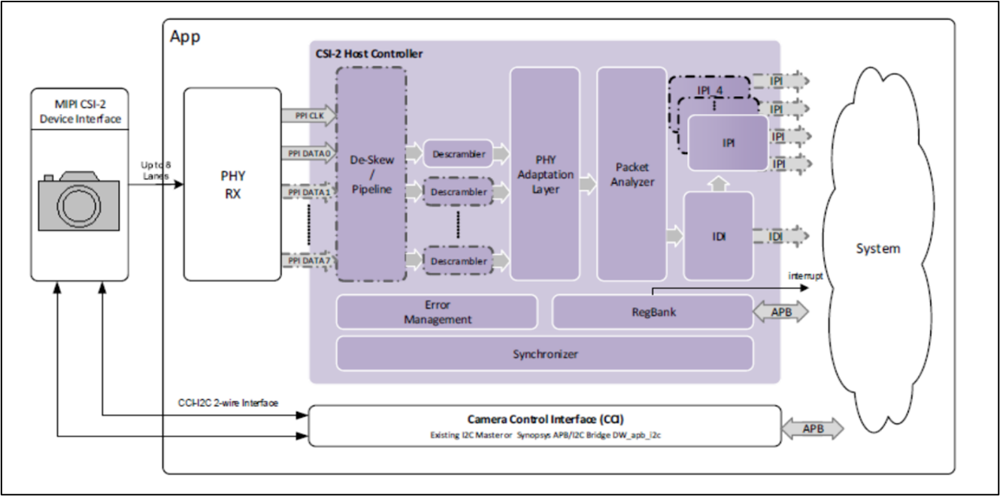
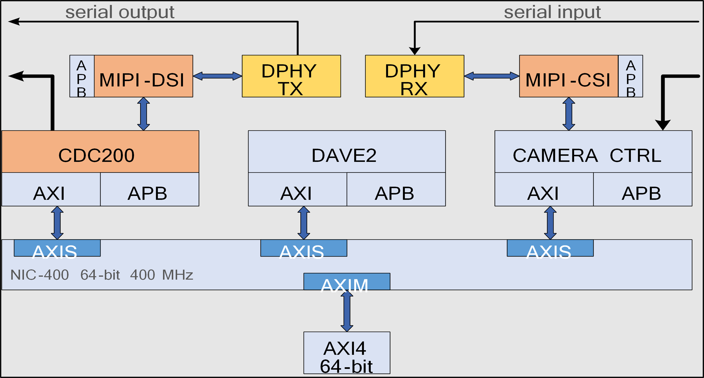
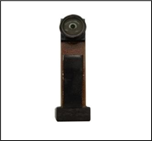
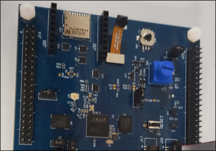
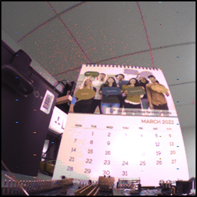

.. _mipi-camera:

===========
MIPI Camera
===========

Introduction
============

This document explains how to create, compile, and run a demo application for the MIPI Camera interface provided by Alif Semiconductor™ and integrated into Ensemble™ devices.

Overview
--------

The MIPI camera is utilized for transmitting pixel data in a serial format. The camera sensor (ARX3A0) transmits pixel data to the DPHY-RX, which transfers it through the PHY Protocol Interface (PPI) to the MIPI CSI2 host. MIPI CSI2 unpacks the pixel data and forwards it through the Image Pixel Interface (IPI). The Camera Pixel Interface (CPI) receives the pixel data from IPI and stores it in memory via the AXI bus.

   Data Flow from MIPI CSI2 to the system

**Image Data Path**: External Camera → MIPI DPHY RX → MIPI CSI → CPI → Memory

   MIPI Block Diagram

Hardware Requirements and Setup
===============================

Hardware Requirements
---------------------

- **Alif Ensemble DevKit (B0 Flat Board, E7)**
- **ARX3A0 Camera Sensor (IAS1MOD-ARX3A0CSSC090110-GEVB)**
- Support on E7 only.

CPI (Camera Parallel Interface)
-------------------------------

The CPI IP, provided by Alif Semiconductor, captures frames and stores them in the allocated memory area, facilitating efficient data transfer between the camera sensor and memory.

I2C Controller
--------------

The I2C IP enables communication between the system-on-chip (SoC) and the ARX3A0 Camera Sensor.

MIPI DPHY
---------

The MIPI DPHY Physical layer receives serial input data from the camera sensor and transfers it to the MIPI CSI2 host. Key features include:

- Flexible clock configuration: 17 MHz to 52 MHz.
- Lane Operation: Data rates from 80 Mbps to 2.5 Gbps per lane in the forward direction.
- Aggregate throughput: Up to 10 Gbps with four data lanes in the forward direction.
- Maximum low-power (LP) data rate: 10 Mbps.
- PHY-Protocol Interface (PPI): Used for clock and data lanes.
- Low-power Modes: Supports low power escape modes and Ultra Low Power state.
- HS TX and RX Features: Programmable HS TX amplitude levels, automatic de-skew calibration, equalization, and offset cancellation.
- Internal Pattern Checker for testing and verification.

MIPI CSI2
---------

MIPI CSI2 unpacks serial input data based on the configured pixel data type, conveying pixels and generating timed video synchronization signals via the Image Pixel Interface (IPI). Notable features include:

- Combo PHY Support: Utilizes four RX data lanes on D-PHY.
- High Data Rate: Up to 2.5 Gbps per lane in D-PHY.
- Data Format Flexibility: Supports YUV, RGB, RAW, and user-defined byte-based data.
- Error Detection and Correction: Robust mechanisms at PHY, packet, line, and frame levels.

ARX3A0 Camera Sensor
--------------------

The ARX3A0 camera sensor, with a 1/10th-inch optical format, is compact and energy-efficient, ideal for IoT devices. It features:

- Active resolution: 560 x 560 pixels.
- Frame rate: Up to 360 frames per second.

   ARX3A0 Sensor

.. figure:: _static/arx3a0_connections.png
   :alt: ARX3A0 Sensor and Flat Board Connection
   :align: center

   ARX3A0 Sensor and Flat Board Connection

   Flat Board

Required Configuration Features
===============================

- ``CONFIG_VIDEO=y``
- ``CONFIG_VIDEO_MIPI_CSI2_DW=y``
- ``CONFIG_LOG=y``
- ``CONFIG_PRINTK=y``
- ``CONFIG_STDOUT_CONSOLE=y``
- ``CONFIG_I2C_TARGET=y``
- ``CONFIG_I2C=y``
- ``CONFIG_I2C_DW_CLOCK_SPEED=100``
- ``CONFIG_MT9M114_PARALLEL_INIT=n``
- ``CONFIG_FB_USES_DTCM_REGION=n`` (needed for E7)

Software Requirements
=====================

To run the MIPI camera application, the following software components and drivers are required:

1. **Camera Drivers (MIPI Interface)**:
   - Alif Zephyr MIPI CSI2 Driver
   - Alif Zephyr Video Driver
   - Alif Zephyr MIPI DSI Driver
   - Alif Zephyr MIPI DPHY Driver
2. **ARX3A0 Camera Sensor Driver**:
   - Zephyr I2C DesignWare Driver
   - Alif Zephyr ARX3A0 Camera Sensor Driver

Selected ARX3A0 Camera Sensor Configurations
============================================

- **Interface**: MIPI CSI2
- **Resolution**: 560x560
- **Output Format**: RAW Bayer10

Exporting and Converting Captured Images
========================================

After capturing images, users must export the raw image data to convert it into a viewable format (e.g., RGB). The raw image data is stored in the capture buffers as shown in the console output. To export the raw image data, use the file paths provided in the console output (e.g., ``/home/$USER/path/capture_0.bin``) and transfer them to a system where image conversion can be performed.

Image Conversion from Bayer to RGB
----------------------------------

To convert a Bayer 10 image to RGB format for viewing, run the following command:

.. code-block:: bash

   bayer2rgb -i image_file.bin -o checking_rgb.tiff -w 560 -v 560 -b 8 -f GRBG -m SIMPLE -t

Building the MIPI Camera Application
====================================

Follow these steps to build your Zephyr-based MIPI camera application using the GCC compiler and the Alif Zephyr SDK:

.. note::
   The application is designed for the Alif Ensemble E7 DevKit. Modify the sample code as needed for other DevKits.

1. For instructions on fetching the Alif Zephyr SDK and navigating to the Zephyr repository, please refer to the `ZAS User Guide`_

2. Build the application:

.. code-block:: bash

   west build -b alif_e7_dk_rtss_hp ../alif/samples/drivers/video/ -DDTC_OVERLAY_FILE=../alif/samples/drivers/video/boards/serial_camera_arx3a0.overlay -p always

Executing Binary on the DevKit
==============================

To execute binaries on the DevKit, follow these steps:

1. Open the **Debug Configuration** window using the *Create, manage, and run configurations* option.

   .. figure:: _static/debug_config_window.png
      :alt: Debug Configuration Window
      :align: center

      Debug Configuration Window

2. In the **Connection** tab, ensure the correct Core and ULINKpro selections are made. In the **Select Target** section, choose:

   - ``Cortex-M55_0`` for M55-HP core

   .. figure:: _static/connections_tab.png
      :alt: Connection Tab Settings
      :align: center

      Connection Tab Settings

3. In the **Debugger** tab:

   - Select **Connect Only**.
   - Use the ``loadfile`` command to specify the path to the application’s ``.elf`` file.
   - Click the **Debug** symbol to load debugging information.
   - Click **Apply** and then **Debug** to start the debugging process.

   .. figure:: _static/debugger_tab.png
      :alt: Debugger Tab Settings
      :align: center

      Debugger Tab Settings

Console Output
==============

The following output is observed in the console:

.. code-block:: text

   *** Booting Zephyr OS build 94f6e05fad28 ***
   - Device name: cam@49030000
   - Capabilities:
     Y10P width (min, max, step)[560; 560; 0] height (min, max, step)[560; 560; 0]
   - format: Y10P 560x560
   Width - 560, Pitch - 560, Height - 560, Buff size - 313600
   - addr - 0x8000000, size - 313600, bytesused - 0
   capture buffer[0]: dump binary memory "/home/$USER/path/capture_0.bin" 0x08000000 0x0804c8ff -r
   - addr - 0x804c900, size - 313600, bytesused - 0
   capture buffer[1]: dump binary memory "/home/$USER/path/capture_1.bin" 0x0804c900 0x080991ff -r
   Capture started
   Got frame 0! size: 313600; timestamp 2285 ms
   Got frame 1! size: 313600; timestamp 2485 ms
   Got frame 2! size: 313600; timestamp 2685 ms
   Got frame 3! size: 313600; timestamp 2885 ms
   Got frame 4! size: 313600; timestamp 3085 ms
   Got frame 5! size: 313600; timestamp 3285 ms
   Got frame 6! size: 313600; timestamp 3485 ms
   Got frame 7! size: 313600; timestamp 3685 ms
   Got frame 8! size: 313600; timestamp 3885 ms
   Got frame 9! size: 313600; timestamp 4085 ms
   [00:00:04.085,000] <inf> video_app: Calling video flush.
   [00:00:04.085,000] <inf> video_app: Calling video stream stop.

Interpretation
==============

- The device is successfully communicating through the `/dev/ttyACM1` serial port.
- The Zephyr OS (build 94f6e05fad28) is booting.
- The `alif_video` driver, `alif_video_csi2` driver, `arx3a0` driver, and `i2c_dw` driver were successfully verified.
- The video capture process was completed successfully.

References and Dependencies
===========================

The reference image captured using the Camera Controller and ARX3A0 Camera Sensor is shown below:

   Reference Image Captured using the Camera Controller and ARX3A0 Camera Sensor