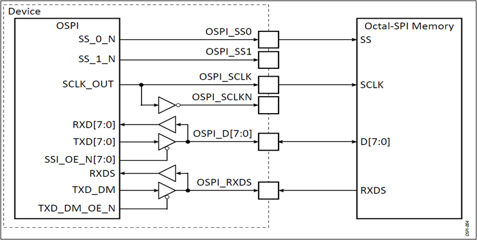

.. _ospi_flash:

==========
OSPI Flash
==========

Introduction
============

The Alif DevKit features a 32MB ISSI Flash (IS25WX256) connected to the Octal SPI 1 (OSPI1) controller. This application note describes how to read from and write to the flash using the Alif Semiconductor Zephyr SDK. The flash driver implements Zephyr's standard flash APIs for erasing, reading, and writing to the flash.

   Block Diagram of OSPI1 Connected to Flash

Required Software
=================

To run the Zephyr OSPI application, the following software and drivers are required:

- Arm DS IDE version 2021.0 or later
- Alif Zephyr SDK, including:

  - Flash Driver
  - OSPI Controller Driver (via HAL)
  - Sample Application

Application Description
=======================

This document covers the demo application for the Alif DevKit:

**Flash Demo Application**: Demonstrates the Zephyr Standard Flash API implementation on the Alif DevKit.

.. note::
   For more details, refer to the `Zephyr Flash API Reference <https://docs.zephyrproject.org/latest/reference/peripherals/flash.html>`_.

Hardware Details
================

Hardware Requirements
---------------------

- Alif DevKit

Hardware Connections
--------------------

The ISSI Flash is connected to the DevKit via the OSPI1 interface. No additional connections are required.

Building the OSPI Flash Application
===================================

Follow these steps to build the Zephyr-based OSPI Flash application using the GCC compiler and the Alif Zephyr SDK:

.. note::
   The application is designed for the Alif Ensemble E7 DevKit. Modify the sample code as needed for other DevKits.

1. For instructions on fetching the Alif Zephyr SDK and navigating to the Zephyr repository, please refer to the `ZAS User Guide`_

2. Remove the existing build directory and build the OSPI Flash application:

   .. code-block:: bash

      rm -rf build
      west build -b alif_e7_dk_rtss_hp/he ../alif/samples/drivers/ospi_flash -p

3. Access the output and binary files in the ``./build/zephyr/`` directory.

Executing Binary on the DevKit
==============================

To execute the binary on the DevKit board:

1. Open the **Debug Configurations** window in Arm DS IDE using the *Create, manage, and run configurations* option.

   .. note::
      The configuration name (e.g., "M55_HE_I2S_Zephyr") is customizable.

   .. figure:: _static/debug_config_window.png
      :alt: Debug Configurations Window
      :align: center

      Debug Configurations Window

2. In the **Connection** tab, verify the correct Core and settings are selected, as shown in the reference image.

   .. figure:: _static/connections_tab.png
      :alt: Connection Tab Settings
      :align: center

      Connection Tab Settings

3. In the **Debugger** tab:

   - Select **Debug from entry point** or **Debug from symbol** based on the debugging type.
   - Use the ``loadfile`` command to specify the path to the application’s ``.elf`` file.
   - Click **Debug** to load debugging information.
   - Click **Apply**, then **Debug** to start debugging.

   .. figure:: _static/debugger_tab.png
      :alt: Debugger Tab Settings
      :align: center

      Debugger Tab Settings

Validating OSPI Flash
=====================

Output Logs
-----------

The following logs demonstrate the OSPI Flash functionality:

.. code-block:: bash

   **** Flash Configured Parameters ****
   * Num Of Sectors: 16384
   * Sector Size: 4096
   * Page Size: 4096
   * Erase Value: 255
   * Write Block Size: 1
   * Total Size in MB: 32

   Test 1: Flash Erase
   Flash erase succeeded!

   Test 1: Flash Write
   Attempting to write 4 bytes
   Data written successfully.

   Test 1: Flash Read
   Data read matches data written. Good!

   Test 2: Flash Full Erase
   Successfully erased entire flash memory.
   Total errors after reading erased chip: 0

   Test 3: Flash Erase
   Flash erase succeeded!

   Test 3: Flash Write
   Attempting to write 1024 bytes
   Data written successfully.

   Test 3: Flash Read
   Data read matches data written. Good!

   Test 4: Write Sector 16384
   Data written successfully.

   Test 4: Write Sector 20480
   Data written successfully.

   Test 4: Read and Verify Sector 16384
   Data read matches data written. Good!

   Test 4: Read and Verify Sector 20480
   Data read matches data written. Good!

   Test 4: Erase Sectors 16384 and 20480
   Flash erase from sector 16384, size 8192 bytes.
   Multi-sector erase succeeded!

   Test 4: Read Sector 16384
   Total errors after reading erased sector: 0

   Test 4: Read Sector 20480
   Total errors after reading erased sector: 0

   Multi-Sector Erase Test Succeeded!

   Test 5: XiP Read
   Content read from OSPI Flash in XiP mode successfully.
   Read from flash command while XiP mode enabled.
   XiP Read Test Succeeded!