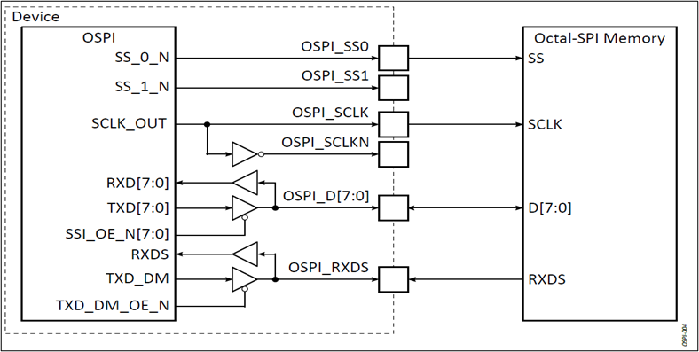

.. _ospi_flash:

==========
OSPI Flash
==========

Introduction
============

The Alif DevKit features a 32MB ISSI Flash (IS25WX256) connected to the Octal SPI1 (OSPI1) controller. This application note describes how to read from and write to the flash using the Alif Zephyr SDK. The flash driver implements Zephyr's standard flash APIs for erasing, reading, and writing to the flash.

   Block Diagram of OSPI1 Connected to Flash

.. note::

   Current Alif DevKit variants support two types of OSPI flash devices:

   1. **ISSI OSPI Flash (IS25WX256)**
   2. **Macronix Flash (MX66UW)** – This flash device is supported only on the **E8 AppKit**, while the remaining DevKit variants use **ISSI flash**.

Application Description
=======================

This document covers the demo application for the Alif DevKit:

**Flash Demo Application**: Demonstrates the Zephyr Standard Flash API implementation on the Alif DevKit.

.. note::
   For more details, refer to the `Zephyr Flash API Reference <https://docs.zephyrproject.org/latest/reference/peripherals/flash.html>`_.

.. include:: prerequisites.rst

Hardware Connections
--------------------

The ISSI Flash is connected to the DevKit via the OSPI1 interface. No additional connections are required.

.. include:: note.rst

Build an OSPI Flash Application with Zephyr
================================================

Follow these steps to build the OSPI Flash application using the Alif Zephyr SDK:

For instructions on fetching the Alif Zephyr SDK and navigating to the Zephyr
repository, refer to the `ZAS User Guide`_.

Alif E7 DevKit
----------------

Build for SoC variant ``ae722f80f55d5xx``, M55 HE core:

.. code-block:: console

   west build -p always \
     -b alif_e7_dk/ae722f80f55d5xx/rtss_he \
     -S ospi-flash \
     ../alif/samples/drivers/spi_flash

Build for SoC variant ``ae722f80f55d5xx``, M55 HP core:

.. code-block:: console

   west build -p always \
     -b alif_e7_dk/ae722f80f55d5xx/rtss_hp \
     -S ospi-flash \
     ../alif/samples/drivers/spi_flash

Build for SoC variant ``ae302f80f55d5xx``, M55 HE core:

.. code-block:: console

   west build -p always \
     -b alif_e7_dk/ae302f80f55d5xx/rtss_he \
     -S ospi-flash \
     ../alif/samples/drivers/spi_flash

Build for SoC variant ``ae302f80f55d5xx``, M55 HP core:

.. code-block:: console

   west build -p always \
     -b alif_e7_dk/ae302f80f55d5xx/rtss_hp \
     -S ospi-flash \
     ../alif/samples/drivers/spi_flash

Alif E7 AppKit
----------------

Build for SoC variant ``ae722f80f55d5xx``, M55 HE core:

.. code-block:: console

   west build -p always \
     -b alif_e7_ak/ae722f80f55d5xx/rtss_he \
     -S ospi-flash \
     ../alif/samples/drivers/spi_flash

Build for SoC variant ``ae722f80f55d5xx``, M55 HP core:

.. code-block:: console

   west build -p always \
     -b alif_e7_ak/ae722f80f55d5xx/rtss_hp \
     -S ospi-flash \
     ../alif/samples/drivers/spi_flash

Alif E8 DevKit
----------------

Build for SoC variant ``ae822fa0e5597xx0``, M55 HE core:

.. code-block:: console

   west build -p always \
     -b alif_e8_dk/ae822fa0e5597xx0/rtss_he \
     -S ospi-flash \
     ../alif/samples/drivers/spi_flash

Build for SoC variant ``ae822fa0e5597xx0``, M55 HP core:

.. code-block:: console

   west build -p always \
     -b alif_e8_dk/ae822fa0e5597xx0/rtss_hp \
     -S ospi-flash \
     ../alif/samples/drivers/spi_flash

Build for SoC variant ``ae402fa0e5597xx0``, M55 HE core:

.. code-block:: console

   west build -p always \
     -b alif_e8_dk/ae402fa0e5597xx0/rtss_he \
     -S ospi-flash \
     ../alif/samples/drivers/spi_flash

Build for SoC variant ``ae402fa0e5597xx0``, M55 HP core:

.. code-block:: console

   west build -p always \
     -b alif_e8_dk/ae402fa0e5597xx0/rtss_hp \
     -S ospi-flash \
     ../alif/samples/drivers/spi_flash

Alif E8 AppKit
----------------

Build for SoC variant ``ae822fa0e5597xx0``, M55 HE core:

.. code-block:: console

   west build -p always \
     -b alif_e8_ak/ae822fa0e5597xx0/rtss_he \
     -S ospi-flash \
     ../alif/samples/drivers/spi_flash

Build for SoC variant ``ae822fa0e5597xx0``, M55 HP core:

.. code-block:: console

   west build -p always \
     -b alif_e8_ak/ae822fa0e5597xx0/rtss_hp \
     -S ospi-flash \
     ../alif/samples/drivers/spi_flash

Alif E1C DevKit
----------------

Build for SoC variant ``ae1c1f4051920hh``, M55 HE core:

.. code-block:: console

   west build -p always \
     -b alif_e1c_dk/ae1c1f4051920hh/rtss_he \
     -S ospi-flash \
     ../alif/samples/drivers/spi_flash

Alif B1 DevKit
---------------

Build for SoC variant ``ab1c1f4m51820ph0``, M55 HE core:

.. code-block:: console

   west build -p always \
     -b alif_b1_dk/ab1c1f4m51820ph0/rtss_he \
     -S ospi-flash \
     ../alif/samples/drivers/spi_flash

Build for SoC variant ``ab1c1f4m51820hh0``, M55 HE core:

.. code-block:: console

   west build -p always \
     -b alif_b1_dk/ab1c1f4m51820hh0/rtss_he \
     -S ospi-flash \
     ../alif/samples/drivers/spi_flash

Build for SoC variant ``ab1c1f1m41820hh0``, M55 HE core:

.. code-block:: console

   west build -p always \
     -b alif_b1_dk/ab1c1f1m41820hh0/rtss_he \
     -S ospi-flash \
     ../alif/samples/drivers/spi_flash

Build for SoC variant ``ab1c1f1m41820ph0``, M55 HE core:

.. code-block:: console

   west build -p always \
     -b alif_b1_dk/ab1c1f1m41820ph0/rtss_he \
     -S ospi-flash \
     ../alif/samples/drivers/spi_flash

Once the build command completes successfully, executable images will be generated and placed in the ``build/zephyr`` directory. Both ``.bin`` (binary) and ``.elf`` (Executable and Linkable Format) files will be available.

.. note::

   To enable XIP (Execute In Place) support for OSPI Flash, add the
   following configuration:

   -DCONFIG_ALIF_OSPI_FLASH_XIP=y

   This configuration enables XIP support for the OSPI Flash module.

Executing Binary on the DevKit
===============================

To execute binaries on the DevKit, follow the command:

.. code-block:: console

   west flash

Console Output
=================

The following logs demonstrate the OSPI Flash functionality:

.. code-block:: text

   **** Flash Configured Parameters ****
   * Num Of Sectors: 16384
   * Sector Size: 4096
   * Page Size: 4096
   * Erase Value: 255
   * Write Block Size: 1
   * Total Size in MB: 32

   Test 1: Flash Erase
   Flash erase succeeded!

   Test 1: Flash Write
   Attempting to write 4 bytes
   Data written successfully.

   Test 1: Flash Read
   Data read matches data written. Good!

   Test 2: Flash Full Erase
   Successfully erased entire flash memory.
   Total errors after reading erased chip: 0

   Test 3: Flash Erase
   Flash erase succeeded!

   Test 3: Flash Write
   Attempting to write 1024 bytes
   Data written successfully.

   Test 3: Flash Read
   Data read matches data written. Good!

   Test 4: Write Sector 16384
   Data written successfully.

   Test 4: Write Sector 20480
   Data written successfully.

   Test 4: Read and Verify Sector 16384
   Data read matches data written. Good!

   Test 4: Read and Verify Sector 20480
   Data read matches data written. Good!

   Test 4: Erase Sectors 16384 and 20480
   Flash erase from sector 16384, size 8192 bytes.
   Multi-sector erase succeeded!

   Test 4: Read Sector 16384
   Total errors after reading erased sector: 0

   Test 4: Read Sector 20480
   Total errors after reading erased sector: 0

   Multi-Sector Erase Test Succeeded!

   Test 5: XIP Read
   Content read from OSPI Flash in XiP mode successfully.
   Read from flash command while XiP mode enabled.
   XiP Read Test Succeeded!
