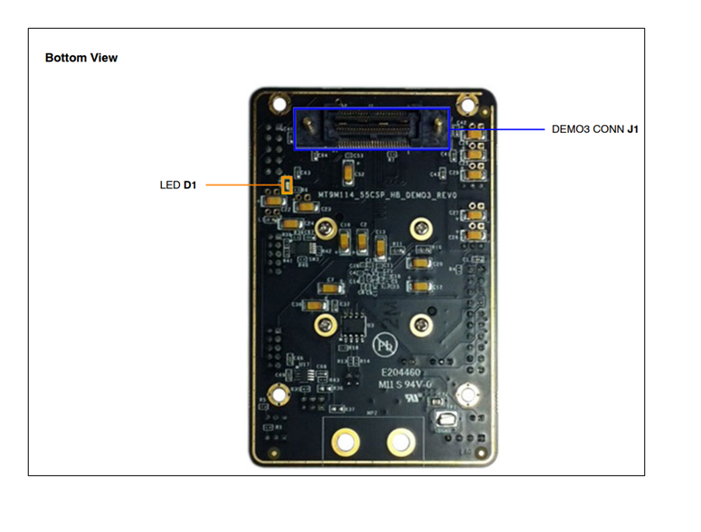
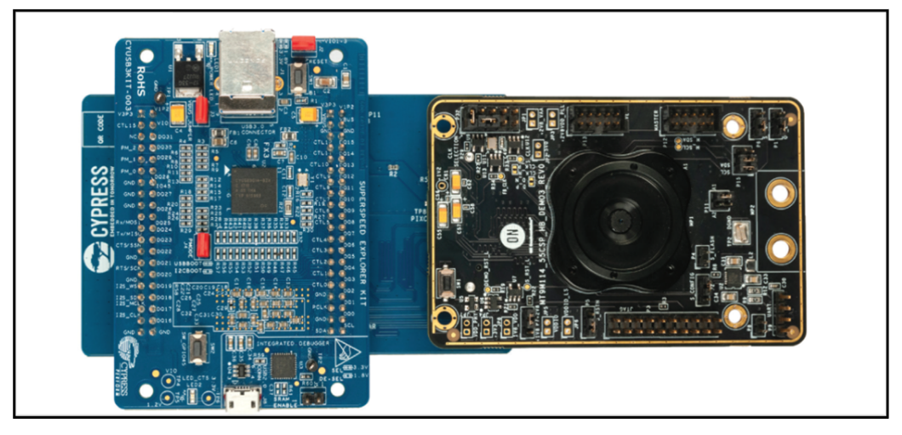
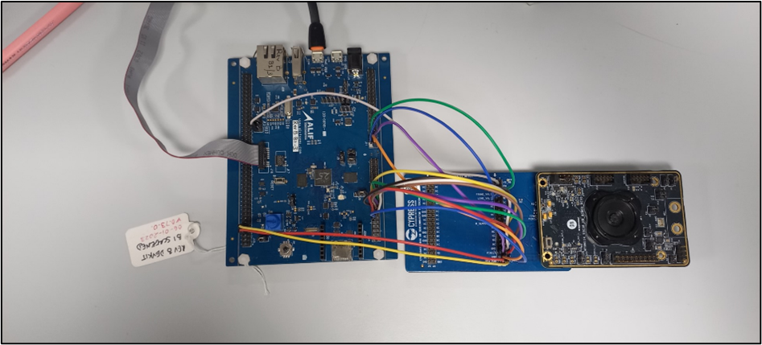
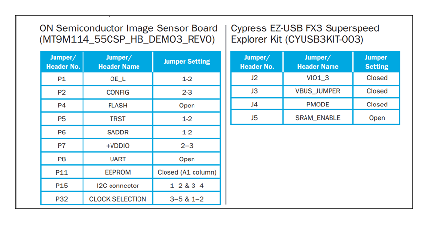
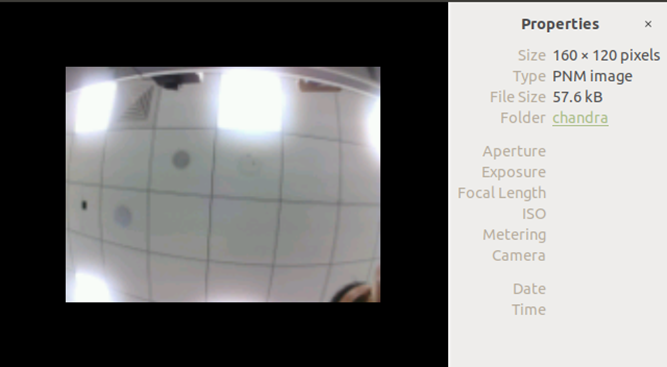

.. _parallel-camera:

===============
Parallel Camera
===============

Introduction
============

This document describes how to capture camera frames using the LPCAM/CAM instances of the video driver (Parallel Interface) along with a camera sensor. The demo application utilizes the MT9M114 camera sensor.

Image Data Path
---------------

**Image Data Path**: External Parallel Camera Sensor → CPI → Memory

Hardware Requirements and Setup
===============================

Hardware Requirements
---------------------

- **Alif Ensemble DevKit (B0 Flat Board, E7)**
- **MT9M114 Camera Sensor**
- **Cypress Interconnect Board (CYUSB3ACC-004A)**
- Supported on E7, E1C, B1DK boards.

CPI
---

The CPI IP, provided by Alif Semiconductor, captures frames and stores them in the allocated memory area.

I2C Controller
--------------

The I2C IP, provided by Alif Semiconductor, facilitates communication between the SoC and the MT9M114 Camera Sensor.

MT9M114 Camera Sensor
---------------------

The ON Semiconductor MT9M114 is a 1/6-inch 1.26 MP CMOS digital image sensor with an active-pixel array of 1296H x 976V. It includes advanced camera functions such as auto exposure control, auto white balance, black level control, flicker avoidance, and defect correction, optimized for low-light conditions. The MT9M114 is a system-on-a-chip (SoC) image sensor, programmable through a serial interface, suitable for embedded notebook, netbook, game consoles, cell phones, mobile devices, and desktop monitor cameras.

**Features**:
- Superior low-light performance
- Ultra-low power
- 720p HD video at 30 fps

**Applications**:
- Embedded notebook, netbook, and desktop monitor cameras
- Tethered PC cameras
- Game consoles
- Cell phones, mobile devices, and consumer video communications
- Surveillance, medical, and industrial applications

Hardware Connections and Setup
------------------------------

   Bottom View of the Board Connector

.. note::
   The demo application uses the Cypress Interconnect Board (CYUSB3ACC-004A) to establish connections between the MT9M114 Camera Sensor and the Alif SoC.

   Cypress Interconnect Board Connecting MT9M114_Camera_Sensor to Alif SoC

Refer to *CYUSB3ACC-004A Interconnect Board for ON Semiconductor Image Sensor* for jumper and pin connection details.

   Connecting Image Sensor Board to CYUSB3ACC-004A Board

Set up the jumper connections as shown below:

   Jumper Connections Table

Required Config Features
========================

- ``CONFIG_VIDEO=y``
- ``CONFIG_VIDEO_MIPI_CSI2_DW=n``
- ``CONFIG_LOG=y``
- ``CONFIG_PRINTK=y``
- ``CONFIG_STDOUT_CONSOLE=y``
- ``CONFIG_I2C_TARGET=y``
- ``CONFIG_I2C=y``
- ``CONFIG_I2C_DW_CLOCK_SPEED=100``
- ``CONFIG_MT9M114_PARALLEL_INIT=y``
- ``CONFIG_FB_USES_DTCM_REGION=y`` (needed for E1C)

Required Device Tree Changes
============================

**If testing with LPCAM instance**:
- Enable the LPCAM node.
- In the `i2c1` node, enable the `mt9m114` sub-node and uncomment the `lpcam` remote endpoint.
- Disable the `cam` node.

**If testing with CAM instance**:
- Enable the `cam` node.
- In the `i2c1` node, enable the `mt9m114` sub-node and uncomment the `cam` remote endpoint.

Software Requirements
=====================

Below is a list of required software and drivers needed to run the LPCAM/CAM application:

- **Video Drivers (CAM or LPCAM instance)**:
  - Alif Zephyr Video Driver
- **MT9M114 Camera Sensor Driver**:
  - Zephyr I2C DesignWare Driver
  - Standard Zephyr MT9M114 Camera Sensor Driver

Selected MT9M114 Camera Sensor Configurations
=============================================

- **Resolution**: 640x480
- **Output Format**: RAW Bayer10

Exporting and Converting Captured Images
========================================

After capturing images, users must export the raw image data to convert it into a viewable format (e.g., RGB). The raw image data is stored in the capture buffers as shown in the console output. To export the raw image data, use the file paths provided in the console output (e.g., ``/home/$USER/path/capture_0.bin``) and transfer them to a system where image conversion can be performed.

Image Conversion from Bayer to RGB
----------------------------------

To convert a Bayer 10 image to RGB format for viewing, run the following command:

.. code-block:: bash

   bayer2rgb -i image_file.bin -o checking_rgb.tiff -w 648 -v 488 -b 8 -f GRBG -m SIMPLE -t

Building the Parallel Camera Application
========================================

Follow these steps to build your Zephyr-based parallel camera application using the GCC compiler and the Alif Zephyr SDK:

.. note::
   The application is designed for the Alif Ensemble E7 DevKit. Modify the sample code as needed for other DevKits.

1. For instructions on fetching the Alif Zephyr SDK and navigating to the Zephyr repository, please refer to the `ZAS User Guide`_

2. Build the application:

.. code-block:: bash

   west build -b alif_e7_dk_rtss_he ../alif/samples/drivers/video/ -DDTC_OVERLAY_FILE=../alif/samples/drivers/video/boards/parallel_camera_mt9m114.overlay -p always

Executing Binary on the DevKit
==============================

To execute binaries on the DevKit board, follow these steps:

1. Open the **Debug Configuration** window using the *Create, manage, and run configurations* option.

   .. figure:: _static/debug_config_window.png
      :alt: Debug Configuration Window
      :align: center

      Debug Configuration Window

2. In the **Connection** tab, ensure the correct Core and ULINKpro selections are made. In the **Select Target** section, choose:

   - ``Cortex-M55_1`` for LPCAM driver instance (M55-HE core)
   - ``Cortex-M55_0`` for CAM driver instance (M55-HP core)

   .. figure:: _static/connections_tab_lpcam.png
      :alt: Connection Tab Settings (LPCAM)
      :align: center

      Connection Tab Settings (LPCAM)

   .. figure:: _static/connections_tab_cam.png
      :alt: Connection Tab Settings (CAM)
      :align: center

      Connection Tab Settings (CAM)

3. In the **Debugger** tab:

   - Select **Connect Only**.
   - Use the ``loadfile`` command to specify the path to the application’s ``.elf`` file.
   - Click the **Debug** symbol to load debugging information.
   - Click **Apply** and then **Debug** to start the debugging process.

   .. figure:: _static/debugger_tab.png
      :alt: Debugger Tab Settings
      :align: center

      Debugger Tab Settings

Console Output
==============

The following output is observed in the console when the MT9M114 camera sensor is tested with the LPCAM instance of the video driver:

.. code-block:: text

   *** Booting Zephyr OS build Zephyr-Alif-SDK-v0.5.0-21-g6039114c3b48 ***
   - Device name: lpcam@43003000
   - Capabilities:
     RGBP width (min, max, step)[480; 480; 0] height (min, max, step)[272; 272; 0]
     YUYV width (min, max, step)[480; 480; 0] height (min, max, step)[272; 272; 0]
     RGBP width (min, max, step)[640; 640; 0] height (min, max, step)[480; 480; 0]
     YUYV width (min, max, step)[640; 640; 0] height (min, max, step)[480; 480; 0]
     Y10P width (min, max, step)[640; 640; 0] height (min, max, step)[480; 480; 0]
     RGBP width (min, max, step)[1280; 1280; 0] height (min, max, step)[720; 720; 0]
     YUYV width (min, max, step)[1280; 1280; 0] height (min, max, step)[720; 720; 0]
   - format: Y10P 640x480
   Width - 640, Pitch - 640, Height - 480, Buff size - 307200
   - addr - 0x8000000, size - 307200, bytesused - 0
   capture buffer[0]: dump binary memory "/home/$USER/path/capture_0.bin" 0x08000000 0x0804afff -r
   Capture started
   Got frame 0! size: 307200; timestamp 7560 ms
   Got frame 1! size: 307200; timestamp 7744 ms
   Got frame 2! size: 307200; timestamp 7929 ms
   Got frame 3! size: 307200; timestamp 8113 ms
   Got frame 4! size: 307200; timestamp 8298 ms
   Got frame 5! size: 307200; timestamp 8482 ms
   Got frame 6! size: 307200; timestamp 8666 ms
   Got frame 7! size: 307200; timestamp 8850 ms
   Got frame 8! size: 307200; timestamp 9034 ms
   Got frame 9! size: 307200; timestamp 9218 ms
   [00:00:09.218,000] <inf> video_app: Calling video flush.
   [00:00:09.218,000] <inf> video_app: Calling video stream stop.

The following output is observed when the MT9M114 camera sensor is tested with the CAM instance of the video driver:

.. code-block:: text

   *** Booting Zephyr OS build Zephyr-Alif-SDK-v0.5.0-21-g6039114c3b48 ***
   - Device name: cam@49030000
   - Capabilities:
     RGBP width (min, max, step)[480; 480; 0] height (min, max, step)[272; 272; 0]
     YUYV width (min, max, step)[480; 480; 0] height (min, max, step)[272; 272; 0]
     RGBP width (min, max, step)[640; 640; 0] height (min, max, step)[480; 480; 0]
     YUYV width (min, max, step)[640; 640; 0] height (min, max, step)[480; 480; 0]
     Y10P width (min, max, step)[640; 640; 0] height (min, max, step)[480; 480; 0]
     RGBP width (min, max, step)[1280; 1280; 0] height (min, max, step)[720; 720; 0]
     YUYV width (min, max, step)[1280; 1280; 0] height (min, max, step)[720; 720; 0]
   - format: Y10P 640x480
   Width - 640, Pitch - 640, Height - 480, Buff size - 307200
   - addr - 0x8000000, size - 307200, bytesused - 0
   capture buffer[0]: dump binary memory "/home/$USER/path/capture_0.bin" 0x08000000 0x0804afff -r
   Capture started
   Got frame 0! size: 307200; timestamp 7561 ms
   Got frame 1! size: 307200; timestamp 7745 ms
   Got frame 2! size: 307200; timestamp 7930 ms
   Got frame 3! size: 307200; timestamp 8114 ms
   Got frame 4! size: 307200; timestamp 8299 ms
   Got frame 5! size: 307200; timestamp 8483 ms
   Got frame 6! size: 307200; timestamp 8667 ms
   Got frame 7! size: 307200; timestamp 8851 ms
   Got frame 8! size: 307200; timestamp 9035 ms
   Got frame 9! size: 307200; timestamp 9219 ms
   [00:00:09.219,000] <inf> video_app: Calling video flush.
   [00:00:09.219,000] <inf> video_app: Calling video stream stop.

Interpretation
==============

- The device is successfully communicating through the `/dev/ttyACM1` serial port.
- The Zephyr OS (build Zephyr-Alif-SDK-v0.5.0-21-g6039114c3b48) is booting up.
- The `alif_video` driver (CAM and LPCAM instances), `mt9m114` driver, and `i2c_dw` driver were successfully verified.
- The video capturing process has been completed successfully.

References and Dependencies
===========================

The reference image captured using the Camera Controller and MT9M114 Camera Sensor is shown below:

   Reference Image Captured using Camera Controller and MT9M114 Camera Sensor