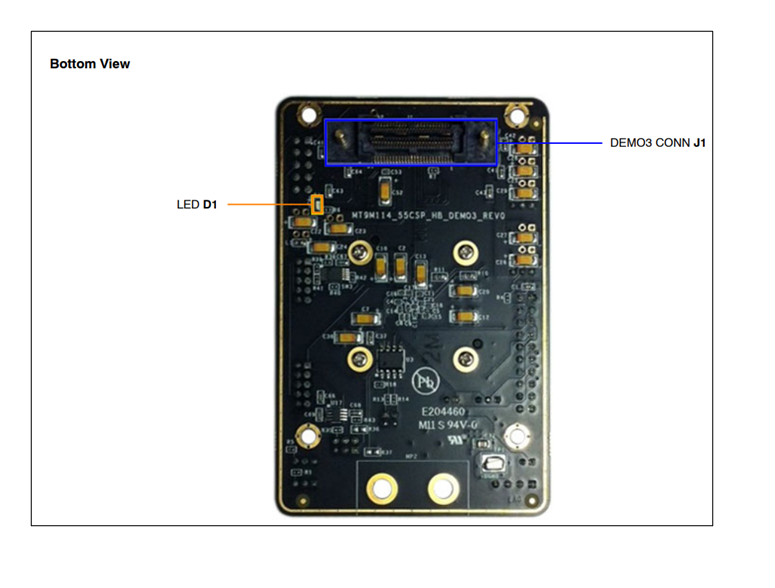
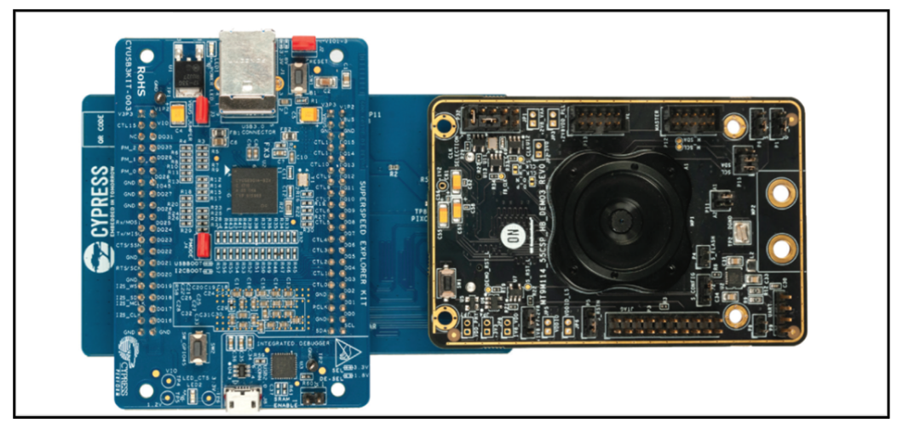
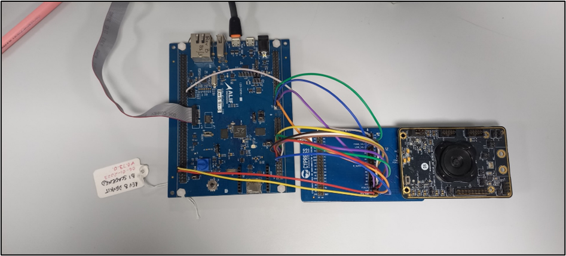
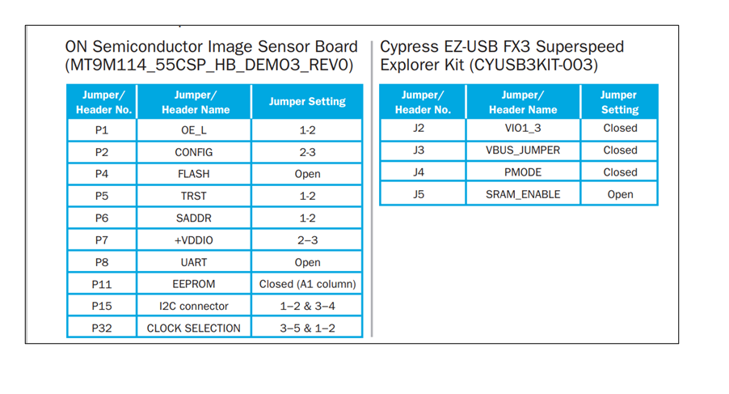
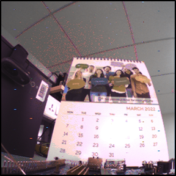
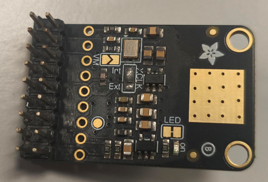
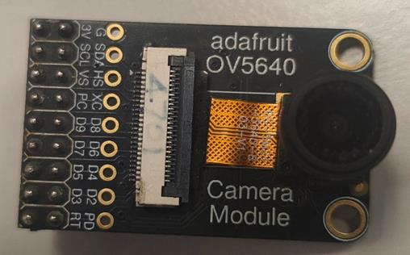
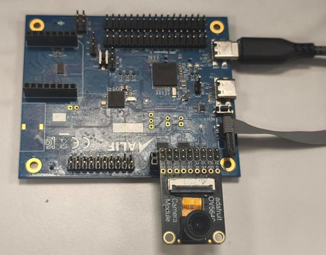
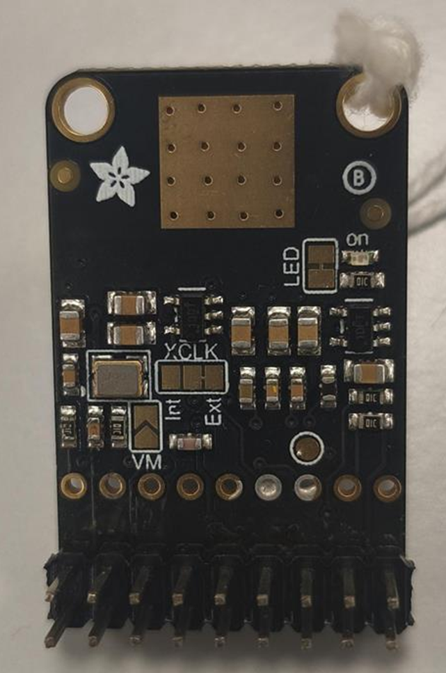
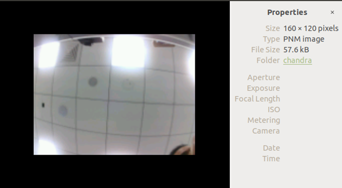

.. _parallel-camera:

===============
Parallel Camera
===============

Introduction
=============

This application note describes how to capture camera frames using the LPCAM
video driver (Parallel Interface) along with a camera sensor.

The demo application demonstrates frame capture using the following
parallel camera sensors:

- MT9M114 Camera Sensor
- OV5640 Camera Sensor

Both sensors transmit image data through the Camera Parallel Interface (CPI)
while sensor configuration is performed using the I2C/SCCB interface.

Image Data Path::

   External Parallel Camera Sensor → CPI → Memory

CPI
-----

The CPI IP is provided by Alif Semiconductor and serves the purpose of
capturing frames and storing them in the allocated memory area.

I2C Controller
---------------

The I2C IP is provided by Alif Semiconductor. This IP facilitates communication
between the SoC and the camera sensor.

MT9M114 Camera Sensor
=======================

The ON Semiconductor MT9M114 is a 1/6-inch 1.26 MP CMOS digital image sensor with an active-pixel array of 1296H x 976V.

It includes advanced camera functions such as auto exposure control, auto white balance, black level control, flicker avoidance, and defect correction, optimized for low-light conditions.

The MT9M114 is a system-on-a-chip (SoC) image sensor, programmable through a serial interface, suitable for embedded notebook, netbook, game consoles, cell phones, mobile devices, and desktop monitor cameras.

Hardware Requirements and Setup
--------------------------------

- Alif Devkit
- Debugger: JLink
- MT9M114 Camera Sensor
- Cypress Interconnect Board (CYUSB3ACC-004A)

Camera Sensor Support
-----------------------

.. note::

   The MT9M114 camera sensor uses the Parallel Camera Interface (CPI) and is supported on the following DevKits:

   - DevKit E7
   - DevKit E8
   - E1C
   - B1 A5/A6

Features
----------

- Superior low-light performance
- Ultra-low power
- 720p HD video at 30 fps

Applications
-------------

- Embedded notebook, netbook, and desktop monitor cameras
- Tethered PC cameras
- Game consoles
- Cell phones, mobile devices, and consumer video communications
- Surveillance, medical, and industrial applications

Hardware Connections and Setup
------------------------------

   Bottom View of the Board Connector

.. note::
   The demo application uses the Cypress Interconnect Board (CYUSB3ACC-004A) to establish connections between the MT9M114 Camera Sensor and the Alif SoC.

   Cypress Interconnect Board Connecting MT9M114_Camera_Sensor to Alif SoC

Refer to *CYUSB3ACC-004A Interconnect Board for ON Semiconductor Image Sensor* for jumper and pin connection details.

   Connecting Image Sensor Board to CYUSB3ACC-004A Board

Set up the jumper connections as shown below:

   Jumper Connections Table

GPIO Configuration
===================

LPCAM Configuration (B0 Flat Board)
------------------------------------

The following GPIO pins are configured for LPCAM:

+--------+----------------------+
| Pin    | Function             |
+========+======================+
| P0_0   | LPCAM_HSYNC_B        |
+--------+----------------------+
| P0_1   | LPCAM_VSYNC_B        |
+--------+----------------------+
| P0_2   | LPCAM_PCLK_B         |
+--------+----------------------+
| P0_3   | LPCAM_XVCLK_B        |
+--------+----------------------+

**Data Lines (D0–D7)**

+--------+----------------------+
| Pin    | Function             |
+========+======================+
| P8_0   | LPCAM_D0_A           |
+--------+----------------------+
| P8_1   | LPCAM_D1_A           |
+--------+----------------------+
| P8_2   | LPCAM_D2_A           |
+--------+----------------------+
| P8_3   | LPCAM_D3_A           |
+--------+----------------------+
| P8_4   | LPCAM_D4_A           |
+--------+----------------------+
| P8_5   | LPCAM_D5_A           |
+--------+----------------------+
| P8_6   | LPCAM_D6_A           |
+--------+----------------------+
| P8_7   | LPCAM_D7_A           |
+--------+----------------------+

CAM Configuration (B0 Flat Board)
----------------------------------

And if MT9M114 camera sensor being tested with CAM driver:
The following GPIO pins are configured for CAM:

+--------+----------------------+
| Pin    | Function             |
+========+======================+
| P0_0   | CAM_HSYNC_A          |
+--------+----------------------+
| P0_1   | CAM_VSYNC_A          |
+--------+----------------------+
| P0_2   | CAM_PCLK_A           |
+--------+----------------------+
| P0_3   | CAM_XVCLK_A          |
+--------+----------------------+

**Data Lines (D0–D7)**

+--------+----------------------+
| Pin    | Function             |
+========+======================+
| P8_0   | CAM_D0_B             |
+--------+----------------------+
| P8_1   | CAM_D1_B             |
+--------+----------------------+
| P8_2   | CAM_D2_B             |
+--------+----------------------+
| P8_3   | CAM_D3_B             |
+--------+----------------------+
| P8_4   | CAM_D4_B             |
+--------+----------------------+
| P8_5   | CAM_D5_B             |
+--------+----------------------+
| P8_6   | CAM_D6_B             |
+--------+----------------------+
| P8_7   | CAM_D7_B             |
+--------+----------------------+

I2C Configuration
------------------

The following GPIO pins are configured for I2C:

+--------+----------------------+
| Pin    | Function             |
+========+======================+
| P7_2   | I2C1_SDA_C           |
+--------+----------------------+
| P7_3   | I2C1_SCL_C           |
+--------+----------------------+

Required Config Features
--------------------------

- ``CONFIG_VIDEO=y``
- ``CONFIG_VIDEO_MIPI_CSI2_DW=n``
- ``CONFIG_LOG=y``
- ``CONFIG_PRINTK=y``
- ``CONFIG_STDOUT_CONSOLE=y``
- ``CONFIG_I2C_TARGET=y``
- ``CONFIG_I2C=y``
- ``CONFIG_I2C_DW_CLOCK_SPEED=100``
- ``CONFIG_SYS_HEAP_AUTO=y``

Required Device Tree Changes
-----------------------------

**If testing with LPCAM instance**:
- Enable the LPCAM node.
- In the `i2c1` node, enable the `mt9m114` sub-node and uncomment the `lpcam` remote endpoint.
- Disable the `cam` node.

**If testing with CAM instance**:
- Enable the `cam` node.
- In the `i2c1` node, enable the `mt9m114` sub-node and uncomment the `cam` remote endpoint.

Software Requirements
-----------------------

- **Alif SDK**: Clone from `https://github.com/alifsemi/sdk-alif.git <https://github.com/alifsemi/sdk-alif.git>`_
- **West Tool**: For building Zephyr applications (installed via ``pip install west``)
- **Arm GCC Compiler**: For compiling the application (part of the Zephyr SDK)
- **SE Tools (optional)**: For loading binaries (refer to Alif documentation)
- **Video Drivers (CAM or LPCAM instance)**:
- **MT9M114 Camera Sensor Driver**:
- Zephyr I2C DesignWare Driver
- Standard Zephyr MT9M114 Camera Sensor Driver

Selected MT9M114 Camera Sensor Configurations
----------------------------------------------

- **Resolution**: 640x480
- **Output Format**: RAW Bayer10

Exporting and Converting Captured Images
-----------------------------------------

After capturing images, users must export the raw image data to convert it into a viewable format (e.g., RGB). The raw image data is stored in the capture buffers as shown in the console output. To export the raw image data, use the file paths provided in the console output (e.g., ``/home/$USER/path/capture_0.bin``) and transfer them to a system where image conversion can be performed.

Image Conversion from Bayer to RGB
----------------------------------

To convert a Bayer 10 image to RGB format for viewing, run the following command:

.. code-block:: console

   bayer2rgb -i image_file.bin \
   -o checking_rgb.tiff \
   -w 648 -v 488 \
   -b 8 -f GRBG \
   -m SIMPLE -t

Build an MT9M114 Camera Sensor Application with Zephyr
======================================================

Follow these steps to build the MT9M114 Camera Sensor Application using the Alif Zephyr SDK:

1. For instructions on fetching the Alif Zephyr SDK and navigating to the Zephyr repository, please refer to the `ZAS User Guide`_

.. note::
   The build commands shown here are specifically for the Alif E7 DevKit.
   To build the application for other boards, modify the board name in the build command accordingly. For more information, refer to the `ZAS User Guide`_, under the section Setting Up and Building Zephyr Applications

2. Build command for the application on the M55 HE core:

.. code-block:: console

   west build -p always \
     -b alif_e7_dk/ae722f80f55d5xx/rtss_he \
     ../alif/samples/drivers/video/ \
     -- \
     -DDTC_OVERLAY_FILE="$PWD/../alif/samples/drivers/video/boards/parallel_camera_mt9m114_he.overlay"

3. Build command for the application on the M55 HP core:

.. code-block:: console

   west build -p always \
     -b alif_e7_dk/ae722f80f55d5xx/rtss_hp \
     ../alif/samples/drivers/video/ \
     -- \
     -DDTC_OVERLAY_FILE="$PWD/../alif/samples/drivers/video/boards/parallel_camera_mt9m114_hp.overlay"

Executing Binary on the DevKit
--------------------------------

To execute binaries on the DevKit follow the command

.. code-block:: bash

   west flash

Console Output
---------------

The following output is observed in the console when the MT9M114 camera sensor is tested with the LPCAM instance of the video driver:

.. code-block:: text

   - Device name: lpcam@43003000
   - Capabilities:
     RGBP width (min, max, step)[480; 480; 0] height (min, max, step)[272; 272; 0]
     YUYV width (min, max, step)[480; 480; 0] height (min, max, step)[272; 272; 0]
     RGBP width (min, max, step)[640; 640; 0] height (min, max, step)[480; 480; 0]
     YUYV width (min, max, step)[640; 640; 0] height (min, max, step)[480; 480; 0]
     Y10P width (min, max, step)[640; 640; 0] height (min, max, step)[480; 480; 0]
     RGBP width (min, max, step)[1280; 1280; 0] height (min, max, step)[720; 720; 0]
     YUYV width (min, max, step)[1280; 1280; 0] height (min, max, step)[720; 720; 0]
   - format: Y10P 640x480
   Width - 640, Pitch - 640, Height - 480, Buff size - 307200
   - addr - 0x8000000, size - 307200, bytesused - 0
   capture buffer[0]: dump binary memory "/home/$USER/path/capture_0.bin" 0x08000000 0x0804afff -r
   Capture started
   Got frame 0! size: 307200; timestamp 7560 ms
   Got frame 1! size: 307200; timestamp 7744 ms
   Got frame 2! size: 307200; timestamp 7929 ms
   Got frame 3! size: 307200; timestamp 8113 ms
   Got frame 4! size: 307200; timestamp 8298 ms
   Got frame 5! size: 307200; timestamp 8482 ms
   Got frame 6! size: 307200; timestamp 8666 ms
   Got frame 7! size: 307200; timestamp 8850 ms
   Got frame 8! size: 307200; timestamp 9034 ms
   Got frame 9! size: 307200; timestamp 9218 ms
   [00:00:09.218,000] <inf> video_app: Calling video flush.
   [00:00:09.218,000] <inf> video_app: Calling video stream stop.

The following output is observed when the MT9M114 camera sensor is tested with the CAM instance of the video driver:

.. code-block:: text

   - Device name: cam@49030000
   - Capabilities:
     RGBP width (min, max, step)[480; 480; 0] height (min, max, step)[272; 272; 0]
     YUYV width (min, max, step)[480; 480; 0] height (min, max, step)[272; 272; 0]
     RGBP width (min, max, step)[640; 640; 0] height (min, max, step)[480; 480; 0]
     YUYV width (min, max, step)[640; 640; 0] height (min, max, step)[480; 480; 0]
     Y10P width (min, max, step)[640; 640; 0] height (min, max, step)[480; 480; 0]
     RGBP width (min, max, step)[1280; 1280; 0] height (min, max, step)[720; 720; 0]
     YUYV width (min, max, step)[1280; 1280; 0] height (min, max, step)[720; 720; 0]
   - format: Y10P 640x480
   Width - 640, Pitch - 640, Height - 480, Buff size - 307200
   - addr - 0x8000000, size - 307200, bytesused - 0
   capture buffer[0]: dump binary memory "/home/$USER/path/capture_0.bin" 0x08000000 0x0804afff -r
   Capture started
   Got frame 0! size: 307200; timestamp 7561 ms
   Got frame 1! size: 307200; timestamp 7745 ms
   Got frame 2! size: 307200; timestamp 7930 ms
   Got frame 3! size: 307200; timestamp 8114 ms
   Got frame 4! size: 307200; timestamp 8299 ms
   Got frame 5! size: 307200; timestamp 8483 ms
   Got frame 6! size: 307200; timestamp 8667 ms
   Got frame 7! size: 307200; timestamp 8851 ms
   Got frame 8! size: 307200; timestamp 9035 ms
   Got frame 9! size: 307200; timestamp 9219 ms
   [00:00:09.219,000] <inf> video_app: Calling video flush.
   [00:00:09.219,000] <inf> video_app: Calling video stream stop.

Interpretation
----------------

- The device is successfully communicating through the `/dev/ttyACM1` serial port.
- The Zephyr OS (build Zephyr-Alif-SDK-v0.5.0-21-g6039114c3b48) is booting up.
- The `alif_video` driver (CAM and LPCAM instances), `mt9m114` driver, and `i2c_dw` driver were successfully verified.
- The video capturing process has been completed successfully.

References and Dependencies
-----------------------------

The reference image captured using the Camera Controller and MT9M114 Camera Sensor is shown below:

   Reference Image Captured using Camera Controller and MT9M114 Camera Sensor

OV5640 Camera Sensor
=======================

The OV5640 (color) image sensor is a low voltage, high-performance,
1/4-inch 5-megapixel CMOS image sensor that provides the full functionality
of a single chip 5-megapixel (2592 × 1944) camera using OmniBSI™ technology
in a small footprint package.

It provides full-frame, sub-sampled, windowed, or arbitrarily scaled
8-bit/10-bit images in various formats via the control of the
Serial Camera Control Bus (SCCB) interface.

The image array is capable of operating at up to 15 frames per second (fps)
in 5 megapixel resolution with complete user control over image quality,
formatting and output data transfer.

.. note::

   The OV5640 camera sensor interfaces via the Parallel Camera Interface (CPI) and is validated on the E1C StartKit Board.

Features
---------

- Digital video port (DVP) parallel output interface
- Dual lane MIPI output interface
- Supports image sizes up to 5 megapixel
- Automatic image control functions including:

  - Automatic Exposure Control (AEC)
  - Automatic White Balance (AWB)
  - Automatic Band Filter (ABF)
  - Automatic 50/60 Hz luminance detection
  - Automatic Black Level Calibration (ABLC)

Applications
--------------

- Embedded vision systems
- Security and surveillance cameras
- IoT camera devices

Hardware Connections and Setup
--------------------------------

OV5640 Camera Sensor Pin Connections

   Bottom View of the OV5640 Camera Sensor Board Connector

   Front View of the OV5640 Camera Sensor Board Connector

   Cypress Interconnect Board Connecting OV5640 Camera Sensor to Alif SoC

   Cypress Interconnect Board Connecting OV5640 Camera Sensor to Alif SoC

.. note::

   Currently, the module has not been validated with an externally supplied XVCLK.
   Therefore, the board must use the on-board internal oscillator to generate
   the XCLK signal.

To configure the board:

#. Solder the jumper between the XCLK and Int pads to route the internally generated clock to the sensor.
#. Ensure that the connection to the Ext pad is open. If a solder bridge exists between XCLK and Ext, it must be cut or removed.
#. This configuration ensures that the internal clock source drives the XVCLK input of the sensor.

.. warning::

   External XVCLK input support has not been tested and should not be used in the current configuration.

GPIO Configuration
-------------------

The following GPIO pins are configured for the LPCAM interface on the
E1C Startkit board.

LPCAM Interface
----------------

- P2_0 as LPCAM_HSYNC_B
- P0_6 as LPCAM_VSYNC_B
- P2_1 as LPCAM_PCLK_B
- P2_3 as LPCAM_XVCLK_B

Data Lines (D0–D7)
--------------------

- P4_0 as LPCAM_D0_A
- P4_1 as LPCAM_D1_A
- P4_2 as LPCAM_D2_A
- P4_3 as LPCAM_D3_A
- P4_4 as LPCAM_D4_A
- P4_5 as LPCAM_D5_A
- P4_6 as LPCAM_D6_A
- P4_7 as LPCAM_D7_A

I2C Interface
---------------

The following GPIO pins are configured for the I2C interface:

- P2_6 as I2C1_SDA_B
- P2_7 as I2C1_SCL_B

Required Config Features
--------------------------

The following configuration options must be enabled:

- ``CONFIG_VIDEO=y``
- ``CONFIG_LOG=y``
- ``CONFIG_PRINTK=y``
- ``CONFIG_STDOUT_CONSOLE=y``
- ``CONFIG_I2C_TARGET=y``
- ``CONFIG_I2C=y``
- ``CONFIG_I2C_DW_CLOCK_SPEED=100``
- ``CONFIG_SYS_HEAP_AUTO=y``

Software Requirements
-----------------------

Below is a list of the required software and drivers needed to run the
LPCAM application:

- Video Drivers (LPCAM instance)

  - Alif Zephyr video driver

- OV5640 Camera Sensor Driver

  - Zephyr I2C DesignWare Driver
  - Standard Zephyr OV5640 Camera Sensor Driver

Selected OV5640 Camera Sensor Configurations
-----------------------------------------------

- **Resolution**: 160 × 120
- **Output Format**: RGB565

Bin to PNM Conversion (Optional)
----------------------------------

The following command needs to be run to convert an RGB565 binary file
to RGB PNM format:

.. code-block:: console

   ./raw2rgbpnm -f RGB565 -s 160x120 /home/user/capture_image.bin ~/captured_image.pnm

Build an OV5640 Camera Sensor Application with Zephyr
======================================================

Follow these steps to build the OV5640 Camera Sensor Application using the Alif Zephyr SDK:

1. For instructions on fetching the Alif Zephyr SDK and navigating to the Zephyr repository, please refer to the `ZAS User Guide`_

.. note::
   The build commands shown here for the E1C Startkit board.

2. Build command for the application on the M55 HE core:

.. code-block:: console

   west build -b alif_e1c_sk//rtss_he ../alif/samples/drivers/video/

Executing Binary on the DevKit
--------------------------------

To execute binaries on the DevKit follow the command

.. code-block:: console

   west flash

Console Output
==============

The following output is observed in the console when the OV5640 camera sensor
is tested with the LPCAM instance of the video driver:

.. code-block:: text

   *** Booting Zephyr OS build ***
   [00:00:00.328,000] <inf> video_app: - Device name: lpcam@43003000
   [00:00:00.328,000] <inf> video_app: - Capabilities:
   [00:00:00.328,000] <inf> video_app:   RGBP width (min, max, step)[160; 160; 0] height (min, max, step)[120; 120; 0]
   [00:00:00.328,000] <inf> video_app:   RGBP width (min, max, step)[320; 320; 0] height (min, max, step)[240; 240; 0]
   [00:00:00.328,000] <inf> video_app:   RGBP width (min, max, step)[480; 480; 0] height (min, max, step)[272; 272; 0]
   [00:00:00.328,000] <inf> video_app: - format: RGBP 160x120
   [00:00:00.328,000] <inf> video_app: Width - 160, Pitch - 320, Height - 120, Buff size - 38400
   [00:00:00.328,000] <inf> video_app: - addr - 0x20020058, size - 38400, bytesused - 0
   [00:00:00.330,000] <inf> video_app: capture buffer[0]: dump binary memory "/home/$USER/capture_0.bin" 0x20020058 0x20029657 -r

   [00:00:07.331,000] <inf> video_app: Capture started
   [00:00:07.453,000] <inf> video_app: Got frame 0! size: 38400; timestamp 7453 ms
   [00:00:07.453,000] <inf> video_app: FPS: 0.0
   [00:00:07.453,000] <inf> video_app: Calling video flush.
   [00:00:07.453,000] <inf> video_app: Calling video stream stop.

Interpretation
---------------

- The Zephyr OS (build 2d6231a778ac) is booting up.
- The ``alif_video`` driver (LPCAM instances), ``ov5640`` driver, and
  ``i2c_dw`` driver are successfully verified.
- The video capturing process has completed successfully.

References and Dependencies
-----------------------------

Here is the reference image captured using the Camera Controller and
OV5640 Camera Sensor:

   Reference Image Captured using the Camera Controller and OV5640 Camera Sensor

