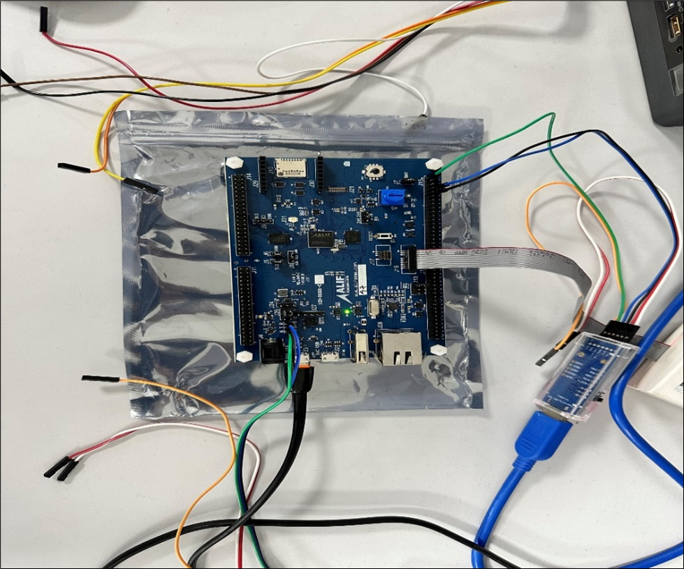

.. _appnote-zas-power-management:

================
Power Management
================

Introduction
============

Power management in the Alif SoC is highly intricate and can be classified into two categories: Individual CPU states and SoC device states (Global Power States). The SoC device states make use of aiPM (Autonomous Intelligent Power Management), which can be tuned to provide fine granularity and achieve the required objectives. In this document, we will discuss individual CPU states and provide guidance on invoking aiPM services to transition into global device states.

.. note::
   Please refer to the aiPM Service API document to learn more about controlling the global clocks and power domains in the SoC.

   Example Power Management Setup

Hardware Requirements and Setup
===============================

Hardware Requirements
---------------------

- **Alif DevKit**
- **USB cable** (x1)
- **FTDI USB** (x1)

Host Software Requirements
--------------------------

- **Tera Term** or similar terminal application
- **SE tool** to flash the application to MRAM

.. note::
   Please ensure that the debugger is not connected while running this application. If the debugger is connected, it will prevent the core from entering the OFF state.

Setup
-----

The Power Management demo application shipped with ZAS uses RTSS_HE to enter the local OFF state and then subsequently enter the STOP mode of the SoC. The RTC is used as the wakeup source for the HE Subsystem. The demo application can be modified to use other wakeup sources such as LPGPIO/LPTIMER for the HP/HE domain. The logs are pushed through the console UART.

ZAS Power Management Application
================================

This sample can be used for basic power measurement and as an example of powering off a subsystem in RTSS cores in Alif Ensemble. The functional behavior is:

- Display the last reset/wakeup reason.
- Set RTC for 20 seconds to ensure the system goes to the idle task (Normal sleep).
- Wait for the RTC interrupt.
- Set the RTC again for 20 seconds and turn the system off.
- The system reboots once the RTC interrupt triggers, and the above steps continue.

How to Use the Application
==========================

This sample application can be used for basic power measurement and demonstrates how to power off a subsystem in the RTSS cores of the Alif Ensemble.

.. note::
   If using a USB hub to connect the UART, it is advised to set the BOOT_DELAY to 5 seconds to ensure UART logs are not missed on the PC after reset. This sample is specific to a single subsystem. For the complete SoC to transition to global states (IDLE/STANDBY/STOP), it requires voting from all the remaining subsystems in the SoC.

Building Power Management Application in Zephyr
==================================================

Follow these steps to prepare your ZAS Power Management application using the GCC compiler and the Alif Zephyr SDK:

1. For instructions on fetching the Alif Zephyr SDK and navigating to the Zephyr repository, please refer to the `ZAS User Guide`_

.. note::
   The build commands shown here are specifically for the Alif E7 DevKit.
   To build the application for other boards, please modify the board name in the build command accordingly. For more information, refer to the ZAS User Guide.

2. Build commands for applications on the M55 HE core using the Ninja build command:

.. code-block:: bash

   rm -rf build
   west build -b alif_e3_dk_rtss_he ../alif/samples/drivers/pm/system_off

2. Build commands for applications on the M55 HP core using the Ninja build command:

.. code-block:: bash

   rm -rf build
   west build -b alif_e3_dk_rtss_hp ../alif/samples/drivers/pm/system_off

.. note::
   To address various scenarios, such as utilizing MRAM or flash addresses and employing alternative compilers like LLVM or ARMCLANG, refer to the document AUGD0008_Getting-Started-with-ZAS-for-Ensemble-v0.5.0-Beta.

Once the build command completes successfully, executable images will be generated and placed in the `build/zephyr` directory. Both `.bin` (binary) and `.elf` (Executable and Linkable Format) files will be available.

Executing Binary on the DevKit
==============================

To execute binaries on the DevKit, follow these steps:

1. Create a JSON configuration file for the SE tool (example assumes RTSS_HE boots from TCM; enable the ITCM node in the overlay file ``samples/drivers/pm/system_off/boards/alif_e3_dk_rtss_he.overlay`` to boot from MRAM):

.. code-block:: json

   {
       "A32_APP": {
           "disabled": true,
           "binary": "a32_stub_0.bin",
           "version": "1.0.0",
           "signed": true,
           "loadAddress": "0x02000000",
           "cpu_id": "A32_0",
           "flags": ["load", "boot"]
       },
       "HP_APP": {
           "disabled": true,
           "binary": "m55_stub_hp.bin",
           "version": "1.0.0",
           "signed": true,
           "mramAddress": "0x80200000",
           "cpu_id": "M55_HP",
           "flags": ["boot"]
       },
       "HE_APP": {
           "disabled": false,
           "binary": "M55_HE.bin",
           "version": "1.0.0",
           "signed": true,
           "loadAddress": "0x58000000",
           "cpu_id": "M55_HE",
           "flags": ["load", "boot"]
       },
       "DEVICE": {
           "disabled": false,
           "binary": "app-device-config.json",
           "version": "0.5.00",
           "signed": true
       }
   }

2. Flash the application:

   a. Copy the generated binary (e.g., ``zephyr.bin``) into ``<SE tool folder>/build/images``.
   b. Copy the JSON configuration file into ``<SE tool folder>/build/config``.
   c. Run the following commands in ``<SE tool folder>``:

.. code-block:: bash

   python3 app-gen-toc.py --filename build/config/<your_config_name>.json
   python3 app-write-mram.py

Sample Output
=============

After the cores boot following a reset, the following prints will be displayed on the console:

.. code-block:: text

   *** Booting Zephyr OS build Zephyr-Alif-SDK-v0.5.0-25-gabba7ca03b57 (delayed boot 10000ms) ***
   alif_e3_devkit System Off Demo
   SE: VTOR = 0
   SE: MEMBLOCKS = 400f0
   Set Alarm and enter Normal Sleep
   Set alarm in 20 sec (20 ticks)
   !!! Alarm !!! at 20 ticks
   Set Alarm and enter Subsystem OFF & then STOP mode
   Set alarm in 20 sec (41 ticks)
   ***** delaying boot 10000ms (per build configuration) *****
   *** Booting Zephyr OS build Zephyr-Alif-SDK-v0.5.0-25-gabba7ca03b57 (delayed boot 10000ms) ***
   alif_e3_devkit System Off Demo
   Wakeup Interrupt Reason : RTC
   SE: VTOR = 0
   SE: MEMBLOCKS = 400f0
   Set Alarm and enter Normal Sleep
   Set alarm in 20 sec (20 ticks)
   !!! Alarm !!! at 20 ticks
   Set Alarm and enter Subsystem OFF & then STOP mode
   Set alarm in 20 sec (41 ticks)
