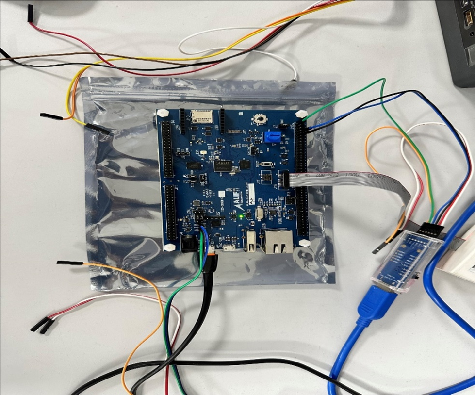

.. _appnote-zas-power-management:

================
Power Management
================

Introduction
============

Power management in the Alif SoC is highly intricate and can be classified into two categories: Individual CPU states and SoC device states (Global Power States). The SoC device states make use of aiPM (Autonomous Intelligent Power Management), which can be tuned to provide fine granularity and achieve the required objectives. In this document, we will discuss individual CPU states and provide guidance on invoking aiPM services to transition into global device states.

.. note::
   Please refer to the aiPM Service API document to learn more about controlling the global clocks and power domains in the SoC.

Prerequisites
===============

Hardware Requirements
---------------------

- Alif Devkit
- USB cable (x1)
- FTDI USB (x1)

Software Requirements
---------------------
- **Alif SDK**: Clone from `https://github.com/alifsemi/sdk-alif.git <https://github.com/alifsemi/sdk-alif.git>`_
- **West Tool**: For building Zephyr applications (refer to the `ZAS User Guide`_)
- **Arm GCC Compiler**: For compiling the application (part of the Zephyr SDK)
- **SE Tools**: For loading binaries (refer to the `ZAS User Guide`_)

.. note::
   Please ensure that the debugger is not connected while running this application. If the debugger is connected, it will prevent the core from entering the OFF state.

Setup
======

The Power Management demo application shipped with ZAS uses RTSS_HE to enter the local OFF state and then subsequently enter the STOP mode of the SoC. The RTC is used as the wakeup source for the HE Subsystem. The demo application can be modified to use other wakeup sources such as LPGPIO/LPTIMER for the HP/HE domain. The logs are pushed through the console UART.

   Example Power Management Setup

ZAS Power Management Application
==================================

This sample demonstrates the following power states:

* **PM_STATE_RUNTIME_IDLE**: Light sleep state with quick wakeup.

* **PM_STATE_SUSPEND_TO_IDLE**: CPU Clock Off with Internal Wakeup Interrupt Controller (IWIC), devices remain active (no device PM overhead). Only interrupts 0-63 can wake CPU from this mode.
* **PM_STATE_SUSPEND_TO_RAM (S2RAM)**: Deep sleep with retention.
    * Substate 0 (STANDBY): Medium power savings.
    * Substate 1 (STOP): Higher power savings.
* **PM_STATE_SOFT_OFF**: Deepest sleep, no retention, full system reset on wakeup.

The PM states exercised depend on the *capability* of the target, selected
via the build snippet. Two compile-time predicates drive the state machine:

``S2RAM_SUPPORTED``
  True when SRAM0 is the configured data RAM (any core, E8 only) OR when
  the HE core boots from TCM (TCM has hardware retention).

``SOFT_OFF_SUPPORTED``
  True when ``S2RAM_SUPPORTED`` is false (mutually exclusive).

.. list-table:: Capability Matrix
   :header-rows: 1
   :widths: 35 15 50

   * - Snippet
     - Core(s)
     - PM states exercised
   * - ``pm-system-off-s2ram-tcm``
     - HE only
     - RUNTIME_IDLE → SUSPEND_TO_IDLE → S2RAM STANDBY → S2RAM STOP
   * - ``pm-system-off-mram``
     - HE + HP
     - RUNTIME_IDLE → SUSPEND_TO_IDLE → SOFT_OFF
   * - ``pm-system-off-s2ram-sram0``
     - HE + HP (E8 only)
     - RUNTIME_IDLE → SUSPEND_TO_IDLE → S2RAM STANDBY → S2RAM STOP

How to Use the Application
==========================

This sample application can be used for basic power measurement and demonstrates how to power off a subsystem in the RTSS cores of the Alif Ensemble.

.. note::
   If using a USB hub to connect the UART, it is advised to set the BOOT_DELAY to 5 seconds to ensure UART logs are not missed on the PC after reset. This sample is specific to a single subsystem. For the complete SoC to transition to global states (IDLE/STANDBY/STOP), it requires voting from all the remaining subsystems in the SoC.

.. include:: note.rst

Build an PM Application with Zephyr
========================================

Follow these steps to build the Power Management Application using the Alif Zephyr SDK:

1. For instructions on fetching the Alif Zephyr SDK and navigating to the Zephyr repository, please refer to the `ZAS User Guide`_

.. note::
   The build commands shown here are specifically for the Alif E7 DevKit.
   To build the application for other boards, modify the board name in the build command accordingly. For more information, refer to the `ZAS User Guide`_, under the section Setting Up and Building Zephyr Applications.

2. Build command for the HE application (TCM boot, S2RAM with retention):

.. code-block:: console

   west build -p auto -b alif_e7_dk/ae722f80f55d5xx/rtss_he \
    ../alif/samples/drivers/pm/system_off \
    -S pm-system-off-s2ram-tcm \
    -DCONFIG_FLASH_BASE_ADDRESS=0x0 \
    -DCONFIG_FLASH_LOAD_OFFSET=0x0 \
    -DCONFIG_FLASH_SIZE=256

3. Build command for the HP application (MRAM boot, SOFT_OFF):

.. code-block:: console

   west build -p auto -b alif_e7_dk/ae722f80f55d5xx/rtss_hp \
    ../alif/samples/drivers/pm/system_off \
    -S pm-system-off-mram

4. Build command for HE application (MRAM boot, SOFT_OFF):

.. code-block:: console

   west build -p auto -b alif_e7_dk/ae722f80f55d5xx/rtss_he \
    ../alif/samples/drivers/pm/system_off \
    -S pm-system-off-mram

5. Build command for HE or HP application (SRAM0 S2RAM, E8 only):

.. code-block:: console

   west build -p auto -b alif_e8_dk/ae822fa0e5597xx0/rtss_he \
    ../alif/samples/drivers/pm/system_off \
    -S pm-system-off-s2ram-sram0

Executing Binary on the DevKit
==============================

To execute binaries on the DevKit, follow these steps:

HE Core (TCM boot or MRAM boot)
---------------------------------

1. Create a JSON configuration file for the SE tool (example assumes RTSS_HE boots from TCM)

.. code-block:: json

   {
       "A32_APP": {
           "disabled": true,
           "binary": "a32_stub_0.bin",
           "version": "1.0.0",
           "signed": true,
           "loadAddress": "0x02000000",
           "cpu_id": "A32_0",
           "flags": ["load", "boot"]
       },
       "HP_APP": {
           "disabled": true,
           "binary": "m55_stub_hp.bin",
           "version": "1.0.0",
           "signed": true,
           "loadAddress": "0x50000000",
           "cpu_id": "M55_HP",
           "flags": ["load", "boot"]
       },
       "HE_APP": {
           "disabled": false,
           "binary": "M55_HE.bin",
           "version": "1.0.0",
           "signed": true,
           "loadAddress": "0x58000000",
           "cpu_id": "M55_HE",
           "flags": ["load", "boot"]
       },
       "DEVICE": {
           "disabled": false,
           "binary": "app-device-config.json",
           "version": "0.5.00",
           "signed": true
       }
   }

2. Flash the application:

   a. Copy the generated binary (e.g., ``zephyr.bin``) into ``<SE tool folder>/build/images``
   b. Copy the JSON configuration file into ``<SE tool folder>/build/config``
   c. Run the following commands in ``<SE tool folder>``:

.. code-block:: console

   ./app-gen-toc --filename build/config/<your_config_name>.json
   ./app-write-mram

HP Core — SRAM0 S2RAM (E8 only)
--------------------------------

For the HP SRAM0 S2RAM use case, two companion binaries are required
alongside the Zephyr application.  See
``samples/drivers/pm/system_off/binaries/README.rst`` for the full setup
and the SE Tools JSON configuration.

Console Output
==============

.. code-block:: text

    *** Booting Zephyr OS build ***

    [00:00:00.004,000] <inf> pm_system_off: alif_e7_dk (S2RAM): PM states demo (RUNTIME_IDLE, SUSPEND_TO_IDLE, S2RAM STANDBY, S2RAM STOP)

    [00:00:00.016,000] <inf> pm_system_off: POWER STATE SEQUENCE:

    [00:00:00.022,000] <inf> pm_system_off: 1. PM_STATE_RUNTIME_IDLE

    [00:00:00.029,000] <inf> pm_system_off: 2. PM_STATE_SUSPEND_TO_IDLE

    [00:00:00.036,000] <inf> pm_system_off: 3. PM_STATE_SUSPEND_TO_RAM (substate 0: STANDBY)

    [00:00:00.044,000] <inf> pm_system_off: 4. PM_STATE_SUSPEND_TO_RAM (substate 1: STOP)

    [00:00:00.062,000] <inf> pm_system_off: Enter RUNTIME_IDLE sleep for (18000000 microseconds)

    [00:00:18.071,000] <inf> pm_system_off: Exited from RUNTIME_IDLE sleep

    [00:00:18.077,000] <inf> pm_system_off: Enter PM_STATE_SUSPEND_TO_IDLE for (4000 microseconds)

    [00:00:18.092,000] <inf> pm_system_off: Exited from PM_STATE_SUSPEND_TO_IDLE

    [00:00:18.099,000] <inf> pm_system_off: Enter PM_STATE_SUSPEND_TO_RAM (substate 0: STANDBY) for (6000000 microseconds)

    [00:00:24.115,000] <inf> pm_system_off: === Resumed from PM_STATE_SUSPEND_TO_RAM (substate 0: STANDBY) ===

    [00:00:24.125,000] <inf> pm_system_off: Main thread running - iteration 0 - tick: 24125

    [00:00:26.135,000] <inf> pm_system_off: Main thread running - iteration 1 - tick: 26135

    [00:00:28.145,000] <inf> pm_system_off: Main thread running - iteration 2 - tick: 28145

    [00:00:30.154,000] <inf> pm_system_off: Enter PM_STATE_SUSPEND_TO_RAM (substate 1: STOP) for (9000000 microseconds)

    [00:00:39.169,000] <inf> pm_system_off: === Resumed from PM_STATE_SUSPEND_TO_RAM (substate 1: STOP) ===

    [00:00:39.178,000] <inf> pm_system_off: Main thread running - iteration 0 - tick: 39178

    [00:00:41.188,000] <inf> pm_system_off: Main thread running - iteration 1 - tick: 41188

    [00:00:43.198,000] <inf> pm_system_off: Main thread running - iteration 2 - tick: 43198

    [00:00:45.207,000] <inf> pm_system_off: === POWER STATE SEQUENCE COMPLETED ===