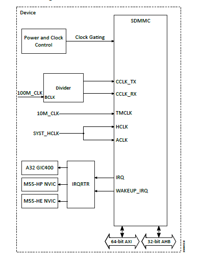

.. _appnote-zephyr-alif-sdmmc:

=====
SDMMC
=====

Overview
========

This application note describes the process of creating, compiling, and running a simple FatFS demo application using the Alif SDMMC host stack on the DevKit.

   Diagram of the SDMMC Configuration

Introduction
============

The Alif SDMMC driver, integrated within the Ensemble ROM code, leverages Intel's eMMC host stack as an alternative to the Zephyr SDMMC host stack. This approach optimizes flash memory usage while maintaining robust SDMMC functionality.

Alif SDMMC Features
===================

The Alif SDMMC driver supports the following features:

- **SDMMC v4.1 Compliance**: Ensures compatibility with modern SD card standards.
- **Bus Width**: Supports 1-bit and 4-bit configurations.
- **Voltage**: Operates at 3.3V.
- **ADMA2**: Enables efficient data transfers with Advanced DMA.

Prerequisites
=============

Software Requirements
---------------------

- **Alif Zephyr SDK**: Version 1.3.0 or later, including:
  - SDMMC APIs
  - Intel eMMC host stack
  - Sample FatFS application
- **Development Environment**: A Linux-based system with the west build tool installed
- **SE Tool**: For flashing and debugging the application

Hardware Requirements
---------------------

- Alif DevKit
- SD card (formatted with FAT32)

Compilation Procedure
=====================

Building the Application
------------------------

1. For instructions on fetching the Alif Zephyr SDK, please refer to the `ZAS User Guide`_

2. Navigate to the SDK directory and build the FatFS sample:

.. note::
   The application is designed for the Alif Ensemble E7 DevKit. Modify the sample code as needed for other DevKits.

.. code-block:: bash

   cd alif
   west build -p always -b alif_e7_dk_rtss_hp samples/subsys/fs/fs_sample/

Locating Output Files
---------------------

- **Binary File**: ``zephyr.bin``
- **Location**: ``./build/zephyr/``

Configuring and Flashing Binary on DevKit
=========================================

Creating a JSON Configuration
-----------------------------

Create a JSON configuration file (e.g., ``sdmmc_config.json``) for the SE tool:

.. code-block:: json

   {
       "DEVICE": {
           "disabled": false,
           "binary": "app-device-config.json",
           "version": "0.5.00",
           "signed": true
       },
       "SDMMC-HP": {
           "binary": "zephyr.bin",
           "version": "1.0.0",
           "signed": false,
           "cpu_id": "M55_HP",
           "mramAddress": "0x80200000",
           "loadAddress": "0x58000000",
           "flags": ["load", "boot"]
       }
   }

Flashing the Application
------------------------

Copy files to the SE tool directory:

- ``zephyr.bin`` → ``<SE tool folder>/build/images``
- ``sdmmc_config.json`` → ``<SE tool folder>/build/config``

Execute the flashing commands:

.. code-block:: bash

   cd <SE tool folder>
   python3 app-gen-toc.py --filename build/config/sdmmc_config.json
   python3 app-write-mram.py

Debugging Binary on DevKit
==========================

To debug binaries on the DevKit, follow these steps:

1. Open the **Debug Configuration** window with *Create, manage, and run configurations*.

   .. figure:: _static/debug_config_window.png
      :alt: Debug Configuration Window
      :align: center

      Debug Configuration Window

   .. note:: The configuration provided is labeled as M55_HP, but you can rename it to suit your preferences.

2. Ensure the **Connection** tab has the correct Core and selections.

   .. figure:: _static/connections_tab.png
      :alt: Connection Tab Settings
      :align: center

      Connection Tab Settings

3. Move to the **Debugger** tab and select **Debug from entry point** or **Debug from symbol** based on the type of debugging to be done.

   .. figure:: _static/debugger_tab.png
      :alt: Debugger Tab Settings
      :align: center

      Debugger Tab Settings

4. Click **Apply** and then **Debug**. Proceed with code debugging.

Validating SDMMC on DevKit
==========================

Output Logs
-----------

The application is expected to list all directories and files available on the SD card.

Sample output:

.. code-block:: text

   [00:00:01.141,000] <err> emmc_hc: adma err:60
   [00:00:01.141,000] <err> emmc_hc: adma err:60
   [00:00:01.145,000] <err> emmc_hc: adma err:60
   [00:00:01.151,000] <err> emmc_hc: adma err:60
   [00:00:01.156,000] <inf> main: Block count 62333952
   Sector size 512
   Memory Size(MB) 30436
   [00:00:01.164,000] <err> emmc_hc: adma err:60
   [00:00:01.169,000] <err> emmc_hc: adma err:60
   [00:00:01.174,000] <err> emmc_hc: adma err:60
   Disk mounted.
   Listing dir /SD: ...
   [00:00:01.183,000] <err> emmc_hc: adma err:60
   [FILE] Ztest1.txt (size = 5757)
   [FILE] TestFile34.txt (size = 5757)
   [FILE] some.dat (size = 5757)
   [FILE] some9.txt (size = 5757)
