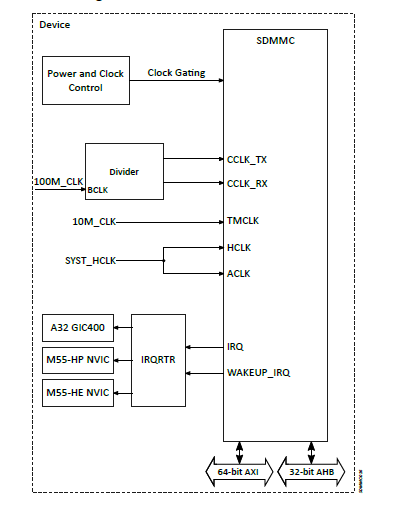

.. _appnote-zephyr-alif-sdmmc:

=====
SDMMC
=====

Overview
========

This application note describes how to build and run SDMMC-based sample
applications on Alif DevKits and AppKits. The SDMMC interface is used for
SD card access (FatFS file system) and SDIO-based WiFi connectivity.

Three sample applications are covered:

- **FatFS File System Sample** (``samples/subsys/fs/fs_sample/``):
  Demonstrates SD card mounting, directory listing, and file read/write.
  Supported on Alif B1 DevKit, E1C DevKit, E7 DevKit, and E8 DevKit.
- **WiFi Shell** (``samples/net/wifi/shell``):
  Interactive shell for WiFi scanning and connectivity over SDIO.
  Supported on Alif E7 DevKit, E8 DevKit, and E8 AppKit.
- **WiFi zperf** (``samples/net/zperf``):
  Network throughput and latency measurement over WiFi/SDIO.
  Supported on Alif E8 AppKit only.

   Diagram of the SDMMC Configuration

Introduction
============

The Alif SDMMC driver uses the Synopsys DesignWare Core SD Host Controller
(DWC SDHC) integrated within the Alif SoCs. It supports SD card access via
the FatFS file system and SDIO-based WiFi modules.

Alif SDMMC Features
===================

The Alif SDMMC driver supports the following features:

- **SDMMC v4.1 Compliance**: Ensures compatibility with modern SD card standards.
- **Bus Width**: Supports 1-bit and 4-bit configurations.
- **Voltage**: Operates at 3.3V on all Alif boards, and at both 3.3V and
  1.8V on Alif E8 DevKit and E8 AppKit.
- **ADMA2**: Enables efficient data transfers with Advanced DMA.

.. include:: prerequisites.rst

.. include:: note.rst

Build SDMMC Applications
=========================

For instructions on fetching the Alif Zephyr SDK and navigating to the
Zephyr repository, please refer to the `ZAS User Guide`_.

FatFS File System Sample
------------------------

The FatFS file system sample (``samples/subsys/fs/fs_sample/``) demonstrates
mounting an SD card using the FatFS file system layer and performing common
file system operations such as creating directories, listing directory contents,
and reading and writing files. This sample is supported on all Alif DevKits
that have an SDMMC interface connected to an SD card slot.

Alif B1 DevKit
^^^^^^^^^^^^^^

The Alif B1 DevKit supports multiple SoC variants. Build for the M55 HE core
using the appropriate SoC variant below.

Build for SoC variant ``ab1c1f1m41820hh0``, M55 HE core:

.. code-block:: console

   west build -p always \
     -b alif_b1_dk/ab1c1f1m41820hh0/rtss_he \
     samples/subsys/fs/fs_sample/

Build for SoC variant ``ab1c1f1m41820ph0``, M55 HE core:

.. code-block:: console

   west build -p always \
     -b alif_b1_dk/ab1c1f1m41820ph0/rtss_he \
     samples/subsys/fs/fs_sample/

Build for SoC variant ``ab1c1f4m51820hh0``, M55 HE core:

.. code-block:: console

   west build -p always \
     -b alif_b1_dk/ab1c1f4m51820hh0/rtss_he \
     samples/subsys/fs/fs_sample/

Build for SoC variant ``ab1c1f4m51820ph0``, M55 HE core:

.. code-block:: console

   west build -p always \
     -b alif_b1_dk/ab1c1f4m51820ph0/rtss_he \
     samples/subsys/fs/fs_sample/

Once build command completes successfully, executable images will
be generated and placed in the ``build/zephyr`` directory. Both ``.bin``
(binary) and ``.elf`` (Executable and Linkable Format) files will be
available.

For flashing and running the binary on the boards, refer to the `Flashing the Application`_, and `Executing Binary on the Boards`_ sections.

Sample Output
"""""""""""""

.. code-block:: console

   [00:00:01.156,000] <inf> main: Block count 62333952
   Sector size 512
   Memory Size(MB) 30436
   Disk mounted.
   Listing dir /SD: ...
   [FILE] Ztest1.txt (size = 5757)
   [FILE] TestFile34.txt (size = 5757)
   [FILE] some.dat (size = 5757)
   [FILE] some9.txt (size = 5757)

Alif E1C DevKit
^^^^^^^^^^^^^^^

The Alif E1C DevKit features a single-core Cortex-M55 HE processor with an
SDMMC interface for SD card access.

Build for SoC variant ``ae1c1f4051920hh``, M55 HE core:

.. code-block:: console

   west build -p always \
     -b alif_e1c_dk/ae1c1f4051920hh/rtss_he \
     samples/subsys/fs/fs_sample/

Once build command completes successfully, executable images will
be generated and placed in the ``build/zephyr`` directory. Both ``.bin``
(binary) and ``.elf`` (Executable and Linkable Format) files will be
available.

For Flashing and executing binary on Boards, Please refer to the `Flashing the Application`_, and `Executing Binary on the Boards`_ section.

Sample Output
"""""""""""""

.. code-block:: console

   [00:00:01.156,000] <inf> main: Block count 62333952
   Sector size 512
   Memory Size(MB) 30436
   Disk mounted.
   Listing dir /SD: ...
   [FILE] Ztest1.txt (size = 5757)
   [FILE] TestFile34.txt (size = 5757)
   [FILE] some.dat (size = 5757)
   [FILE] some9.txt (size = 5757)

Alif E7 DevKit
^^^^^^^^^^^^^^

The Alif E7 DevKit features dual Cortex-M55 cores (HE and HP). The FatFS
sample can be built and run on either core.

Build for SoC variant ``ae722f80f55d5xx``, M55 HE core:

.. code-block:: console

   west build -p always \
     -b alif_e7_dk/ae722f80f55d5xx/rtss_he \
     samples/subsys/fs/fs_sample/

Build for SoC variant ``ae722f80f55d5xx``, M55 HP core:

.. code-block:: console

   west build -p always \
     -b alif_e7_dk/ae722f80f55d5xx/rtss_hp \
     samples/subsys/fs/fs_sample/

Once build command completes successfully, executable images will
be generated and placed in the ``build/zephyr`` directory. Both ``.bin``
(binary) and ``.elf`` (Executable and Linkable Format) files will be
available.

For Flashing and executing binary on Boards, Please refer to the `Flashing the Application`_, and `Executing Binary on the Boards`_ section.

Sample Output
"""""""""""""

.. code-block:: console

   [00:00:01.156,000] <inf> main: Block count 62333952
   Sector size 512
   Memory Size(MB) 30436
   Disk mounted.
   Listing dir /SD: ...
   [FILE] Ztest1.txt (size = 5757)
   [FILE] TestFile34.txt (size = 5757)
   [FILE] some.dat (size = 5757)
   [FILE] some9.txt (size = 5757)

Alif E8 DevKit
^^^^^^^^^^^^^^

The Alif E8 DevKit features dual Cortex-M55 cores (HE and HP). The FatFS
sample can be built and run on either core.

Build for SoC variant ``ae822fa0e5597xx0``, M55 HE core:

.. code-block:: console

   west build -p always \
     -b alif_e8_dk/ae822fa0e5597xx0/rtss_he \
     samples/subsys/fs/fs_sample/

Build for SoC variant ``ae822fa0e5597xx0``, M55 HP core:

.. code-block:: console

   west build -p always \
     -b alif_e8_dk/ae822fa0e5597xx0/rtss_hp \
     samples/subsys/fs/fs_sample/

Once build command completes successfully, executable images will
be generated and placed in the ``build/zephyr`` directory. Both ``.bin``
(binary) and ``.elf`` (Executable and Linkable Format) files will be
available.

For Flashing and executing binary on Boards, Please refer to the `Flashing the Application`_, and `Executing Binary on the Boards`_ section.

Sample Output
"""""""""""""

.. code-block:: console

   [00:00:01.156,000] <inf> main: Block count 62333952
   Sector size 512
   Memory Size(MB) 30436
   Disk mounted.
   Listing dir /SD: ...
   [FILE] Ztest1.txt (size = 5757)
   [FILE] TestFile34.txt (size = 5757)
   [FILE] some.dat (size = 5757)
   [FILE] some9.txt (size = 5757)

WiFi Shell Sample
-----------------

The WiFi shell sample (``samples/net/wifi/shell``) provides an interactive
command-line shell for managing WiFi connectivity over the SDIO interface.
It enables scanning for available access points, connecting to a network,
checking connection status, and performing basic network management. This
sample requires an SDIO-connected WiFi module and is supported on the
Alif E7 DevKit, E8 DevKit, and E8 AppKit. The sample runs on the M55 HP
core, which handles network processing. Sample output sections are provided
per board and per WiFi module variant. The Alif E7 DevKit and E8 DevKit
support both ``1YN`` and ``2FY`` module variants. The Alif E8 AppKit
supports the ``2FY`` module variant only.

.. note::

   The WiFi application binary must be executed from MRAM. The total binary
   size exceeds the available ITCM (Instruction Tightly Coupled Memory) due
   to the inclusion of the WiFi firmware, NVRAM configuration, and CLM
   (Country Locale Matrix) data. Refer to the `ZAS User Guide`_ for
   instructions on flashing and booting from MRAM.

.. note::
   Before building any wifi sample application, make sure to run ``west blobs fetch hal_infineon``
   to fetch the required blobs files (Firmware, NVRAM, and CLM).

Alif E7 DevKit
^^^^^^^^^^^^^^

Build for SoC variant ``ae722f80f55d5xx``, M55 HP core:

.. code-block:: console

   west build -p always \
     -b alif_e7_dk/ae722f80f55d5xx/rtss_hp \
     samples/net/wifi/shell

Once build command completes successfully, executable images will
be generated and placed in the ``build/zephyr`` directory. Both ``.bin``
(binary) and ``.elf`` (Executable and Linkable Format) files will be
available.

For Flashing and executing binary on Boards, Please refer to the `Flashing the Application`_, and `Executing Binary on the Boards`_ section.

Sample Output — WiFi Module 1YN
""""""""""""""""""""""""""""""""

.. code-block:: console

   [1263] WLAN MAC Address : 34:90:EA:AE:2E:72

   [1267] WLAN Firmware    : wl0: Jun  5 2024 06:33:59 version 7.95.88 (cf1d613 CY) FWID 01-7b7cf51a

   [1277] WLAN CLM         : API: 12.2 Data: 9.10.39 Compiler: 1.29.4 ClmImport: 1.36.3 Creation: 2024-04-16 21:20:55

   [1287] WHD VERSION      : 3.3.3.26653
   [1290]  : WIFI5-v3.3.3
   [1292]  : GCC 12.2
   [1294]  : 2025-04-14 03:18:50 +0000

   [00:00:01.014,000] <err> sdhc_dwc: CMD error event: 0x00010000
   [00:00:01.014,000] <err> sdhc_dwc: CMD: 0x081a ARG: 0x000001aa XFER: 0x0000 RSP01: 0x00000000 PSTATE: 0x03ff0000, cc:0
   [00:00:01.015,000] <err> sdhc_dwc: CMD error event: 0x00010000
   [00:00:01.015,000] <err> sdhc_dwc: CMD: 0x081a ARG: 0x000001aa XFER: 0x0000 RSP01: 0x00000000 PSTATE: 0x03ff0000, cc:0
   [00:00:01.015,000] <err> sdhc_dwc: CMD error event: 0x00010000
   [00:00:01.015,000] <err> sdhc_dwc: CMD: 0x081a ARG: 0x000001aa XFER: 0x0000 RSP01: 0x00000000 PSTATE: 0x03ff0000, cc:0
   [00:00:01.016,000] <err> sdhc_dwc: CMD error event: 0x00010000
   [00:00:01.016,000] <err> sdhc_dwc: CMD: 0x081a ARG: 0x000001aa XFER: 0x0000 RSP01: 0x00000000 PSTATE: 0x03ff0000, cc:0
   [00:00:01.016,000] <err> sdhc_dwc: CMD error event: 0x00010000
   [00:00:01.016,000] <err> sdhc_dwc: CMD: 0x081a ARG: 0x000001aa XFER: 0x0000 RSP01: 0x00000000 PSTATE: 0x03ff0000, cc:0
   [00:00:01.017,000] <err> sdhc_dwc: CMD error event: 0x00010000
   [00:00:01.017,000] <err> sdhc_dwc: CMD: 0x081a ARG: 0x000001aa XFER: 0x0000 RSP01: 0x00000000 PSTATE: 0x03ff0000, cc:0
   [00:00:01.017,000] <err> sdhc_dwc: CMD error event: 0x00010000
   [00:00:01.017,000] <err> sdhc_dwc: CMD: 0x081a ARG: 0x000001aa XFER: 0x0000 RSP01: 0x00000000 PSTATE: 0x03ff0000, cc:0
   [00:00:01.018,000] <err> sdhc_dwc: CMD error event: 0x00010000
   [00:00:01.018,000] <err> sdhc_dwc: CMD: 0x081a ARG: 0x000001aa XFER: 0x0000 RSP01: 0x00000000 PSTATE: 0x03ff0000, cc:0
   [00:00:01.019,000] <err> sdhc_dwc: CMD error event: 0x00010000
   [00:00:01.019,000] <err> sdhc_dwc: CMD: 0x081a ARG: 0x000001aa XFER: 0x0000 RSP01: 0x00000000 PSTATE: 0x03ff0000, cc:0
   [00:00:01.019,000] <err> sdhc_dwc: CMD error event: 0x00010000
   [00:00:01.019,000] <err> sdhc_dwc: CMD: 0x081a ARG: 0x000001aa XFER: 0x0000 RSP01: 0x00000000 PSTATE: 0x03ff0000, cc:0
   [00:00:01.020,000] <err> sdhc_dwc: CMD error event: 0x00010000
   [00:00:01.020,000] <err> sdhc_dwc: CMD: 0x081a ARG: 0x000001aa XFER: 0x0000 RSP01: 0x00000000 PSTATE: 0x03ff0000, cc:0
   [00:00:01.020,000] <inf> sd: Card does not support CMD8, assuming legacy card
   *** Booting Zephyr OS build 7d0dea4e5c54 ***
   uart:~$ wifi connect -s "YOUR_SSID" -p "YOUR_PASSWORD" -k 1
   Connected
   Connection requested
   [00:06:14.683,000] <inf> net_dhcpv4: Received: 192.0.2.10
   uart:~$ net ping 8.8.8.8
   PING 8.8.8.8
   28 bytes from 8.8.8.8 to 192.0.2.10: icmp_seq=1 ttl=117 time=13.36 ms
   28 bytes from 8.8.8.8 to 192.0.2.10: icmp_seq=3 ttl=117 time=14.19 ms

Once build command completes successfully, executable images will
be generated and placed in the ``build/zephyr`` directory. Both ``.bin``
(binary) and ``.elf`` (Executable and Linkable Format) files will be
available.

For Flashing and executing binary on Boards, Please refer to the `Flashing the Application`_, and `Executing Binary on the Boards`_ section.

Sample Output — WiFi Module 2FY
""""""""""""""""""""""""""""""""

.. note::

   The ``sdhc_dwc: CMD error`` messages seen during boot for CMD8 are
   expected. The SD subsystem begins probing for an SD memory card by
   issuing CMD8 (Send Interface Condition). Since the attached device is an
   SDIO WiFi module and not an SD memory card, CMD8 is not supported and
   all retries fail. After exhausting the retries the subsystem recognises
   the card as a legacy SDIO device and switches to SDIO mode. This is
   the actual expected behaviour for SDIO mode, not an error.

.. code-block:: console

   [1519] chip ID: 55500, chip rev: 1, Support ChipId Read from SDIO Core

   [2830] WLAN MAC Address : 84:96:90:E9:59:5B

   [2835] WLAN Firmware    : wl0: May 30 2025 08:50:00 version 28.10.522.8 (c6a09ae) FWID 01-c782e3d9

   [2844] WLAN CLM         : API: 20.0 Data: IFX.BRANCH_18_53 Compiler: 1.49.5 ClmImport: 1.48.0 Customization: v3 24/04/08 Creation: 2024-11-18 02:07:29

   [2858] WHD VERSION      : 5.1.090.26654
   [2861]  : 11ax WIFI6-dev-v5.1.090
   [2864]  : GCC 12.2
   [2866]  : 2025-04-15 06:07:24 +0000

   [00:00:01.474,000] <err> sdhc_dwc: CMD error event: 0x00010000
   [00:00:01.474,000] <err> sdhc_dwc: CMD: 0x081a ARG: 0x000001aa XFER: 0x0000 RSP01: 0x00000000 PSTATE: 0x03ff0000, cc:0
   [00:00:01.475,000] <err> sdhc_dwc: CMD error event: 0x00010000
   [00:00:01.475,000] <err> sdhc_dwc: CMD: 0x081a ARG: 0x000001aa XFER: 0x0000 RSP01: 0x00000000 PSTATE: 0x03ff0000, cc:0
   [00:00:01.475,000] <err> sdhc_dwc: CMD error event: 0x00010000
   [00:00:01.476,000] <err> sdhc_dwc: CMD: 0x081a ARG: 0x000001aa XFER: 0x0000 RSP01: 0x00000000 PSTATE: 0x03ff0000, cc:0
   [00:00:01.476,000] <err> sdhc_dwc: CMD error event: 0x00010000
   [00:00:01.476,000] <err> sdhc_dwc: CMD: 0x081a ARG: 0x000001aa XFER: 0x0000 RSP01: 0x00000000 PSTATE: 0x03ff0000, cc:0
   [00:00:01.477,000] <err> sdhc_dwc: CMD error event: 0x00010000
   [00:00:01.477,000] <err> sdhc_dwc: CMD: 0x081a ARG: 0x000001aa XFER: 0x0000 RSP01: 0x00000000 PSTATE: 0x03ff0000, cc:0
   [00:00:01.477,000] <err> sdhc_dwc: CMD error event: 0x00010000
   [00:00:01.477,000] <err> sdhc_dwc: CMD: 0x081a ARG: 0x000001aa XFER: 0x0000 RSP01: 0x00000000 PSTATE: 0x03ff0000, cc:0
   [00:00:01.478,000] <err> sdhc_dwc: CMD error event: 0x00010000
   [00:00:01.478,000] <err> sdhc_dwc: CMD: 0x081a ARG: 0x000001aa XFER: 0x0000 RSP01: 0x00000000 PSTATE: 0x03ff0000, cc:0
   [00:00:01.478,000] <err> sdhc_dwc: CMD error event: 0x00010000
   [00:00:01.478,000] <err> sdhc_dwc: CMD: 0x081a ARG: 0x000001aa XFER: 0x0000 RSP01: 0x00000000 PSTATE: 0x03ff0000, cc:0
   [00:00:01.479,000] <err> sdhc_dwc: CMD error event: 0x00010000
   [00:00:01.479,000] <err> sdhc_dwc: CMD: 0x081a ARG: 0x000001aa XFER: 0x0000 RSP01: 0x00000000 PSTATE: 0x03ff0000, cc:0
   [00:00:01.479,000] <err> sdhc_dwc: CMD error event: 0x00010000
   [00:00:01.479,000] <err> sdhc_dwc: CMD: 0x081a ARG: 0x000001aa XFER: 0x0000 RSP01: 0x00000000 PSTATE: 0x03ff0000, cc:0
   [00:00:01.480,000] <err> sdhc_dwc: CMD error event: 0x00010000
   [00:00:01.480,000] <err> sdhc_dwc: CMD: 0x081a ARG: 0x000001aa XFER: 0x0000 RSP01: 0x00000000 PSTATE: 0x03ff0000, cc:0
   [00:00:01.480,000] <inf> sd: Card does not support CMD8, assuming legacy card
   [00:00:01.504,000] <inf> sd: Card switched to 1.8V signaling
   *** Booting Zephyr OS build 7d0dea4e5c54 ***
   [00:00:02.883,000] <inf> net_config: Initializing network
   [00:00:02.883,000] <inf> net_config: Waiting interface 1 (0x20000be0) to be up...
   [00:00:32.884,000] <inf> net_config: IPv4 address: 192.0.2.1
   [00:00:32.884,000] <inf> net_config: Running dhcpv4 client...
   [00:00:32.916,000] <err> net_config: Timeout while waiting network interface
   [00:00:32.916,000] <err> net_config: Network initialization failed (-115)
   uart:~$ wifi connect -s "Alif-Wireless" -p "Alif$2o24$" -k 1
   Connected
   Connection requested
   [00:06:14.683,000] <inf> net_dhcpv4: Received: 10.0.0.233
   [00:06:14.683,000] <inf> net_config: IPv4 address: 10.0.0.233
   [00:06:14.683,000] <inf> net_config: Lease time: 7200 seconds
   [00:06:14.683,000] <inf> net_config: Subnet: 255.255.255.0
   [00:06:14.683,000] <inf> net_config: Router: 10.0.0.1
   uart:~$ net ping 8.8.8.8
   PING 8.8.8.8
   28 bytes from 8.8.8.8 to 10.0.0.233: icmp_seq=1 ttl=117 time=13.36 ms
   28 bytes from 8.8.8.8 to 10.0.0.233: icmp_seq=3 ttl=117 time=14.19 ms

Alif E8 DevKit
^^^^^^^^^^^^^^

Build for SoC variant ``ae822fa0e5597xx0``, M55 HP core:

.. code-block:: console

   west build -p always \
     -b alif_e8_dk/ae822fa0e5597xx0/rtss_hp \
     samples/net/wifi/shell

Once build command completes successfully, executable images will
be generated and placed in the ``build/zephyr`` directory. Both ``.bin``
(binary) and ``.elf`` (Executable and Linkable Format) files will be
available.

For Flashing and executing binary on Boards, Please refer to the `Flashing the Application`_, and `Executing Binary on the Boards`_ section.

Sample Output — WiFi Module 1YN
""""""""""""""""""""""""""""""""

.. code-block:: console

   [1263] WLAN MAC Address : 34:90:EA:AE:2E:72

   [1267] WLAN Firmware    : wl0: Jun  5 2024 06:33:59 version 7.95.88 (cf1d613 CY) FWID 01-7b7cf51a

   [1277] WLAN CLM         : API: 12.2 Data: 9.10.39 Compiler: 1.29.4 ClmImport: 1.36.3 Creation: 2024-04-16 21:20:55

   [1287] WHD VERSION      : 3.3.3.26653
   [1290]  : WIFI5-v3.3.3
   [1292]  : GCC 12.2
   [1294]  : 2025-04-14 03:18:50 +0000

   [00:00:01.014,000] <err> sdhc_dwc: CMD error event: 0x00010000
   [00:00:01.014,000] <err> sdhc_dwc: CMD: 0x081a ARG: 0x000001aa XFER: 0x0000 RSP01: 0x00000000 PSTATE: 0x03ff0000, cc:0
   [00:00:01.015,000] <err> sdhc_dwc: CMD error event: 0x00010000
   [00:00:01.015,000] <err> sdhc_dwc: CMD: 0x081a ARG: 0x000001aa XFER: 0x0000 RSP01: 0x00000000 PSTATE: 0x03ff0000, cc:0
   [00:00:01.015,000] <err> sdhc_dwc: CMD error event: 0x00010000
   [00:00:01.015,000] <err> sdhc_dwc: CMD: 0x081a ARG: 0x000001aa XFER: 0x0000 RSP01: 0x00000000 PSTATE: 0x03ff0000, cc:0
   [00:00:01.016,000] <err> sdhc_dwc: CMD error event: 0x00010000
   [00:00:01.016,000] <err> sdhc_dwc: CMD: 0x081a ARG: 0x000001aa XFER: 0x0000 RSP01: 0x00000000 PSTATE: 0x03ff0000, cc:0
   [00:00:01.016,000] <err> sdhc_dwc: CMD error event: 0x00010000
   [00:00:01.016,000] <err> sdhc_dwc: CMD: 0x081a ARG: 0x000001aa XFER: 0x0000 RSP01: 0x00000000 PSTATE: 0x03ff0000, cc:0
   [00:00:01.017,000] <err> sdhc_dwc: CMD error event: 0x00010000
   [00:00:01.017,000] <err> sdhc_dwc: CMD: 0x081a ARG: 0x000001aa XFER: 0x0000 RSP01: 0x00000000 PSTATE: 0x03ff0000, cc:0
   [00:00:01.017,000] <err> sdhc_dwc: CMD error event: 0x00010000
   [00:00:01.017,000] <err> sdhc_dwc: CMD: 0x081a ARG: 0x000001aa XFER: 0x0000 RSP01: 0x00000000 PSTATE: 0x03ff0000, cc:0
   [00:00:01.018,000] <err> sdhc_dwc: CMD error event: 0x00010000
   [00:00:01.018,000] <err> sdhc_dwc: CMD: 0x081a ARG: 0x000001aa XFER: 0x0000 RSP01: 0x00000000 PSTATE: 0x03ff0000, cc:0
   [00:00:01.019,000] <err> sdhc_dwc: CMD error event: 0x00010000
   [00:00:01.019,000] <err> sdhc_dwc: CMD: 0x081a ARG: 0x000001aa XFER: 0x0000 RSP01: 0x00000000 PSTATE: 0x03ff0000, cc:0
   [00:00:01.019,000] <err> sdhc_dwc: CMD error event: 0x00010000
   [00:00:01.019,000] <err> sdhc_dwc: CMD: 0x081a ARG: 0x000001aa XFER: 0x0000 RSP01: 0x00000000 PSTATE: 0x03ff0000, cc:0
   [00:00:01.020,000] <err> sdhc_dwc: CMD error event: 0x00010000
   [00:00:01.020,000] <err> sdhc_dwc: CMD: 0x081a ARG: 0x000001aa XFER: 0x0000 RSP01: 0x00000000 PSTATE: 0x03ff0000, cc:0
   [00:00:01.020,000] <inf> sd: Card does not support CMD8, assuming legacy card
   *** Booting Zephyr OS build 7d0dea4e5c54 ***
   uart:~$ wifi connect -s "Alif-Wireless" -p "Alif$2o24$" -k 1
   Connected
   Connection requested
   [00:06:14.683,000] <inf> net_dhcpv4: Received: 10.0.0.233
   uart:~$ net ping 8.8.8.8
   PING 8.8.8.8
   28 bytes from 8.8.8.8 to 10.0.0.233: icmp_seq=1 ttl=117 time=13.36 ms
   28 bytes from 8.8.8.8 to 10.0.0.233: icmp_seq=3 ttl=117 time=14.19 ms

Once build command completes successfully, executable images will
be generated and placed in the ``build/zephyr`` directory. Both ``.bin``
(binary) and ``.elf`` (Executable and Linkable Format) files will be
available.

For Flashing and executing binary on Boards, Please refer to the `Flashing the Application`_, and `Executing Binary on the Boards`_ section.

Sample Output — WiFi Module 2FY
""""""""""""""""""""""""""""""""

.. note::

   The ``sdhc_dwc: CMD error`` messages seen during boot for CMD8 are
   expected. The SD subsystem begins probing for an SD memory card by
   issuing CMD8 (Send Interface Condition). Since the attached device is an
   SDIO WiFi module and not an SD memory card, CMD8 is not supported and
   all retries fail. After exhausting the retries the subsystem recognises
   the card as a legacy SDIO device and switches to SDIO mode. This is
   the actual expected behaviour for SDIO mode, not an error.

.. code-block:: console

   [1519] chip ID: 55500, chip rev: 1, Support ChipId Read from SDIO Core

   [2830] WLAN MAC Address : 84:96:90:E9:59:5B

   [2835] WLAN Firmware    : wl0: May 30 2025 08:50:00 version 28.10.522.8 (c6a09ae) FWID 01-c782e3d9

   [2844] WLAN CLM         : API: 20.0 Data: IFX.BRANCH_18_53 Compiler: 1.49.5 ClmImport: 1.48.0 Customization: v3 24/04/08 Creation: 2024-11-18 02:07:29

   [2858] WHD VERSION      : 5.1.090.26654
   [2861]  : 11ax WIFI6-dev-v5.1.090
   [2864]  : GCC 12.2
   [2866]  : 2025-04-15 06:07:24 +0000

   [00:00:01.474,000] <err> sdhc_dwc: CMD error event: 0x00010000
   [00:00:01.474,000] <err> sdhc_dwc: CMD: 0x081a ARG: 0x000001aa XFER: 0x0000 RSP01: 0x00000000 PSTATE: 0x03ff0000, cc:0
   [00:00:01.475,000] <err> sdhc_dwc: CMD error event: 0x00010000
   [00:00:01.475,000] <err> sdhc_dwc: CMD: 0x081a ARG: 0x000001aa XFER: 0x0000 RSP01: 0x00000000 PSTATE: 0x03ff0000, cc:0
   [00:00:01.475,000] <err> sdhc_dwc: CMD error event: 0x00010000
   [00:00:01.476,000] <err> sdhc_dwc: CMD: 0x081a ARG: 0x000001aa XFER: 0x0000 RSP01: 0x00000000 PSTATE: 0x03ff0000, cc:0
   [00:00:01.476,000] <err> sdhc_dwc: CMD error event: 0x00010000
   [00:00:01.476,000] <err> sdhc_dwc: CMD: 0x081a ARG: 0x000001aa XFER: 0x0000 RSP01: 0x00000000 PSTATE: 0x03ff0000, cc:0
   [00:00:01.477,000] <err> sdhc_dwc: CMD error event: 0x00010000
   [00:00:01.477,000] <err> sdhc_dwc: CMD: 0x081a ARG: 0x000001aa XFER: 0x0000 RSP01: 0x00000000 PSTATE: 0x03ff0000, cc:0
   [00:00:01.477,000] <err> sdhc_dwc: CMD error event: 0x00010000
   [00:00:01.477,000] <err> sdhc_dwc: CMD: 0x081a ARG: 0x000001aa XFER: 0x0000 RSP01: 0x00000000 PSTATE: 0x03ff0000, cc:0
   [00:00:01.478,000] <err> sdhc_dwc: CMD error event: 0x00010000
   [00:00:01.478,000] <err> sdhc_dwc: CMD: 0x081a ARG: 0x000001aa XFER: 0x0000 RSP01: 0x00000000 PSTATE: 0x03ff0000, cc:0
   [00:00:01.478,000] <err> sdhc_dwc: CMD error event: 0x00010000
   [00:00:01.478,000] <err> sdhc_dwc: CMD: 0x081a ARG: 0x000001aa XFER: 0x0000 RSP01: 0x00000000 PSTATE: 0x03ff0000, cc:0
   [00:00:01.479,000] <err> sdhc_dwc: CMD error event: 0x00010000
   [00:00:01.479,000] <err> sdhc_dwc: CMD: 0x081a ARG: 0x000001aa XFER: 0x0000 RSP01: 0x00000000 PSTATE: 0x03ff0000, cc:0
   [00:00:01.479,000] <err> sdhc_dwc: CMD error event: 0x00010000
   [00:00:01.479,000] <err> sdhc_dwc: CMD: 0x081a ARG: 0x000001aa XFER: 0x0000 RSP01: 0x00000000 PSTATE: 0x03ff0000, cc:0
   [00:00:01.480,000] <err> sdhc_dwc: CMD error event: 0x00010000
   [00:00:01.480,000] <err> sdhc_dwc: CMD: 0x081a ARG: 0x000001aa XFER: 0x0000 RSP01: 0x00000000 PSTATE: 0x03ff0000, cc:0
   [00:00:01.480,000] <inf> sd: Card does not support CMD8, assuming legacy card
   [00:00:01.504,000] <inf> sd: Card switched to 1.8V signaling
   *** Booting Zephyr OS build 7d0dea4e5c54 ***
   [00:00:02.883,000] <inf> net_config: Initializing network
   [00:00:02.883,000] <inf> net_config: Waiting interface 1 (0x20000be0) to be up...
   [00:00:32.884,000] <inf> net_config: IPv4 address: 192.0.2.1
   [00:00:32.884,000] <inf> net_config: Running dhcpv4 client...
   [00:00:32.916,000] <err> net_config: Timeout while waiting network interface
   [00:00:32.916,000] <err> net_config: Network initialization failed (-115)
   uart:~$ wifi connect -s "Alif-Wireless" -p "Alif$2o24$" -k 1
   Connected
   Connection requested
   [00:06:14.683,000] <inf> net_dhcpv4: Received: 10.0.0.233
   [00:06:14.683,000] <inf> net_config: IPv4 address: 10.0.0.233
   [00:06:14.683,000] <inf> net_config: Lease time: 7200 seconds
   [00:06:14.683,000] <inf> net_config: Subnet: 255.255.255.0
   [00:06:14.683,000] <inf> net_config: Router: 10.0.0.1
   uart:~$ net ping 8.8.8.8
   PING 8.8.8.8
   28 bytes from 8.8.8.8 to 10.0.0.233: icmp_seq=1 ttl=117 time=13.36 ms
   28 bytes from 8.8.8.8 to 10.0.0.233: icmp_seq=3 ttl=117 time=14.19 ms

Alif E8 AppKit
^^^^^^^^^^^^^^

Build for SoC variant ``ae822fa0e5597xx0``, M55 HP core:

.. code-block:: console

   west build -p always \
     -b alif_e8_ak/ae822fa0e5597xx0/rtss_hp \
     samples/net/wifi/shell

Once build command completes successfully, executable images will
be generated and placed in the ``build/zephyr`` directory. Both ``.bin``
(binary) and ``.elf`` (Executable and Linkable Format) files will be
available.

For Flashing and executing binary on Boards, Please refer to the `Flashing the Application`_, and `Executing Binary on the Boards`_ section.

Sample Output — WiFi Module 2FY
""""""""""""""""""""""""""""""""

.. note::

   The ``sdhc_dwc: CMD error`` messages seen during boot for CMD8 are
   expected. The SD subsystem begins probing for an SD memory card by
   issuing CMD8 (Send Interface Condition). Since the attached device is an
   SDIO WiFi module and not an SD memory card, CMD8 is not supported and
   all retries fail. After exhausting the retries the subsystem recognises
   the card as a legacy SDIO device and switches to SDIO mode. This is
   the actual expected behaviour for SDIO mode, not an error.

.. code-block:: console

   [1519] chip ID: 55500, chip rev: 1, Support ChipId Read from SDIO Core

   [2830] WLAN MAC Address : 84:96:90:E9:59:5B

   [2835] WLAN Firmware    : wl0: May 30 2025 08:50:00 version 28.10.522.8 (c6a09ae) FWID 01-c782e3d9

   [2844] WLAN CLM         : API: 20.0 Data: IFX.BRANCH_18_53 Compiler: 1.49.5 ClmImport: 1.48.0 Customization: v3 24/04/08 Creation: 2024-11-18 02:07:29

   [2858] WHD VERSION      : 5.1.090.26654
   [2861]  : 11ax WIFI6-dev-v5.1.090
   [2864]  : GCC 12.2
   [2866]  : 2025-04-15 06:07:24 +0000

   [00:00:01.474,000] <err> sdhc_dwc: CMD error event: 0x00010000
   [00:00:01.474,000] <err> sdhc_dwc: CMD: 0x081a ARG: 0x000001aa XFER: 0x0000 RSP01: 0x00000000 PSTATE: 0x03ff0000, cc:0
   [00:00:01.475,000] <err> sdhc_dwc: CMD error event: 0x00010000
   [00:00:01.475,000] <err> sdhc_dwc: CMD: 0x081a ARG: 0x000001aa XFER: 0x0000 RSP01: 0x00000000 PSTATE: 0x03ff0000, cc:0
   [00:00:01.475,000] <err> sdhc_dwc: CMD error event: 0x00010000
   [00:00:01.476,000] <err> sdhc_dwc: CMD: 0x081a ARG: 0x000001aa XFER: 0x0000 RSP01: 0x00000000 PSTATE: 0x03ff0000, cc:0
   [00:00:01.476,000] <err> sdhc_dwc: CMD error event: 0x00010000
   [00:00:01.476,000] <err> sdhc_dwc: CMD: 0x081a ARG: 0x000001aa XFER: 0x0000 RSP01: 0x00000000 PSTATE: 0x03ff0000, cc:0
   [00:00:01.477,000] <err> sdhc_dwc: CMD error event: 0x00010000
   [00:00:01.477,000] <err> sdhc_dwc: CMD: 0x081a ARG: 0x000001aa XFER: 0x0000 RSP01: 0x00000000 PSTATE: 0x03ff0000, cc:0
   [00:00:01.477,000] <err> sdhc_dwc: CMD error event: 0x00010000
   [00:00:01.477,000] <err> sdhc_dwc: CMD: 0x081a ARG: 0x000001aa XFER: 0x0000 RSP01: 0x00000000 PSTATE: 0x03ff0000, cc:0
   [00:00:01.478,000] <err> sdhc_dwc: CMD error event: 0x00010000
   [00:00:01.478,000] <err> sdhc_dwc: CMD: 0x081a ARG: 0x000001aa XFER: 0x0000 RSP01: 0x00000000 PSTATE: 0x03ff0000, cc:0
   [00:00:01.478,000] <err> sdhc_dwc: CMD error event: 0x00010000
   [00:00:01.478,000] <err> sdhc_dwc: CMD: 0x081a ARG: 0x000001aa XFER: 0x0000 RSP01: 0x00000000 PSTATE: 0x03ff0000, cc:0
   [00:00:01.479,000] <err> sdhc_dwc: CMD error event: 0x00010000
   [00:00:01.479,000] <err> sdhc_dwc: CMD: 0x081a ARG: 0x000001aa XFER: 0x0000 RSP01: 0x00000000 PSTATE: 0x03ff0000, cc:0
   [00:00:01.479,000] <err> sdhc_dwc: CMD error event: 0x00010000
   [00:00:01.479,000] <err> sdhc_dwc: CMD: 0x081a ARG: 0x000001aa XFER: 0x0000 RSP01: 0x00000000 PSTATE: 0x03ff0000, cc:0
   [00:00:01.480,000] <err> sdhc_dwc: CMD error event: 0x00010000
   [00:00:01.480,000] <err> sdhc_dwc: CMD: 0x081a ARG: 0x000001aa XFER: 0x0000 RSP01: 0x00000000 PSTATE: 0x03ff0000, cc:0
   [00:00:01.480,000] <inf> sd: Card does not support CMD8, assuming legacy card
   [00:00:01.504,000] <inf> sd: Card switched to 1.8V signaling
   *** Booting Zephyr OS build 7d0dea4e5c54 ***
   [00:00:02.883,000] <inf> net_config: Initializing network
   [00:00:02.883,000] <inf> net_config: Waiting interface 1 (0x20000be0) to be up...
   [00:00:32.884,000] <inf> net_config: IPv4 address: 192.0.2.1
   [00:00:32.884,000] <inf> net_config: Running dhcpv4 client...
   [00:00:32.916,000] <err> net_config: Timeout while waiting network interface
   [00:00:32.916,000] <err> net_config: Network initialization failed (-115)
   uart:~$ wifi connect -s "Alif-Wireless" -p "Alif$2o24$" -k 1
   Connected
   Connection requested
   [00:06:14.683,000] <inf> net_dhcpv4: Received: 10.0.0.233
   [00:06:14.683,000] <inf> net_config: IPv4 address: 10.0.0.233
   [00:06:14.683,000] <inf> net_config: Lease time: 7200 seconds
   [00:06:14.683,000] <inf> net_config: Subnet: 255.255.255.0
   [00:06:14.683,000] <inf> net_config: Router: 10.0.0.1
   uart:~$ net ping 8.8.8.8
   PING 8.8.8.8
   28 bytes from 8.8.8.8 to 10.0.0.233: icmp_seq=1 ttl=117 time=13.36 ms
   28 bytes from 8.8.8.8 to 10.0.0.233: icmp_seq=3 ttl=117 time=14.19 ms

WiFi zperf Sample
-----------------

The WiFi zperf sample (``samples/net/zperf``) measures network throughput
and latency over a WiFi/SDIO connection using the zperf utility. It supports
both UDP and TCP protocols and can operate in client or server mode, making
it suitable for benchmarking WiFi performance in embedded applications.
This sample is supported exclusively on the Alif E8 AppKit, which provides
the required SDIO-connected WiFi hardware configuration. The E8 AppKit
supports the ``2FY`` WiFi module variant only.

.. note::

   The WiFi application binary must be executed from MRAM. The total binary
   size exceeds the available ITCM (Instruction Tightly Coupled Memory) due
   to the inclusion of the WiFi firmware, NVRAM configuration, and CLM
   (Country Locale Matrix) data. Refer to the `ZAS User Guide`_ for
   instructions on flashing and booting from MRAM.

.. note::
   Before building any wifi sample application, make sure to run ``west blobs fetch hal_infineon``
   to fetch the required blobs files (Firmware, NVRAM, and CLM).

Alif E8 AppKit
^^^^^^^^^^^^^^

Build for SoC variant ``ae822fa0e5597xx0``, M55 HP core:

.. code-block:: console

   west build -p always \
     -b alif_e8_ak/ae822fa0e5597xx0/rtss_hp \
     samples/net/zperf

Once build command completes successfully, executable images will
be generated and placed in the ``build/zephyr`` directory. Both ``.bin``
(binary) and ``.elf`` (Executable and Linkable Format) files will be
available.

For Flashing and executing binary on Boards, Please refer to the `Flashing the Application`_, and `Executing Binary on the Boards`_ section.

Sample Output — WiFi Module 2FY
""""""""""""""""""""""""""""""""

.. note::

   The ``sdhc_dwc: CMD error`` messages seen during boot for CMD8 are
   expected. The SD subsystem begins probing for an SD memory card by
   issuing CMD8 (Send Interface Condition). Since the attached device is an
   SDIO WiFi module and not an SD memory card, CMD8 is not supported and
   all retries fail. After exhausting the retries the subsystem recognises
   the card as a legacy SDIO device and switches to SDIO mode. This is
   the actual expected behaviour for SDIO mode, not an error.

.. code-block:: console

   [1519] chip ID: 55500, chip rev: 1, Support ChipId Read from SDIO Core

   [2830] WLAN MAC Address : 84:96:90:E9:59:5B

   [2835] WLAN Firmware    : wl0: May 30 2025 08:50:00 version 28.10.522.8 (c6a09ae) FWID 01-c782e3d9

   [2844] WLAN CLM         : API: 20.0 Data: IFX.BRANCH_18_53 Compiler: 1.49.5 ClmImport: 1.48.0 Customization: v3 24/04/08 Creation: 2024-11-18 02:07:29

   [2858] WHD VERSION      : 5.1.090.26654
   [2861]  : 11ax WIFI6-dev-v5.1.090
   [2864]  : GCC 12.2
   [2866]  : 2025-04-15 06:07:24 +0000

   [00:00:01.474,000] <err> sdhc_dwc: CMD error event: 0x00010000
   [00:00:01.474,000] <err> sdhc_dwc: CMD: 0x081a ARG: 0x000001aa XFER: 0x0000 RSP01: 0x00000000 PSTATE: 0x03ff0000, cc:0
   [00:00:01.475,000] <err> sdhc_dwc: CMD error event: 0x00010000
   [00:00:01.475,000] <err> sdhc_dwc: CMD: 0x081a ARG: 0x000001aa XFER: 0x0000 RSP01: 0x00000000 PSTATE: 0x03ff0000, cc:0
   [00:00:01.475,000] <err> sdhc_dwc: CMD error event: 0x00010000
   [00:00:01.476,000] <err> sdhc_dwc: CMD: 0x081a ARG: 0x000001aa XFER: 0x0000 RSP01: 0x00000000 PSTATE: 0x03ff0000, cc:0
   [00:00:01.476,000] <err> sdhc_dwc: CMD error event: 0x00010000
   [00:00:01.476,000] <err> sdhc_dwc: CMD: 0x081a ARG: 0x000001aa XFER: 0x0000 RSP01: 0x00000000 PSTATE: 0x03ff0000, cc:0
   [00:00:01.477,000] <err> sdhc_dwc: CMD error event: 0x00010000
   [00:00:01.477,000] <err> sdhc_dwc: CMD: 0x081a ARG: 0x000001aa XFER: 0x0000 RSP01: 0x00000000 PSTATE: 0x03ff0000, cc:0
   [00:00:01.477,000] <err> sdhc_dwc: CMD error event: 0x00010000
   [00:00:01.477,000] <err> sdhc_dwc: CMD: 0x081a ARG: 0x000001aa XFER: 0x0000 RSP01: 0x00000000 PSTATE: 0x03ff0000, cc:0
   [00:00:01.478,000] <err> sdhc_dwc: CMD error event: 0x00010000
   [00:00:01.478,000] <err> sdhc_dwc: CMD: 0x081a ARG: 0x000001aa XFER: 0x0000 RSP01: 0x00000000 PSTATE: 0x03ff0000, cc:0
   [00:00:01.478,000] <err> sdhc_dwc: CMD error event: 0x00010000
   [00:00:01.478,000] <err> sdhc_dwc: CMD: 0x081a ARG: 0x000001aa XFER: 0x0000 RSP01: 0x00000000 PSTATE: 0x03ff0000, cc:0
   [00:00:01.479,000] <err> sdhc_dwc: CMD error event: 0x00010000
   [00:00:01.479,000] <err> sdhc_dwc: CMD: 0x081a ARG: 0x000001aa XFER: 0x0000 RSP01: 0x00000000 PSTATE: 0x03ff0000, cc:0
   [00:00:01.479,000] <err> sdhc_dwc: CMD error event: 0x00010000
   [00:00:01.479,000] <err> sdhc_dwc: CMD: 0x081a ARG: 0x000001aa XFER: 0x0000 RSP01: 0x00000000 PSTATE: 0x03ff0000, cc:0
   [00:00:01.480,000] <err> sdhc_dwc: CMD error event: 0x00010000
   [00:00:01.480,000] <err> sdhc_dwc: CMD: 0x081a ARG: 0x000001aa XFER: 0x0000 RSP01: 0x00000000 PSTATE: 0x03ff0000, cc:0
   [00:00:01.480,000] <inf> sd: Card does not support CMD8, assuming legacy card
   [00:00:01.504,000] <inf> sd: Card switched to 1.8V signaling
   *** Booting Zephyr OS build 7d0dea4e5c54 ***
   [00:00:02.883,000] <inf> net_config: Initializing network
   [00:00:02.883,000] <inf> net_config: Waiting interface 1 (0x20000be0) to be up...
   [00:00:32.884,000] <inf> net_config: IPv4 address: 192.0.2.1
   [00:00:32.884,000] <inf> net_config: Running dhcpv4 client...
   [00:00:32.916,000] <err> net_config: Timeout while waiting network interface
   [00:00:32.916,000] <err> net_config: Network initialization failed (-115)
   uart:~$ wifi connect -s "Alif-Wireless" -p "Alif$2o24$" -k 1
   Connected
   Connection requested
   [00:06:14.683,000] <inf> net_dhcpv4: Received: 10.0.0.233
   [00:06:14.683,000] <inf> net_config: IPv4 address: 10.0.0.233
   [00:06:14.683,000] <inf> net_config: Lease time: 7200 seconds
   [00:06:14.683,000] <inf> net_config: Subnet: 255.255.255.0
   [00:06:14.683,000] <inf> net_config: Router: 10.0.0.1
   uart:~$ zperf tcp upload 10.10.50.183 5001 10
   Remote port is 5001
   Connecting to 10.10.50.183
   Duration:       10.00 s
   Packet size:    256 bytes
   Rate:           10 kbps
   Starting...
   -
   Upload completed!
   Duration:       10.00 s
   Num packets:    59396
   Num errors:     0 (retry or fail)
   Rate:           12.16 Mbps

The corresponding iperf server output on the host:

.. code-block:: console

   PS C:\path\to\iperf> ./iperf -s -p 5001
   ------------------------------------------------------------
   Server listening on TCP port 5001
   TCP window size: 64.0 KByte (default)
   ------------------------------------------------------------
   [  1] local 192.0.2.10 port 5001 connected with 192.0.2.20 port 48364
   [ ID] Interval       Transfer     Bandwidth
   [  1] 0.00-10.04 sec  14.5 MBytes  12.1 Mbits/sec

Configuring and Flashing Binary on DevKit
=========================================

Creating a JSON Configuration
-----------------------------

Create a JSON configuration file (e.g., ``sdmmc_config.json``) for the SE tool:

.. code-block:: json

   {
       "DEVICE": {
           "disabled": false,
           "binary": "app-device-config.json",
           "version": "0.5.00",
           "signed": true
       },
       "SDMMC-HP": {
           "binary": "zephyr.bin",
           "version": "1.0.0",
           "signed": false,
           "cpu_id": "M55_HP",
           "mramAddress": "0x80200000",
           "loadAddress": "0x58000000",
           "flags": ["load", "boot"]
       }
   }

Flashing the Application
------------------------

Copy files to the SE tool directory:

- ``zephyr.bin`` → ``<SE tool folder>/build/images``
- ``sdmmc_config.json`` → ``<SE tool folder>/build/config``

Execute the flashing commands:

.. code-block:: console

   cd <SE tool folder>
   python3 app-gen-toc.py --filename build/config/sdmmc_config.json
   python3 app-write-mram.py

Executing Binary on the Boards
===============================

To execute binaries on the DevKit follow the command

.. code-block:: console

   west flash
