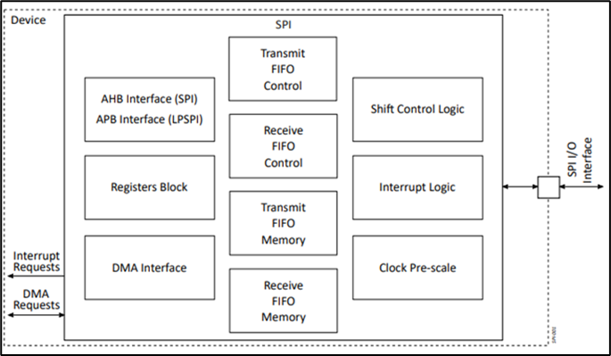
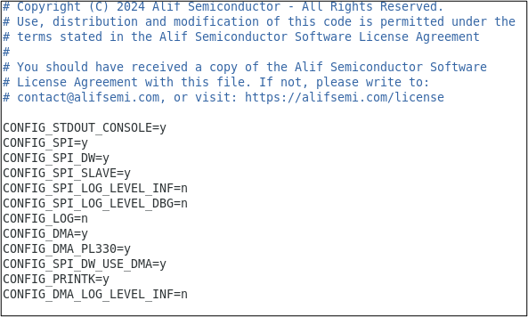
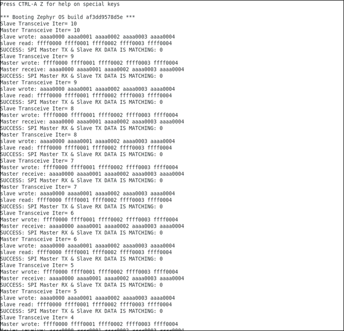

.. _spi:

===
SPI
===

Introduction
============

The Serial Peripheral Interface (SPI) module is a programmable low pin count, full-duplex master or slave synchronous serial interface. The device includes up to four SPI modules in Shared Peripherals and one Low-Power SPI module (LPSPI) in the RTSS-HE. SPI instances can be configured as both master and slave devices, but LPSPI only works in master mode. Programmable data item size (4 to 32 bits) is supported for each data transfer. SPI is connected to the AHB interface, and LPSPI is connected to the APB interface.

   SPI Block Diagram (Contains Synopsys proprietary information. Used with permission)

Application Description
=======================

This document describes two demo applications available on the Alif DevKit:

**LPSPI (Master) to SPI0 (Slave) Data Transfer**: This demo application demonstrates data transfer between the LPSPI peripheral as master and SPI0 peripheral as slave. It is specifically designed to run on the M55-HE core, which is the only core with access to the LPSPI instance. This application is DMA enabled. DMA can be disabled by configuring ``CONFIG_SPI_DW_USE_DMA=n`` in the ``prj.conf`` file.

**SPI0 (Master) to SPI1 (Slave) Data Transfer**: This demo application showcases data transfer between the SPI0 peripheral as master and the SPI1 peripheral as slave. This application can be executed on either the M55-HE or M55-HP cores. By default, this application has DMA enabled. DMA can be disabled by configuring ``CONFIG_SPI_DW_USE_DMA=n`` in the ``prj.conf`` file.

Prerequisites
===============

Hardware Requirements
---------------------

**SPI IP**: The SoC utilizes Synopsys SPI controllers, with four SPI instances based on AHB SPI controllers and the LPSPI instance using an APB SPI controller.

Software Requirements
-----------------------

The following software and drivers are required to run the Zephyr SPI application:

- Alif Zephyr SDK (v0.5.0)
  - SPI driver
  - Sample application

Building SPI Application in Zephyr
===================================

Follow these steps to build your Zephyr-based SPI application using the GCC compiler and the Alif Zephyr SDK:

.. note::
   The build commands shown here are specifically for the Alif E7 DevKit.
   To build the application for other boards, please modify the board name in the build command accordingly. For more information, refer to the ZAS User Guide.

1. Set up the environment by adding the necessary tools to your PATH:

   .. code-block:: bash

      export PATH=$PATH:$HOME/.local/bin

2. F1. For instructions on fetching the Alif Zephyr SDK, please refer to the `ZAS User Guide`_

3. Remove the existing build directory and build the SPI application:

   If using the M55-HP core, the application will fetch SPI0 and SPI1 instances:

   .. code-block:: bash

      rm -rf build
      west build -b alif_e7_dk_rtss_hp ../alif/samples/drivers/spi_dw -p

   If using the M55-HE core, the application will fetch SPI0 and LPSPI instances:

   .. code-block:: bash

      rm -rf build
      west build -b alif_e7_dk_rtss_he ../alif/samples/drivers/spi_dw -p

Once the build command completes successfully, executable images will be generated and placed in the `build/zephyr` directory. Both `.bin` (binary) and `.elf` (Executable and Linkable Format) files will be available.

**DMA Configuration**

By default, the Alif Zephyr SDK v0.5.0 enables DMA (Direct Memory Access) support for SPI transactions. To disable Tx/Rx with DMA on SPI, set the following in ``../alif/samples/drivers/spi_dw/prj.conf``:

.. code-block:: bash

   CONFIG_SPI_DW_USE_DMA=n

      Proj.conf Settings

Executing Binary on the DevKit
===============================

To execute binaries on the DevKit follow the command

.. code-block:: bash

   west flash

Validating SPI
==============

Output Logs
-----------

   Validation of SPI Functionality on DevKit-E7 Board