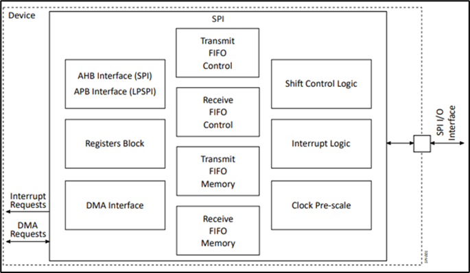

.. _spi:

===
SPI
===

Introduction
============

The Serial Peripheral Interface (SPI) module is a programmable low pin count, full-duplex master or slave synchronous serial interface. The device includes up to four SPI modules in Shared Peripherals and one Low-Power SPI module (LP SPI) in the RTSS-HE. SPI instances can be configured as both master and slave devices, but LP SPI only works in master mode. Programmable data item size (4 to 32 bits) is supported for each data transfer. SPI is connected to the AHB interface, and LP SPI is connected to the APB interface.

   SPI Block Diagram (Contains Synopsys proprietary information. Used with permission)

Application Description
=======================

This document describes two demo applications available on the Alif DevKit:

**LP SPI (Master) to SPI0 (Slave) Data Transfer**: This demo application demonstrates data transfer between the LP SPI peripheral as master and SPI0 peripheral as slave. It is specifically designed to run on the M55-HE core, which is the only core with access to the LP SPI instance. This application is DMA enabled. DMA can be disabled by configuring ``CONFIG_SPI_DW_USE_DMA=n`` in the ``prj.conf`` file.

**SPI0 (Master) to SPI1 (Slave) Data Transfer**: This demo application showcases data transfer between the SPI0 peripheral as master and the SPI1 peripheral as slave. This application can be executed on either the M55-HE or M55-HP cores. By default, this application has DMA enabled. DMA can be disabled by configuring ``CONFIG_SPI_DW_USE_DMA=n`` in the ``prj.conf`` file.

.. include:: prerequisites.rst

.. include:: note.rst

Build an SPI Application with Zephyr
========================================

Follow these steps to build the SPI application using the Alif Zephyr SDK:

1. For instructions on fetching the Alif Zephyr SDK and navigating to the Zephyr repository, refer to the `ZAS User Guide`_.

.. note::
   The build commands shown here are specifically for the Alif E7 DevKit.
   For the build commands for every supported target, refer to :ref:`SPI build commands <build-commands-spi>`.

2. Build command for application on the M55 HP core, application will fetch SPI0 and SPI1 instances:

.. code-block:: console

   west build -p always \
   -b alif_e7_dk/ae722f80f55d5xx/rtss_hp \
   ../alif/samples/drivers/spi_dw -S alif-dk

3. Build command for application on the M55 HE core, application will fetch SPI0 and LP SPI instances:

.. code-block:: console

   west build -p always \
   -b alif_e7_dk/ae722f80f55d5xx/rtss_he \
   ../alif/samples/drivers/spi_dw -S alif-dk

Once the build command completes successfully, executable images will be generated and placed in the ``build/zephyr`` directory. Both ``.bin`` (binary) and ``.elf`` (Executable and Linkable Format) files will be available.

**DMA Configuration**

By default, the Alif Zephyr SDK enables DMA (Direct Memory Access) support for SPI transactions. To disable Tx/Rx with DMA on SPI, set the following in ``../alif/samples/drivers/spi_dw/prj.conf``:

.. code-block:: console

   CONFIG_SPI_DW_USE_DMA=n

Proj.conf Settings
---------------------

.. code-block:: text

    # Copyright (C) 2024 Alif Semiconductor - All Rights Reserved.
    # Use, distribution and modification of this code is permitted under the
    # terms stated in the Alif Semiconductor Software License Agreement
    #
    # You should have received a copy of the Alif Semiconductor Software
    # License Agreement with this file. If not, please write to:
    # contact@alifsemi.com, or visit: https://alifsemi.com/license

    CONFIG_STDOUT_CONSOLE=y
    CONFIG_SPI=y
    CONFIG_SPI_DW=y
    CONFIG_SPI_SLAVE=y
    CONFIG_SPI_LOG_LEVEL_INF=n
    CONFIG_SPI_LOG_LEVEL_DBG=n
    CONFIG_LOG=n
    CONFIG_DMA=y
    CONFIG_DMA_PL330=y
    CONFIG_SPI_DW_USE_DMA=y
    CONFIG_PRINTK=y
    CONFIG_DMA_LOG_LEVEL_INF=n

Executing Binary on the DevKit
===============================

To execute the binary on the DevKit, follow the command:

.. code-block:: bash

   west flash

Console Output
===============

SPI Output Logs for HP
-----------------------

.. code-block:: text

    *** Booting Zephyr OS build ***
    Slave Transceive Iter= 10
    Master Transceive Iter= 10
    Master wrote: a5a50000 a5a50001 a5a50002 a5a50003 a5a50004
    Master receive: 5a5a0000 5a5a0001 5a5a0002 5a5a0003 5a5a0004
    SUCCESS: SPI Master RX & Slave TX DATA IS MATCHING: 0
    slave wrote: 5a5a0000 5a5a0001 5a5a0002 5a5a0003 5a5a0004
    slave read: a5a50000 a5a50001 a5a50002 a5a50003 a5a50004
    SUCCESS: SPI Master TX & Slave RX DATA IS MATCHING: 0
    Slave Transceive Iter= 9
    Master Transceive Iter= 9
    Master wrote: a5a50000 a5a50001 a5a50002 a5a50003 a5a50004
    Master receive: 5a5a0000 5a5a0001 5a5a0002 5a5a0003 5a5a0004
    SUCCESS: SPI Master RX & Slave TX DATA IS MATCHING: 0
    slave wrote: 5a5a0000 5a5a0001 5a5a0002 5a5a0003 5a5a0004
    slave read: a5a50000 a5a50001 a5a50002 a5a50003 a5a50004
    SUCCESS: SPI Master TX & Slave RX DATA IS MATCHING: 0
    Slave Transceive Iter= 8
    Master Transceive Iter= 8
    Master wrote: a5a50000 a5a50001 a5a50002 a5a50003 a5a50004
    Master receive: 5a5a0000 5a5a0001 5a5a0002 5a5a0003 5a5a0004
    SUCCESS: SPI Master RX & Slave TX DATA IS MATCHING: 0
    slave wrote: 5a5a0000 5a5a0001 5a5a0002 5a5a0003 5a5a0004
    slave read: a5a50000 a5a50001 a5a50002 a5a50003 a5a50004
    SUCCESS: SPI Master TX & Slave RX DATA IS MATCHING: 0
    Slave Transceive Iter= 7
    Master Transceive Iter= 7
    Master wrote: a5a50000 a5a50001 a5a50002 a5a50003 a5a50004
    Master receive: 5a5a0000 5a5a0001 5a5a0002 5a5a0003 5a5a0004
    SUCCESS: SPI Master RX & Slave TX DATA IS MATCHING: 0
    slave wrote: 5a5a0000 5a5a0001 5a5a0002 5a5a0003 5a5a0004
    slave read: a5a50000 a5a50001 a5a50002 a5a50003 a5a50004
    SUCCESS: SPI Master TX & Slave RX DATA IS MATCHING: 0
    Slave Transceive Iter= 6
    Master Transceive Iter= 6
    Master wrote: a5a50000 a5a50001 a5a50002 a5a50003 a5a50004
    Master receive: 5a5a0000 5a5a0001 5a5a0002 5a5a0003 5a5a0004
    SUCCESS: SPI Master RX & Slave TX DATA IS MATCHING: 0
    slave wrote: 5a5a0000 5a5a0001 5a5a0002 5a5a0003 5a5a0004
    slave read: a5a50000 a5a50001 a5a50002 a5a50003 a5a50004
    SUCCESS: SPI Master TX & Slave RX DATA IS MATCHING: 0
    Slave Transceive Iter= 5
    Master Transceive Iter= 5
    Master wrote: a5a50000 a5a50001 a5a50002 a5a50003 a5a50004
    Master receive: 5a5a0000 5a5a0001 5a5a0002 5a5a0003 5a5a0004
    SUCCESS: SPI Master RX & Slave TX DATA IS MATCHING: 0
    slave wrote: 5a5a0000 5a5a0001 5a5a0002 5a5a0003 5a5a0004
    slave read: a5a50000 a5a50001 a5a50002 a5a50003 a5a50004
    SUCCESS: SPI Master TX & Slave RX DATA IS MATCHING: 0
    Slave Transceive Iter= 4
    Master Transceive Iter= 4
    Master wrote: a5a50000 a5a50001 a5a50002 a5a50003 a5a50004
    Master receive: 5a5a0000 5a5a0001 5a5a0002 5a5a0003 5a5a0004
    SUCCESS: SPI Master RX & Slave TX DATA IS MATCHING: 0
    slave wrote: 5a5a0000 5a5a0001 5a5a0002 5a5a0003 5a5a0004
    slave read: a5a50000 a5a50001 a5a50002 a5a50003 a5a50004
    SUCCESS: SPI Master TX & Slave RX DATA IS MATCHING: 0
    Slave Transceive Iter= 3
    Master Transceive Iter= 3
    Master wrote: a5a50000 a5a50001 a5a50002 a5a50003 a5a50004
    Master receive: 5a5a0000 5a5a0001 5a5a0002 5a5a0003 5a5a0004
    SUCCESS: SPI Master RX & Slave TX DATA IS MATCHING: 0
    slave wrote: 5a5a0000 5a5a0001 5a5a0002 5a5a0003 5a5a0004
    slave read: a5a50000 a5a50001 a5a50002 a5a50003 a5a50004
    SUCCESS: SPI Master TX & Slave RX DATA IS MATCHING: 0
    Slave Transceive Iter= 2
    Master Transceive Iter= 2
    Master wrote: a5a50000 a5a50001 a5a50002 a5a50003 a5a50004
    Master receive: 5a5a0000 5a5a0001 5a5a0002 5a5a0003 5a5a0004
    SUCCESS: SPI Master RX & Slave TX DATA IS MATCHING: 0
    slave wrote: 5a5a0000 5a5a0001 5a5a0002 5a5a0003 5a5a0004
    slave read: a5a50000 a5a50001 a5a50002 a5a50003 a5a50004
    SUCCESS: SPI Master TX & Slave RX DATA IS MATCHING: 0
    Slave Transceive Iter= 1
    Master Transceive Iter= 1
    Master wrote: a5a50000 a5a50001 a5a50002 a5a50003 a5a50004
    Master receive: 5a5a0000 5a5a0001 5a5a0002 5a5a0003 5a5a0004
    SUCCESS: SPI Master RX & Slave TX DATA IS MATCHING: 0
    slave wrote: 5a5a0000 5a5a0001 5a5a0002 5a5a0003 5a5a0004
    slave read: a5a50000 a5a50001 a5a50002 a5a50003 a5a50004
    SUCCESS: SPI Master TX & Slave RX DATA IS MATCHING: 0
    Slave Transfer Successfully Completed
    Master Transfer Successfully Completed

SPI Output Logs for HE
-----------------------

.. code-block:: text

    *** Booting Zephyr OS build ***
    Slave Transceive Iter= 10
    Master Transceive Iter= 10
    Master wrote: a5a50000 a5a50001 a5a50002 a5a50003 a5a50004
    Master receive: 5a5a0000 5a5a0001 5a5a0002 5a5a0003 5a5a0004
    SUCCESS: SPI Master RX & Slave TX DATA IS MATCHING: 0
    slave wrote: 5a5a0000 5a5a0001 5a5a0002 5a5a0003 5a5a0004
    slave read: a5a50000 a5a50001 a5a50002 a5a50003 a5a50004
    SUCCESS: SPI Master TX & Slave RX DATA IS MATCHING: 0
    Slave Transceive Iter= 9
    Master Transceive Iter= 9
    Master wrote: a5a50000 a5a50001 a5a50002 a5a50003 a5a50004
    Master receive: 5a5a0000 5a5a0001 5a5a0002 5a5a0003 5a5a0004
    SUCCESS: SPI Master RX & Slave TX DATA IS MATCHING: 0
    slave wrote: 5a5a0000 5a5a0001 5a5a0002 5a5a0003 5a5a0004
    slave read: a5a50000 a5a50001 a5a50002 a5a50003 a5a50004
    SUCCESS: SPI Master TX & Slave RX DATA IS MATCHING: 0
    Slave Transceive Iter= 8
    Master Transceive Iter= 8
    Master wrote: a5a50000 a5a50001 a5a50002 a5a50003 a5a50004
    Master receive: 5a5a0000 5a5a0001 5a5a0002 5a5a0003 5a5a0004
    SUCCESS: SPI Master RX & Slave TX DATA IS MATCHING: 0
    slave wrote: 5a5a0000 5a5a0001 5a5a0002 5a5a0003 5a5a0004
    slave read: a5a50000 a5a50001 a5a50002 a5a50003 a5a50004
    SUCCESS: SPI Master TX & Slave RX DATA IS MATCHING: 0
    Slave Transceive Iter= 7
    Master Transceive Iter= 7
    Master wrote: a5a50000 a5a50001 a5a50002 a5a50003 a5a50004
    Master receive: 5a5a0000 5a5a0001 5a5a0002 5a5a0003 5a5a0004
    SUCCESS: SPI Master RX & Slave TX DATA IS MATCHING: 0
    slave wrote: 5a5a0000 5a5a0001 5a5a0002 5a5a0003 5a5a0004
    slave read: a5a50000 a5a50001 a5a50002 a5a50003 a5a50004
    SUCCESS: SPI Master TX & Slave RX DATA IS MATCHING: 0
    Slave Transceive Iter= 6
    Master Transceive Iter= 6
    Master wrote: a5a50000 a5a50001 a5a50002 a5a50003 a5a50004
    Master receive: 5a5a0000 5a5a0001 5a5a0002 5a5a0003 5a5a0004
    SUCCESS: SPI Master RX & Slave TX DATA IS MATCHING: 0
    slave wrote: 5a5a0000 5a5a0001 5a5a0002 5a5a0003 5a5a0004
    slave read: a5a50000 a5a50001 a5a50002 a5a50003 a5a50004
    SUCCESS: SPI Master TX & Slave RX DATA IS MATCHING: 0
    Slave Transceive Iter= 5
    Master Transceive Iter= 5
    Master wrote: a5a50000 a5a50001 a5a50002 a5a50003 a5a50004
    Master receive: 5a5a0000 5a5a0001 5a5a0002 5a5a0003 5a5a0004
    SUCCESS: SPI Master RX & Slave TX DATA IS MATCHING: 0
    slave wrote: 5a5a0000 5a5a0001 5a5a0002 5a5a0003 5a5a0004
    slave read: a5a50000 a5a50001 a5a50002 a5a50003 a5a50004
    SUCCESS: SPI Master TX & Slave RX DATA IS MATCHING: 0
    Slave Transceive Iter= 4
    Master Transceive Iter= 4
    Master wrote: a5a50000 a5a50001 a5a50002 a5a50003 a5a50004
    Master receive: 5a5a0000 5a5a0001 5a5a0002 5a5a0003 5a5a0004
    SUCCESS: SPI Master RX & Slave TX DATA IS MATCHING: 0
    slave wrote: 5a5a0000 5a5a0001 5a5a0002 5a5a0003 5a5a0004
    slave read: a5a50000 a5a50001 a5a50002 a5a50003 a5a50004
    SUCCESS: SPI Master TX & Slave RX DATA IS MATCHING: 0
    Slave Transceive Iter= 3
    Master Transceive Iter= 3
    Master wrote: a5a50000 a5a50001 a5a50002 a5a50003 a5a50004
    Master receive: 5a5a0000 5a5a0001 5a5a0002 5a5a0003 5a5a0004
    SUCCESS: SPI Master RX & Slave TX DATA IS MATCHING: 0
    slave wrote: 5a5a0000 5a5a0001 5a5a0002 5a5a0003 5a5a0004
    slave read: a5a50000 a5a50001 a5a50002 a5a50003 a5a50004
    SUCCESS: SPI Master TX & Slave RX DATA IS MATCHING: 0
    Slave Transceive Iter= 2
    Master Transceive Iter= 2
    Master wrote: a5a50000 a5a50001 a5a50002 a5a50003 a5a50004
    Master receive: 5a5a0000 5a5a0001 5a5a0002 5a5a0003 5a5a0004
    SUCCESS: SPI Master RX & Slave TX DATA IS MATCHING: 0
    slave wrote: 5a5a0000 5a5a0001 5a5a0002 5a5a0003 5a5a0004
    slave read: a5a50000 a5a50001 a5a50002 a5a50003 a5a50004
    SUCCESS: SPI Master TX & Slave RX DATA IS MATCHING: 0
    Slave Transceive Iter= 1
    Master Transceive Iter= 1
    Master wrote: a5a50000 a5a50001 a5a50002 a5a50003 a5a50004
    Master receive: 5a5a0000 5a5a0001 5a5a0002 5a5a0003 5a5a0004
    SUCCESS: SPI Master RX & Slave TX DATA IS MATCHING: 0
    slave wrote: 5a5a0000 5a5a0001 5a5a0002 5a5a0003 5a5a0004
    slave read: a5a50000 a5a50001 a5a50002 a5a50003 a5a50004
    SUCCESS: SPI Master TX & Slave RX DATA IS MATCHING: 0
    Slave Transfer Successfully Completed
    Master Transfer Successfully Completed

SPI Power Management Sample
===========================

``samples/drivers/pm/spi_dw`` cycles through Zephyr power-management states and runs an SPI master/slave loopback after each wake. Received data is compared with the expected pattern. During each loopback, sleep states deeper than ``RUNTIME_IDLE`` are locked so the transfer finishes before the next state.

The PM states depend on the boot path:

* **S2RAM path** (TCM or SRAM0 retention): ``RUNTIME_IDLE`` → ``SUSPEND_TO_IDLE`` → S2RAM STANDBY → S2RAM STOP
* **SOFT_OFF path** (MRAM boot, no retention): ``RUNTIME_IDLE`` → ``SUSPEND_TO_IDLE`` → ``SOFT_OFF``. The system resets on wakeup.

.. note::

   Use the LPUART port for console logs on E1C and B1 DevKits.

Building and Running the PM Sample
-----------------------------------

Follow these steps to build the PM sample using the Alif Zephyr SDK.

For instructions on fetching the Alif Zephyr SDK and navigating to the Zephyr repository, refer to the `ZAS User Guide`_.

.. note::

   The build commands shown here are for the Alif E7 DevKit, except the SRAM0 builds, which are E8 only.
   E8, E1C, and B1 use the same snippets for the TCM and MRAM paths. Change only the board target.
   Refer to the `ZAS User Guide`_, under the section
   ``Setting Up and Building Zephyr Applications``.

HE Core — TCM Boot S2RAM (E7, E8, E1C, B1)
^^^^^^^^^^^^^^^^^^^^^^^^^^^^^^^^^^^^^^^^^^^

.. code-block:: console

   west build -p auto \
     -b alif_e7_dk/ae722f80f55d5xx/rtss_he \
     ../alif/samples/drivers/pm/spi_dw \
     -S spi-dw-pm-s2ram-tcm \
     -DCONFIG_FLASH_BASE_ADDRESS=0x0 \
     -DCONFIG_FLASH_LOAD_OFFSET=0x0 \
     -DCONFIG_FLASH_SIZE=256

HE Core — MRAM Boot SOFT_OFF (E7, E8, E1C, B1)
^^^^^^^^^^^^^^^^^^^^^^^^^^^^^^^^^^^^^^^^^^^^^^^

.. code-block:: console

   west build -p auto \
     -b alif_e7_dk/ae722f80f55d5xx/rtss_he \
     ../alif/samples/drivers/pm/spi_dw \
     -S spi-dw-pm-mram

HP Core — MRAM Boot SOFT_OFF (E7, E8)
^^^^^^^^^^^^^^^^^^^^^^^^^^^^^^^^^^^^^^

.. code-block:: console

   west build -p auto \
     -b alif_e7_dk/ae722f80f55d5xx/rtss_hp \
     ../alif/samples/drivers/pm/spi_dw \
     -S spi-dw-pm-mram

HE Core — SRAM0 S2RAM (E8 only)
^^^^^^^^^^^^^^^^^^^^^^^^^^^^^^^^

.. code-block:: console

   west build -p auto \
     -b alif_e8_dk/ae822fa0e5597xx0/rtss_he \
     ../alif/samples/drivers/pm/spi_dw \
     -S spi-dw-pm-s2ram-sram0

HP Core — SRAM0 S2RAM (E8 only)
^^^^^^^^^^^^^^^^^^^^^^^^^^^^^^^^

.. code-block:: console

   west build -p auto \
     -b alif_e8_dk/ae822fa0e5597xx0/rtss_hp \
     ../alif/samples/drivers/pm/spi_dw \
     -S spi-dw-pm-s2ram-sram0

PM Support Verification
-----------------------

A successful S2RAM run displays messages similar to the following. The log below is from an E7 DevKit HE core TCM-boot run with ``APP_PM_WAKEUP_DEBUG`` set to 0. Setting it to 1 in ``main.c`` also prints ``PM wakeup: NVIC ISPR[x] = 0x...`` on each resume.

.. code-block:: console

   *** Booting Zephyr OS build ***
   [00:00:00.000,000] <inf> pm_spi_dw: alif_e7_dk (S2RAM): SPI DW PM demo (RUNTIME_IDLE, SUSPEND_TO_IDLE, S2RAM STANDBY, S2RAM STOP)
   [00:00:00.000,000] <inf> pm_spi_dw: POWER STATE SEQUENCE:
   [00:00:00.000,000] <inf> pm_spi_dw: 1. PM_STATE_RUNTIME_IDLE
   [00:00:00.000,000] <inf> pm_spi_dw: 2. PM_STATE_SUSPEND_TO_IDLE
   [00:00:00.000,000] <inf> pm_spi_dw: 3. PM_STATE_SUSPEND_TO_RAM (substate 0: STANDBY)
   [00:00:00.000,000] <inf> pm_spi_dw: 4. PM_STATE_SUSPEND_TO_RAM (substate 1: STOP)
   [00:00:00.000,000] <inf> pm_spi_dw: [SPI Demo] before RUNTIME_IDLE
   [00:00:00.000,000] <inf> pm_spi_dw: Slave Transceive Iter= 1
   [00:00:00.101,000] <inf> pm_spi_dw: Master Transceive Iter= 1
   [00:00:00.107,000] <inf> pm_spi_dw: Master wrote: a5a50000 a5a50001 a5a50002 a5a50003 a5a50004
   [00:00:00.107,000] <inf> pm_spi_dw: Master receive: 5a5a0000 5a5a0001 5a5a0002 5a5a0003 5a5a0004
   [00:00:00.107,000] <inf> pm_spi_dw: SUCCESS: SPI Master RX & Slave TX DATA IS MATCHING: 0
   [00:00:00.107,000] <inf> pm_spi_dw: slave wrote: 5a5a0000 5a5a0001 5a5a0002 5a5a0003 5a5a0004
   [00:00:00.107,000] <inf> pm_spi_dw: slave read: a5a50000 a5a50001 a5a50002 a5a50003 a5a50004
   [00:00:00.107,000] <inf> pm_spi_dw: SUCCESS: SPI Master TX & Slave RX DATA IS MATCHING: 0
   ... (iterations 2-10, one per second) ...
   [00:00:09.170,000] <inf> pm_spi_dw: Slave Transfer Successfully Completed
   [00:00:10.171,000] <inf> pm_spi_dw: Master Transfer Successfully Completed
   [00:00:10.171,000] <inf> pm_spi_dw: Enter RUNTIME_IDLE sleep for (18000000 microseconds)
   [00:00:28.172,000] <inf> pm_spi_dw: Exited from RUNTIME_IDLE sleep
   [00:00:28.172,000] <inf> pm_spi_dw: Enter PM_STATE_SUSPEND_TO_IDLE for (10000 microseconds)
   [00:00:28.173,000] <inf> pm_spi_dw: PM enter: SUSPEND_TO_IDLE (substate 0)
   [00:00:28.173,000] <inf> pm_spi_dw: PM wakeup: SUSPEND_TO_IDLE (substate 0)
   [00:00:28.173,000] <inf> pm_spi_dw: PM exit: SUSPEND_TO_IDLE (substate 0)
   [00:00:28.183,000] <inf> pm_spi_dw: Exited from PM_STATE_SUSPEND_TO_IDLE
   [00:00:28.183,000] <inf> pm_spi_dw: [SPI Demo] after SUSPEND_TO_IDLE
   [00:00:28.183,000] <inf> pm_spi_dw: Slave Transceive Iter= 1
   [00:00:28.284,000] <inf> pm_spi_dw: Master Transceive Iter= 1
   [00:00:28.290,000] <inf> pm_spi_dw: Master wrote: a5a50000 a5a50001 a5a50002 a5a50003 a5a50004
   [00:00:28.290,000] <inf> pm_spi_dw: Master receive: 5a5a0000 5a5a0001 5a5a0002 5a5a0003 5a5a0004
   [00:00:28.290,000] <inf> pm_spi_dw: SUCCESS: SPI Master RX & Slave TX DATA IS MATCHING: 0
   [00:00:28.290,000] <inf> pm_spi_dw: slave wrote: 5a5a0000 5a5a0001 5a5a0002 5a5a0003 5a5a0004
   [00:00:28.290,000] <inf> pm_spi_dw: slave read: a5a50000 a5a50001 a5a50002 a5a50003 a5a50004
   [00:00:28.290,000] <inf> pm_spi_dw: SUCCESS: SPI Master TX & Slave RX DATA IS MATCHING: 0
   ... (iterations 2-10, one per second) ...
   [00:00:37.353,000] <inf> pm_spi_dw: Slave Transfer Successfully Completed
   [00:00:38.354,000] <inf> pm_spi_dw: Master Transfer Successfully Completed
   [00:00:38.354,000] <inf> pm_spi_dw: Enter PM_STATE_SUSPEND_TO_RAM (substate 0: STANDBY) for (6000000 microseconds)
   [00:00:38.355,000] <inf> pm_spi_dw: PM enter: SUSPEND_TO_IDLE (substate 0)
   [00:00:38.355,000] <inf> pm_spi_dw: PM wakeup: SUSPEND_TO_IDLE (substate 0)
   [00:00:38.355,000] <inf> pm_spi_dw: PM exit: SUSPEND_TO_IDLE (substate 0)
   [00:00:38.452,000] <inf> pm_spi_dw: PM enter: SUSPEND_TO_RAM (substate 0)
   [00:00:38.452,000] <inf> pm_spi_dw: PM wakeup: SUSPEND_TO_RAM (substate 0)
   [00:00:38.452,000] <inf> pm_spi_dw: PM exit: SUSPEND_TO_RAM (substate 0)
   [00:00:44.405,000] <inf> pm_spi_dw: === Resumed from PM_STATE_SUSPEND_TO_RAM (substate 0: STANDBY) ===
   [00:00:44.405,000] <inf> pm_spi_dw: [SPI Demo] after S2RAM STANDBY
   ... (10 transfer iterations, one per second) ...
   [00:00:53.575,000] <inf> pm_spi_dw: Slave Transfer Successfully Completed
   [00:00:54.576,000] <inf> pm_spi_dw: Master Transfer Successfully Completed
   [00:00:54.576,000] <inf> pm_spi_dw: Enter PM_STATE_SUSPEND_TO_RAM (substate 1: STOP) for (9000000 microseconds)
   [00:00:54.577,000] <inf> pm_spi_dw: PM enter: SUSPEND_TO_IDLE (substate 0)
   [00:00:54.577,000] <inf> pm_spi_dw: PM wakeup: SUSPEND_TO_IDLE (substate 0)
   [00:00:54.577,000] <inf> pm_spi_dw: PM exit: SUSPEND_TO_IDLE (substate 0)
   [00:00:54.674,000] <inf> pm_spi_dw: PM enter: SUSPEND_TO_RAM (substate 1)
   [00:00:54.674,000] <inf> pm_spi_dw: PM wakeup: SUSPEND_TO_RAM (substate 1)
   [00:00:54.674,000] <inf> pm_spi_dw: PM exit: SUSPEND_TO_RAM (substate 1)
   [00:01:03.622,000] <inf> pm_spi_dw: === Resumed from PM_STATE_SUSPEND_TO_RAM (substate 1: STOP) ===
   [00:01:03.622,000] <inf> pm_spi_dw: [SPI Demo] after S2RAM STOP
   ... (10 transfer iterations, one per second) ...
   [00:01:12.792,000] <inf> pm_spi_dw: Slave Transfer Successfully Completed
   [00:01:13.793,000] <inf> pm_spi_dw: Master Transfer Successfully Completed
   [00:01:13.793,000] <inf> pm_spi_dw: === SPI DW PM SEQUENCE COMPLETED ===
