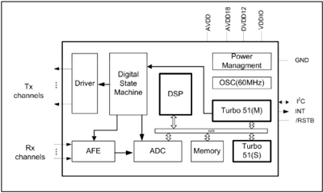
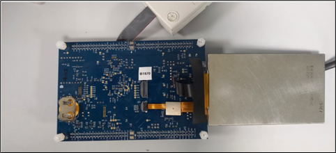
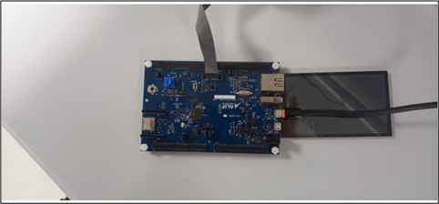

.. _appnote-gt911-touchscreen:

=================
GT911 Touchscreen
=================

Introduction
============

The GT911 is a sophisticated 5-point capacitive touch solution tailored for 7" to 8" Mobile Internet Devices (MIDs). It features up to 26 transmitter electrodes and 14 receiver electrodes, which work together to enhance touch accuracy. The controller supports up to 5 concurrent touches, providing real-time tracking of touch position, motion trajectory, and touch area. It efficiently reports this information to the host system when required.

   GT911 Internal Diagram

The GT911 interfaces with the host through six key pins: VDD, GND, SCL, SDA, INT, and RESET. The INT pin can be triggered by a rising or falling edge, and when set as an input, it should remain floating with no internal pull-up or pull-down. The host controls the RESET pin by outputting high or low levels, with a recommendation to keep the RESET signal low for more than 100 microseconds for a reliable reset.

Communication with the host occurs via a standard I2C interface, with a maximum transmission rate of 400K bps. For communication speeds exceeding 200K bps, it's crucial to select an appropriate resistance for the external pull-up resistor on the I2C lines to ensure sharp signal edges on SCL and SDA. As a slave device, the GT911 uses a 7-bit address for identification, complemented by a Read/Write control bit, supporting two slave addresses:

.. list-table:: Address Configuration
   :widths: 20 20 20
   :header-rows: 1

   * - 7-bit Address
     - 8-bit Write Address
     - 8-bit Read Address
   * - 0x5D
     - 0xBA
     - 0xBB
   * - 0x14
     - 0x28
     - 0x29

After each power-on or reset, the I2C address must be set via the INT pin, ensuring proper communication setup.

The GT911 touch controller is designed to deliver high precision and reliability for touch-based interfaces in MIDs, with straightforward integration into systems via I2C. Its robust performance and multi-touch capabilities make it an excellent choice for enhancing user interaction in various applications.

Hardware Requirements and Setup
===============================

Hardware Requirements
---------------------

**GT911**

The GT911 is a 5-point capacitive touch solution designed for 7” to 8” MIDs. It incorporates up to 26 transmitter electrodes and 14 receiver electrodes to enhance touch accuracy.

Main features of GT911:

- Utilizes the standard I2C interface.
- Operates in slave mode.
- Supports host interface voltage ranging from 1.8 V to 3.3 V.
- Reports touch coordinates in real time at a rate of 100Hz.
- Integrated with HotKnot technology.
- Single power supply with an internal 1.8V LDO.
- Embedded flash memory, allowing for in-system reprogramming.
- Unified software that can be applied to capacitive touch screens of various sizes.
- 26 transmitter (Tx) channels and 14 receiver (Rx) channels for precise touch detection.
- Compatible with capacitive touch screen sizes ranging from 7” to 8”.

**I2C Controller**

The I2C Intellectual Property (IP) is supplied by Synopsys DesignWare and is a part of the SoC ALIF Semiconductor. It is employed for communication between the System-on-Chip (SoC) and the GT911 Touch Sensor.

Hardware Connections
--------------------

   Rear Side Hardware Connections

   Front Side Hardware Connections

.. note:: When using a touchscreen, connect the second thinner cable to J23.

Configuration Features Required
-------------------------------

The following kernel configuration settings are required for GT911 touchscreen integration:

.. list-table:: Kernel Configuration Settings
   :widths: 40 20
   :header-rows: 1

   * - Configuration Option
     - Value
   * - CONFIG_INPUT_SHELL_KBD_MATRIX_STATE
     - n
   * - CONFIG_INPUT_GPIO_KEYS
     - n
   * - CONFIG_STDOUT_CONSOLE
     - y
   * - CONFIG_I2C_TARGET
     - y
   * - CONFIG_I2C
     - y
   * - CONFIG_I2C_DW_CLOCK_SPEED
     - 100
   * - CONFIG_INPUT_GT911_INTERRUPT
     - y

Software Requirements
=====================

To successfully run the GT911 touchscreen application, you'll need the following software components and drivers:

1. **GT911 Touchscreen Driver**:
   - Input GT911 Driver

2. **Input Subsystem Drivers**:
   - Input Util Driver
   - Input Driver

Building GT911 Touchscreen Application in Zephyr
=================================================

Follow these steps to prepare your Zephyr-based GT911 touchscreen application using the GCC compiler and the Alif Zephyr SDK:

1. For instructions on fetching the Alif Zephyr SDK and navigating to the Zephyr repository, please refer to the `ZAS User Guide`_

2. Remove the existing build directory and build the application:

.. note::
   The build commands shown here are specifically for the Alif E7 DevKit.
   To build the application for other boards, please modify the board name in the build command accordingly. For more information, refer to the ZAS User Guide.

2. Build commands for applications on the M55 HE core using the Ninja build command:

.. code-block:: bash

   rm -rf build
   west build -b alif_e7_dk_rtss_he samples/subsys/input/input_dump/

3. Build commands for applications on the M55 HP core using the Ninja build command:

.. code-block:: bash

   rm -rf build
   west build -b alif_e7_dk_rtss_hp samples/subsys/input/input_dump/

Executing Binary on the DevKit
==============================

To execute binaries on the DevKit follow the command

.. code-block:: bash

   west flash

Sample Output
=============

The following output is observed in the console:

.. code-block:: text

   *** Booting Zephyr OS build 94f6e05fad28 ***
   Input sample started
   I: input event: dev=gt911@5d         SYN type= 1 code=330 value=0
   I: input event: dev=gt911@5d         SYN type= 1 code=330 value=0
   I: input event: dev=gt911@5d         SYN type= 1 code=330 value=0
   I: input event: dev=gt911@5d             type= 3 code=  0 value=255
   I: input event: dev=gt911@5d             type= 3 code=  1 value=560
   I: input event: dev=gt911@5d         SYN type= 1 code=330 value=1
   I: input event: dev=gt911@5d             type= 3 code=  0 value=255
   I: input event: dev=gt911@5d             type= 3 code=  1 value=560
   I: input event: dev=gt911@5d         SYN type= 1 code=330 value=1
   I: input event: dev=gt911@5d             type= 3 code=  0 value=255
   I: input event: dev=gt911@5d             type= 3 code=  1 value=560
   I: input event: dev=gt911@5d         SYN type= 1 code=330 value=1
   I: input event: dev=gt911@5d             type= 3 code=  0 value=255
   I: input event: dev=gt911@5d             type= 3 code=  1 value=560
   I: input event: dev=gt911@5d         SYN type= 1 code=330 value=1
   I: input event: dev=gt911@5d             type= 3 code=  0 value=255
   I: input event: dev=gt911@5d             type= 3 code=  1 value=560
   I: input event: dev=gt911@5d         SYN type= 1 code=330 value=1
   I: input event: dev=gt911@5d             type= 3 code=  0 value=255
   I: input event: dev=gt911@5d             type=  3 code=  1 value=560
   I: input event: dev=gt911@5d         SYN type= 1 code=330 value=1

Observations
============

- The device is successfully communicating via the `/dev/ttyACM1` serial port.
- The Zephyr OS, with build 2d6231a778ac, is booting.
- The touchscreen successfully generates an interrupt when pressed and updates the coordinates accordingly.