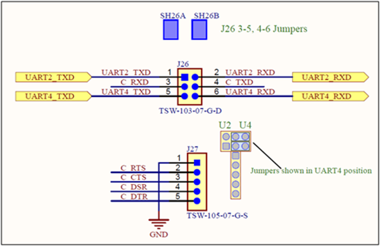

.. _appnote-zephyr-uart:

====
UART
====

Overview
----------

The Universal Asynchronous Receiver/Transmitter (UART) module implements an asynchronous serial communication interface based on standard Non-Return-to-Zero (NRZ) frame format. This application note describes how to use UART with Alif Semiconductor SoC.

   USER COM SELECT Jumper Diagram

Driver Description
==================

The SoC device includes:

- Up to eight UART modules in Shared Peripherals
- One Low-Power UART module (LPUART) in the RTSS-HE

Prerequisites
===============

Hardware Requirements
---------------------

To run the UART application, you need:

- **Alif Devkit**
- **Debugger: JLink (optional)**

Software Requirements
-----------------------

To develop and run UART applications on the Alif Devkit with Zephyr, you need:

- **Alif SDK**: Clone from `https://github.com/alifsemi/sdk-alif <https://github.com/alifsemi/sdk-alif>`_
- **West Tool**: For building Zephyr applications (installed via ``pip install west``)
- **Arm GCC Compiler**: For compiling the application (part of the Zephyr SDK)
- **SE Tools (optional)**: For loading binaries (refer to Alif documentation)

Hardware Connections and Setup
==============================

There is a total of 8 UART instances (UART0-UART7) and one LPUART available in the SoC. A particular UART instance can be selected using Pin-Muxing.

UART2 and UART4 are directly available on the board. With only the power cable and J26 jumper setting, the user can communicate to either UART2 or UART4. Refer to the DevKit schematic for details.

Building UART Application in Zephyr
===================================

Follow these steps to build the UART application using the Alif Zephyr SDK:

1. For instructions on fetching the Alif Zephyr SDK and navigating to the Zephyr repository, please refer to the `ZAS User Guide`_

.. note::
   The build commands shown here are specifically for the Alif E7 DevKit.
   To build the application for other boards, please modify the board name in the build command accordingly. For more information, refer to the ZAS User Guide.

2. Build commands for UART applications on the M55 HP core (default output on UART2) using the Ninja build command:

.. code-block:: bash

   rm -rf build
   west build -b alif_e7_dk_rtss_hp samples/drivers/uart/echo_bot/

3. Build commands for UART application on the M55 HE core (default output on UART4) using the Ninja build command:

.. code-block:: bash

   rm -rf build
   west build -b alif_e7_dk_rtss_he samples/drivers/uart/echo_bot/

4. Build commands for LPUART application on the M55 HE core using the Ninja build command:

.. code-block:: bash

   rm -rf build
   west build -b alif_e7_dk_rtss_he samples/drivers/uart/echo_bot/ \
       -DDTC_OVERLAY_FILE=/<Zephyr_dir>/alif/boards/arm/alif_e7_devkit/alif_e7_dk_rtss_he_LPUART.overlay

5. Build commands for LPUART application on the M55 HP core using the Ninja build command:

.. code-block:: bash

   rm -rf build
   west build -b alif_e7_dk_rtss_hp samples/drivers/uart/echo_bot/ \
       -DDTC_OVERLAY_FILE=/<Zephyr_dir>/alif/boards/arm/alif_e7_devkit/alif_e7_dk_rtss_he_LPUART.overlay

.. note::
   To address various scenarios, such as utilizing MRAM or flash addresses and employing alternative compilers like LLVM or ARMCLANG, refer to the document AUGD0008_Getting-Started-with-ZAS-for-Ensemble-v0.5.0-Beta.

Once the build command completes successfully, executable images will be generated and placed in the `build/zephyr` directory. Both `.bin` (binary) and `.elf` (Executable and Linkable Format) files will be available.

Executing Binary on the DevKit
==============================================

To execute binaries on the DevKit follow the command

.. code-block:: bash

   west flash