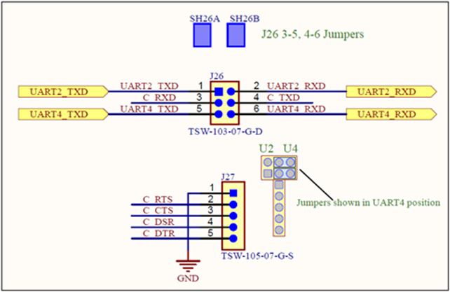

.. _appnote-zephyr-uart:

======
UART
======

Overview
=========

The Universal Asynchronous Receiver/Transmitter (UART) module implements an asynchronous serial communication interface based on standard Non-Return-to-Zero (NRZ) frame format. This application note describes how to use UART with Alif Semiconductor SoC.

   USER COM SELECT Jumper Diagram

Driver Description
--------------------

The SoC device includes:

- Up to eight UART modules in Shared Peripherals
- One Low-Power UART module (LPUART) in the RTSS-HE

.. include:: prerequisites.rst

Hardware Connections and Setup
--------------------------------

There is a total of 8 UART instances (UART0-UART7) and one LPUART available in the SoC. A particular UART instance can be selected using Pin-Muxing.

UART2 and UART4 are directly available on the board. With only the power cable and J26 jumper setting, the user can communicate to either UART2 or UART4. Refer to the DevKit schematic for details.

.. include:: note.rst

Build a UART Application with Zephyr
=====================================

Follow these steps to build the UART application using the Alif Zephyr SDK:

1. For instructions on fetching the Alif Zephyr SDK and navigating to the Zephyr repository, please refer to the `ZAS User Guide`_

.. note::
   The build commands shown here are specifically for the Alif E7 DevKit.
   To build the application for other boards, modify the board name in the build command accordingly. For more information, refer to the `ZAS User Guide`_, under the section *Setting Up and Building Zephyr Applications*.

2. Build command for UART application on the M55 HP core (default output on UART2):

.. code-block:: console

   west build -p always \
     -b alif_e7_dk/ae722f80f55d5xx/rtss_hp \
     samples/drivers/uart/echo_bot

3. Build command for UART application on the M55 HE core (default output on UART4):

.. code-block:: console

   west build -p always \
     -b alif_e7_dk/ae722f80f55d5xx/rtss_he \
     samples/drivers/uart/echo_bot

4. Build command for LPUART application on the M55 HE core using the ``lpuart`` snippet:

.. code-block:: console

   west build -p always \
     -b alif_e7_dk/ae722f80f55d5xx/rtss_he \
     -S lpuart \
     samples/drivers/uart/echo_bot

5. Build command for UART0 with hardware flow control (RTS/CTS) using the ``uart0-rts-cts`` snippet:

.. code-block:: console

   west build -p always \
     -b alif_e7_dk/ae722f80f55d5xx/rtss_he \
     -S uart0-rts-cts \
     samples/drivers/uart/echo_bot

By default, software pull-ups are enabled on the RTS/CTS lines. However, on some development kits, these lines may not be driven high due to pin multiplexing conflicts with other peripherals.
In such cases, it is recommended to use external pull-up resistors on the RTS/CTS lines to ensure proper operation.

Once the build command completes successfully, executable images will be generated and placed in the ``build/zephyr`` directory. Both ``.bin`` (binary) and ``.elf`` (Executable and Linkable Format) files will be available.

Executing Binary on the DevKit
=================================

To execute binaries on the DevKit follow the command

.. code-block:: console

   west flash

Console Output
===============

.. code-block:: text

  Hello! I'm your echo bot.
  Tell me something and press enter:
  Echo: hello
  Echo: Hello World

UART Snippets
==============

UART-related board overlays are organized as Zephyr snippets. Use the ``-S <snippet-name>`` flag
in the build command to apply them.

.. list-table::
   :header-rows: 1
   :widths: 20 60

   * - Snippet
     - Description
   * - ``lpuart``
     - Enables LPUART and sets it as the Zephyr shell UART.
   * - ``uart0-rts-cts``
     - Enables UART0 with hardware flow control (RTS/CTS) as shell UART.
   * - ``uart2-hfosc-clk``
     - Configures UART2 to use the HFOSC 38.4 MHz clock source.

Example usage:

.. code-block:: console

   west build -p always \
     -b alif_e7_dk/ae722f80f55d5xx/rtss_he \
     -S uart2-hfosc-clk \
     samples/drivers/uart/echo_bot

UART DMA Echo Application
============================

The ``echo_dma`` sample demonstrates UART data transmission and reception using
DMA-based transfers with the Zephyr asynchronous UART API. It receives data over
a DMA-enabled UART and echoes the received line back after the user presses Enter.

The application uses two separate UART instances:

- **Console UART** – used only for debug output via ``printk``.
- **Shell UART (DMA)** – used for RX and TX using DMA.

.. note::
   The console UART cannot be used as a DMA UART in this sample. The UART
   instance used for the console is initialized before the DMA controller
   during system boot. A separate Shell UART instance must be used for
   DMA-based communication.

Building the UART DMA Echo Application
-----------------------------------------

.. code-block:: console

   west build -p always \
     -b alif_e7_dk/ae722f80f55d5xx/rtss_he \
     -S alif-dk \
     ../alif/samples/drivers/uart/echo_dma

After flashing:

1. Connect to the **Console UART** to see debug messages.
2. Open a terminal connected to the **Shell UART (DMA)**.
3. Type anything and press **Enter** on Shell UART.

Console Output (debug):

.. code-block:: text

   UART DMA Echo Test
   Enabling UART RX DMA
   RX buffer request
   Type anything on Shell UART and press ENTER!
   DMA TX done
   DMA TX done
   DMA TX done

Shell UART (DMA) Output:

.. code-block:: text

   Hi! How are you!
   Echo:
   Hi! How are you!
