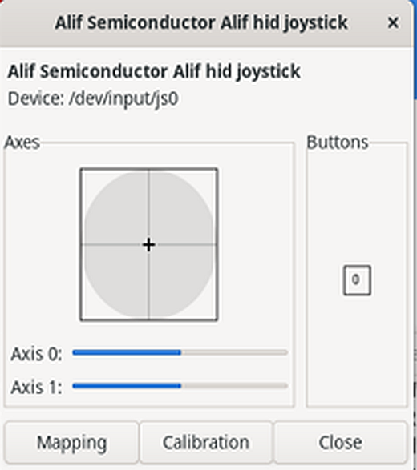

============
USB Device
============

Introduction
============

This application note describes how to build and run USB device samples on Alif DevKits using the Alif UDC driver (dwc3). The following samples are covered:

- CDC-ACM: enumerates as a USB virtual COM port
- MSC: enumerates as USB mass storage (RAM disk, SD card, and/or OSPI flash)
- HID Joystick: enumerates as a USB HID joystick
- CDC NCM: enumerates as a USB virtual Ethernet interface

USB Features
------------

- USB 2.0 High Speed (DWC3 UDC)
- CDC-ACM (virtual COM port)
- MSC (RAM disk, SD card, OSPI)
- HID Joystick (USB Human Interface Device)
- CDC NCM (virtual Ethernet)

.. include:: prerequisites.rst

.. include:: note.rst

Build a USB CDC-ACM Sample Application with Zephyr
==================================================

Follow these steps to build the USB CDC-ACM sample application using the Alif Zephyr
SDK:

1. For instructions on fetching the Alif Zephyr SDK and navigating to the Zephyr repository, refer to the `ZAS User Guide`_.

.. note::
   The build commands shown here are specifically for the Alif Boards.
   To build the application for other boards, modify the board name in the build command accordingly. For more information, refer to the `ZAS User Guide`_, under the section ``Setting Up and Building Zephyr Applications``.

2. Build command for the CDC-ACM sample application on Alif E7 DevKit (M55 HP):

.. code-block:: console

   west build \
     -b alif_e7_dk/ae722f80f55d5xx/rtss_hp \
     samples/subsys/usb/cdc_acm/ \
     -- \
     -DCONF_FILE=usbd_next_prj.conf \
     -DDTC_OVERLAY_FILE=boards/alif_usb.overlay

3. Build command for the CDC-ACM sample application on Alif E7 DevKit (M55 HE):

.. code-block:: console

   west build \
     -b alif_e7_dk/ae722f80f55d5xx/rtss_he \
     samples/subsys/usb/cdc_acm/ \
     -- \
     -DCONF_FILE=usbd_next_prj.conf \
     -DDTC_OVERLAY_FILE=boards/alif_usb.overlay

4. Build command for the CDC-ACM sample application on Alif E8 DevKit (M55 HP):

.. code-block:: console

   west build \
     -b alif_e8_dk/ae822fa0e5597xx0/rtss_hp \
     samples/subsys/usb/cdc_acm/ \
     -- \
     -DCONF_FILE=usbd_next_prj.conf \
     -DDTC_OVERLAY_FILE=boards/alif_usb.overlay

5. Build command for the CDC-ACM sample application on Alif E8 DevKit (M55 HE):

.. code-block:: console

   west build \
     -b alif_e8_dk/ae822fa0e5597xx0/rtss_he \
     samples/subsys/usb/cdc_acm/ \
     -- \
     -DCONF_FILE=usbd_next_prj.conf \
     -DDTC_OVERLAY_FILE=boards/alif_usb.overlay

6. Build command for the CDC-ACM sample application on Alif B1 DevKit (M55 HE):

.. code-block:: console

   west build \
     -b alif_b1_dk/ab1c1f4m51820hh0/rtss_he \
     samples/subsys/usb/cdc_acm/ \
     -- \
     -DCONF_FILE=usbd_next_prj.conf \
     -DDTC_OVERLAY_FILE=boards/alif_usb.overlay

7. Build command for the CDC-ACM sample application on Alif E1C DevKit (M55 HE):

.. code-block:: console

   west build \
     -b alif_e1c_dk/ae1c1f4051920hh/rtss_he \
     samples/subsys/usb/cdc_acm/ \
     -- \
     -DCONF_FILE=usbd_next_prj.conf \
     -DDTC_OVERLAY_FILE=boards/alif_usb.overlay

Once the build command completes successfully, executable images will be generated and placed in the ``build/zephyr`` directory. Both ``.bin`` (binary) and ``.elf`` (Executable and Linkable Format) files will be available.

Executing Binary on the DevKit
===============================

To execute binaries on the DevKit, follow the command:

.. code-block:: console

    west flash

Validation
============

To validate that the USB device has been correctly enumerated and is functioning as a virtual COM port, follow these steps:

**On Windows Host:**

1. Ensure the device is detected by checking **Device Manager** under **Ports (COM & LPT)**.
   The device should appear as a COM port (e.g., `COMx`).
2. Open the COM port using **Tera Term**.
3. Set the baud rate to **115200** and establish a connection.
4. Type characters in Tera Term—the device should echo them back, confirming bidirectional communication.

**On Linux Host:**

1. Verify device detection:

   .. code-block:: console

      ls /dev/ttyACM*

2. Open the serial port using **minicom**:

   .. code-block:: console

      sudo minicom -D /dev/ttyACM* -b 115200

3. Type characters in minicom. The device should echo them back, confirming bidirectional communication.

Console Output
===============

.. note::

   The ``Failed to add interface string descriptor`` message can appear during
   enumeration and does not prevent CDC-ACM operation.

.. code-block:: text

   [00:00:00.105,000] <err> usbd_cdc_acm: Failed to add interface string descriptor
   [00:00:00.105,000] <inf> cdc_acm_echo: USB device support enabled
   [00:00:00.105,000] <inf> cdc_acm_echo: Wait for DTR
   [00:00:00.206,000] <inf> cdc_acm_echo: USBD message: Bus reset
   [00:00:00.261,000] <inf> cdc_acm_echo: USBD message: VBUS ready
   [00:00:00.329,000] <inf> cdc_acm_echo: USBD message: New device configuration
   [00:00:00.335,000] <inf> cdc_acm_echo: USBD message: CDC ACM control line state
   [00:00:00.335,000] <inf> cdc_acm_echo: USBD message: CDC ACM line coding
   [00:00:00.335,000] <inf> cdc_acm_echo: Baudrate 115200
   [00:00:00.352,000] <inf> cdc_acm_echo: USBD message: CDC ACM line coding
   [00:00:00.352,000] <inf> cdc_acm_echo: Baudrate 115200
   [00:00:00.352,000] <inf> cdc_acm_echo: USBD message: CDC ACM control line state
   [00:00:00.352,000] <inf> cdc_acm_echo: DTR set
   [00:00:00.352,000] <inf> cdc_acm_echo: USBD message: CDC ACM line coding
   [00:00:00.352,000] <inf> cdc_acm_echo: Baudrate 115200

Build a USB MSC Sample Application with Zephyr
==============================================

This application note describes the implementation of the USB Mass Storage Class (MSC) device using Zephyr RTOS on the Alif platform. The solution leverages the DWC3 USB device controller to enumerate the Alif board as a USB mass storage device on the host system.

The application supports multiple storage backends, including RAM disk, SD card, and OSPI flash. Each storage medium can be configured independently, allowing the device to operate with any one of them or with all three simultaneously. When configured together, each storage type is exposed as a separate Logical Unit Number (LUN).

Upon successful enumeration, the host system detects and populates the configured storage media as individual mass storage devices. This allows the host to access each medium independently using standard file system operations such as read and write, similar to conventional USB storage devices.

Follow these steps to build the USB MSC sample application using the Alif Zephyr SDK:

For instructions on fetching the Alif Zephyr SDK and navigating to the Zephyr repository, refer to the `ZAS User Guide`_.

.. note::
   The build commands shown here are specifically for the Alif Boards.
   To build the application for other boards, modify the board name in the build command accordingly. For more information, refer to the `ZAS User Guide`_, under the section Setting Up and Building Zephyr Applications.

MSC with SD Support
-------------------

1. Build command for MSC sample application with SD support on Alif E7 DevKit (M55 HP):

.. code-block:: console

   west build \
     -b alif_e7_dk/ae722f80f55d5xx/rtss_hp \
     samples/subsys/usb/mass/ \
     "-DCONF_FILE=usbd_next_prj.conf;boards/alif_msc_sd.conf" \
     -S alif-msc-sd

2. Build command for MSC sample application with SD support on Alif E7 DevKit (M55 HE):

.. code-block:: console

   west build \
     -b alif_e7_dk/ae722f80f55d5xx/rtss_he \
     samples/subsys/usb/mass/ \
     "-DCONF_FILE=usbd_next_prj.conf;boards/alif_msc_sd.conf" \
     -S alif-msc-sd

3. Build command for MSC sample application with SD support on Alif E8 DevKit (M55 HP):

.. code-block:: console

   west build \
     -b alif_e8_dk/ae822fa0e5597xx0/rtss_hp \
     samples/subsys/usb/mass/ \
     "-DCONF_FILE=usbd_next_prj.conf;boards/alif_msc_sd.conf" \
     -S alif-msc-sd

4. Build command for MSC sample application with SD support on Alif E8 DevKit (M55 HE):

.. code-block:: console

   west build \
     -b alif_e8_dk/ae822fa0e5597xx0/rtss_he \
     samples/subsys/usb/mass/ \
     "-DCONF_FILE=usbd_next_prj.conf;boards/alif_msc_sd.conf" \
     -S alif-msc-sd

5. Build command for MSC sample application with SD support on Alif B1 DevKit (M55 HE):

.. code-block:: console

   west build \
     -b alif_b1_dk/ab1c1f4m51820hh0/rtss_he \
     samples/subsys/usb/mass/ \
     "-DCONF_FILE=usbd_next_prj.conf;boards/alif_msc_sd.conf" \
     -S alif-msc-sd

6. Build command for MSC sample application with SD support on Alif E1C DevKit (M55 HE):

.. code-block:: console

   west build \
     -b alif_e1c_dk/ae1c1f4051920hh/rtss_he \
     samples/subsys/usb/mass/ \
     "-DCONF_FILE=usbd_next_prj.conf;boards/alif_msc_sd.conf" \
     -S alif-msc-sd

Once the build command completes successfully, executable images will be generated and placed in the ``build/zephyr`` directory. Both ``.bin`` (binary) and ``.elf`` (Executable and Linkable Format) files will be available.

Executing Binary on the DevKit
===============================

To execute binaries on the DevKit, follow the command:

.. code-block:: console

    west flash

Validation of USB MSC Application
==================================

To validate the functionality of the USB Mass Storage (MSC) application on the Alif board, follow these steps:

1. Connect the Alif board to the host machine (Windows/Linux) via USB.
2. Ensure the board enumerates as a mass storage device (either RAMDISK or SD card or OSPI) on the host system (e.g., separate drives).
3. Test the file read and write operations by copying files to the board's storage.

Console Output with SD Support
==============================

.. code-block:: text

   *** Booting Zephyr OS build ***
   Mount /SD:: 0
   /SD:: bsize = 512 ; frsize = 8192 ; blocks = 1942592 ; bfree = 1942588
   /SD: opendir: 0
     D 0 System Volume Information
   End of files
   [00:00:05.878,000] <inf> main: The device is put in USB mass storage mode.
   [00:00:06.100,000] <inf> usbd_msc: Enable
   [00:00:06.100,000] <inf> usbd_msc: Bulk-Only Mass Storage Reset

MSC with RAMDISK Support
-------------------------

1. Build command for MSC sample application with RAMDISK support on Alif E7 DevKit (M55 HP):

.. code-block:: console

   west build \
     -b alif_e7_dk/ae722f80f55d5xx/rtss_hp \
     samples/subsys/usb/mass/ \
     -DCONF_FILE=usbd_next_prj.conf \
     "-DDTC_OVERLAY_FILE=boards/alif_usb.overlay;ramdisk.overlay"

2. Build command for MSC sample application with RAMDISK support on Alif E7 DevKit (M55 HE):

.. code-block:: console

   west build \
     -b alif_e7_dk/ae722f80f55d5xx/rtss_he \
     samples/subsys/usb/mass/ \
     -DCONF_FILE=usbd_next_prj.conf \
     "-DDTC_OVERLAY_FILE=boards/alif_usb.overlay;ramdisk.overlay"

3. Build command for MSC sample application with RAMDISK support on Alif E8 DevKit (M55 HP):

.. code-block:: console

   west build \
     -b alif_e8_dk/ae822fa0e5597xx0/rtss_hp \
     samples/subsys/usb/mass/ \
     -DCONF_FILE=usbd_next_prj.conf \
     "-DDTC_OVERLAY_FILE=boards/alif_usb.overlay;ramdisk.overlay"

4. Build command for MSC sample application with RAMDISK support on Alif E8 DevKit (M55 HE):

.. code-block:: console

   west build \
     -b alif_e8_dk/ae822fa0e5597xx0/rtss_he \
     samples/subsys/usb/mass/ \
     -DCONF_FILE=usbd_next_prj.conf \
     "-DDTC_OVERLAY_FILE=boards/alif_usb.overlay;ramdisk.overlay"

5. Build command for MSC sample application with RAMDISK support on Alif B1 DevKit (M55 HE):

.. code-block:: console

   west build \
     -b alif_b1_dk/ab1c1f4m51820hh0/rtss_he \
     samples/subsys/usb/mass/ \
     -DCONF_FILE=usbd_next_prj.conf \
     "-DDTC_OVERLAY_FILE=boards/alif_usb.overlay;ramdisk.overlay"

6. Build command for MSC sample application with RAMDISK support on Alif E1C DevKit (M55 HE):

.. code-block:: console

   west build \
     -b alif_e1c_dk/ae1c1f4051920hh/rtss_he \
     samples/subsys/usb/mass/ \
     -DCONF_FILE=usbd_next_prj.conf \
     "-DDTC_OVERLAY_FILE=boards/alif_usb.overlay;ramdisk.overlay"

Once the build command completes successfully, executable images will be generated and placed in the ``build/zephyr`` directory. Both ``.bin`` (binary) and ``.elf`` (Executable and Linkable Format) files will be available.

Executing Binary on the DevKit
===============================

To execute binaries on the DevKit, follow the command:

.. code-block:: console

    west flash

Console Output with RAMDISK Support
===================================

.. code-block:: text

   *** Booting Zephyr OS build ***
   [00:00:00.000,000] <inf> main: No file system selected
   [00:00:00.105,000] <inf> main: The device is put in USB mass storage mode.
   [00:00:00.328,000] <inf> usbd_msc: Enable
   [00:00:00.328,000] <inf> usbd_msc: Bulk-Only Mass Storage Reset

MSC with RAMDISK, SD Card and OSPI Support
------------------------------------------

.. note::

   When booting the application from TCM, ensure that the following
   configuration options are disabled or removed from the configuration file:

   * ``CONFIG_USE_DT_CODE_PARTITION``
   * ``CONFIG_FLASH_BASE_ADDRESS=0x80000000``

1. Build command for MSC sample application with RAMDISK, SD card and OSPI support on Alif E7 DevKit (M55 HP):

.. code-block:: console

   west build \
     -b alif_e7_dk/ae722f80f55d5xx/rtss_hp \
     ../alif/samples/subsys/usb/mass/ \
     -S alif-msc-ramdisk-ospi-sd

2. Build command for MSC sample application with RAMDISK, SD card and OSPI support on Alif E7 DevKit (M55 HE):

.. code-block:: console

   west build \
     -b alif_e7_dk/ae722f80f55d5xx/rtss_he \
     ../alif/samples/subsys/usb/mass/ \
     -S alif-msc-ramdisk-ospi-sd

3. Build command for MSC sample application with RAMDISK, SD card and OSPI support on Alif E8 DevKit (M55 HP):

.. code-block:: console

   west build \
     -b alif_e8_dk/ae822fa0e5597xx0/rtss_hp \
     ../alif/samples/subsys/usb/mass/ \
     -S alif-msc-ramdisk-ospi-sd

4. Build command for MSC sample application with RAMDISK, SD card and OSPI support on Alif E8 DevKit (M55 HE):

.. code-block:: console

   west build \
     -b alif_e8_dk/ae822fa0e5597xx0/rtss_he \
     ../alif/samples/subsys/usb/mass/ \
     -S alif-msc-ramdisk-ospi-sd

5. Build command for MSC sample application with RAMDISK, SD card and OSPI support on Alif B1 DevKit (M55 HE):

.. code-block:: console

   west build \
     -b alif_b1_dk/ab1c1f4m51820hh0/rtss_he \
     ../alif/samples/subsys/usb/mass/ \
     -S alif-msc-ramdisk-ospi-sd

6. Build command for MSC sample application with RAMDISK, SD card and OSPI support on Alif E1C DevKit (M55 HE):

.. code-block:: console

   west build \
     -b alif_e1c_dk/ae1c1f4051920hh/rtss_he \
     ../alif/samples/subsys/usb/mass/ \
     -S alif-msc-ramdisk-ospi-sd

Once the build command completes successfully, executable images will be generated and placed in the ``build/zephyr`` directory. Both ``.bin`` (binary) and ``.elf`` (Executable and Linkable Format) files will be available.

Executing Binary on the DevKit
===============================

To execute binaries on the DevKit, follow the command:

.. code-block:: console

    west flash

Console Output with RAMDISK, SD Card and OSPI Support
=====================================================

.. code-block:: text

   *** Booting Zephyr OS build 783f9469451a ***
   Area 0 at 0x0 on ospi_flash@0 for 67108864 bytes
   Mount /RAM:: 0
   /RAM:: bsize = 512 ; frsize = 512 ; blocks = 158 ; bfree = 158
   /RAM: opendir: 0
   End of files
   [00:00:01.100,000] <inf> flashdisk: Initialize device NAND
   [00:00:01.100,000] <inf> flashdisk: offset 0, sector size 512, page size 4096, volume size 67108864
   Mount /NAND:: 0
   /NAND:: bsize = 512 ; frsize = 4096 ; blocks = 16371 ; bfree = 16312
   /NAND: opendir: 0
     D 0 System Volume Information
     F 79027 CMSIS_driver_MSC.tdc
     F 45804 SDSIO_server_8kb.tdc
     F 47553 SDSIO_server_9kb.tdc
     F 47040 SDSIO_server_camera_with_usb.tdc
   End of files
   Mount /SD:: 0
   /SD:: bsize = 512 ; frsize = 4096 ; blocks = 1946112 ; bfree = 1946050
   /SD: opendir: 0
     D 0 System Volume Information
     F 5966 camera_with_usb.txt
     F 45804 SDSIO_server_8kb.tdc
     F 47553 SDSIO_server_9kb.tdc
     F 47040 SDSIO_server_camera_with_usb.tdc
     F 79027 CMSIS_driver_MSC.tdc
   End of files
   [00:00:20.445,000] <inf> main: The device is put in USB mass storage mode.
   [00:00:20.669,000] <inf> usbd_msc: Enable
   [00:00:20.669,000] <inf> usbd_msc: Bulk-Only Mass Storage Reset

Build a USB HID Joystick Sample Application with Zephyr
=======================================================

The USB HID Joystick sample (``samples/subsys/usb/hid-joystick``) demonstrates how to
implement a USB Human Interface Device (HID) Joystick using the Zephyr USB Device
stack.

The sample enumerates as a standard USB HID joystick on the host PC. The joystick
directions (Up, Down, Left, Right) and Center button are read through GPIOs and
reported as HID joystick events to the host.

The sample uses the USB HID class and a standard HID Joystick Report Descriptor to
expose the device as a generic joystick that can be detected by operating systems
such as Linux and Windows.

Alif E7 DevKit
---------------

Build for SoC variant ``ae722f80f55d5xx``, M55 HE core:

.. code-block:: console

   west build \
     -b alif_e7_dk/ae722f80f55d5xx/rtss_he \
     samples/subsys/usb/hid-joystick \
     -S alif-hid-joystick \
     -- \
     -DCONF_FILE=usbd_next_prj.conf

Build for SoC variant ``ae722f80f55d5xx``, M55 HP core:

.. code-block:: console

   west build \
     -b alif_e7_dk/ae722f80f55d5xx/rtss_hp \
     samples/subsys/usb/hid-joystick \
     -S alif-hid-joystick \
     -- \
     -DCONF_FILE=usbd_next_prj.conf

Alif E8 DevKit
---------------

Build for SoC variant ``ae822fa0e5597xx0``, M55 HE core:

.. code-block:: console

   west build \
     -b alif_e8_dk/ae822fa0e5597xx0/rtss_he \
     samples/subsys/usb/hid-joystick \
     -S alif-hid-joystick \
     -- \
     -DCONF_FILE=usbd_next_prj.conf

Build for SoC variant ``ae822fa0e5597xx0``, M55 HP core:

.. code-block:: console

   west build \
     -b alif_e8_dk/ae822fa0e5597xx0/rtss_hp \
     samples/subsys/usb/hid-joystick \
     -S alif-hid-joystick \
     -- \
     -DCONF_FILE=usbd_next_prj.conf

Alif E1C DevKit
---------------

Build for SoC variant ``ae1c1f4051920hh``, M55 HE core:

.. code-block:: console

   west build \
     -b alif_e1c_dk/ae1c1f4051920hh/rtss_he \
     samples/subsys/usb/hid-joystick \
     -S alif-hid-joystick \
     -- \
     -DCONF_FILE=usbd_next_prj.conf

Build Output
============

After a successful build, the generated images are available in
``build/zephyr``.

Generated files include:

* ``zephyr.bin`` - Binary image for programming the target.
* ``zephyr.elf`` - ELF image used for debugging.
* ``zephyr.map`` - Linker map file.

Executing Binary on the DevKit
==============================

To execute binaries on the DevKit, follow the command:

.. code-block:: console

   west flash

USB Enumeration
===============

After programming the board and connecting it to the host PC, the device enumerates
as a USB HID Joystick.

Example output:

.. code-block:: console

   [697020.214063] usb 3-3.1: USB disconnect, device number 110
   [697027.560397] usb 3-3.1: new high-speed USB device number 111 using xhci_hcd
   [697027.646064] usb 3-3.1: New USB device found, idVendor=2fe3,
   idProduct=0008, bcdDevice= 4.01
   [697027.646076] usb 3-3.1: New USB device strings: Mfr=1, Product=2,
   SerialNumber=3
   [697027.646080] usb 3-3.1: Product: Alif hid joystick
   [697027.646083] usb 3-3.1: Manufacturer: Alif Semiconductor
   [697027.646086] usb 3-3.1: SerialNumber: 3030303030303030
   [697027.653656] input: Alif Semiconductor Alif hid joystick as
   /devices/pci0000:00/0000:00:14.0/usb3/3-3/3-3.1/3-3.1:1.0/0003:2FE3:0008.0115/
   input/input285
   [697027.654008] hid-generic 0003:2FE3:0008.0115: input,hidraw0: USB HID
   v1.11 Joystick [Alif Semiconductor Alif hid joystick] on
   usb-0000:00:14.0-3.1/input0

HID Raw Report Verification
---------------------------

Follow these steps to verify the raw HID reports.

Step 1: Check the HID raw device
^^^^^^^^^^^^^^^^^^^^^^^^^^^^^^^^^

List all available HID raw devices:

.. code-block:: console

   ls -l /dev/hidraw*

Step 2: Capture the HID reports
^^^^^^^^^^^^^^^^^^^^^^^^^^^^^^^^

Capture the HID reports using ``hexdump``:

.. code-block:: console

   sudo hexdump -Cv /dev/hidraw0

Step 3: Move the joystick
^^^^^^^^^^^^^^^^^^^^^^^^^

Move the joystick in different directions and observe the HID report data.

Sample output:

.. code-block:: text

   00000000  00 ec 00 00 00 00 00 00 14 00 00 00 00 14 00 00  |................|
   00000010  00 00 00 00 ec 00 00 00 01 00 00 00 00 00 00 ec  |................|
   00000020  00 00 00 00 01 00 00 00 00 00 00 00 14 00 00 00  |................|
   00000030  01 00 00 00 00 00 00 ec 00 00 00 00 01 00 00 00  |................|
   00000040  00 00 00 00 14 00 00 00 01 00 00 00 00 00 00 ec  |................|
   00000050  00 00 00 00 00 00 ec 00 00 00 00 00 14 00 00 00  |................|
   00000060  01 00 00 00 00 00 00 ec 00 00 00 00 00 00 ec 00  |................|
   00000070  00 00 00 00 14 01 00 00 00 00 00 00 00 00 00 ec  |................|
   00000080  00 00 00 00 00 00 ec 00 00 00 01 00 00 00 00 00  |................|
   00000090  00 ec 00 00 00 00 00 00 ec 00 00 00 00 00 14 00  |................|
   000000a0  00 00 01 00 00 00 00 00 00 ec 00 00 00 00 00 00  |................|
   000000b0  ec 00 00 00 01 00 00 00 00 00 00 ec 00 00 00 00  |................|
   000000c0  00 00 ec 00 00 00 00 00 14 00 00 00 00 14 00 00  |................|

Graphical Joystick Verification
-------------------------------

The joystick can also be verified graphically using ``jstest-gtk``.

Step 1: Install the utility
^^^^^^^^^^^^^^^^^^^^^^^^^^^

Update the package list and install ``jstest-gtk``:

.. code-block:: console

   sudo apt update
   sudo apt install jstest-gtk

Step 2: Launch the application
^^^^^^^^^^^^^^^^^^^^^^^^^^^^^^

Launch ``jstest-gtk``:

.. code-block:: console

   jstest-gtk

Step 3: Select the joystick
^^^^^^^^^^^^^^^^^^^^^^^^^^^

The detected joystick appears as:

``Alif Semiconductor Alif hid joystick``

Open the **Properties** window.

   jstest-gtk joystick properties window

Step 4: Verify the joystick operation
^^^^^^^^^^^^^^^^^^^^^^^^^^^^^^^^^^^^^

Verify the following:

* X-axis movement updates correctly.
* Y-axis movement updates correctly.
* The button state changes when the joystick center button is pressed.
* Axis values return to the center position when the joystick is released.

USB CDC NCM Echo Server Sample
==============================

The **USB CDC NCM Echo Server** sample
(``samples/net/sockets/echo_server``) demonstrates TCP/IP communication over a
USB CDC Network Control Model (CDC NCM) connection.

The sample uses the USB CDC NCM class to expose the target device as a virtual
Ethernet interface to the host PC. Once the device is enumerated, the host can
communicate with the Zephyr device using standard networking utilities such as
**ping** and **netcat (nc)**.

The TCP echo server listens for incoming TCP connections on port **4242**.
Data received from the host is transmitted back to the host without
modification, allowing verification of USB CDC NCM networking, IPv4
connectivity, TCP communication, and data transfer.

Build a USB CDC NCM Echo Server Sample Application with Zephyr
==============================================================

Follow these steps to build the USB CDC NCM Echo Server sample application using the Alif Zephyr
SDK:

Alif E7 DevKit
---------------

Build for SoC variant ``ae722f80f55d5xx``, M55 HE core:

.. code-block:: console

   west build -p always \
     -b alif_e7_dk/ae722f80f55d5xx/rtss_he \
     samples/net/sockets/echo_server \
     -- \
     -DEXTRA_CONF_FILE="overlay-usbd_next.conf;boards/alif-cdc-ncm-common.conf" \
     -DDTC_OVERLAY_FILE=boards/alif-cdc-ncm-common.overlay

Build for SoC variant ``ae722f80f55d5xx``, M55 HP core:

.. code-block:: console

   west build -p always \
     -b alif_e7_dk/ae722f80f55d5xx/rtss_hp \
     samples/net/sockets/echo_server \
     -- \
     -DEXTRA_CONF_FILE="overlay-usbd_next.conf;boards/alif-cdc-ncm-common.conf" \
     -DDTC_OVERLAY_FILE=boards/alif-cdc-ncm-common.overlay

Alif E8 DevKit
---------------

Build for SoC variant ``ae822fa0e5597xx0``, M55 HE core:

.. code-block:: console

   west build -p always \
     -b alif_e8_dk/ae822fa0e5597xx0/rtss_he \
     samples/net/sockets/echo_server \
     -- \
     -DEXTRA_CONF_FILE="overlay-usbd_next.conf;boards/alif-cdc-ncm-common.conf" \
     -DDTC_OVERLAY_FILE=boards/alif-cdc-ncm-common.overlay

Build for SoC variant ``ae822fa0e5597xx0``, M55 HP core:

.. code-block:: console

   west build -p always \
     -b alif_e8_dk/ae822fa0e5597xx0/rtss_hp \
     samples/net/sockets/echo_server \
     -- \
     -DEXTRA_CONF_FILE="overlay-usbd_next.conf;boards/alif-cdc-ncm-common.conf" \
     -DDTC_OVERLAY_FILE=boards/alif-cdc-ncm-common.overlay

Alif E1C DevKit
----------------

Build for SoC variant ``ae1c1f4051920hh``, M55 HE core:

.. code-block:: console

   west build -p always \
     -b alif_e1c_dk/ae1c1f4051920hh/rtss_he \
     samples/net/sockets/echo_server \
     -- \
     -DEXTRA_CONF_FILE="overlay-usbd_next.conf;boards/alif-cdc-ncm-common.conf" \
     -DDTC_OVERLAY_FILE=boards/alif-cdc-ncm-common.overlay

Build Output
============

After a successful build, the generated images are available in the
``build/zephyr`` directory.

Generated files include:

* ``zephyr.bin`` - Binary image for programming the target.
* ``zephyr.elf`` - ELF image used for debugging.
* ``zephyr.map`` - Linker map file.

USB Enumeration
===============

After flashing the application and connecting the board to the Linux host PC,
the USB CDC NCM device is enumerated as a virtual Ethernet interface.

The Linux host displays messages similar to the following:

.. code-block:: console

   [3656409.313208] usb 3-3.4.4.2: Product: Alif CDC NCM Ethernet
   [3656409.313211] usb 3-3.4.4.2: Manufacturer: Alif Semiconductor
   [3656409.313214] usb 3-3.4.4.2: SerialNumber: 3030303030303030
   [3656409.339016] cdc_ncm 3-3.4.4.2:1.0: MAC-Address: 00:00:5e:00:53:01
   [3656409.339455] cdc_ncm 3-3.4.4.2:1.0 eth0: register 'cdc_ncm' \
   at usb-0000:00:14.0-3.4.4.2, CDC NCM (NO ZLP), 00:00:5e:00:53:01
   [3656409.358994] cdc_ncm 3-3.4.4.2:1.0 enx00005e005301: renamed from eth0

Network Configuration
=====================

The Zephyr device and Linux host use the following network configuration:

.. list-table::
   :header-rows: 1
   :widths: 25 35 40

   * - Device
     - Interface
     - IPv4 Address
   * - Alif device
     - ``eth0``
     - ``192.168.7.2/24``
   * - Linux host
     - ``enx00005e005301``
     - ``192.168.7.1/24``

Host-side Configuration
-----------------------

The USB CDC NCM interface can be configured on the Linux host using the
following commands.

#. Bring the USB CDC NCM interface up:

   .. code-block:: console

      sudo ip link set enx00005e005301 up

#. Assign the host IP address:

   .. code-block:: console

      sudo ip addr add 192.168.7.1/24 dev enx00005e005301

#. Verify the interface configuration:

   .. code-block:: console

      ip addr show enx00005e005301

Device-side Verification
-------------------------

On the Alif device UART console, run:

.. code-block:: console

   uart:~$ net iface

Expected output:

.. code-block:: console

   Hostname: zephyr

   Interface eth0 (0x200026a8) (Ethernet) [1]
   ===================================

   Link addr : 02:00:00:00:00:01
   MTU       : 1500
   Flags     : AUTO_START,IPv4,IPv6
   Device    : cdc_ncm_eth0 (0x8022dab0)

   Status    : oper=UP, admin=UP, carrier=ON

   Ethernet capabilities supported:
           10 Mbits

   Ethernet PHY device: <none> (0)

   IPv6 unicast addresses (max 3):
           fe80::ff:fe00:1 autoconf preferred infinite
           2001:db8::1 manual preferred infinite

   IPv6 multicast addresses (max 4):
           ff02::1
           ff02::1:ff00:1

   IPv6 prefixes (max 2):
           <none>

   IPv6 hop limit           : 64
   IPv6 base reachable time : 30000
   IPv6 reachable time      : 43118
   IPv6 retransmit timer    : 0

   IPv4 unicast addresses (max 2):
           192.168.7.2/255.255.255.0 manual preferred infinite

   IPv4 multicast addresses (max 2):
           224.0.0.1

   IPv4 gateway : 0.0.0.0

Ping Verification
=================

Ping from Zephyr Device to Linux Host
--------------------------------------

On the device UART console, run:

.. code-block:: console

   uart:~$ net ping 192.168.7.1

Sample output:

.. code-block:: console

   28 bytes from 192.168.7.1 to 192.168.7.2: icmp_seq=1 ttl=64 time=2.97 ms
   28 bytes from 192.168.7.1 to 192.168.7.2: icmp_seq=2 ttl=64 time=1.95 ms
   28 bytes from 192.168.7.1 to 192.168.7.2: icmp_seq=3 ttl=64 time=1.50 ms

Ping from Linux Host to Zephyr Device
-------------------------------------

On the Linux host, run:

.. code-block:: console

   ping 192.168.7.2

Sample output:

.. code-block:: console

   64 bytes from 192.168.7.2: icmp_seq=109 ttl=64 time=1.49 ms
   64 bytes from 192.168.7.2: icmp_seq=110 ttl=64 time=1.49 ms
   64 bytes from 192.168.7.2: icmp_seq=111 ttl=64 time=1.51 ms
   64 bytes from 192.168.7.2: icmp_seq=112 ttl=64 time=1.46 ms

   --- 192.168.7.2 ping statistics ---

   124 packets transmitted, 124 received, 0% packet loss, time 123173ms
   rtt min/avg/max/mdev = 1.416/1.480/1.584/0.027 ms

TCP Echo Server Verification
============================

Linux Host TCP Client
---------------------

The TCP echo server listens for incoming TCP connections on port ``4242``.

On the Linux host, use ``netcat`` (``nc``) to connect to the TCP echo server:

.. code-block:: console

   nc 192.168.7.2 4242

Once connected, enter test data.

For example:

.. code-block:: console

   Hello

Sample output:

.. code-block:: console

   Hello
   Hello

The first ``Hello`` is transmitted from the Linux host, and the second
``Hello`` is the echoed response from the Zephyr device.

Device-side TCP Echo Logs
-------------------------

The Zephyr device UART console displays logs similar to the following:

.. code-block:: console

   [00:14:24.569,000] <dbg> net_echo_server_sample:
   handle_data: TCP (IPv4): Received and replied with 5 bytes

   [00:14:36.337,000] <dbg> net_echo_server_sample:
   handle_data: TCP (IPv4): Received and replied with 2 bytes
