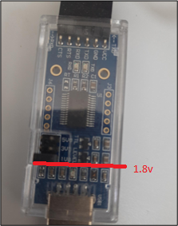
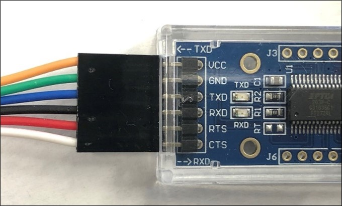
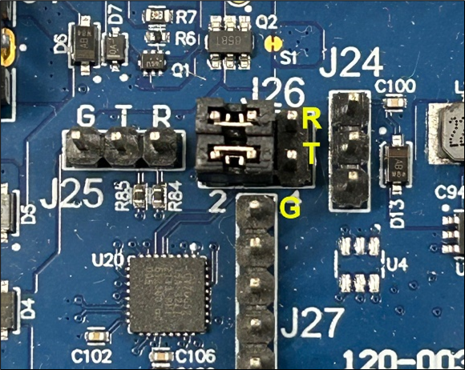
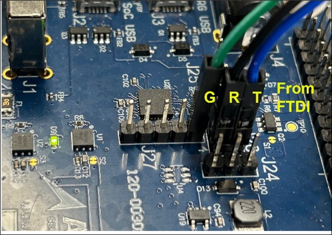

Hardware and Software Setup
============================
.. _connecting-usb-prg:

Serial Consoles
---------------
.. figure:: _static/connecting_usbprg.png
   :alt: USB PRG Cable and Jumper Connections
   :width: 400px
   :align: center

   *Connecting the USB PRG Cable and Configuring Jumper Connections for UART2*

The USB PRG J3 port has two available ports:

* SEUART port
* UART2 or UART4 port

To select between UART2 and UART4, adjust the J26 jumper settings:

* **UART2:** Connect jumpers to pins 1 and 3, and pins 2 and 4 (Figure 1).
* **UART4:** Connect jumpers to pins 3 and 5, and pins 4 and 6.

**Note**:

UART2 is used as the serial console for **RTSS-HP**, displaying boot-up messages. UART4 serves as the serial console for **RTSS-HE**, displaying RTSS-HE boot-up messages.
If you have to use both UART2 and UART4 FDTI connection is required.

**Important:** Ensure the FTDI module jumper is set to 1.8 V TTL before applying power to the board or plugging the FTDI module into a USB port to prevent damage. The jumper should be on the pins nearest to the USB connector (Figure 2).

   *Setting the Jumper on FTDI Module for 1.8 V TTL*

.. caution::

   Cable colors may vary. Verify the FTDI signal connections by the silkscreened signal names on the adapter PCB.

   *FTDI Connection for UART4*

To connect the FTDI UART cable between the host PC and the Devkit device (for UART4 serial console):

* **J26 pin 6 (UART4_RX)**: Connects to TXDATA (blue wire, or as indicated)
* **J26 pin 5 (UART4_TX)**: Connects to RXDATA (black wire, or as indicated)
* **J27 pin 1 (GND)**: Connects to GND (green wire, or as indicated)

   *UART4 Pin Connections for DevKit*

SETOOLS Installation
--------------------

Install the latest version of the Alif Security Toolkit (SETOOLS) following the instructions in the `Alif Security Toolkit Quick Start Guide`_.

