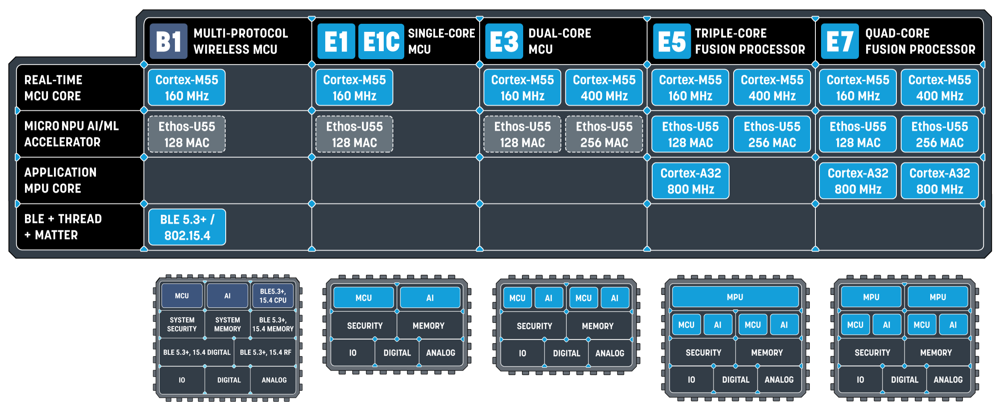
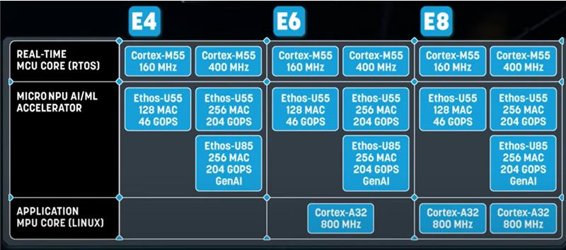

**Introduction**
================

In this user guide, we cover the following steps:

1. **Prerequisites for Building Zephyr OS:**
    - Understand the requirements for building Zephyr OS, a small Real-Time Operating System designed for connected, resource-constrained, and embedded devices for the real-time subsystems in Alif's devices.

2. **Building an Application Using the West Tool:**
    - West is Zephyr’s meta-tool for building and deploying binaries onto target hardware. Written in Python, West orchestrates CMake and Make commands and is supported on multiple host operating systems, including Linux, Windows and MacOS.

3. **Programming the Application Binary onto ITCM:**
    - Steps to program the application binary onto the ITCM of one of the real-time subsystems and booting the application.

4. **Running the Application from MRAM:**
    - Discover how to run applications directly from MRAM. Learn about the supported targets, specific MRAM boot addresses for RTSS-HE and RTSS-HP, and the necessary build commands.

Zephyr RTOS
-------------

The real-time subsystems boot with Zephyr OS, a small RTOS for connected, resource-constrained, and embedded devices. Zephyr supports multiple architectures and is available under the Apache 2.0 license.

Zephyr uses a meta-tool called `west` to execute Kconfig, CMake, and build system commands (Make or Ninja). CMake builds applications with the Zephyr kernel in two stages:

- **Configuration stage:** CMakeLists.txt build scripts are executed to generate host-native build scripts.

- **Build stage:** The generated build scripts are executed to compile the application.

Host Requirements
--------------------------

**Hardware Requirements**
~~~~~~~~~~~~~~~~~~~~~~~~~

Ensure you have one of the following Alif development kits to proceed with your project setup:

- Ensemble DevKit (DK-E7)
- Ensemble DevKit (DK-E8)
- Ensemble E1C DevKit (DK-E1C)
- Balletto DevKit (DK-B1)
- Ensemble AppKit (AK-E7)
- Ensemble AppKit (AK-E8)
- Ensemble E1C StarterKit (SK-E1C)
- Balletto StarterKit (SK-B1)

Ensure you have the following debugger available to proceed with your project setup:

- For debugging, use the J-Link debugger

**Software Requirements**
~~~~~~~~~~~~~~~~~~~~~~~~~

1. **For Host PC:**
    - Ubuntu 22.04.5 LTS or above.

2. **Alif Security Toolkit:**
    - SE version is 1.110

    * Available at `Alif Toolkit Download`_

**Alif MCU Families**
~~~~~~~~~~~~~~~~~~~~~

   Balletto and Ensemble Family

   Ensemble Gen2 Family

The Alif development board featuring an Alif multi-core SoC, offering both high-performance and low-power execution.

- **Ensemble DevKit (DK-E7):**
    - The Ensemble E7 DevKit (DK-E7) is a cost-effective, single-board solution that brings out all signals on the device to easily access pins for power and performance profiling, prototyping, and more. The DevKit can be configured to operate as your choice of the E1, E3, E5, or E7 series MCU devices in the Ensemble family, with superset E7 series device having two Cortex-M55 CPU cores, two Ethos-U55 neural network processors cores, and two Cortex-A32 MPU cores.

- **Ensemble DevKit (DK-E8):**
    - The Ensemble E8 DevKit (DK-E8) is a cost-effective, single-board solution that brings out all signals on the device to easily access pins for power and performance profiling, prototyping, and more. The DevKit can be configured to operate as your choice of the E4, E6, or E8 series MCU devices in the Ensemble family, with superset E8 series device having two Cortex-M55 CPU cores, two Ethos-U55 + one Ethos-U85 neural network processors cores, and two Cortex-A32 MPU cores.

- **Ensemble E1C DevKit (DK-E1C):**
    - The Ensemble E1C DevKit is a cost-effective, single-board platform that brings out all signals on the E1C MCU to easily access pins for power and performance profiling, prototyping, and more. The E1C MCU on the board has a Cortex M55 CPU core with Helium-M Vector Extension, operating at 160 MHz, an Ethos-U55 neural network processor core with 128 MACs per cycle, 2MB of SRAM and 1.9MB of NVM, off-chip OSPI flash and PSRAM memory devices (64MB and 32MB respectively), plus a variety of digital and analog interfaces.

- **Balletto DevKit (DK-B1):**
    - The Balletto B1 DevKit (DK-B1) is a cost-effective, single-board platform that brings out all signals on the Balletto B1 MCU to easily access pins for power and performance profiling, prototyping, and more. The B1 MCU on the board has a Cortex M-55 CPU core with Helium-M Vector Extension, operating at 160 MHz, an Ethos-U55 neural network processor core with 128 MACs per cycle, 2MB of SRAM and 1.8MB of NVM, off-chip OSPI flash and PSRAM memory devices (64MB and 32MB respectively), a variety of digital and analog interfaces, plus and a BLE 5.3 + 802.15.4 radio subsystem with a chip antenna.

- **Ensemble AppKit (AK-E7):**
    - The Ensemble E7 AI/ML AppKit (AK-E7-AIML) enables quick software development and evaluation for Endpoint Machine Learning use cases. Powered by an Alif Ensemble E7 fusion processor with four compute cores (two Arm Cortex-M55 and two Cortex-A32), and two machine learning accelerator coprocessors (two Arm Ethos-U55 microNPUs) with ample memory and peripherals, this kit is the ideal platform to build Endpoint ML projects that input sensor data and leverage ML in an extremely power-efficient way. On board is a camera/image sensor for snapshots or video input, plus motion and sound sensors to round out a variety of Endpoint ML use case scenarios. Several pre-built applications are available for the AI/ML AppKit so you can quickly get started.

**Software Components**
~~~~~~~~~~~~~~~~~~~~~~~

The following software components are part of the SDK:

.. list-table::
   :header-rows: 1

   * - Name
     - Path
     - Repository
   * - zephyr
     - zephyr
     - `zephyr_alif`_
   * - mcuboot_alif
     - bootloader/mcuboot
     - `mcuboot_alif`_
   * - cmsis_alif
     - modules/hal/cmsis
     - `cmsis_alif`_
   * - hal_alif
     - modules/hal/alif
     - `hal_alif`_
   * - sdk-alif
     - Alif Zephyr SDK
     - `sdk-alif`_
