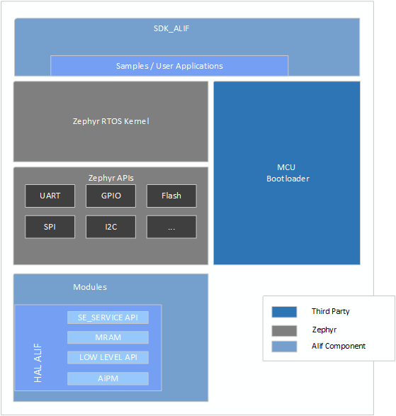

**Overview of Zephyr Alif SDK**
================================

The Zephyr Alif SDK [ZAS] is a comprehensive suite of tools that makes it possible to configure, build and deploy applications for Alif's microcontrollers.

Repositories
------------

Zephyr
~~~~~~

The Zephyr repository, which is part of the SDK, takes the upstream Zephyr as base and extends it when necessary. It includes various components that contribute to the functionality of Zephyr. These components are publicly available and open source, allowing developers from the community to contribute and collaborate.

Alif Zephyr SDK
~~~~~~~~~~~~~~~~~
Alif provides a Zephyr Software Development Kit (SDK) that combines both Alif's components and Zephyr's kernel and subsystems. By using this SDK, developers can access additional features beyond what's available in the upstream Zephyr repository. These materials may include samples, drivers, middleware protocols, and other resources that are specific to Alif. Here's what you'll find in this section:

- **Sample Applications and Tests**: We provide the latest and updated sample applications and tests specific to Alif's hardware and features. Additional custom tests can also be found here.
- **Improved APIs and Drivers**: If there are drivers with improved APIs that are not yet included in the upstream Zephyr OS, you will find them in this section.
- **Middleware Protocols and Libraries**: Alif's middleware protocols, configurations, and libraries are available here. These resources facilitate communication and interaction with Alif's hardware.
- **New Protocols and Example Applications**: Explore new protocols not currently part of Zephyr in this section. You can find example applications that demonstrate how to use these protocols effectively.
- **SDK Documentation, Binaries, and Libraries**: Access comprehensive documentation for the SDK here. You can find the necessary binaries and libraries required for developing with Alif's SDK.

Components
----------

The image below shows various SDK components. The main components are SDK Alif, Zephyr RTOS, HAL Alif and the MCUboot bootloader.

   *SDK Components*

The SDK provides a rich set of components to enhance software development for Alif Semiconductor's products. Below, we'll explore each component in detail:

+-----------------------------+---------------------------------------------------------------+
| **Component**               | **Description**                                               |
+=============================+===============================================================+
| **Zephyr RTOS**             | The Zephyr Project is a scalable real-time operating system   |
|                             |                                                               |
+-----------------------------+---------------------------------------------------------------+
| **SoC/Board Files/DTS**     | These files define the system-on-chip (SoC) and board-specific|
|                             | configurations.                                               |
+-----------------------------+---------------------------------------------------------------+
| **Zephyr Device Driver**    | Device drivers for various hardware peripherals and components|
|                             |                                                               |
+-----------------------------+---------------------------------------------------------------+
| **SDK_ALIF**                | Alif-Specific Applications and Examples (Alif Licensed)       |
|                             | Explore Alif's custom applications and examples tailored to   |
|                             | their hardware. These resources are licensed by Alif and      |
|                             | demonstrate specific use cases.                               |
+-----------------------------+---------------------------------------------------------------+
| **Third-Party Licensed      | You can also make use of any third-party components or        |
| Tools**                     | libraries used within SDK. These resources are available in   |
|                             | both source form and binaries.                                |
+-----------------------------+---------------------------------------------------------------+

HAL_ALIF (Hardware Abstraction Layer)
~~~~~~~~~~~~~~~~~~~~~~~~~~~~~~~~~~~~~

The HAL provides hardware-specific APIs, allowing interaction with Alif's devices.

1. SE Services (Security Services): Alif's security services, including encryption, authentication, and secure communication.
2. Alif Crypto Libraries: Alif’s Crypto libraries provide support for MbedTLS.
3. Power Management API: APIs related to power management, optimizing energy usage in Alif devices.

Documentation
~~~~~~~~~~~~~

The SDK provides the following essential documentation:

- **Getting Started Guide**: Introduction and initial setup instructions.
- **Release Notes**: Information on the latest updates and changes.
- **Licenses**: Legal terms and conditions for using the SDK.
- **README**: Detailed project overview and instructions.

Toolchains
-----------

Supported toolchains for software development:

- **GCC (GNU Compiler Collection v12.2.0)** from the Zephyr Project.
- **LLVM-embedded-toolchain-for-Arm 17.0.1** for efficient code generation targeting Arm architecture.
- **ARM CLang 6.18** for optimized compilation on Arm-based systems.

Zephyr RTOS
-----------

Zephyr is a small RTOS for connected, resource-constrained and embedded devices.

The notable features are:

- A small monolithic kernel.
- Highly configurable / Modular for flexibility.
- Cross architecture support.
- Devicetree support.
- Optimized device driver model.
- A set of protocol stacks such as IPv4 and IPv6, 802.15.4 (LR-WPAN), Bluetooth Low Energy, CAN, MQTT.
- Virtual File System Interface with LittleFS and FATFS Support.

The following is the directory tree of Zephyr project. The purpose of each is briefly described.

.. figure:: _static/sdk_directory_tree.jpg
   :alt: SDK Directory Tree
   :width: 400px
   :align: center

   *SDK Directory Tree*
